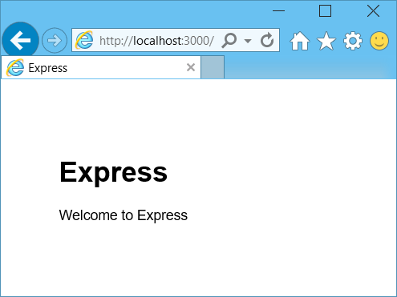
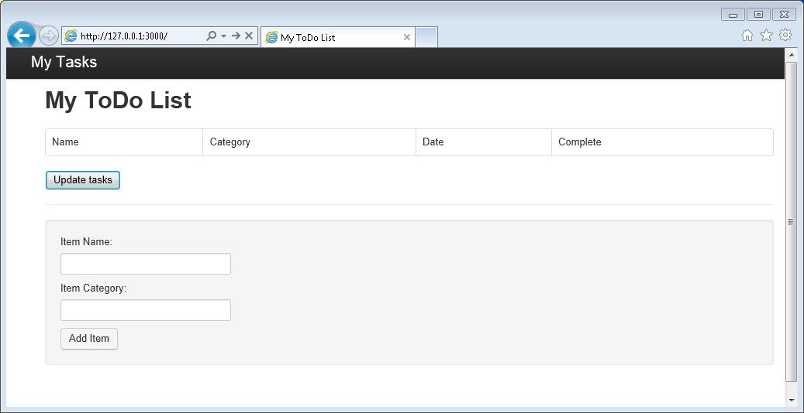

<properties 
	pageTitle="Learn Node.js - DocumentDB Node.js Tutorial | Microsoft Azure" 
	description="Learn Node.js! Tutorial explores how to use Microsoft Azure DocumentDB to store and access data from a Node.js Express web application hosted on Azure Websites." 
	keywords="Application development, database tutorial, learn node.js, node.js tutorial, documentdb, azure, Microsoft azure"
	services="documentdb" 
	documentationCenter="nodejs" 
	authors="aliuy" 
	manager="jhubbard" 
	editor="cgronlun"/>

<tags 
	ms.service="documentdb" 
	ms.workload="data-services" 
	ms.tgt_pltfrm="na" 
	ms.devlang="nodejs" 
	ms.topic="hero-article" 
	ms.date="04/18/2016" 
	ms.author="andrl"/>

# Build a Node.js web application using DocumentDB

> [AZURE.SELECTOR]
- [.NET](documentdb-dotnet-application.md)
- [Node.js](documentdb-nodejs-application.md)
- [Java](documentdb-java-application.md)
- [Python](documentdb-python-application.md)

This Node.js tutorial shows you how to use the Azure DocumentDB service to store and access data from a Node.js Express application hosted on Azure Websites.

We recommend getting started by watching the following video, where you will learn how to provision an Azure DocumentDB database account and store JSON documents in your Node.js application. 

> [AZURE.VIDEO azure-demo-getting-started-with-azure-documentdb-on-nodejs-in-linux]

Then, return to this Node.js tutorial, where you'll learn the answers to the following questions:

- How do I work with DocumentDB using the documentdb npm module?
- How do I deploy the web application to Azure Websites?

By following this database tutorial, you will build a simple web-based
task-management application that allows creating, retrieving and
completing of tasks. The tasks will be stored as JSON documents in Azure
DocumentDB.

Don't have time to complete the tutorial and just want to get the complete solution? Not a problem, you can get the complete sample solution from [GitHub][].

## Prerequisites

> [AZURE.TIP] This Node.js tutorial assumes that you have some prior experience using Node.js and Azure Websites.

Before following the instructions in this article, you should ensure
that you have the following:

- An active Azure account. If you don't have an account, you can create a free trial account in just a couple of minutes. For details, see [Azure Free Trial](https://azure.microsoft.com/pricing/free-trial/).
- [Node.js][] version v0.10.29 or higher.
- [Express generator](http://www.expressjs.com/starter/generator.html) (you can install this via `npm install express-generator -g`)
- [Git][].

## Step 1: Create a DocumentDB database account

Let's start by creating a DocumentDB account. If you already have an account, you can skip to [Step 2: Create a new Node.js application](#_Toc395783178).

[AZURE.INCLUDE [documentdb-create-dbaccount](../../includes/documentdb-create-dbaccount.md)]

[AZURE.INCLUDE [documentdb-keys](../../includes/documentdb-keys.md)]

## Step 2: Learn to create a new Node.js application

Now let's learn to create a basic Hello World Node.js project using the [Express](http://expressjs.com/) framework.

1. Open your favorite terminal.

2. Use the express generator to generate a new application called **todo**.

		express todo

3. Open your new **todo** directory and install dependencies.

		cd todo
		npm install

4. Run your new application.

		npm start

5. You can you view your new application by navigating your browser to [http://localhost:3000](http://localhost:3000).

	

## Step 3: Install additional modules

The **package.json** file is one of the files created in the root of the
project. This file contains a list of additional modules that are
required for your Node.js application. Later, when you deploy this
application to an Azure Websites, this file is used to determine
which modules need to be installed on Azure to support your application. We still need to install two more packages for this tutorial.

1. Back in the terminal, install the **async** module via npm.

		npm install async --save

1. Install the **documentdb** module via npm. This is the module where all the DocumentDB magic happens.

		npm install documentdb --save

3. A quick check of the **package.json** file of the application should show the additional modules. This file will tell Azure which packages to download and install when running your application. It should resemble the example below.

	

       This tells Node (and Azure later) that your application depends on these additional modules.

## Step 4: Using the DocumentDB service in a node application

That takes care of all the initial setup and configuration, now let’s get down to why we’re here, and that’s to write some code using Azure DocumentDB.

### Create the model

1. In the project directory, create a new directory named **models**.
2. In the **models** directory, create a new file named **taskDao.js**. This file will contain the model for the tasks created by our application.
3. In the same **models** directory, create another new file named **docdbUtils.js**. This file will contain some useful, reusable, code that we will use throughout our application. 
4. Copy the following code in to **docdbUtils.js**

		var DocumentDBClient = require('documentdb').DocumentClient;
			
		var DocDBUtils = {
		    getOrCreateDatabase: function (client, databaseId, callback) {
		        var querySpec = {
		            query: 'SELECT * FROM root r WHERE r.id= @id',
		            parameters: [{
		                name: '@id',
		                value: databaseId
		            }]
		        };
		
		        client.queryDatabases(querySpec).toArray(function (err, results) {
		            if (err) {
		                callback(err);
		
		            } else {
		                if (results.length === 0) {
		                    var databaseSpec = {
		                        id: databaseId
		                    };
		
		                    client.createDatabase(databaseSpec, function (err, created) {
		                        callback(null, created);
		                    });
		
		                } else {
		                    callback(null, results[0]);
		                }
		            }
		        });
		    },
		
		    getOrCreateCollection: function (client, databaseLink, collectionId, callback) {
		        var querySpec = {
		            query: 'SELECT * FROM root r WHERE r.id=@id',
		            parameters: [{
		                name: '@id',
		                value: collectionId
		            }]
		        };		       
				
		        client.queryCollections(databaseLink, querySpec).toArray(function (err, results) {
		            if (err) {
		                callback(err);
		
		            } else {		
		                if (results.length === 0) {
		                    var collectionSpec = {
		                        id: collectionId
		                    };
							
				 			var requestOptions = {
								offerType: 'S1'
							};
							
		                    client.createCollection(databaseLink, collectionSpec, requestOptions, function (err, created) {
		                        callback(null, created);
		                    });
		
		                } else {
		                    callback(null, results[0]);
		                }
		            }
		        });
		    }
		};
				
		module.exports = DocDBUtils;

> [AZURE.TIP] createCollection takes an optional requestOptions parameter that can be used to specify the Offer Type for the Collection. If no requestOptions.offerType value is supplied then the Collection will be created using the default Offer Type.
> For more information on DocumentDB Offer Types please refer to [Performance levels in DocumentDB](documentdb-performance-levels.md) 
		
3. Save and close the **docdbUtils.js** file.

4. At the beginning of the **taskDao.js** file, add the following code to reference the **DocumentDBClient** and the **docdbUtils.js** we created above:

        var DocumentDBClient = require('documentdb').DocumentClient;
		var docdbUtils = require('./docdbUtils');

4. Next, you will add code to define and export the Task object. This is responsible for initializing our Task object and setting up the Database and Document Collection we will use.

		function TaskDao(documentDBClient, databaseId, collectionId) {
		  this.client = documentDBClient;
		  this.databaseId = databaseId;
		  this.collectionId = collectionId;
		
		  this.database = null;
		  this.collection = null;
		}
		
		module.exports = TaskDao;

5. Next, add the following code to define additional methods on the Task object, which allow interactions with data stored in DocumentDB.

		TaskDao.prototype = {
		    init: function (callback) {
		        var self = this;
		
		        docdbUtils.getOrCreateDatabase(self.client, self.databaseId, function (err, db) {
		            if (err) {
		                callback(err);
		            } else {
		                self.database = db;
		                docdbUtils.getOrCreateCollection(self.client, self.database._self, self.collectionId, function (err, coll) {
		                    if (err) {
		                        callback(err);
		
		                    } else {
		                        self.collection = coll;
		                    }
		                });
		            }
		        });
		    },
		
		    find: function (querySpec, callback) {
		        var self = this;
		
		        self.client.queryDocuments(self.collection._self, querySpec).toArray(function (err, results) {
		            if (err) {
		                callback(err);
		
		            } else {
		                callback(null, results);
		            }
		        });
		    },
		
		    addItem: function (item, callback) {
		        var self = this;
		
		        item.date = Date.now();
		        item.completed = false;
		
		        self.client.createDocument(self.collection._self, item, function (err, doc) {
		            if (err) {
		                callback(err);
		
		            } else {
		                callback(null, doc);
		            }
		        });
		    },
		
		    updateItem: function (itemId, callback) {
		        var self = this;
		
		        self.getItem(itemId, function (err, doc) {
		            if (err) {
		                callback(err);
		
		            } else {
		                doc.completed = true;
		
		                self.client.replaceDocument(doc._self, doc, function (err, replaced) {
		                    if (err) {
		                        callback(err);
		
		                    } else {
		                        callback(null, replaced);
		                    }
		                });
		            }
		        });
		    },
		
		    getItem: function (itemId, callback) {
		        var self = this;
		
		        var querySpec = {
		            query: 'SELECT * FROM root r WHERE r.id = @id',
		            parameters: [{
		                name: '@id',
		                value: itemId
		            }]
		        };
		
		        self.client.queryDocuments(self.collection._self, querySpec).toArray(function (err, results) {
		            if (err) {
		                callback(err);
		
		            } else {
		                callback(null, results[0]);
		            }
		        });
		    }
		};

6. Save and close the **taskDao.js** file. 

### Create the controller

1. In the **routes** directory of your project, create a new file named **tasklist.js**. 
2. Add the following code to **tasklist.js**. This loads the DocumentDBClient and async modules, which are used by **tasklist.js**. This also defined the **TaskList** function, which is passed an instance of the **Task** object we defined earlier:

		var DocumentDBClient = require('documentdb').DocumentClient;
		var async = require('async');
		
		function TaskList(taskDao) {
		  this.taskDao = taskDao;
		}
		
		module.exports = TaskList;

3. Continue adding to the **tasklist.js** file by adding the methods used to **showTasks, addTask**, and **completeTasks**:
		
		TaskList.prototype = {
		    showTasks: function (req, res) {
		        var self = this;
		
		        var querySpec = {
		            query: 'SELECT * FROM root r WHERE r.completed=@completed',
		            parameters: [{
		                name: '@completed',
		                value: false
		            }]
		        };
		
		        self.taskDao.find(querySpec, function (err, items) {
		            if (err) {
		                throw (err);
		            }
		
		            res.render('index', {
		                title: 'My ToDo List ',
		                tasks: items
		            });
		        });
		    },
		
		    addTask: function (req, res) {
		        var self = this;
		        var item = req.body;
		
		        self.taskDao.addItem(item, function (err) {
		            if (err) {
		                throw (err);
		            }
		
		            res.redirect('/');
		        });
		    },
		
		    completeTask: function (req, res) {
		        var self = this;
		        var completedTasks = Object.keys(req.body);
		
		        async.forEach(completedTasks, function taskIterator(completedTask, callback) {
		            self.taskDao.updateItem(completedTask, function (err) {
		                if (err) {
		                    callback(err);
		                } else {
		                    callback(null);
		                }
		            });
		        }, function goHome(err) {
		            if (err) {
		                throw err;
		            } else {
		                res.redirect('/');
		            }
		        });
		    }
		};

4. Save and close the **tasklist.js** file.
 
### Add config.js

1. In your project directory create a new file named **config.js**.
2. Add the following to **config.js**. This defines configuration settings and values needed for our application.

		var config = {}
		
		config.host = process.env.HOST || "[the URI value from the DocumentDB Keys blade on http://portal.azure.com]";
		config.authKey = process.env.AUTH_KEY || "[the PRIMARY KEY value from the DocumentDB Keys blade on http://portal.azure.com]";
		config.databaseId = "ToDoList";
		config.collectionId = "Items";
		
		module.exports = config;

3. In the **config.js** file, update the values of HOST and AUTH_KEY using the values found in the Keys blade of your DocumentDB account on the [Microsoft Azure Portal](https://portal.azure.com):

4. Save and close the **config.js** file.
 
### Modify app.js

1. In the project directory, open the **app.js** file. This file was created earlier when the Express web application was created.
2. Add the following code to the top of **app.js**
	
		var DocumentDBClient = require('documentdb').DocumentClient;
		var config = require('./config');
		var TaskList = require('./routes/tasklist');
		var TaskDao = require('./models/taskDao');

3. This code defines the config file to be used, and proceeds to read values out of this file in to some variables we will use soon.
4. Replace the following two lines in **app.js** file:

		app.use('/', routes);
		app.use('/users', users); 

      with the following snippet:

		var docDbClient = new DocumentDBClient(config.host, {
		    masterKey: config.authKey
		});
		var taskDao = new TaskDao(docDbClient, config.databaseId, config.collectionId);
		var taskList = new TaskList(taskDao);
		taskDao.init();
		
		app.get('/', taskList.showTasks.bind(taskList));
		app.post('/addtask', taskList.addTask.bind(taskList));
		app.post('/completetask', taskList.completeTask.bind(taskList));
		app.set('view engine', 'jade');

6. These lines define a new instance of our **TaskDao** object, with a new connection to DocumentDB (using the values read from the **config.js**), initialize the task object and then bind form actions to methods on our **TaskList** controller. 

7. Finally, save and close the **app.js** file, we're just about done.
 
## Step 5: Build a user interface

Now let’s turn our attention to building the user interface so a user can actually interact with our application. The Express application we created uses **Jade** as the view engine. For more information on Jade please refer to [http://jade-lang.com/](http://jade-lang.com/).

1. The **layout.jade** file in the **views** directory is used as a global template for other **.jade** files. In this step you will modify it to use [Twitter Bootstrap](https://github.com/twbs/bootstrap), which is a toolkit that makes it easy to design a nice looking website. 
2. Open the **layout.jade** file found in the **views** folder and replace the contents with the following;
	
		doctype html
		html
		  head
		    title= title
		    link(rel='stylesheet', href='//ajax.aspnetcdn.com/ajax/bootstrap/3.3.2/css/bootstrap.min.css')
		    link(rel='stylesheet', href='/stylesheets/style.css')
		  body
		    nav.navbar.navbar-inverse.navbar-fixed-top
		      div.navbar-header
		        a.navbar-brand(href='#') My Tasks
		    block content
		    script(src='//ajax.aspnetcdn.com/ajax/jQuery/jquery-1.11.2.min.js')
		    script(src='//ajax.aspnetcdn.com/ajax/bootstrap/3.3.2/bootstrap.min.js')

	This effectively tells the **Jade** engine to render some HTML for our application and creates a **block** called **content** where we can supply the layout for our content pages.
	Save and close this **layout.jade** file.

4. Now open the **index.jade** file, the view that will be used by our application, and replace the content of the file with the following:

		extends layout
		
		block content
		  h1 #{title}
		  br
		
		  form(action="/completetask", method="post")
		    table.table.table-striped.table-bordered
		      tr
		        td Name
		        td Category
		        td Date
		        td Complete
		      if (typeof tasks === "undefined")
		        tr
		          td
		      else
		        each task in tasks
		          tr
		            td #{task.name}
		            td #{task.category}
		            - var date  = new Date(task.date);
		            - var day   = date.getDate();
		            - var month = date.getMonth() + 1;
		            - var year  = date.getFullYear();
		            td #{month + "/" + day + "/" + year}
		            td
		              input(type="checkbox", name="#{task.id}", value="#{!task.completed}", checked=task.completed)
		    button.btn(type="submit") Update tasks
		  hr
		  form.well(action="/addtask", method="post")
		    label Item Name:
		    input(name="name", type="textbox")
		    label Item Category:
		    input(name="category", type="textbox")
		    br
		    button.btn(type="submit") Add item

	This extends layout, and provides content for the **content** placeholder we saw in the **layout.jade** file earlier.
	
	In this layout we created two HTML forms. 
	The first form contains a table for our data and a button that allows us to update items by posting to **/completetask** method of our controller.
	The second form contains two input fields and a button that allows us to create a new item by posting to **/addtask** method of our controller.
	
	This should be all that we need for our application to work.

5. Open the **style.css** file in **public\stylesheets** directory and replace the code with the following:

		body {
		  padding: 50px;
		  font: 14px "Lucida Grande", Helvetica, Arial, sans-serif;
		}
		a {
		  color: #00B7FF;
		}
		.well label {
		  display: block;
		}
		.well input {
		  margin-bottom: 5px;
		}
		.btn {
		  margin-top: 5px;
		  border: outset 1px #C8C8C8;
		}

	Save and close this **style.css** file.

## Step 6: Run your application locally

1. To test the application on your local machine, run `npm start` in a terminal to start your application, and launch a browser with a page that looks like the image below:

	

2. Use the provided fields for Item, Item Name and Category to enter
information, and then click **Add Item**.

3. The page should update to display the newly created item in the ToDo
list.

	

4. To complete a task, simply check the checkbox in the Complete column,
and then click **Update tasks**.

## Step 7: Deploy your application development project to Azure Websites

1. If you haven't already, enable a git repository for your Azure Website. You can find instructions on how to do this in the [Local Git Deployment to Azure App Service](../app-service-web/app-service-deploy-local-git.md) topic.

2. Add your Azure Website as a git remote.

		git remote add azure https://username@your-azure-website.scm.azurewebsites.net:443/your-azure-website.git

3. Deploy by pushing to the remote.

		git push azure master

4. In a few seconds, git will finish publishing your web
application and launch a browser where you can see your handy work
running in Azure!

## Next steps

Congratulations! You have just built your first Node.js Express Web
Application using Azure DocumentDB and published it to Azure Websites.

The source code for the complete reference application can be downloaded from [GitHub][].

For more information, see the [Node.js Developer Center](https://azure.microsoft.com/develop/nodejs/).

[Node.js]: http://nodejs.org/
[Git]: http://git-scm.com/
[Github]: https://github.com/Azure-Samples/documentdb-node-todo-app
 
