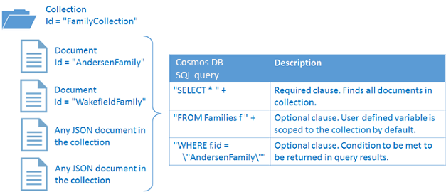

<properties
	pageTitle="NoSQL Node.js tutorial for DocumentDB | Microsoft Azure"
	description="A NoSQL Node.js tutorial that creates a node database and console application using the DocumentDB Node.js SDK. DocumentDB is a NoSQL database for JSON."
    keywords="node.js tutorial, node database"
	services="documentdb"
	documentationCenter="node.js"
	authors="AndrewHoh"
	manager="jhubbard"
	editor="monicar"/>

<tags
	ms.service="documentdb"
	ms.workload="data-services"
	ms.tgt_pltfrm="na"
	ms.devlang="node"
	ms.topic="hero-article" 
	ms.date="03/30/2016"
	ms.author="anhoh"/>

# NoSQL Node.js tutorial: DocumentDB Node.js console application  

> [AZURE.SELECTOR]
- [.NET](documentdb-get-started.md)
- [Node.js](documentdb-nodejs-get-started.md)

Welcome to the Node.js tutorial for the DocumentDB Node.js SDK! After following this tutorial, you'll have a console application that creates and queries DocumentDB resources, including a Node database.

We'll cover:

- Creating and connecting to a DocumentDB account
- Setting up your application
- Creating a node database
- Creating a collection
- Creating JSON documents
- Querying the collection
- Deleting the node database

Don't have time? Don't worry! The complete solution is available on [GitHub](https://github.com/Azure-Samples/documentdb-node-getting-started). See [Get the complete solution](#GetSolution) for quick instructions. 

After you've completed the Node.js tutorial, please use the voting buttons at the top and bottom of this page to give us feedback. If you'd like us to contact you directly, feel free to include your email address in your comments.

Now let's get started!

## Prerequisites for the Node.js tutorial

Please make sure you have the following:

- An active Azure account. If you don't have one, you can sign up for a [Free Azure Trial](https://azure.microsoft.com/pricing/free-trial/).
- [Node.js](https://nodejs.org/) version v0.10.29 or higher.

## Step 1: Create a DocumentDB account

Let's create a DocumentDB account. If you already have an account you want to use, you can skip ahead to [Setup your Node.js application](#SetupNode).

[AZURE.INCLUDE [documentdb-create-dbaccount](../../includes/documentdb-create-dbaccount.md)]

##<a id="SetupNode"></a> Step 2: Setup your Node.js application

1. Open your favorite terminal.
2. Locate the folder or directory where you'd like to save your Node.js application.
3. Create two empty JavaScript files with the following commands:
	- Windows:    
	    * ```fsutil file createnew app.js 0```
        * ```fsutil file createnew config.js 0```
	- Linux/OS X: 
	    * ```touch app.js```
        * ```touch config.js```
4. Install the documentdb module via npm. Use the following command:
    * ```npm install documentdb --save```

Great! Now that you've finished setting up, let's start writing some code.

##<a id="Config"></a> Step 3: Set your app's configurations

Open ```config.js``` in your favorite text editor. 

Then, create an empty object titled ```config``` and set properties ```config.endpoint``` and ```config.authKey``` to your DocumentDB endpoint and authorization key. Both these configurations can be found in the [Azure Portal](https://portal.azure.com).

![Node.js tutorial - Screen shot of the Azure Portal, showing a DocumentDB account, with the ACTIVE hub highlighted, the KEYS button highlighted on the DocumentDB account blade, and the URI, PRIMARY KEY and SECONDARY KEY values highlighted on the Keys blade - Node database][keys]

    var config = {}

    config.endpoint = "https://YOUR_ENDPOINT_URI.documents.azure.com:443/";
    config.authKey = "oqTveZeWlbtnJQ2yMj23HOAViIr0ya****YOUR_AUTHORIZATION_KEY****ysadfbUV+wUdxwDAZlCfcVzWp0PQg==";

Let's now add the ```database id```, ```collection id```, and ```JSON documents``` to your ```config``` object. Below where you set your ```config.endpoint``` and ```config.authKey``` properties, add the following code. If you already have data you'd like to store in your database, you can use DocumentDB's [Data Migration tool](documentdb-import-data.md) rather than adding the document definitions.

    config.database = {
        "id": "FamilyDB"
    };

    config.collection = {
        "id": "FamilyColl",
        "partitionKey": { "paths": ["/district"], "kind": "Hash" }
    };

    config.documents = {
        "Andersen": {
            "id": "Anderson.1",
            "lastName": "Andersen",
            "district": "WA5",
            "parents": [{
                "firstName": "Thomas"
            }, {
                    "firstName": "Mary Kay"
                }],
            "children": [{
                "firstName": "Henriette Thaulow",
                "gender": "female",
                "grade": 5,
                "pets": [{
                    "givenName": "Fluffy"
                }]
            }],
            "address": {
                "state": "WA",
                "county": "King",
                "city": "Seattle"
            }
        },
        "Wakefield": {
            "id": "Wakefield.7",
            "district": "NY23",
            "parents": [{
                "familyName": "Wakefield",
                "firstName": "Robin"
            }, {
                    "familyName": "Miller",
                    "firstName": "Ben"
                }],
            "children": [{
                "familyName": "Merriam",
                "firstName": "Jesse",
                "gender": "female",
                "grade": 8,
                "pets": [{
                    "givenName": "Goofy"
                }, {
                        "givenName": "Shadow"
                    }]
            }, {
                    "familyName": "Miller",
                    "firstName": "Lisa",
                    "gender": "female",
                    "grade": 1
                }],
            "address": {
                "state": "NY",
                "county": "Manhattan",
                "city": "NY"
            },
            "isRegistered": false
        }
    };


The database, collection, and document definitions will act as your DocumentDB ```database id```, ```collection id```, and documents' data.

Finally, export your ```config``` object, so that you can reference it within the ```app.js``` file.

    module.exports = config;

##<a id="Connect"></a> Step 4: Connect to a DocumentDB account

Open your empty ```app.js``` file in the text editor. Import the ```documentdb``` module and your newly created ```config``` module.

    "use strict";

    var documentClient = require("documentdb").DocumentClient;
    var config = require("./config");
    var url = require('url');

Next, let's use the previously saved ```config.endpoint``` and ```config.authKey``` to create a new DocumentClient.

    var client = new documentClient(config.endpoint, { "masterKey": config.authKey });

Now that you've connected to a DocumentDB account, let's take a look at working with DocumentDB resources.

## Step 5: Create a Node database
A [database](documentdb-resources.md#databases) can be created by using the [createDatabase](https://azure.github.io/azure-documentdb-node/DocumentClient.html) function of the **DocumentClient** class. A database is the logical container of document storage partitioned across collections. Add a function for creating your new database in the app.js file with the ```id``` specified in the ```config``` object. We'll first check to make sure a database with the same ```FamilyRegistry``` id does not already exist. If it does exist, we'll return that database instead of creating a new one.

    var HttpStatusCodes = { NOTFOUND: 404 };
    var databaseUrl = `dbs/${config.database.id}`;
    var collectionUrl = `${databaseUrl}/colls/${config.collection.id}`;

    /**
     * Get the database by ID, or create if it doesn't exist.
     * @param {string} database - The database to get or create
     */
    function getDatabase() {
        console.log(`Getting database:\n${config.database.id}\n`);

        return new Promise((resolve, reject) => {
            client.readDatabase(databaseUrl, (err, result) => {
                if (err) {
                    if (err.code == HttpStatusCodes.NOTFOUND) {
                        client.createDatabase(config.database, (err, created) => {
                            if (err) reject(err)
                            else resolve(created);
                        });
                    } else {
                        reject(err);
                    }
                } else {
                    resolve(result);
                }
            });
        });
    }
##<a id="CreateColl"></a>Step 6: Create a collection  

> [AZURE.WARNING] **CreateDocumentCollectionAsync** will create a new collection, which has pricing implications. For more details, please visit our [pricing page](https://azure.microsoft.com/pricing/details/documentdb/).

A [collection](documentdb-resources.md#collections) can be created by using the [createCollection](https://azure.github.io/azure-documentdb-node/DocumentClient.html) function of the **DocumentClient** class. A collection is a container of JSON documents and associated JavaScript application logic. dd a function for creating your new collection in the app.js file with the ```id``` specified in the ```config``` object. Again, we'll check to make sure a collection with the same ```FamilyCollection``` id does not already exist. If it does exist, we'll return that collection instead of creating a new one.

    /**
     * Get the collection by ID, or create if it doesn't exist.
     */
    function getCollection() {
        console.log(`Getting collection:\n${collection.id}\n`);

        return new Promise((resolve, reject) => {
            client.readCollection(collectionUrl, (err, result) => {
                if (err) {
                    if (err.code == HttpStatusCodes.NOTFOUND) {
                        client.createCollection(databaseUrl, config.collection, { offerThroughput: 400 }, (err, created) => {
                            if (err) reject(err)
                            else resolve(created);
                        });
                    } else {
                        reject(err);
                    }
                } else {
                    resolve(result);
                }
            });
        });
    }

##<a id="CreateDoc"></a>Step 7: Create a document
A [document](documentdb-resources.md#documents) can be created by using the [createDocument](https://azure.github.io/azure-documentdb-node/DocumentClient.html) function of the **DocumentClient** class. Documents are user defined (arbitrary) JSON content. You can now insert a document into DocumentDB.

Next, add a function to app.js for creating the documents containing the JSON data saved in the ```config``` object. Again, we'll check to make sure a document with the same id does not already exist.

    /**
     * Get the document by ID, or create if it doesn't exist.
     * @param {function} callback - The callback function on completion
     */
    function getFamilyDocument(document) {
        let documentUrl = `${collectionUrl}/docs/${document.id}`;
        console.log(`Getting document:\n${document.id}\n`);

        return new Promise((resolve, reject) => {
            client.readDocument(documentUrl, { partitionKey: document.district }, (err, result) => {
                if (err) {
                    if (err.code == HttpStatusCodes.NOTFOUND) {
                        client.createDocument(collectionUrl, document, (err, created) => {
                            if (err) reject(err)
                            else resolve(created);
                        });
                    } else {
                        reject(err);
                    }
                } else {
                    resolve(result);
                }
            });
        });
    };

Congratulations! You now have functions for creating a database, collection, and document in DocumentDB!


##<a id="Query"></a>Step 8: Query DocumentDB resources

DocumentDB supports [rich queries](documentdb-sql-query.md) against JSON documents stored in each collection. The following sample code shows a query that you can run against the documents in your collection. Add the following function to the ```app.js``` file. DocumentDB supports SQL-like queries as shown below. For more information on building complex queries, check out the [Query Playground](https://www.documentdb.com/sql/demo) and the [query documentation](documentdb-sql-query.md).

    /**
     * Query the collection using SQL
     */
    function queryCollection() {
        console.log(`Querying collection through index:\n${config.collection.id}\n`);

        return new Promise((resolve, reject) => {
            client.queryDocuments(
                collectionUrl,
                'SELECT VALUE r.address.city FROM root r WHERE r.lastName = "Andersen"',
                { enableCrossPartitionQuery: true }
            ).toArray((err, results) => {
                if (err) reject(err)
                else {
                    for (var queryResult of results) {
                        console.log(`Query returned ${queryResult}`);
                    }
                    resolve(results);
                }
            });
        });
    };


The following diagram illustrates how the DocumentDB SQL query syntax is called against the collection you created.



The [FROM](documentdb-sql-query.md/#from-clause) keyword is optional in the query because DocumentDB queries are already scoped to a single collection. Therefore, "FROM Families f" can be swapped with "FROM root r", or any other variable name you choose. DocumentDB will infer that Families, root, or the variable name you chose, reference the current collection by default.

##<a id="DeleteDatabase"></a>Step 9: Delete the Node database

Deleting the created database will remove the database and all children resources (collections, documents, etc.). You can delete the database by adding the following code snippet.

    /**
     * Cleanup the database and collection on completion
     */
    function cleanup() {
        console.log(`Cleaning up by deleting database ${config.database.id}`);

        return new Promise((resolve, reject) => {
            client.deleteDatabase(databaseUrl, (err) => {
                if (err) reject(err)
                else resolve(null);
            });
        });
    }

##<a id="Build"></a>Step 10: Put it together

Now that you've set all the necessary functions for your application, let's call them!

Add the following code snippet to the bottom of your code in ```app.js```.

    /**
     * Exit the app with a prompt
     * @param {message} message - The message to display
     */
    function exit(message) {
        console.log(message);
        console.log('Press any key to exit');
        process.stdin.setRawMode(true);
        process.stdin.resume();
        process.stdin.on('data', process.exit.bind(process, 0));
    }

    getDatabase()
        .then(() => getCollection())
        .then(() => getFamilyDocument(config.documents.Andersen))
        .then(() => getFamilyDocument(config.documents.Wakefield))
        .then(() => queryCollection())
        .then(() => cleanup())
        .then(() => { exit(`Completed successfully`); })
        .catch((error) => { exit(`Completed with error ${JSON.stringify(error)}`) });

##<a id="Run"></a>Step 11: Run your Node.js application!

You are now ready to run your Node.js application!

In your terminal, locate your ```app.js``` file and run the command: ```node app.js```

You should see the output of your get started app. The output should match the example text below.

    Getting database:
    FamilyDB

    Getting collection:
    FamilyColl

    Getting document:
    Anderson.1

    Getting document:
    Wakefield.7

    Querying collection through index:
    FamilyColl
      Query returned Seattle

    Cleaning up by deleting database FamilyDB

    Completed successfully
    Press any key to exit

Congratulations! You've created you've completed the Node.js tutorial and have your first DocumentDB console application! 

##<a id="GetSolution"></a> Get the complete Node.js tutorial solution
To build the GetStarted solution that contains all the samples in this article, you will need the following:

-   [DocumentDB account][documentdb-create-account].
-   The [GetStarted](https://github.com/Azure-Samples/documentdb-node-getting-started) solution available on GitHub.

Install the **documentdb** module via npm. Use the following command:
* ```npm install documentdb --save```

Next, in the ```config.js``` file, update the config.endpoint and config.authKey values as described in [Step 3: Set your app's configurations](#Config).

## Next steps

-   Want a more complex Node.js sample? See [Build a Node.js web application using DocumentDB](documentdb-nodejs-application.md).
-	Learn how to [monitor a DocumentDB account](documentdb-monitor-accounts.md).
-	Run queries against our sample dataset in the [Query Playground](https://www.documentdb.com/sql/demo).
-	Learn more about the programming model in the Develop section of the [DocumentDB documentation page](../../services/documentdb/).

[doc-landing-page]: ../../services/documentdb/
[documentdb-create-account]: documentdb-create-account.md
[documentdb-manage]: documentdb-manage.md

[keys]: media/documentdb-nodejs-get-started/node-js-tutorial-keys.png
