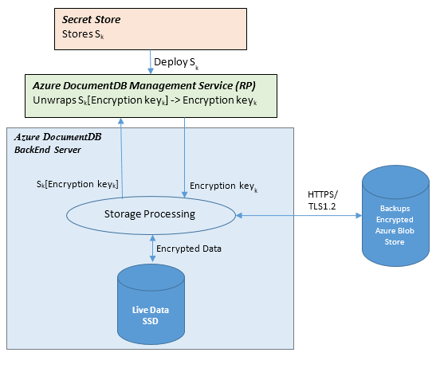

# DocumentDB NoSQL database encryption at rest

Encryption at rest is a phrase that commonly refers the to encryption of data on non-volatile storage devices such as Solid State Drives (SSDs) and Hard Disks (HDDs).  DocumentDB stores its primary databases on SSD and its media attachments and backups into Azure Blobs which are generally HDD backed.  With the release of encryption at rest for DocumentDB all of your databases, media attachments, and backups are now encrypted.  This means your data is now encrypted in transit (over the network) and at rest (non-volatile storage) giving you end-to-end encryption.

As a PaaS service we have worked hard to make DocumentDB very easy to use.  With this in mind all user data stored in DocumentDB is encrypted at rest and in transport without the user having to take any action.  Another way to put this is Encryption At Rest is "on" by default.  There are no controls to turn it off or on and we have provided this feature while continuing to meet our [availability and performance SLAs](https://azure.microsoft.com/support/legal/sla/documentdb/v1_1/).

## How does encryption at rest Work?

Encryption at rest is implemented using a number of security technologies including secure key storage systems, encrypted networks, and cryptographic APIs.  The diagram below shows how storage of encrypted data and the management of keys is separated.  Systems that decrypt and process data have to communicate with systems that manage keys.

The basic flow of a user request is the following:
- The user database account is made ready and storage keys are retrieved via a request to the Management Service Resource Provider (RP).
- A user creates a connection to DocumentDB via HTTPS/secure transport (The SDKs abstract the details).
- User sends a JSON Document to be stored over the previously created secure connection.
- The JSON Document is indexed unless the user has turned off indexing.
- Both the JSON Document and Index Data are written to secure storage.
- Periodically data is read from the secure storage and backed up to Azure Encrypted Blob Store.

## Frequently asked questions

### Q: How much more does Azure Storage cost if SSE is enabled?
A: There is no additional cost.

### Q: Who manages the encryption keys?
A: The keys are managed by Microsoft.

### Q: Can I use my own encryption keys?
A: DocumentDB is a PaaS service and we have worked hard to keep the service easy to use.  We have noticed this question is
often asked as a proxy question for meeting a compliance like PCI-DSS.  As part of building this feature we have worked with
compliance auditors to ensure customers using DocumentDB meeting their requirements without needing to manage keys themselves.
This is why we currently do offer users the option to burden themselves with key management.

### Q: What regions have encryption turned on?
A: All DocumentDB regions have encryption turned on for all user data.

## Next steps

For an overview of DocumentDB security and the latest improvements see [DocumentDB NoSQL database security](documentdb-nosql-database-security.md).

For more details about Microsoft certifications, see [Azure Trust Center](https://azure.microsoft.com/en-us/support/trust-center/).
