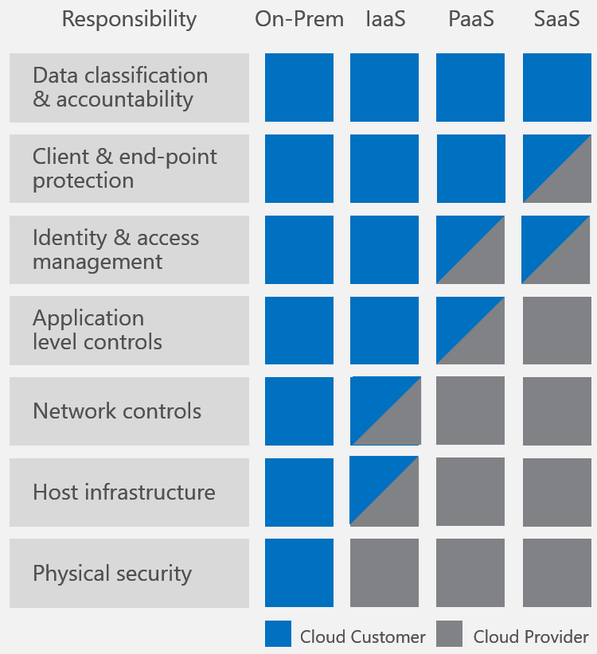
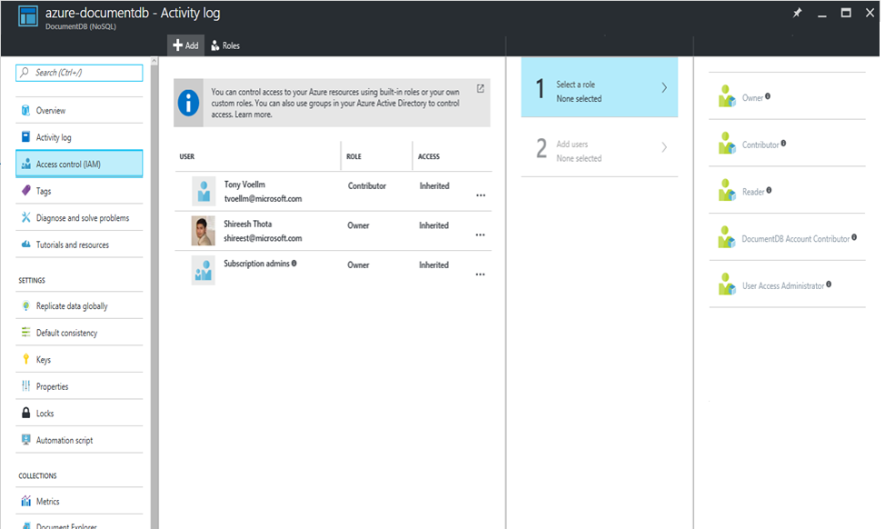

# DocumentDB NoSQL database security

This article discusses NoSQL database security best practices and key features offered by Azure DocumentDB to help you prevent, detect, and respond to database breaches.
 
## What's new in DocumentDB security?

Encryption at rest is now available for documents stored in DocumentDB in all Azure regions except government regions, Azure in China, and Azure in Germany. The remaining regions will be enabled next week, along with encryption at rest on backups. Encryption at rest is applied automatically for both new and existing customers in these regions. There is no need to configure anything; and you get the same great latency, throughput, availability, and functionality as before with the benefit of knowing your data is safe and secure with encryption at rest.

## How do I secure my NoSQL database? 

Data security is a shared responsibility between you, the customer, and your database provider. Depending on the database provider you choose, the amount of responsibility you carry can vary. If you choose an on-premises solution, you need to provide everything from end-point protection to physical security of your hardware - which is no easy task. If you choose a PaaS cloud database provider such as Azure DocumentDB, your area of concern shrinks considerably. The following image, borrowed from Microsoft's [Shared Responsibilities for Cloud Computing](https://aka.ms/sharedresponsibility) white paper, shows how your responsibility decreases with a PaaS provider like Azure DocumentDB.

The diagram above shows high-level cloud security components, but what items do you need to worry about specifically for your NoSQL database solution? And how can you compare solutions to each other? 

We recommend the following checklist of requirements on which to compare NoSQL database systems:

- Network security and firewall settings
- User authentication and fine grained user controls
- Ability to replicate data globally for regional failures
- Ability to perform failovers from one data center to another
- Local data replication within a data center
- Automatic data backups
- Restoration of deleted data from backups
- Protect and isolate sensitive data
- Monitoring for attacks
- Responding to attacks
- Ability to geo-fence data to adhere to data governance restrictions
- Physical protection of servers in protected data centers

And although it may seem obvious, recent [large-scale database breaches](http://thehackernews.com/2017/01/mongodb-database-security.html) remind us of the simple but critical importance of the following requirements:
- Patched servers that are kept up to date
- HTTPS by default/SSL encryption
- Administrative accounts with strong passwords

## How does Azure DocumentDB secure my database?

Let's look back at the preceding list - how many of those security requirements does Azure DocumentDB provide? Every single one.

Let's dig into each one in detail.

|Security requirement|DocumentDB's security approach|
|---|---|---|
|Network security|Using an IP firewall is the first layer of protection to secure your NoSQL database. DocumentDB supports policy driven IP-based access controls for inbound firewall support. The IP-based access controls are similar to the firewall rules used by traditional database systems, but they are expanded so that a DocumentDB database account is only accessible from an approved set of machines or cloud services.   DocumentDB enables you to enable a specific IP address (168.61.48.0), an IP range (168.61.48.0/8), and combinations of IPs and ranges.   All requests originating from machines outside this allowed list are blocked by DocumentDB. Requests from approved machines and cloud services then must complete the authentication process to be given access control to the resources.  Learn more in [DocumentDB firewall support](documentdb-firewall-support.md).|
|Authorization|DocumentDB uses hash-based message authentication code (HMAC) for authorization.   Each request is hashed using the secret account key, and the subsequent base-64 encoded hash is sent with each call to DocumentDB. To validate the request, the DocumentDB service uses the correct secret key and properties to generate a hash, then it compares the value with the one in the request. If the two values match, the operation is authorized successfully and the request is processed, otherwise there is an authorization failure and the request is rejected.  You can use either a [master key](documentdb-secure-access-to-data.md#master-keys), or a [resource token](documentdb-secure-access-to-data.md#resource-tokens) allowing fine-grained access to a resource such as a document.  Learn more in [Securing access to DocumentDB resources](documentdb-secure-access-to-data.md).|
|Users and permissions|Using the [master key](#master-key) for the account, you can create user resources and permission resources per database. A [resource token](#resource-token) is associated with a permission in a database and determines whether the user has access (read-write, read-only, or no access) to an application resource in the database. Application resources include collections, documents, attachments, stored procedures, triggers, and UDFs. The resource token is then used during authentication to provide or deny access to the resource.  Learn more in [Securing access to DocumentDB resources](documentdb-secure-access-to-data.md).|
|Active directory integration (RBAC)| You can also provide access to the database account using Access control (IAM) in the Azure portal. IAM provides role-based access control and integrates with Active Directory. You can use built in roles or custom roles for individuals and groups as shown in the following image.  |
|Global replication|DocumentDB offers turnkey global distribution, which enables you to replicate your data to any one of Azure's world-wide datacenters with the click of a button. Global replication lets you scale globally and provide low-latency access to your data around the world.  In the context of security, global replication insures data protection against regional failures.  Learn more in [Distribute data globally](documentdb-distribute-data-globally.md).|
|Regional failovers|If you have replicated your data in more than one data center, DocumentDB automatically rolls over your operations should a regional data center go offline. You can create a prioritized list of failover regions using the regions in which your data is replicated.   Learn more in [Regional Failovers in Azure DocumentDB](documentdb-regional-failovers.md).|
|Local replication|Even within a single data center, DocumentDB automatically replicates data for high availability giving you the choice of [consistency levels](documentdb-consistency-levels.md). This guarantees a [99.99% uptime availability SLA](https://azure.microsoft.com/support/legal/sla/documentdb/v1_1/) and comes with a financial guarantee - something no other NoSQL database service can provide.|
|Automated online backups|DocumentDB databases are backed up regularly and stored in a georedundant store.   Learn more in [Automatic online backup and restore with DocumentDB](documentdb-online-backup-and-restore.md).|
|Restore deleted data|The automated online backups can be used to recover data you may have accidentally deleted up to ~30 days after the event.   Learn more in [Automatic online backup and restore with DocumentDB](documentdb-online-backup-and-restore.md)|
|Protect and isolate sensitive data|All data in the regions listed in [What's new?](#whats-new) is now encrypted at rest.  PII and other confidential data can be isolated to specific collections and read-write, or read-only access can be limited to specific users.|
|Monitor for attacks|By using audit logging and activity logs, you can monitor your account for normal and abnormal activity. You can view what operations were performed on your resources, who initiated the operation, when the operation occurred, the status of the operation, and much more.  |
|Respond to attacks|Once you have contacted Azure support to report a potential attack, a 5-step incident response process is kicked off. The goal of the 5-step process is to restore normal service security and operations as quickly as possible after an issue is detected and an investigation is started.  Learn more in [Microsoft Azure Security Response in the Cloud](https://aka.ms/securityresponsepaper).|
|Geo-fencing|DocumentDB ensures data governance and compliance for sovereign regions (for example, Germany, China, US Gov).|
|Protected facilities|Data in DocumentDB is stored on SSDs in Azure's protected data centers.  Learn more in [Microsoft global datacenters](https://www.microsoft.com/en-us/cloud-platform/global-datacenters)|
|HTTPS/SSL/TLS encryption|All client-to-service DocumentDB interactions are SSL/TLS 1.2 enforced. Also, all intra datacenter and cross datacenter replication is SSL/TLS 1.2 enforced.|
|Encryption at rest|All data stored into DocumentDB is encrypted at rest. Learn more in [DocumentDB encryption at rest](.\documentdb-nosql-database-encryption-at-rest.md)|
|Patched servers|As a managed NoSQL database, DocumentDB eliminates the need to manage and patch servers, that's done for you, automatically.|
|Administrative accounts with strong passwords|It's hard to believe we even need to mention this requirement, but unlike some of our competitors, it's impossible to have an administrative account with no password in DocumentDB.   Security via SSL and HMAC secret based authentication is baked in by default.|
|Security and data protection certifications|DocumentDB has [ISO 27001](https://www.microsoft.com/en-us/TrustCenter/Compliance/ISO-IEC-27001), [European Model Clauses (EUMC)](https://www.microsoft.com/en-us/TrustCenter/Compliance/EU-Model-Clauses), and [HIPAA](https://www.microsoft.com/en-us/TrustCenter/Compliance/HIPAA) certifications. Additional certifications are in progress.|

## Next steps

For more details about master keys and resource tokens, see [Securing access to DocumentDB data](documentdb-secure-access-to-data.md).

For more details about Microsoft certifications, see [Azure Trust Center](https://azure.microsoft.com/en-us/support/trust-center/).
