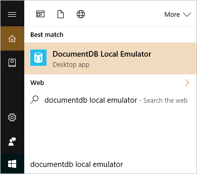
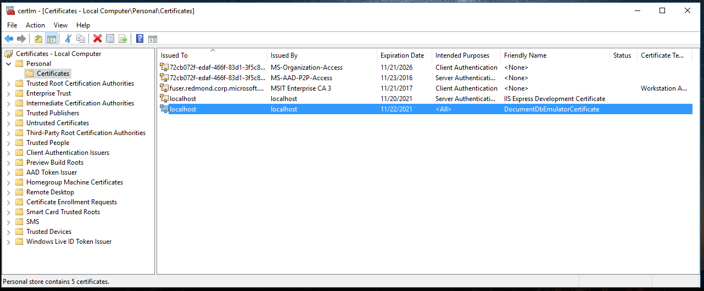

# Use the Azure DocumentDB Emulator for development and testing

[**Download the Emulator**](https://aka.ms/documentdb-emulator)

The Azure DocumentDB Emulator provides a local environment that emulates the Azure DocumentDB service for development purposes. Using the DocumentDB Emulator, you can develop and test your application locally, without creating an Azure subscription or incurring any costs. When you're satisfied with how your application is working in the DocumentDB Emulator, you can switch to using an Azure DocumentDB account in the cloud.

We recommend getting started by watching the following video, where Kirill Gavrylyuk shows how to get started with the DocumentDB Emulator.

> [!VIDEO https://channel9.msdn.com/Events/Connect/2016/192/player]
> 
> 

## DocumentDB Emulator system requirements
The DocumentDB Emulator has the following hardware and software requirements:

* Software requirements
  * Windows Server 2012 R2, Windows Server 2016, or Windows 10
*	Minimum Hardware requirements
  *	2 GB RAM
  *	10 GB available hard disk space

## Installing the DocumentDB Emulator
You can download and install the DocumentDB Emulator from the [Microsoft Download Center](https://aka.ms/documentdb-emulator). 

> [!NOTE]
> To install, configure, and run the DocumentDB Emulator, you must have administrative privileges on the computer.

## Checking for DocumentDB Emulator updates
The DocumentDB Emulator includes a built-in Azure DocumentDB Data Explorer to browse data stored within DocumentDB, create new collections, and let you know when a new update is available for download. 

> [!NOTE]
> Data created in one version of the DocumentDB Emulator is not guaranteed to be accessible when using a different version. If you need to persist your data for the long term, it is recommended that you store that data in an Azure DocumentDB account, rather than in the DocumentDB Emulator. 

## How the DocumentDB Emulator works
The DocumentDB Emulator provides a high-fidelity emulation of the DocumentDB service. It supports identical functionality as Azure DocumentDB, including support for creating and querying JSON documents, provisioning and scaling collections, and executing stored procedures and triggers. You can develop and test applications using the DocumentDB Emulator, and deploy them to Azure at global scale by just making a single configuration change to the connection endpoint for DocumentDB.

While we created a high-fidelity local emulation of the actual DocumentDB service, the implementation of the DocumentDB Emulator is different than that of the service. For example, the DocumentDB Emulator uses standard OS components such as the local file system for persistence, and HTTPS protocol stack for connectivity. This means that some functionality that relies on Azure infrastructure like global replication, single-digit millisecond latency for reads/writes, and tunable consistency levels are not available via the DocumentDB Emulator.

## Authenticating requests against the DocumentDB Emulator
Just as with Azure Document in the cloud, every request that you make against the DocumentDB Emulator must be authenticated. The DocumentDB Emulator supports a single fixed account and a well-known authentication key for master key authentication. This account and key are the only credentials permitted for use with the DocumentDB Emulator. They are:

    Account name: localhost:<port>
    Account key: C2y6yDjf5/R+ob0N8A7Cgv30VRDJIWEHLM+4QDU5DE2nQ9nDuVTqobD4b8mGGyPMbIZnqyMsEcaGQy67XIw/Jw==

> [!NOTE]
> The master key supported by the DocumentDB Emulator is intended for use only with the emulator. You cannot use your production DocumentDB account and key with the DocumentDB Emulator. 

Additionally, just as the Azure DocumentDB service, the DocumentDB Emulator supports only secure communication via SSL.

## Start and initialize the DocumentDB Emulator

To start the Azure DocumentDB Emulator, select the Start button or press the Windows key. Begin typing **DocumentDB Emulator**, and select the emulator from the list of applications. 

When the emulator is running, you'll see an icon in the Windows taskbar notification area. The DocumentDB Emulator by default runs on the local machine ("localhost") listening on port 8081.

The DocumentDB Emulator is installed by default to the `C:\Program Files\DocumentDB Emulator` directory. You can also start and stop the emulator from the command-line. See [command-line tool reference](#command-line) for more information.

## Start the local emulator Data Explorer

When the local emulator launches it will automatically open the DocumentDB Data Explorer in your browser. The address will appear as [https://localhost:8081/_explorer/index.html](https://localhost:8081/_explorer/index.html). If you close the explorer and would like to re-open it later, you can either open the URL in your browser or launch it from the DocumentDB Emulator in the Windows Tray Icon as shown below.

## Developing with the DocumentDB Emulator
Once you have the DocumentDB Emulator running on your desktop, you can use any supported [DocumentDB SDK](documentdb-sdk-dotnet.md) or the [DocumentDB REST API](https://msdn.microsoft.com/library/azure/dn781481.aspx) to interact with the Emulator. The DocumentDB Emulator also includes a built-in Data Explorer that lets you create collections, view and edit documents without writing any code. 

    // Connect to the DocumentDB Emulator running locally
    DocumentClient client = new DocumentClient(
        new Uri("https://localhost:8081"), 
        "C2y6yDjf5/R+ob0N8A7Cgv30VRDJIWEHLM+4QDU5DE2nQ9nDuVTqobD4b8mGGyPMbIZnqyMsEcaGQy67XIw/Jw==",
        new ConnectionPolicy { EnableEndpointDiscovery = false });

> [!NOTE]
> When connecting to the emulator, you must set EnableEndpointDiscovery = false in the connection configuration.

If you're using [DocumentDB protocol support for MongoDB](documentdb-protocol-mongodb.md), please use the following connection string:

    mongodb://localhost:C2y6yDjf5/R+ob0N8A7Cgv30VRDJIWEHLM+4QDU5DE2nQ9nDuVTqobD4b8mGGyPMbIZnqyMsEcaGQy67XIw/Jw==@localhost:10250/test?ssl=true

You can use existing tools like [DocumentDB Studio](https://github.com/mingaliu/DocumentDBStudio) to connect to the DocumentDB Emulator. You can also migrate data between the DocumentDB Emulator and the Azure DocumentDB service using the [DocumentDB Data Migration Tool](https://github.com/azure/azure-documentdb-datamigrationtool).

## Export the DocumentDB Emulator SSL certificate

.NET languages and runtime use the Windows Certificate Store to securely connect to the DocumentDB local emulator. Other languages have their own method of managing and using certificates. Java uses its own [certificate store](https://docs.oracle.com/cd/E19830-01/819-4712/ablqw/index.html) whereas Python uses [socket wrappers](https://docs.python.org/2/library/ssl.html).

In order to obtain a certificate to use with languages and runtimes that do not integrate with the Windows Certificate Store you will need to export it using the Windows Certificate Manager. You can start it by running certlm.msc or follow the step by step instructions in [Export the DocumentDB Emulator Certificates](./documentdb-nosql-local-emulator-export-ssl-certificates.md). Once the certificate manager is running, open the Personal Certificates as shown below and export the certificate with the friendly name "DocumentDBEmulatorCertificate" as a BASE-64 encoded X.509 (.cer) file.

The X.509 certificate can be imported into the Java certificate store by following the instructions in [Adding a Certificate to the Java CA Certificates Store](https://docs.microsoft.com/en-us/azure/java-add-certificate-ca-store). Once the certificate is imported into the cacerts store Java and MongoDB applications will be able to connect to the DocumentDB Emulator.

## DocumentDB Emulator command-line tool reference
From the installation location, you can use the command-line to start and stop the emulator, configure options, and perform other operations.

### Command-line Syntax

    DocumentDB.Emulator.exe [/shutdown] [/datapath] [/port] [/mongoport] [/directports] [/key] [/?]

To view the list of options, type `DocumentDB.Emulator.exe /?` at the command prompt.

<table>
<tr>
  <td><strong>Option</strong></td>
  <td><strong>Description</strong></td>
  <td><strong>Command</strong></td>
  <td><strong>Arguments</strong></td>
</tr>
<tr>
  <td>[No arguments]</td>
  <td>Starts up the DocumentDB Emulator with default settings</td>
  <td>DocumentDB.Emulator.exe</td>
  <td></td>
</tr>
<tr>
  <td>Shutdown</td>
  <td>Shuts down the DocumentDB Emulator</td>
  <td>DocumentDB.Emulator.exe /Shutdown</td>
  <td></td>
</tr>
<tr>
  <td>Help</td>
  <td>Displays the list of command-line arguments</td>
  <td>DocumentDB.Emulator.exe /?</td>
  <td></td>
</tr>
<tr>
  <td>Datapath</td>
  <td>Specifies the path in which to store data files</td>
  <td>DocumentDB.Emulator.exe /datapath=&lt;datapath&gt;</td>
  <td>&lt;datapath&gt;: An accessible path</td>
</tr>
<tr>
  <td>Port</td>
  <td>Specifies the port number to use for the emulator.  Default is 8081</td>
  <td>DocumentDB.Emulator.exe /port=&lt;port&gt;</td>
  <td>&lt;port&gt;: Single port number</td>
</tr>
<tr>
  <td>MongoPort</td>
  <td>Specifies the port number to use for MongoDB compatibility API. Default is 10250</td>
  <td>DocumentDB.Emulator.exe /mongoport=&lt;mongoport&gt;</td>
  <td>&lt;mongoport&gt;: Single port number</td>
</tr>
<tr>
  <td>DirectPorts</td>
  <td>Specifies the ports to use for direct connectivity. Defaults are 10251,10252,10253,10254</td>
  <td>DocumentDB.Emulator.exe /directports:&lt;directports&gt;</td>
  <td>&lt;directports&gt;: Comma-delimited list of 4 ports</td>
</tr>
<tr>
  <td>Key</td>
  <td>Authorization key for the emulator. Key must be the base-64 encoding of a 64-byte vector</td>
  <td>DocumentDB.Emulator.exe /key:&lt;key&gt;</td>
  <td>&lt;key&gt;: Key must be the base-64 encoding of a 64-byte vector</td>
</tr>
<tr>
  <td>EnableThrottling</td>
  <td>Specifies that request throttling behavior is enabled</td>
  <td>DocumentDB.Emulator.exe /enablethrottling</td>
  <td></td>
</tr>
<tr>
  <td>DisableThrottling</td>
  <td>Specifies that request throttling behavior is disabled</td>
  <td>DocumentDB.Emulator.exe /disablethrottling</td>
  <td></td>
</tr>
<tr>
  <td>NoUi</td>
  <td>Do not show the emulator user interface.</td>
  <td>DocumentDB.LocalEmulator.exe /noui</td>
  <td></td>
</tr>
<tr>
  <td>NoExplorer</td>
  <td>Don't show document explorer on startup.</td>
  <td>DocumentDB.LocalEmulator.exe /noexplorer</td>
  <td></td>
</tr>
</table>

## Differences between the DocumentDB Emulator and Azure DocumentDB 
Because the DocumentDB Emulator provides an emulated environment running on a local developer workstation, there are some differences in functionality between the emulator and an Azure DocumentDB account in the cloud:

* The DocumentDB Emulator supports only a single fixed account and a well-known master key.  Key regeneration is not possible in the DocumentDB Emulator.
* The DocumentDB Emulator is not a scalable service and will not support a large number of collections.
* The DocumentDB Emulator does not simulate different [DocumentDB consistency levels](documentdb-consistency-levels.md).
* The DocumentDB Emulator does not simulate [multi-region replication](documentdb-distribute-data-globally.md).
* The DocumentDB Emulator does not support the service quota overrides that are available in the Azure DocumentDB service (e.g. document size limits, increased partitioned collection storage).
* As your copy of the DocumentDB Emulator might not be up to date with the most recent changes with the Azure DocumentDB service, please [DocumentDB capacity planner](https://www.documentdb.com/capacityplanner) to accurately estimate production throughput (RUs) needs of your application.

## Next steps
* To learn more about DocumentDB, see [Introduction to Azure DocumentDB](documentdb-introduction.md)
* To start developing against the DocumentDB Emulator, download one of the [supported DocumentDB SDKs](documentdb-sdk-dotnet.md).
