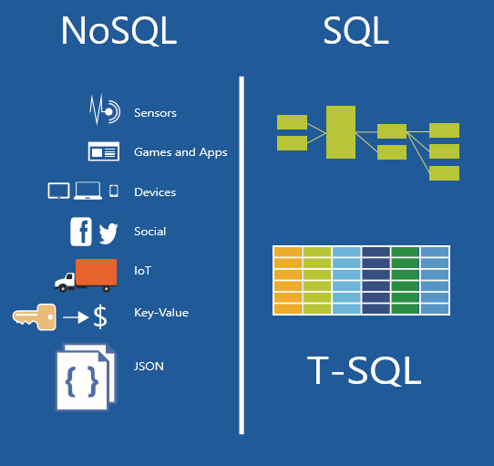

<properties
	pageTitle="When to use NoSQL vs SQL | Microsoft Azure"
	description="Compare the benefits of using non-relational NoSQL solutions versus SQL solutions. Learn whether one of the Microsoft Azure NoSQL services or SQL Server solutions best fits your scenario."
	keywords="nosql vs sql, when to use NoSQL, sql vs nosql"
	services="documentdb"
	documentationCenter=""
	authors="mimig1"
	manager="jhubbard"
	editor=""/>

<tags
	ms.service="documentdb"
	ms.workload="data-services"
	ms.tgt_pltfrm="na"
	ms.devlang="dotnet"
	ms.topic="article" 
	ms.date="03/20/2016"
	ms.author="mimig"/>

# NoSQL vs SQL Comparison

SQL Server and relational databases (RDBMS) have been the go-to databases for over 20 years. However, the increased need to process higher volumes and varieties of data at a rapid rate has altered the nature of data storage needs for application developers. In order to enable this scenario, NoSQL databases that enable storing unstructured and heterogeneous have data gained in popularity. 

NoSQL is a category of databases that are separate from the well-known SQL databases. NoSQL means "Not-SQL" or "Not Only SQL". There are a number of technologies in the NoSQL category, including document databases, key value stores, and column family stores, which are popular with gaming, social, and IoT apps.

The goal of this article is to help you learn about the differences between NoSQL and SQL, and provide you with a comparative introduction to the NoSQL and SQL offerings from Microsoft and Microsoft Azure.  

## NoSQL vs SQL 

The following table compares the benefits of NoSQL versus SQL. Which one best suits your requirements?

If a NoSQL database best suits your requirements, continue to the next section. Otherwise, if a SQL database best suits your needs, skip to [What are the Microsoft SQL offerings?](#what-are-the-microsoft-sql-offerings)

## What are the Microsoft Azure NoSQL offerings?

Azure has four fully-managed NoSQL services: 

- [Azure DocumentDB](https://azure.microsoft.com/services/documentdb/)
- [Azure Table Storage](https://azure.microsoft.com/services/storage/)
- [Azure HBase as a part of HDInsight](https://azure.microsoft.com/services/hdinsight/)
- [Azure Redis Cache](https://azure.microsoft.com/services/cache/)

The following comparison chart maps out the key differentiators for each service. Which one most accurately describes the needs of your application? 

If one or more of these services sounds like it might meet the needs of your application, learn more with the following resources: 

- [DocumentDB learning path](https://azure.microsoft.com/documentation/learning-paths/documentdb/) and [DocumentDB use cases](documentdb-use-case.md)
- [Get started with Azure table storage](storage/storage-dotnet-how-to-use-tables.md)
- [What is HBase in HDInsight](hdinsight-hbase-overview.md)
- [Redis Cache learning path](https://azure.microsoft.com/documentation/learning-paths/redis-cache/)

Then go to [Next steps](#next-steps) for free trial information.

## What are the Microsoft SQL offerings?

Microsoft has three SQL offerings: 

- [SQL Server](https://www.microsoft.com/server-cloud/products/sql-server-2016/)
- [SQL Server on Azure Virtual Machines](https://azure.microsoft.com/documentation/articles/virtual-machines-provision-sql-server/)
- [Azure SQL Database](https://azure.microsoft.com/services/sql-database/)

The following comparison charts maps out the key differentiators for each offering. Which one most accurately describes the needs of your application? 

*I will make this into a similar table as the NoSQL offering tables and add additional rows.*

|---|**SQL Server**|**SQL Server on Azure Virtual Machines**|**Azure SQL Database**|
|---|---|---|---|
|**Category**|Relational Database Management System (RDBMS)|Infrastructure as a service (IaaS)|Platform as a service (PaaS) database or database as a service (DBaaS) that is optimized for software-as-a-service (SaaS) app development|
|**Use case**|Existing on-premises applications or new applications where private hosting and administration is preferred|Existing on-premises applications with a preference to stop maintaining private hardware. Hybrid solutions. Elastic scale.|Building new cloud-based applications or migrating existing SQL Server solutions to take advantage of the cost savings and performance optimization that cloud services provide. Low initial time-to-market, long term cost optimization. Elastic scale|
|**Hardware**|Complete flexibility in choosing your own hardware|Wide variety of virtual machine sizes available in Azure|Hardware selected by Microsoft|
|**Hardware hosting**|Hosted privately. SQL Server is installed on-premises by DBA|Hosted on the cloud by Azure. SQL Server is installed on Windows Server Virtual Machines (VMs) hosted by Azure|On the cloud by Azure. This is a fully managed, cloud-based Azure service.|
|**Availability**|AlwaysOn availability and log shipping maintained by DBA|99.95% availability for Virtual Machines maintained by Microsoft. SQL Server AlwaysOn availability maintained by DBA|99.99% availability maintained by Microsoft|
|**Pricing**|License based on SQL Server edition|Size of virtual machine, time usage, and license based on SQL Server edition|Amount of storage per elastic database pool and performance level|

If one or more of these options sounds like it might meet the needs of your application, learn more with the following resources:

- [Choose a cloud SQL Server option: Azure SQL (PaaS) Database or SQL Server on Azure VMs (IaaS)](data-management-azure-sql-database-and-sql-server-iaas.md).
- [SQL Server Editions](https://www.microsoft.com/server-cloud/products/sql-server-editions/overview.aspx)

Then go to [Next steps](#next-steps) for free trial and evaluation links.

## Next steps

Interested in:

- DocumentDB, Table Storage, HBase on HDInsignt, or Redis Cache? You can sign up for a [free one-month trial](https://azure.microsoft.com/pricing/free-trial/) and receive $200 to spend on Azure.
- SQL Server or SQL Server on a Virtual Machine? Spin up an [evaluation version of SQL Server 2016 on a virtual machine](https://azure.microsoft.com/marketplace/partners/microsoft/sqlserver2016ctp33evaluationwindowsserver2012r2/).
- SQL Server 2016? Try [SQL Server Evaluations](https://www.microsoft.com/en-us/evalcenter/evaluate-sql-server-2016).

