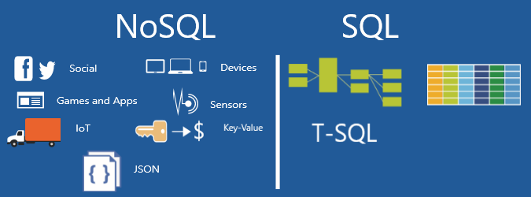
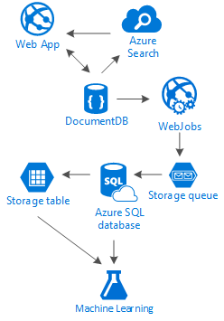
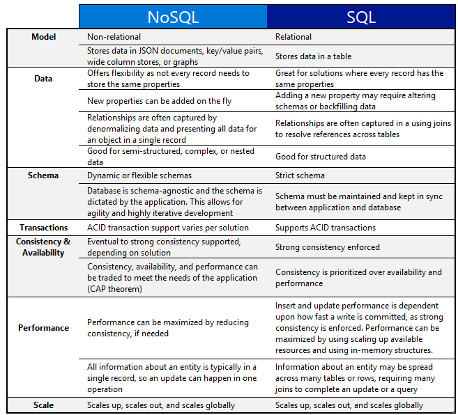
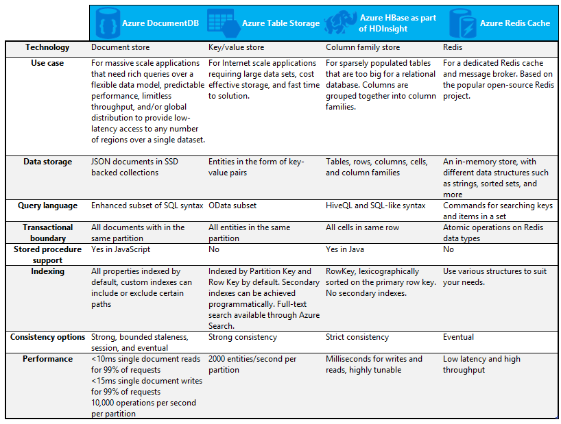

<properties
	pageTitle="When to use NoSQL vs SQL | Microsoft Azure"
	description="Compare the benefits of using non-relational NoSQL solutions versus SQL solutions. Learn whether one of the Microsoft Azure NoSQL services or SQL Server solutions best fits your scenario."
	keywords="nosql vs sql, when to use NoSQL, sql vs nosql"
	services="documentdb"
	documentationCenter=""
	authors="mimig1"
	manager="jhubbard"
	editor=""/>

<tags
	ms.service="documentdb"
	ms.workload="data-services"
	ms.tgt_pltfrm="na"
	ms.devlang="dotnet"
	ms.topic="article" 
	ms.date="03/21/2016"
	ms.author="mimig"/>

# NoSQL vs SQL Comparison

SQL Server and relational databases (RDBMS) have been the go-to databases for over 20 years. However, the increased need to process higher volumes and varieties of data at a rapid rate has altered the nature of data storage needs for application developers. In order to enable this scenario, NoSQL databases that enable storing unstructured and heterogeneous data have gained in popularity. 

NoSQL is a category of databases distinctly different from SQL databases. NoSQL means "Not-SQL" or "Not Only SQL". There are a number of technologies in the NoSQL category, including document databases, key value stores, and column family stores, which are popular with gaming, social, and IoT apps.

The goal of this article is to help you learn about the differences between NoSQL and SQL, and provide you with an introduction to the NoSQL and SQL offerings from Microsoft and Microsoft Azure.  

## When to use NoSQL?

Let's imagine you're building a new social media app. Users can create articles and add add pictures, videos and music to them. Other users can comment on the posts and give points to rate the articles. The landing page will have a feed of posts that users can share and interact with. There will be a feed of posts that users will see and be able to interact with on our main website landing. 

So how do you store this data? If you're familiar with SQL, you might start drawing something like this:

So far, so good, but now think about the structure of a single post. If you want to show that post in a website or application, you'd have to do a query with eight table joins just to show a single post. Now imagine a stream of posts that dynamically load and appear on the screen and you can easily predict that it's going to require thousands of queries and many joins to complete the task.

Now you could use a relational solution like SQL Server or SQL Data Warehouse to store the data - but there's another option, a NoSQL option that simplifies the approach. By transforming the post into a JSON document like the following and storing it in DocumentDB, an Azure NoSQL service, you can retrieve the whole post with one query and no joins. It's a simpler and more straightforward result.

    {
        "id":"ew12-res2-234e-544f",
        "title":"post title",
        "date":"2016-01-01",
        "body":"this is an awesome post stored on NoSQL",
        "createdBy":User,
        "images":["http://myfirstimage.png","http://mysecondimage.png"],
        "videos":[
            {"url":"http://myfirstvideo.mp4", "title":"The first video"},
            {"url":"http://mysecondvideo.mp4", "title":"The second video"}
        ],
        "audios":[
            {"url":"http://myfirstaudio.mp3", "title":"The first audio"},
            {"url":"http://mysecondaudio.mp3", "title":"The second audio"}
        ]
    }

You could then build on this solution using: 

- An intelligent search solution like Azure Search
- The flexibility of Azure App Services to host the application and the background processes
- Expandable storage solutions such as Azure Storage and Azure SQL Database for storing massive amounts of data
- The analytic power of Azure Machine Learning to create knowledge and intelligence that can provide feedback to our processes and help us deliver the right content to the right users.

This social media app is just one one scenario in which a NoSQL database is the right data model for the job. If you're interested in reading more about this scenario and how to model your data for DocumentDB in social media pplications, see [Going social with DocumentDB](documentdb-social-media-app.md). 

Other scenarios where NoSQL may be better suited for the data model than SQL include the following:

- Massive amounts of device information that contain only a key and an attribute per device could be stored in Azure Table Storage.
- Sensor data collected incrementally from various sources and used provide metrics and insights about the health of server system could be stored in HBase as a part of HDInsight.
- A list of the most popular movies and times could be populated from Redis Cache because the commonly requested movie times can be cached and don't need to be continually retrieved from the database.

## NoSQL vs SQL 

The following table compares some differences between NoSQL and SQL. 

If a NoSQL database best suits your requirements, continue to the next section to learn more about the NoSQL services available from Azure. Otherwise, if a SQL database best suits your needs, skip to [What are the Microsoft SQL offerings?](#what-are-the-microsoft-sql-offerings)

## What are the Microsoft Azure NoSQL offerings?

Azure has four fully-managed NoSQL services: 

- [Azure DocumentDB](https://azure.microsoft.com/services/documentdb/)
- [Azure Table Storage](https://azure.microsoft.com/services/storage/)
- [Azure HBase as a part of HDInsight](https://azure.microsoft.com/services/hdinsight/)
- [Azure Redis Cache](https://azure.microsoft.com/services/cache/)

The following comparison chart maps out the key differentiators for each service. Which one most accurately describes the needs of your application? 

If one or more of these services might meet the needs of your application, learn more with the following resources: 

- [DocumentDB learning path](https://azure.microsoft.com/documentation/learning-paths/documentdb/) and [DocumentDB use cases](documentdb-use-cases.md)
- [Get started with Azure table storage](../storage/storage-dotnet-how-to-use-tables.md)
- [What is HBase in HDInsight](../hdinsight/hdinsight-hbase-overview.md)
- [Redis Cache learning path](https://azure.microsoft.com/documentation/learning-paths/redis-cache/)

Then go to [Next steps](#next-steps) for free trial information.

## What are the Microsoft SQL offerings?

Microsoft has four SQL offerings: 

- [SQL Server](https://www.microsoft.com/server-cloud/products/sql-server-2016/)
- [SQL Server on Azure Virtual Machines](https://azure.microsoft.com/services/virtual-machines/sql-server/)
- [Azure SQL Database](https://azure.microsoft.com/services/sql-database/)
- [Azure SQL Data Warehouse (Preview)](https://azure.microsoft.com/services/sql-data-warehouse/)

If you're interested in SQL Server on a Virtual Machine or SQL Database, then read [Choose a cloud SQL Server option: Azure SQL (PaaS) Database or SQL Server on Azure VMs (IaaS)](../sql-database/data-management-azure-sql-database-and-sql-server-iaas.md) to learn more about the differences between the two.

If SQL Server sounds like the best option, then go to [SQL Server Editions](https://www.microsoft.com/server-cloud/products/sql-server-editions/overview.aspx) to learn more about what the different versions of SQL offer.

Then go to [Next steps](#next-steps) for free trial and evaluation links.

## Next steps

We invite you to learn more about our SQL and NoSQL products by trying them out for free. 

|Product|Free trial and evaluation information|
|---|---|
|[Azure DocumentDB](https://azure.microsoft.com/services/documentdb/)  [Azure Table Storage](https://azure.microsoft.com/services/storage/)  [Azure HBase as a part of HDInsight](https://azure.microsoft.com/services/hdinsight/)  [Azure Redis Cache](https://azure.microsoft.com/services/cache/)  [Azure SQL Data Warehouse (Preview)](https://azure.microsoft.com/services/sql-data-warehouse/)  [Azure SQL Database](https://azure.microsoft.com/services/sql-database/)|You can sign up for a [free one-month trial](https://azure.microsoft.com/pricing/free-trial/) and receive $200 to spend on Azure.|
|[SQL Server](https://www.microsoft.com/server-cloud/products/sql-server-2016/)  [SQL Server on Azure Virtual Machines](https://azure.microsoft.com/services/virtual-machines/sql-server/)|Spin up an [evaluation version of SQL Server 2016 on a virtual machine](https://azure.microsoft.com/marketplace/partners/microsoft/sqlserver2016ctp33evaluationwindowsserver2012r2/).  Or see [SQL Server Evaluations](https://www.microsoft.com/en-us/evalcenter/evaluate-sql-server-2016).|

