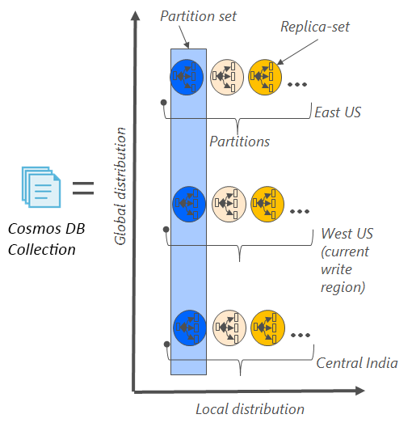
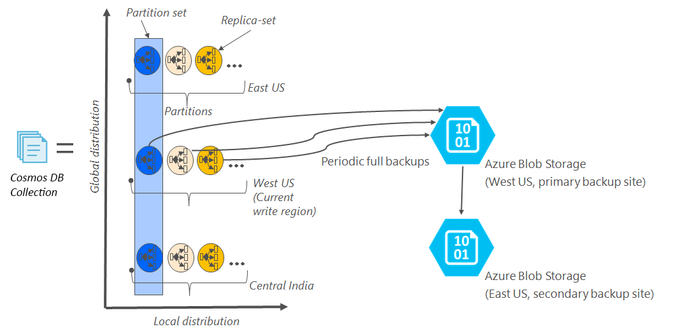

# Automatic online backup and restore with DocumentDB
Azure DocumentDB automatically takes backups of all your data at regular intervals. The automatic backups are taken without affecting the performance or availability of your NoSQL database operations. All your backups are stored separately in another storage service, and those backups are globally replicated for resiliency against regional disasters. The automatic backups are intended for scenarios when you accidentally delete your DocumentDB collection and later require data recovery or a disaster recovery solution.  

This article starts with a quick recap of the data redundancy and availability in DocumentDB, and then discusses backups. 

## High availability with DocumentDB - a recap
DocumentDB is designed to be [globally distributed](documentdb-distribute-data-globally.md) – it allows you to scale throughput across multiple Azure regions along with policy driven failover and transparent multi-homing APIs. As a database system offering [99.99% availability SLAs](https://azure.microsoft.com/support/legal/sla/documentdb/v1_1/), all the writes in DocumentDB are durably committed to local disks by a quorum of replicas within a local data center before acknowledging to the client. Note that the high availability of DocumentDB relies on local storage and does not depend on any external storage technologies. Additionally, if your database account is associated with more than one Azure region, your writes are replicated across other regions as well. To scale your throughput and access data at low latencies, you can have as many read regions associated with your database account as you like. In each read region, the (replicated) data is durably persisted across a replica set.  

As illustrated in the following diagram, a single DocumentDB collection is [horizontally partitioned](documentdb-partition-data.md). A “partition” is denoted by a circle in the following diagram, and each partition is made highly available via a replica set. This is the local distribution within a single Azure region (denoted by the X axis). Further, each partition (with its corresponding replica set) is then globally distributed across multiple regions associated with your database account (for example, in this illustration the three regions – East US, West US and Central India). The “partition set” is a globally distributed entity comprising of multiple copies of your data in each region (denoted by the Y axis). You can assign priority to the regions associated with your database account and DocumentDB will transparently failover to the next region in case of disaster. You can also manually simulate failover to test the end-to-end availability of your application.  

The following image illustrates the high degree of redundancy with DocumentDB.

## Full, automatic, online backups
Oops, I deleted my collection or database! With DocumentDB, not only your data, but the backups of your data are also made highly redundant and resilient to regional disasters. These automated backups are currently taken approximately every four hours and latest 2 backups are stored at all times. If the data is accidently dropped or corrupted, please [contact Azure support](https://azure.microsoft.com/support/options/) within 8 hours. 

The backups are taken without affecting the performance or availability of your database operations. DocumentDB takes the backup in the background without consuming your provisioned RUs or affecting the performance and without affecting the availability of your NoSQL database. 

Unlike your data that is stored inside DocumentDB, the automatic backups are stored in Azure Blob Storage service. To guarantee the low latency/efficient upload, the snapshot of your backup is uploaded to an instance of Azure Blob storage in the same region as the current write region of your DocumentDB database account. For resiliency against regional disaster, each snapshot of your backup data in Azure Blob Storage is again replicated via geo-redundant storage (GRS) to another region. The following diagram shows that the entire DocumentDB collection (with all three primary partitions in West US, in this example) is backed up in a remote Azure Blob Storage account in West US and then GRS replicated to East US. 

The following image illustrates periodic full backups of all DocumentDB entities in GRS Azure Storage.

## Retention period for a given snapshot
As described above, we periodically take snapshots of your data and per our compliance regulations, we retain the latest snapshot up to 90 days before it eventually gets purged. If a collection or account is deleted, DocumentDB stores the last backup for 90 days.

## Restore database from the online backup
In case you accidentally delete your data, you can [file a support ticket](https://portal.azure.com/?#blade/Microsoft_Azure_Support/HelpAndSupportBlade) or [call Azure support](https://azure.microsoft.com/support/options/) to restore the data from the last automatic backup. For a specific snapshot of your backup to be restored, DocumentDB requires that the data was at least available with us for the duration of the backup cycle for that snapshot.

## Next steps
To replicate your NoSQL database in multiple data centers, see [distribute your data globally with DocumentDB](documentdb-distribute-data-globally.md). 

To file contact Azure Support, [file a ticket from the Azure portal](https://portal.azure.com/?#blade/Microsoft_Azure_Support/HelpAndSupportBlade).

