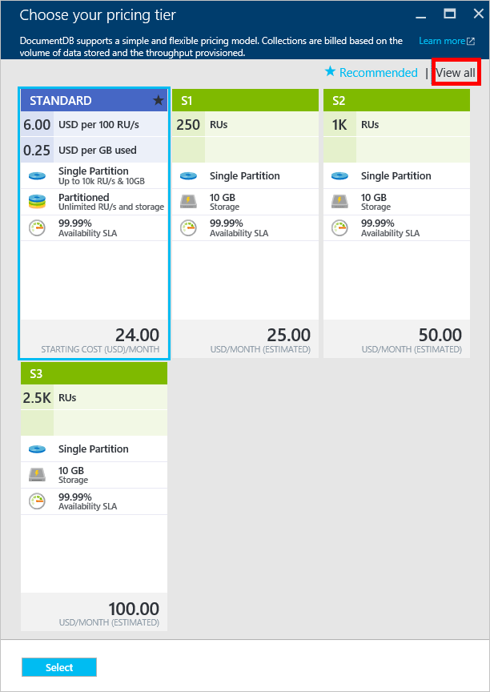

# Performance levels and pricing tiers in DocumentDB
This article provides an overview of performance levels in [Microsoft Azure DocumentDB](https://azure.microsoft.com/services/documentdb/).

After reading this article, you'll be able to answer the following questions:  

* What is a performance level?
* How is throughput reserved for a database account?
* How do I work with performance levels?
* How am I billed for performance levels?

## Introduction to performance levels
Each DocumentDB collection created in a Standard DocumentDB account is provisioned with an associated performance level. Each collection in a database can have a different performance level enabling you to designate more throughput for frequently accessed collections and less throughput for infrequently accessed collections. 

DocumentDB supports both **user-defined** performance levels and **pre-defined** performance levels, as shown in the following table.  User-defined performance enables you to reserved throughput in units of 100 RU/s and have unlimited storage, whereas the three pre-defined performance levels have specified throughput options, and a 10GB storage quota. The following table compares **user-defined** performance to **pre-defined** performance.

|Performance type|Details|Throughput|Storage|Version|APIs|
|----------------|-------|----------|-------|-------|----|
|User-defined performance|User sets throughput in units of 100 RU/s|Unlimited.   400 - 250,000 request units/s by default (higher by request)|Unlimited.   250 GB by default (higher by request)|V2|API 2015-12-16 and newer|
|Pre-defined performance|10 GB reserved storage.  S1 = 250 RU/s S2 = 1000 RU/s S3 = 2500 RU/s|2500 RU/s|10 GB|V1|Any|

Throughput that is reserved per collection, and is available for use by that collection exclusively. Throughput is measured in [request units (RUs)](documentdb-request-units.md), which measure for the resources required to perform various DocumentDB database operations.

> [!NOTE]
> The performance level of a collection can be adjusted through the [SDKs](documentdb-sdk-dotnet.md) or the [Azure portal](https://portal.azure.com/). Performance level changes are expected to complete within 3 minutes.
> 
> 

## Setting performance levels for collections
Once a collection is created, the full allocation of RUs based on the designated performance level are reserved for the collection.

Note that with both user-defined and pre-defined performance levels, DocumentDB operates based on reservation of throughput. By creating a collection, an application has reserved and is billed for reserved throughput regardless of how much of that throughput is actively used. With user-defined performance levels, storage is metered based on consumption, but with pre-defined performance levels, 10 GB of storage is reserved at the time of collection creation.  

After collections are created, you can modify the performance level and/or throughput by using the [SDKs](documentdb-sdk-dotnet.md) or the [Azure portal](https://portal.azure.com/).

> [!IMPORTANT]
> DocumentDB Standard collections are billed at an hourly rate and each collection you create will be billed for a minimum one hour of usage.
> 
> 

If you adjust the performance level of a collection within an hour, you will be billed for the highest performance level set during the hour. For example, if you increase your performance level for a collection at 8:53am you will be charged for the new level starting at 8:00am. Likewise, if you decrease your performance level at 8:53am, the new rate will be applied at 9:00am.

Request units are reserved for each collection based on the performance level set. Request unit consumption is evaluated as a per second rate. Applications that exceed the provisioned request unit rate (or performance level) on a collection will be throttled until the rate drops below the reserved level for that collection. If your application requires a higher level of throughput, you can increase the performance level for each collection.

> [!NOTE]
> When your application exceeds performance levels for one or multiple collections, requests will be throttled on a per collection basis. This means that some application requests may succeed while others may be throttled. It is recommended to add a small number of retries when throttled in order to handle spikes in request traffic.
> 
> 

## Working with performance levels
DocumentDB collections enable you to group your data based on both the query patterns and performance needs of your application. With DocumentDB’s automatic indexing and query support, it is quite common to collocate heterogeneous documents within the same collection. The key considerations in deciding whether separate collections should be used include:

* Queries – A collection is the scope for query execution. If you need to query across a set of documents, the most efficient read patterns come from collocating documents in a single collection.
* Transactions – All transactions are scoped to within a single collection. If you have documents that must be updated within a single stored procedure or trigger, they must be stored within the same collection. More specifically, a partition key within a collection is the transaction boundary. Please see [Partitioning in DocumentDB](documentdb-partition-data.md) for more details.
* Performance isolation – A collection has an associated performance level. This ensures that each collection has a predictable performance through reserved RUs. Data can be allocated to different collections, with different performance levels, based on access frequency.

> [!IMPORTANT]
> It is important to understand you will be billed at full standard rates based on the number of collections created by your application.
> 
> 

It is recommended that your application makes use of a small number of collections unless you have large storage or throughput requirements. Ensure that you have well understood application patterns for the creation of new collections. You may choose to reserve collection creation as a management action handled outside your application. Similarly, adjusting the performance level for a collection will change the hourly rate at which the collection is billed. You should monitor collection performance levels if your application adjusts these dynamically.

## Change from S1, S2, S3 to user-defined performance
Follow these steps to change from using pre-defined throughput levels to user-defined throughput levels in the Azure portal. By using user-defined throughput levels, you can tailor your throughput to your needs. And if you're still using an S1 account, you can increase your default throughput from 250 RU/s to 400 RU/s with just a few clicks. Note that once you move a collection from S1, S2 or S3 to Standard (user-defined), you cannot move back to S1, S2, or S3, you can however modify the throughput of a Standard collection at any time.

For more information about the pricing changes related to user-defined and pre-defined throughput, see the blog post [DocumentDB: Everything you need to know about using the new pricing options](https://azure.microsoft.com/blog/documentdb-use-the-new-pricing-options-on-your-existing-collections/).

> [!VIDEO https://channel9.msdn.com/Blogs/AzureDocumentDB/ChangeDocumentDBCollectionPerformance/player]
> 
> 

1. In the [**Azure portal**](https://portal.azure.com), click **NoSQL (DocumentDB)**, then select the DocumentDB account to modify. 
 
    If **NoSQL (DocumentDB)** is not on the Jumpbar, click >, scroll to **Databases**, select **NoSQL (DocumentDB)**, and then select the DocumentDB account.  

2. On the resource menu, under **Collections**, click **Scale**, select the collection to modify from the drop down list, and then click **Pricing Tier**. Accounts using pre-defined throughput have a pricing tier of S1, S2, or S3.  In the **Choose your pricing tier** blade, click **Standard** to change to user-defined throughput, and then click **Select** to save your change.

    

3. Back in the **Scale** blade, the **Pricing Tier** is changed to **Standard** and the **Throughput (RU/s)** box is displayed with a default value of 400. Set the throughput between 400 and 10,000 [Request units](documentdb-request-units.md)/second (RU/s). The **Estimated Monthly Bill** at the bottom of the page updates automatically to provide an estimate of the monthly cost. Click **Save** to save your changes.

    If you determine that you need more throughput (greater than 10,000 RU/s) or more storage (greater than 10GB) you can create a partitioned collection. To create a partitioned collection, see [Create a collection](documentdb-create-collection.md).

> [!NOTE]
> Changing performance levels of a collection may take up to 2 minutes.
> 
> 

## Changing performance levels using the .NET SDK
Another option for changing your collections' performance levels is through our SDKs. This section only covers changing a collection's performance level using our [.NET SDK](https://msdn.microsoft.com/library/azure/dn948556.aspx), but the process is similar for our other [SDKs](https://msdn.microsoft.com/library/azure/dn781482.aspx). If you are new to our .NET SDK, please visit our [getting started tutorial](documentdb-get-started.md).

Here is a code snippet for changing the offer throughput to 50,000 request units per second:

    //Fetch the resource to be updated
    Offer offer = client.CreateOfferQuery()
                      .Where(r => r.ResourceLink == collection.SelfLink)    
                      .AsEnumerable()
                      .SingleOrDefault();

    // Set the throughput to 5000 request units per second
    offer = new OfferV2(offer, 5000);

    //Now persist these changes to the database by replacing the original resource
    await client.ReplaceOfferAsync(offer);

    // Set the throughput to S2
    offer = new Offer(offer);
    offer.OfferType = "S2";

    //Now persist these changes to the database by replacing the original resource
    await client.ReplaceOfferAsync(offer);

> [!NOTE]
> Collections provisioned with under 10,000 request units per second can be migrated between offers with user-defined throughput and pre-defined throughput (S1, S2, S3) at any time. Collections which are provisioned with above 10,000 request units per second cannot be converted to pre-defined throughput levels.
> 
> 

Visit [MSDN](https://msdn.microsoft.com/library/azure/microsoft.azure.documents.client.documentclient.aspx) to view additional examples and learn more about our offer methods:

* [**ReadOfferAsync**](https://msdn.microsoft.com/library/azure/microsoft.azure.documents.client.documentclient.readofferasync.aspx)
* [**ReadOffersFeedAsync**](https://msdn.microsoft.com/library/azure/microsoft.azure.documents.client.documentclient.readoffersfeedasync.aspx)
* [**ReplaceOfferAsync**](https://msdn.microsoft.com/library/azure/microsoft.azure.documents.client.documentclient.replaceofferasync.aspx)
* [**CreateOfferQuery**](https://msdn.microsoft.com/library/azure/microsoft.azure.documents.linq.documentqueryable.createofferquery.aspx)

## Changing the throughput of a collection
If you are already using user-defined performance, you can change the throughput of your collection by doing the following. If you need to change from an S1, S2 or S3 performance level (pre-defined performance) to user-defined performance, see [Change from S1, S2, S3 to user-defined performance](#changing-performance-levels-using-the-azure-portal).

1. In the [**Azure portal**](https://portal.azure.com), click **NoSQL (DocumentDB)**, then select the DocumentDB account to modify.    
2. On the resource menu, under **Collections**, click **Scale**, select the collection to modify from the drop down list.
3. In the **Throughput (RU/s)** box, type the new throughput level. 
   
    The **Estimated Monthly Bill** at the bottom of the page updates automatically to provide an estimate of the monthly cost. Click **Save** to save your changes.

    If you're not sure how much to increase your throughput, see [Estimating throughput needs](documentdb-request-units.md#estimating-throughput-needs) and the [Request unit calculator](https://www.documentdb.com/capacityplanner).

## Troubleshooting

If you do not see the option to change to between S1, S2, or S3 performance levels on the **Choose your pricing tier** blade, click **View all** to display the Standard, S1, S2, and S3 performance levels.

Once you change a collection from S1, S2, or S3 to Standard, you cannot move back to S1, S2, or S3.

## Next steps
To learn more about pricing and managing data with Azure DocumentDB, explore these resources:

* [DocumentDB pricing](https://azure.microsoft.com/pricing/details/documentdb/)
* [Managing DocumentDB capacity](documentdb-manage.md)
* [Modeling data in DocumentDB](documentdb-modeling-data.md)
* [Partitioning data in DocumentDB](documentdb-partition-data.md)
* [Request units](http://go.microsoft.com/fwlink/?LinkId=735027)

To learn more about DocumentDB, see the Azure DocumentDB [documentation](https://azure.microsoft.com/documentation/services/documentdb/).

To get started with scale and performance testing with DocumentDB, see [Performance and Scale Testing with Azure DocumentDB](documentdb-performance-testing.md).

[1]: ./media/documentdb-performance-levels/documentdb-change-collection-performance7-9.png
[2]: ./media/documentdb-performance-levels/documentdb-change-collection-performance10-11.png
