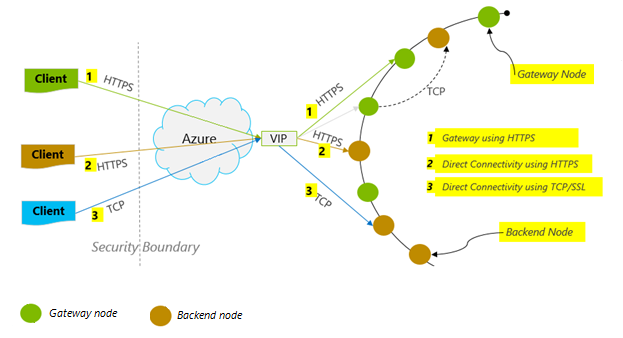
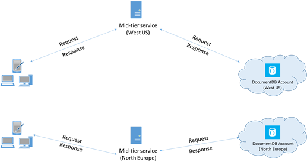

<properties 
	pageTitle="DocumentDB performance tips | Microsoft Azure" 
	description="Learn client configuration options to improve Azure DocumentDB database performance"
	keywords="how to improve database performance"
	services="documentdb" 
	authors="mimig1" 
	manager="jhubbard" 
	editor="" 
	documentationCenter=""/>

<tags 
	ms.service="documentdb" 
	ms.workload="data-services" 
	ms.tgt_pltfrm="na" 
	ms.devlang="na" 
	ms.topic="article" 
	ms.date="07/27/2016" 
	ms.author="mimig"/>

# Performance tips for DocumentDB

Azure DocumentDB is a fast and flexible distributed database that scales seamlessly with guaranteed latency and throughput. You do not have to make major architecture changes or write complex code to scale your database with DocumentDB. Scaling up and down is as easy as making a single API call or [SDK method call](documentdb-performance-levels.md#changing-performance-levels-using-the-net-sdk). However, because DocumentDB is accessed via network calls there are client-side optimizations you can make to achieve peak performance.

So if you're asking "How can I improve my database performance?" consider the following options.

## Networking

1. **Connection policy: Use direct connection mode**
    
    How a client connects to Azure DocumentDB has important implications on performance, especially in terms of observed client-side latency. There are two key configuration settings available for configuring client Connection Policy – the connection *mode* and the [connection *protocol*](#connection-protocol).  The two available modes are:

    1. Gateway Mode (default)
    2. Direct Mode

    Since DocumentDB is a distributed storage system, DocumentDB resources like collections are partitioned across numerous machines and each partition is replicated for high availability. The logical to physical address translation is kept in a routing table which is also internally available as a resource.

    In Gateway Mode, the DocumentDB gateway machines perform this routing, thereby allowing client code to be simple and compact. A client application issues requests to the DocumentDB gateway machines, which translate the logical URI in the request to the physical address of the backend node, and forward the request appropriately.  Conversely, in Direct Mode clients must maintain – and periodically refresh – a copy of this routing table, and then directly connect to the backend DocumentDB nodes.

    Gateway Mode is supported on all SDK platforms and is the configured default.  If your application runs within a corporate network with strict firewall restrictions, Gateway Mode is the best choice since it uses the standard HTTPS port and a single endpoint. The performance tradeoff, however, is that Gateway Mode involves an additional network hop every time data is read or written to DocumentDB.   Because of this, Direct Mode offers better performance due to fewer network hops.

2. **Connection policy: Use the TCP protocol**

    When leveraging Direct Mode, there are two protocol options available:

    - TCP
    - HTTPS

    DocumentDB offers a simple and open RESTful programming model over HTTPS. Additionally, it offers an efficient TCP protocol which is also RESTful in its communication model and is available through the .NET client SDK. For best performance, use the TCP protocol when possible.

    The Connectivity Mode is configured during the construction of the DocumentClient instance with the ConnectionPolicy parameter. If Direct Mode is used, the Protocol can also be set within the ConnectionPolicy parameter.

        var serviceEndpoint = new Uri("https://contoso.documents.net");
        var authKey = new "your authKey from Azure Mngt Portal";
        DocumentClient client = new DocumentClient(serviceEndpoint, authKey, 
        new ConnectionPolicy
        {
            ConnectionMode = ConnectionMode.Direct,
            ConnectionProtocol = Protocol.Tcp
        });

    Because TCP is only supported in Direct Mode, if Gateway Mode is used, then the HTTPS protocol is always used to communicate with the Gateway and the Protocol value in the ConnectionPolicy is ignored.

    

3. **Call OpenAsync to avoid startup latency on first request**

    By default, the first request will have a higher latency because it has to fetch the address routing table. In order to avoid this startup latency on the first request, you should call OpenAsync() once during initialization as follows.

        await client.OpenAsync();

4. **Collocate clients in same Azure region for performance**

    When possible, place any applications calling DocumentDB in the same region as the DocumentDB database. For a ballpark comparison, calls to DocumentDB within the same region complete within 1-2 ms, but the latency between the West and East coast of the US is >50 ms. This latency can likely vary from request to request depending on the route taken by the request as it passes from the client to the Azure datacenter boundary. The lowest possible latency will be achieved by ensuring the calling application is located within the same Azure region as the provisioned DocumentDB endpoint. For a list of available regions, see [Azure Regions](https://azure.microsoft.com/regions/#services).

    

5. **Increase number of threads/tasks**

    Since calls to DocumentDB are made over the network, you may need to vary the degree of parallelism of your requests so that the client application spends very little time waiting between requests. For example, if you're using .NET's [Task Parallel Library](https://msdn.microsoft.com//library/dd460717.aspx), please create in the order of 100s of Tasks reading or writing to DocumentDB.

## SDK Usage

1. **Install the most recent SDK**

    The DocumentDB SDKs are constantly being improved to provide the best performance. See the [DocumentDB SDK](documentdb-sdk-dotnet.md) pages to determine the most recent SDK and review improvements. 

2. **Use a singleton DocumentDB client for the lifetime of your application**
  
    Note that each DocumentClient instance is thread-safe and performs efficient connection management and address caching when operating in Direct Mode. To allow efficient connection management and better performance by DocumentClient, it is recommended to use a single instance of DocumentClient per AppDomain for the lifetime of the application.

3. **Increase System.Net MaxConnections per host**

    DocumentDB requests are made over HTTPS/REST by default and subject to the default connection limits per hostname or IP address. You may need to set this to a higher value (100-1000) so that the client library can utilize multiple simultaneous connections to DocumentDB. In the .NET SDK 1.8.0 and above, the default value for [ServicePointManager.DefaultConnectionLimit](https://msdn.microsoft.com/library/system.net.servicepointmanager.defaultconnectionlimit.aspx) is 50 and to change the value, you can set the [Documents.Client.ConnectionPolicy.MaxConnectionLimit]( https://msdn.microsoft.com /library/azure/microsoft.azure.documents.client.connectionpolicy.maxconnectionlimit.aspx#P:Microsoft.Azure.Documents.Client.ConnectionPolicy.MaxConnectionLimit) to a higher value.  

4. **Turn server-side GC on**
    
    Reducing the frequency of garbage collection may help in some cases. In .NET, set [gcServer](https://msdn.microsoft.com/library/ms229357.aspx) to true.

5. **Implement backoff at RetryAfter intervals**
 
    During performance testing, you should increase load until a small rate of requests get throttled. If throttled, the client application should backoff on throttle for the server-specified retry interval. This ensures that you spend minimal amount of time waiting between retries. Retry policy support is included in Version 1.8.0 and above of the DocumentDB [.NET](documentdb-sdk-dotnet.md) and [Java](documentdb-sdk-java.md), and version 1.9.0 and above of the [Node.js](documentdb-sdk-nodejs.md) and [Python](documentdb-sdk-python.md). For more information see [Exceeding reserved throughput limits](documentdb-request-units.md#exceeding-reserved-throughput-limits) and [RetryAfter](https://msdn.microsoft.com/library/microsoft.azure.documents.documentclientexception.retryafter.aspx).

6. **Scale out your client-workload**

    If you are testing at high throughput levels (>50,000 RU/s), the client application may become the bottleneck due to the machine capping out on CPU or Network utilization. If you reach this point, you can continue to push the DocumentDB account further by scaling out your client applications across multiple servers.

7. **Cache document URIs for lower read latency**

    Cache document URIs whenever possible for the best read performance.

8. **Tune the page size for queries/read feeds for better performance**

    When performing a bulk read of documents using read feed functionality (i.e. ReadDocumentFeedAsync) or when issuing a DocumentDB SQL query, the results are returned in a segmented fashion if the result set is too large. By default, results are returned in chunks of 100 items or 1 MB, whichever limit is hit first. 

    In order to reduce the number of network round trips required to retrieve all applicable results, you can increase the page size using x-ms-max-item-count request header to up to 1000. In cases where you need to display only a few results, e.g., if your user interface or application API returns only ten results a time, you can also decrease the page size to 10 in order to reduce the throughput consumed for reads and queries.

    You may also set the page size using the available DocumentDB SDKs.  For example:
    
        IQueryable<dynamic> authorResults = client.CreateDocumentQuery(documentCollection.SelfLink, "SELECT p.Author FROM Pages p WHERE p.Title = 'About Seattle'", new FeedOptions { MaxItemCount = 1000 });

9. **Increase number of threads/tasks**

	See [Increase number of threads/tasks](increase-threads.md) in the Networking section.

## Indexing Policy

1. **Use lazy indexing for faster peak time ingestion rates**

    DocumentDB allows you to specify – at the collection level – an indexing policy, which enables you to choose if you want the documents in a collection to be automatically indexed or not.  In addition, you may also choose between synchronous (Consistent) and asynchronous (Lazy) index updates. By default, the index is updated synchronously on each insert, replace or delete of a document to the collection. This enables the queries to honor the same [consistency level](documentdb-consistency-levels.md) as that of the document reads without any delay for the index to “catch up".
    
    Lazy indexing may be considered for scenarios in which data is written in bursts, and you want to amortize the work required to index content over a longer period of time. This allows you to use your provisioned throughput effectively and serve write requests at peak times with minimal latency. It is important to note, however, that when lazy indexing is enabled, query results will be eventually consistent regardless of the consistency level configured for the DocumentDB account.

    Hence, Consistent indexing mode (IndexingPolicy.IndexingMode is set to Consistent) incurs the highest request unit charge per write, while Lazy indexing mode (IndexingPolicy.IndexingMode is set to Lazy) and no indexing (IndexingPolicy.Automatic is set to False) have zero indexing cost at the time of write.

2. **Exclude unused paths from indexing for faster writes**

    DocumentDB’s indexing policy also allows you to specify which document paths to include or exclude from indexing by leveraging Indexing Paths (IndexingPolicy.IncludedPaths and IndexingPolicy.ExcludedPaths). The use of indexing paths can offer improved write performance and lower index storage for scenarios in which the query patterns are known beforehand, as indexing costs are directly correlated to the number of unique paths indexed.  For example, the following code shows how to exclude an entire section of the documents (a.k.a. a sub-tree) from indexing using the "*" wildcard.

        var collection = new DocumentCollection { Id = "excludedPathCollection" };
        collection.IndexingPolicy.IncludedPaths.Add(new IncludedPath { Path = "/*" });
        collection.IndexingPolicy.ExcludedPaths.Add(new ExcludedPath { Path = "/nonIndexedContent/*");
        collection = await client.CreateDocumentCollectionAsync(UriFactory.CreateDatabaseUri("db"), excluded);

    For more information, see [DocumentDB indexing policies](documentdb-indexing-policies.md).

## Throughput

1. **Measure and tune for lower request units/second usage**

    DocumentDB offers a rich set of database operations including relational and hierarchical queries with UDFs, stored procedures, and triggers – all operating on the documents within a database collection. The cost associated with each of these operations will vary based on the CPU, IO and memory required to complete the operation. Instead of thinking about and managing hardware resources, you can think of a request unit (RU) as a single measure for the resources required to perform various database operations and service an application request.

    [Request units](documentdb-request-units.md) are provisioned for each database account based on the number of capacity units that you purchase. Request unit consumption is evaluated as a rate per second. Applications that exceed the provisioned request unit rate for their account will be limited until the rate drops below the reserved level for the account. If your application requires a higher level of throughput, you can purchase additional capacity units.

    The complexity of a query impacts how many Request Units are consumed for an operation. The number of predicates, nature of the predicates, number of UDFs, and the size of the source data set all influence the cost of query operations.

    To measure the overhead of any operation (create, update or delete), inspect the x-ms-request-charge header (or the equivalent RequestCharge property in ResourceResponse<T> or FeedResponse<T> in the .NET SDK) to measure the number of request units consumed by these operations.

        // Measure the performance (request units) of writes
        ResourceResponse<Document> response = await client.CreateDocumentAsync(collectionSelfLink, myDocument);
        Console.WriteLine("Insert of document consumed {0} request units", response.RequestCharge);
        // Measure the performance (request units) of queries
        IDocumentQuery<dynamic> queryable = client.CreateDocumentQuery(collectionSelfLink, queryString).AsDocumentQuery();
        while (queryable.HasMoreResults)
             {
                  FeedResponse<dynamic> queryResponse = await queryable.ExecuteNextAsync<dynamic>();
                  Console.WriteLine("Query batch consumed {0} request units", queryResponse.RequestCharge);
             }
        
    The request charge returned in this header is a fraction of your provisioned throughput (i.e. 2000 RUs / second).   For example, if the query above returns 1000 1KB documents, the cost of the operation will be 1000. As such, within one second, the server will honor only two such requests before throttling subsequent requests. For more information, see [Request units](documentdb-request-units.md) and the [request unit calculator](https://www.documentdb.com/capacityplanner).

2. **Handle rate limiting/request rate too large**

    When a client attempts to exceed the reserved throughput for an account, there will be no performance degradation at the server and no use of throughput capacity beyond the reserved level. The server will preemptively end the request with RequestRateTooLarge (HTTP status code 429) and return the x-ms-retry-after-ms header indicating the amount of time, in milliseconds, that the user must wait before reattempting the request.
 
        HTTP Status 429,
        Status Line: RequestRateTooLarge
        x-ms-retry-after-ms :100

    The SDKs all implicitly catch this response, respect the server-specified retry-after header, and retry the request. Unless your account is being accessed concurrently by multiple clients, the next retry will succeed.

    If you have more than one client cumulatively operating consistently above the request rate, the default retry count currently set to 9 by the client may not suffice; in this case, the client will throw a DocumentClientException with status code 429 to the application. The default retry count can be increased by changing the RetryOptions/RetryPolicy settings. By default, the DocumentClientException is returned after 30 seconds if the request does not complete. This occurs even when the current retry count, be it the default of 9 or a user defined value, is less than the max retry count.

    While the automated retry behavior helps to improve resiliency and usability for the most applications, it might come at odds when doing performance benchmarks, especially when measuring latency.  The client-observed latency will spike if the experiment hits the server throttle and causes the client SDK to silently retry. To avoid latency spikes during performance experiments, measure the charge returned by each operation and ensure that requests are operating below the reserved request rate. For more information, see [Request units](documentdb-request-units.md).
   
3. **Design for smaller documents for higher throughput**

    The request charge (i.e. request processing cost) of a given operation is directly correlated to the size of the document. Operations on large documents cost more than operations for small documents.

## Consistency Levels

1. **Use weaker consistency Levels for better read latencies**

    Another important factor to take into account while tuning the performance of a DocumentDB applications is consistency level. The choice of consistency level has performance implications for both reads and writes. You can configure the default consistency level on the database account and the chosen consistency level then applies to all the collections (across all of the databases) within the DocumentDB account. In terms of write operations, the impact of changing consistency level is observed as request latency. As stronger consistency levels are used, write latencies will increase. On the other hand, the impact of consistency level on read operations is observed in terms of throughput. Weaker consistency levels allow higher read throughput to be realized by the client.

    By default all reads and queries issued against the user defined resources will use the default consistency level specified on the database account. You can, however, lower the consistency level of a specific read/query request by specifying the x-ms-consistency-level request header. For more information, see [Consistency levels in DocumentDB](documentdb-consistency-levels.md).

## Next steps

For a sample application used to evaluate DocumentDB for high-performance scenarios on a small number of client machines, see [Performance and scale testing with Azure DocumentDB](documentdb-performance-testing.md).

Also, to learn more about designing your application for scale and high performance, see [Partitioning and scaling in Azure DocumentDB](documentdb-partition-data.md).
