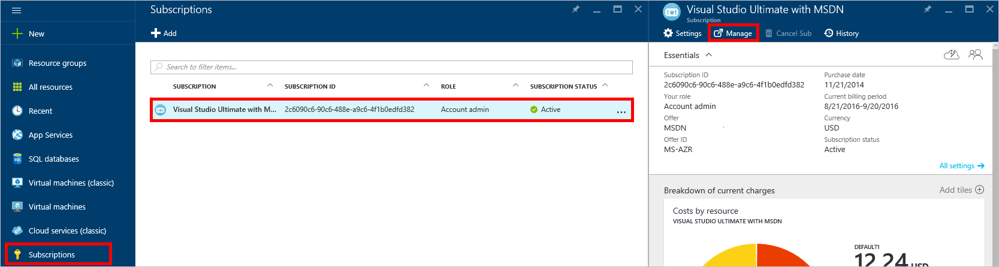

<properties
    pageTitle="Troubleshooting DocumentDB portal issues | Microsoft Azure"
    description="Find out to resolve issues in the DocumentDB Azure portal." 
    services="documentdb"
    documentationCenter=""
    authors="mimig1"
    manager="jhubbard"
    editor="monicar"/>

<tags
    ms.service="documentdb"
    ms.workload="data-services"
    ms.tgt_pltfrm="na"
    ms.devlang="na"
    ms.topic="article"
    ms.date="08/29/2016"
    ms.author="mimig"/>

# Azure DocumentDB portal troubleshooting tips

This article describes how to resolve DocumentDB issues in the Azure portal. 

## Resources are missing

**Symptom**: Databases or collections are missing from your portal blades.

**Solution**: Lower application usage to operate under the maximum throughput quota for the collection. 

**Explanation**: The portal is an application like any other, making calls to your DocumentDB database and collection. If your requests are currently being throttled due to calls being made from a separate application, the portal may also be throttled, causing resources not to appear in the portal. To resolve the issue, address the cause of the high throughput usage, and then refresh the portal blade. Information on how to measure and lower throughput usage can be found in the [Throughput](documentdb-performance-tips.md#throughput) section of the [Performance tips](documentdb-performance-tips.md) article.
 
## Pages or blades won't load

**Symptom**: Pages and blades in the portal do not display.

**Solution**: Lower application usage to operate under the maximum throughput quota for the collection. 

**Explanation**: The portal is an application like any other, making calls to your DocumentDB database and collection. If your requests are currently being throttled due to calls being made from a separate application, the portal may also be throttled, causing resources not to appear in the portal. To resolve the issue, address the cause of the high throughput usage, and then refresh the portal blade. Information on how to measure and lower throughput usage can be found in the [Throughput](documentdb-performance-tips.md#throughput) section of the [Performance tips](documentdb-performance-tips.md) article.

## Add Collection button is disabled

**Symptom**: On the Database blade, the **Add Collection** button is disabled.

**Explanation**: If your Azure subscription is associated with benefit credits, such as free credits offered from an MSDN subscription, and you have used all of your credits for the month, you are unable to create any additional collections in DocumentDB.

**Solution**: Remove the spending limit from your account.

1. In the Azure portal, in the Jumpbar, click **Subscriptions**, click the subscription associated with the DocumentDB database, and then in the **Subscription** blade, click **Manage**. 
    

2. In the new browser window, you'll see that you have no credits remaining. Click the **Remove spending limit** button to remove the spending for only the current billing period or indefinitely. Then complete the wizard to add or confirm your credit card information. 
    

 
## Query Explorer completes with errors

See [Troubleshoot Query Explorer](documentdb-query-collections-query-explorer.md#troubleshoot).

## No data available in monitoring tiles

See [Troubleshoot monitoring tiles](documentdb-monitor-accounts.md#troubleshooting).

## No documents returned in Document Explorer

See [Troubleshooting Document Explorer](documentdb-view-json-document-explorer.md#troubleshoot).

## Next steps

If you are still experiencing issues in the portal, please email [askdocdb@microsoft.com](mailto:askdocdb@microsoft.com) for assistance, or file a support request in the portal by clicking **Browse**, **Help + support**, and then clicking **Create support request**.
