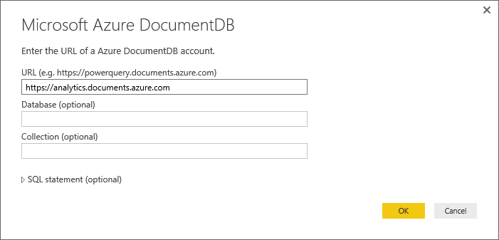
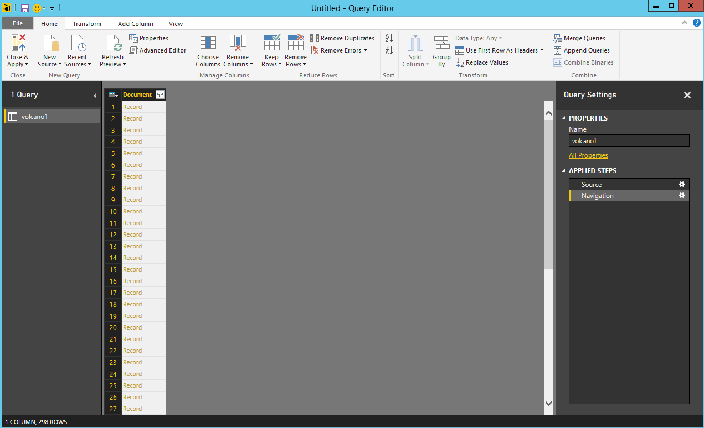
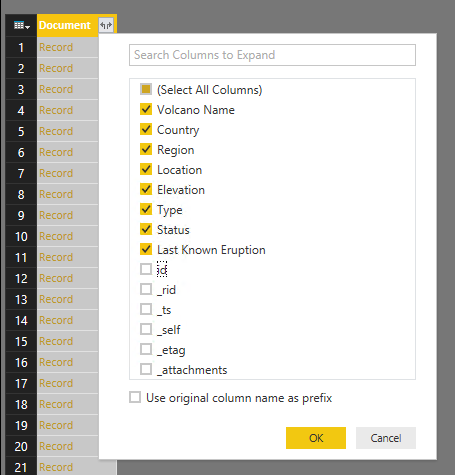
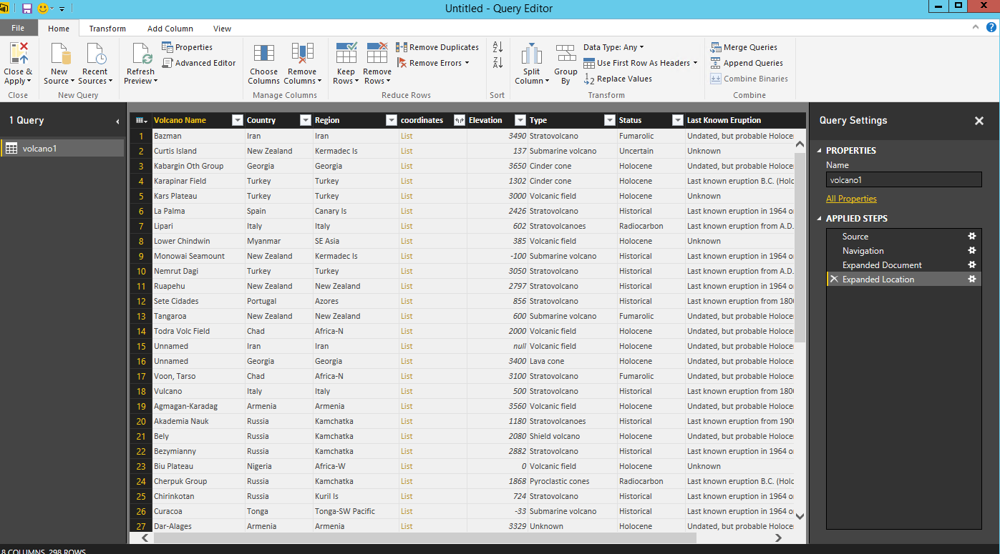
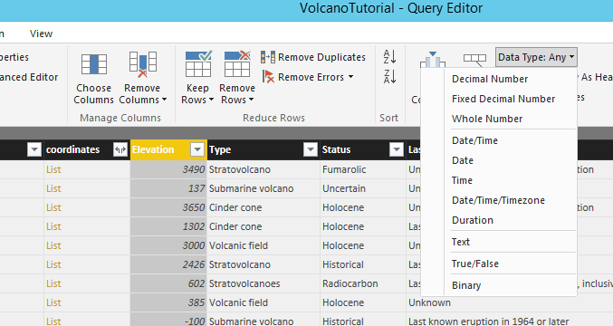
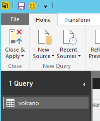

<properties
	pageTitle="Power BI tutorial for DocumentDB connector | Microsoft Azure"
	description="Use this Power BI tutorial to import JSON, create insightful reports, and visualize data using the DocumentDB and Power BI connector."
	keywords="power bi tutorial, visualize data, power bi connector"
	services="documentdb"
	authors="h0n"
	manager="jhubbard"
	editor="mimig"
	documentationCenter=""/>

<tags
	ms.service="documentdb"
	ms.workload="data-services"
	ms.tgt_pltfrm="na"
	ms.devlang="na"
	ms.topic="article"
	ms.date="05/31/2016"
	ms.author="hawong"/>

# Power BI tutorial for DocumentDB: Visualize data using the Power BI connector
[PowerBI.com](https://powerbi.microsoft.com/) is an online service where you can create and share dashboards and reports with data that's important to you and your organization.  Power BI Desktop is a dedicated report authoring tool that enables you to retrieve data from various data sources, merge and transform the data, create powerful reports and visualizations, and publish the reports to Power BI.  With the latest version of Power BI Desktop, you can now connect to your DocumentDB account via the DocumentDB connector for Power BI.   

In this Power BI tutorial, we will walk through the steps to connect to a DocumentDB account in Power BI Desktop, navigate to a collection where we want to extract the data using the Navigator, transform JSON data into tabular format using Power BI Desktop Query Editor, and build and publish a report to PowerBI.com.

After completing this Power BI tutorial, you'll be able to answer the following questions:  

-	How can I build reports with data from DocumentDB using Power BI Desktop?
-	How can I connect to a DocumentDB account in Power BI Desktop?
-	How can I retrieve data from a collection in Power BI Desktop?
-	How can I transform nested JSON data in Power BI Desktop?
-	How can I publish and share my reports in PowerBI.com?

## Prerequisites

Before following the instructions in this Power BI tutorial, ensure that you have the following:

- [The latest version of Power BI Desktop](https://powerbi.microsoft.com/desktop).
- Access to our demo account or data in your Azure DocumentDB account.
	- The demo account is populated with the volcano data shown in this tutorial. This demo account is not bound by any SLAs and is meant for demostration purposes only.  We reserve the right to make modifications to this demo account including but not limited to, terminating the account, changing the key, restricting access, changing and delete the data, at any time without advance notice or reason.
		- URL:   https://analytics.documents.azure.com
		- Read-only key: MSr6kt7Gn0YRQbjd6RbTnTt7VHc5ohaAFu7osF0HdyQmfR+YhwCH2D2jcczVIR1LNK3nMPNBD31losN7lQ/fkw==
	- Or, to create your own account, see [Create a DocumentDB database account using the Azure Portal](https://azure.microsoft.com/documentation/articles/documentdb-create-account/). Then, to get sample volcano data that's similar to what's used in this tutorial (but does not contain the GeoJSON blocks), see the [NOAA site](https://www.ngdc.noaa.gov/nndc/struts/form?t=102557&s=5&d=5) and then import the data using the [DocumentDB data migration tool](https://azure.microsoft.com/documentation/articles/documentdb-import-data/).

To share your reports in PowerBI.com, you must have an account in PowerBI.com.  To learn more about Power BI for Free and Power BI Pro, please visit [https://powerbi.microsoft.com/pricing](https://powerbi.microsoft.com/pricing).

## Let's get started
In this tutorial, let's imagine that you are a geologist studying volcanoes around the world.  The volcano data is stored in a DocumentDB account and the JSON documents look like the one below.

	{
    	"Volcano Name": "Rainier",
   		"Country": "United States",
  		"Region": "US-Washington",
  		"Location": {
    		"type": "Point",
    		"coordinates": [
      		-121.758,
      		46.87
    		]
  		},
  		"Elevation": 4392,
  		"Type": "Stratovolcano",
  		"Status": "Dendrochronology",
  		"Last Known Eruption": "Last known eruption from 1800-1899, inclusive"
	}

You want to retrieve the volcano data from the DocumentDB account and visualize data in an interactive Power BI report like the one below.

Ready to give it a try? Let's get started.

1. Run Power BI Desktop on your workstation.
2. Once Power BI Desktop is launched, a *Welcome* screen is displayed.

	

3. You can **Get Data**, see **Recent Sources**, or **Open Other Reports** directly from the *Welcome* screen.  Click the X at the top right corner to close the screen. The **Report** view of Power BI Desktop is displayed.

	

4. Select the **Home** ribbon, then click on **Get Data**.  The **Get Data** window should appear.

5. Click on **Azure**, select **Microsoft Azure DocumentDB (Beta)**, and then click **Connect**.  The **Microsoft Azure DocumentDB Connect** window should appear.

	

6. Specify the DocumentDB account endpoint URL you would like to retrieve the data from as shown below, and then click **OK**. You can retrieve the URL from the URI box in the **Keys** blade of the Azure Portal or you can use the demo account information provided above. For more information, see [Keys](documentdb-manage-account.md#keys).

	*Note.  In this tutorial, we will not specify the Database name, Collection name, or a SQL statement as these fields are optional.  Instead, we will use the Navigator to select the Database and Collection to identify where the data comes from.*

    

7. If you are connecting to this endpoint for the first time, you will be prompted for the account key. Enter the account key and click **Connect**.

	*Note. We recommend that you use the read-only key when building reports.  This will prevent unnecessary exposure of the master key to potential security risks. The read-only key is available from the Read-Only Keys blade of the Azure Portal or you can use the demo account information provided above.*

    

8. When the account is successfully connected, the **Navigator** will appear.  The **Navigator** will show a list of databases under the account.
9. Click and expand on the database where the data for the report will come from.  A list of collections under the database will display.  

10. Now, select a collection that you will retrieve the data from, e.g. volcano1.

	*Note. The Preview pane shows a list of **Record** items.  A Document is represented as a **Record** type in Power BI. Similarly, a nested JSON block inside a document is also a **Record**.*

    

11. Click **Edit** to launch the Query Editor so we can transform the data.

## Flattening and transforming JSON documents
1. In the Power BI Query Editor, you should see a **Document** column in the center pane.

2. Click on the expander at the right side of the **Document** column header.  The context menu with a list of fields will appear.  Select the fields you need for your report, for instance,  Volcano Name, Country, Region, Location, Elevation, Type, Status and Last Know Eruption, and then click **OK**.

	

3. The center pane will display a preview of the result with the fields selected.

	

4. In our example, the Location property is a GeoJSON block in a document.  As you can see, Location is represented as a **Record** type in Power BI Desktop.  
5. Click on the expander at the right side of the Location column header.  The context menu with type and coordinates fields will appear.  Let's select the coordinates field and click **OK**.

    

6. The center pane now shows a coordinates column of **List** type.  As shown at the beginning of the tutorial, the GeoJSON data in this tutorial is of Point type with Latitude and Longitude values recorded in the coordinates array.

	*Note.  the coordinates[0] element represents Longitude while coordinates[1] represents Latitude.*
	

7. To flatten the coordinates array, we will create a **Custom Column** called LatLong.  Select the **Add Column** ribbon and click on **Add Custom Column**.  The **Add Custom Column** window should appear.

8. Provide a name for the new column, e.g. LatLong.

9. Next, specify the custom formula for the new column.  For our example, we will concatenate the Latitude and Longitude values separated by a comma as shown below using the following formula: Text.From([coordinates]{1})&","&Text.From([coordinates]{0}). Click **OK**.

    *Note. For more information on Data Analysis Expressions(DAX) including DAX functions, please visit [DAX Basic in Power BI Desktop](https://support.powerbi.com/knowledgebase/articles/554619-dax-basics-in-power-bi-desktop).*

    

10. Now, the center pane will show the new LatLong column populated with the Latitude and Longitude values separated by a comma.

	

11. We have now completed flattening the data into tabular format.  You can leverage all of the features available in the Query Editor to shape and transform data in DocumentDB.  For instance, you can change the data type for Elevation to **Decimal Number** by changing the **Data Type** on the **Home** ribbon.

    

12. Click **Close and Apply** to save the data model.

    

## Build the reports
Power BI Desktop Report view is where you can start creating reports to visualize data.  You can create reports by dragging and dropping fields into the **Report** canvas.

In the Report view, you should find:

 1. The **Fields** pane, this is where you will see a list of data models with fields you can use for your reports.

 2. The **Visualizations** pane. A report can contain a single or multiple visualizations.  Pick the visual types fitting your needs from the **Visualizations** pane.

 3. The **Report** canvas, this is where you will build the visuals for your report.

 4. The **Report** page. You can add multiple report pages in Power BI Desktop.

The following shows the basic steps of creating a simple interactive Map view report.

1. For our example, we will create a map view showing the location of each volcano.  In the **Visualizations** pane,  click on the Map visual type as highlighed in the screenshot above.  You should see the Map visual type painted on the **Report** canvas.  The **Visualization** pane should also display a set of properties related to the Map visual type.

2. Now, drag and drop the LatLong field from the **Fields** pane to the **Location** property in **Visualizations** pane.
3. Next, drag and drop the Volcano Name field to the **Legend** property.  

4. Then, drag and drop the Elevation field to the **Values** property.  

5. You should now see the Map visual showing a set of bubbles indicating the location of each volcano with the size of the bubble correlating to the elevation of the volcano.

6. You now have created a basic report.  You can further customize the report by adding more visualizations.  In our case, we added a Volcano Type slicer to make the report interactive.  

    

## Publish and share your report
To share your report, you must have an account in PowerBI.com.

1. In the Power BI Desktop,  click on the **Home** ribbon.
2. Click **Publish**.  You will be prompted to enter the user name and password for your PowerBI.com account.
3. Once the credential has been authenticated, the report is published to your PowerBI.com account.
4. You can then share your report in PowerBI.com.

## Next steps
- To learn more about Power BI, click [here](https://powerbi.microsoft.com/documentation/powerbi-service-get-started/)
- To learn more about DocumentDB, click [here](https://azure.microsoft.com/documentation/services/documentdb/).
