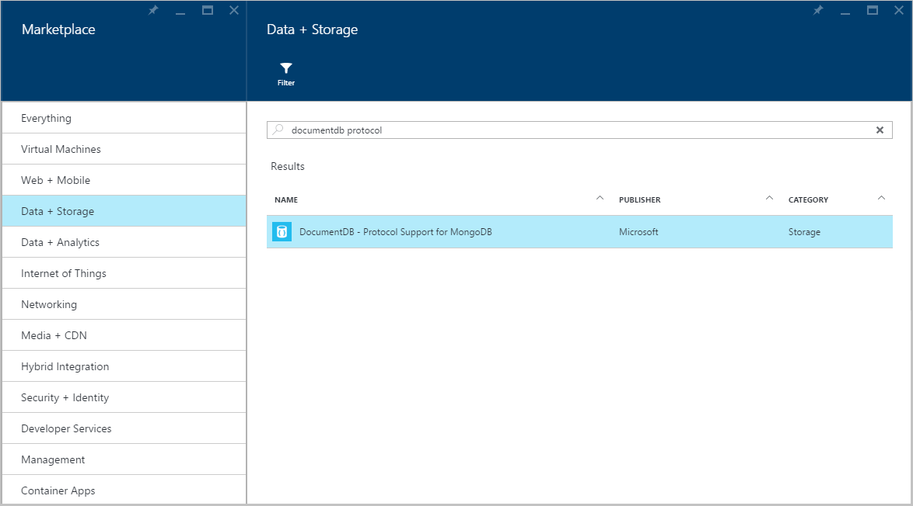
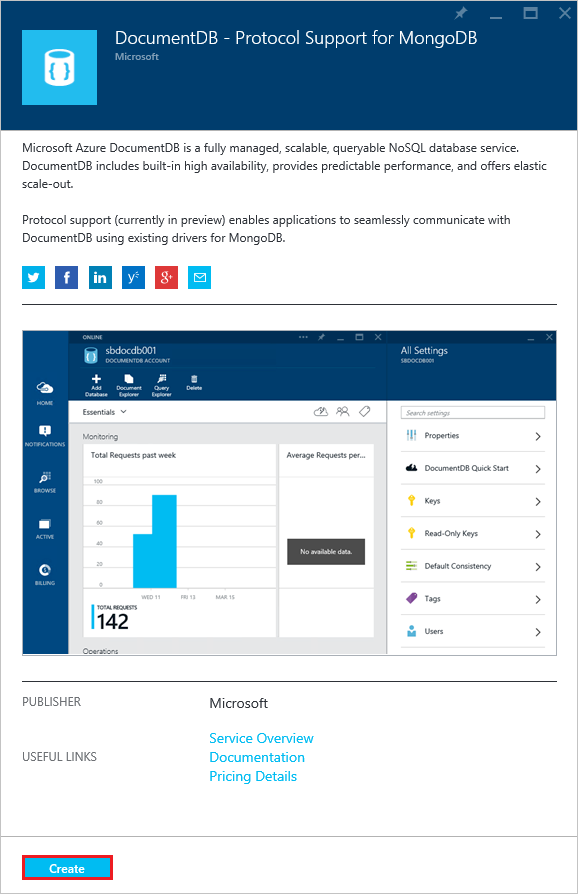
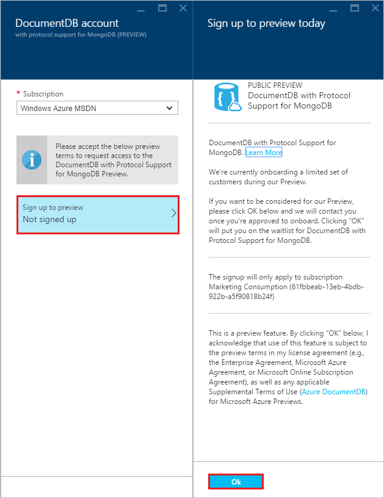

<properties 
	pageTitle="DocumentDB with protocol support for MongoDB | Microsoft Azure" 
	description="Learn about DocumentDB with protocol support for MongoDB." 
	keywords="json database, document database"
	services="documentdb" 
	authors="stephbaron" 
	manager="jhubbard" 
	editor="" 
	documentationCenter=""/>

<tags 
	ms.service="documentdb" 
	ms.workload="data-services" 
	ms.tgt_pltfrm="na" 
	ms.devlang="na" 
	ms.topic="get-started-article" 
	ms.date="03/31/2016" 
	ms.author="stbaro"/>

# DocumentDB Protocol Support for MongoDB

Microsoft Azure DocumentDB can now be accessed using existing drivers for MongoDB.  Using this preview functionality, applications can easily and transparently communicate with DocumentDB using existing, community supported Apache License drivers for MongoDB.  Developers can use their current tools and skills for MongoDB to build applications that leverage DocumentDB, a fully managed and scalable NoSQL database service backed by industry leading SLAs. 

We are currently onboarding customers to preview this new functionality.  If you want to be considered for the preview, follow the directions below to request access to the preview program and we will contact you once you're approved.    

## Prerequisites

Before requesting access to the preview program, you must have the following.

- **An Azure subscription**. See [Create your free Azure account today](https://azure.microsoft.com/free/).

## Request Access to the DocumentDB Protocol Support for MongoDB Preview  

To request access to the preview, perform the following steps.

1. Sign in to the [Azure Portal](https://portal.azure.com).
2. Click **NEW**, click **Data + Storage**, click **See all**, click **More**, and then click **DocumentDB - Protocol Support for MongoDB**.

	

3. Alternatively, search the **Data + Storage** category for "DocumentDB protocol".

	

4. Click **Create** to launch the preview signup process.

	

5. In the **New DocumentDB Account** blade, click **Sign up to preview**. Read the information and then click **OK**. You will receive an e-mail once your subscription has been enabled for the Public Preview.

	

## Next steps
- Once you've been approved for the preview, you will receive a welcome email with instructions on how to create your account and get started.

 
