<properties
    pageTitle="Python Flask Web Application Development with DocumentDB | Microsoft Azure"
    description="Review a database tutorial on using DocumentDB to store and access data from a Python Flask web application hosted on Azure. Find application development solutions." 
	keywords="Application development, database tutorial, python flask, python web application, python web development, documentdb, azure, Microsoft azure"
    services="documentdb"
    documentationCenter="python"
    authors="AndrewHoh"
    manager="jhubbard"
    editor="cgronlun"/>

<tags
    ms.service="documentdb"
    ms.workload="data-management"
    ms.tgt_pltfrm="na"
    ms.devlang="python"
    ms.topic="hero-article"
    ms.date="04/18/2016"
    ms.author="anhoh"/>

# Python Flask Web Application Development with DocumentDB

> [AZURE.SELECTOR]
- [.NET](documentdb-dotnet-application.md)
- [Node.js](documentdb-nodejs-application.md)
- [Java](documentdb-java-application.md)
- [Python](documentdb-python-application.md)

This tutorial shows you how to use Azure DocumentDB to store and access data from a Python web application hosted on Azure and presumes that you have some prior experience using Python and
Azure websites.

This database tutorial covers:

1. Creating and provisioning a DocumentDB account.
2. Creating a Python MVC application.
3. Connecting to and using Azure DocumentDB from your web application.
4. Deploying the web application to Azure Websites.

By following this tutorial, you will build a simple voting
application that allows you to vote for a poll.

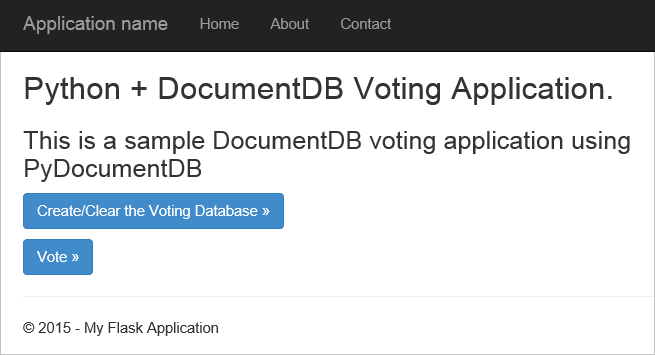


## Database tutorial prerequisites

Before following the instructions in this article, you should ensure
that you have the following installed:

- An active Azure account. If you don't have an account, you can create a free trial account in just a couple of minutes. For details, see [Azure Free Trial](https://azure.microsoft.com/pricing/free-trial/).
- [Visual Studio 2013](http://www.visualstudio.com/) or higher, or [Visual Studio Express](), which is the free version. The instructions in this tutorial are written specifically for Visual Studio 2015. 
- Python Tools for Visual Studio from [GitHub](http://microsoft.github.io/PTVS/). This tutorial uses Python Tools for VS 2015. 
- Azure Python SDK for Visual Studio, version 2.4 or higher available from [azure.com](https://azure.microsoft.com/downloads/). We used Microsoft Azure SDK for Python 2.7.
- Python 2.7 from [python.org][2]. We used Python 2.7.11. 

> [AZURE.IMPORTANT] If you are installing Python 2.7 for the first time, ensure that in the Customize Python 2.7.11 screen, you select **Add python.exe to Path**.
> 
>    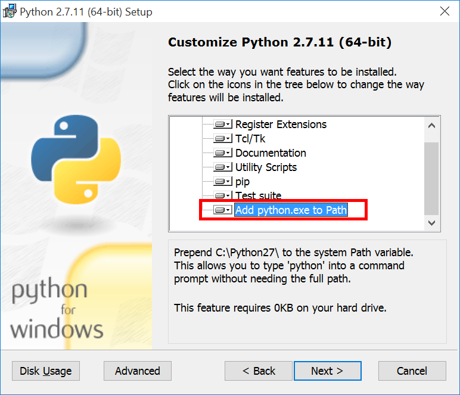

- Microsoft Visual C++ Compiler for Python 2.7 from the [Microsoft Download Center][3].

## Step 1: Create a DocumentDB database account

Let's start by creating a DocumentDB account. If you already have an account, you can skip to [Step 2: Create a new Python Flask web application](#step-2:-create-a-new-python-flask-web-application).

[AZURE.INCLUDE [documentdb-create-dbaccount](../../includes/documentdb-create-dbaccount.md)]

<br/>
We will now walk through how to create a new Python Flask web application from the ground up.

## Step 2: Create a new Python Flask web application

1. In Visual Studio, on the **File** menu, point to **New**, and then click **Project**.

    The **New Project** dialog box appears.

2. In the left pane, expand **Templates** and then **Python**, and then click **Web**. 

3. Select **Flask  Web Project** in the center pane, then in the **Name** box type **tutorial**, and then click **OK**. Remember that Python package names should be all lowercase, as described in the [Style Guide for Python Code](https://www.python.org/dev/peps/pep-0008/#package-and-module-names).

	For those new to Python Flask, it is a web application development framework that helps you build web applications in Python faster.

	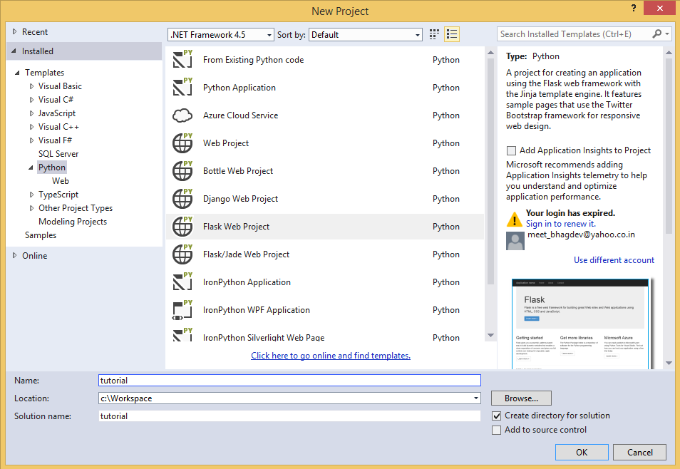

4. In the **Python Tools for Visual Studio** window, click **Install into a virtual environment**. 

	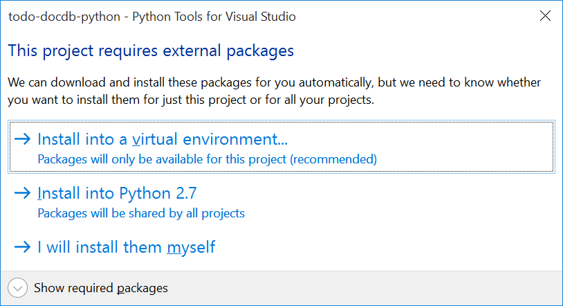

5. In the **Add Virtual Environment** window, you can accept the defaults and use Python 2.7 as the base environment because PyDocumentDB does not currently support Python 3.x, and then click **Create**. This sets up the required Python virtual environment for your project.

	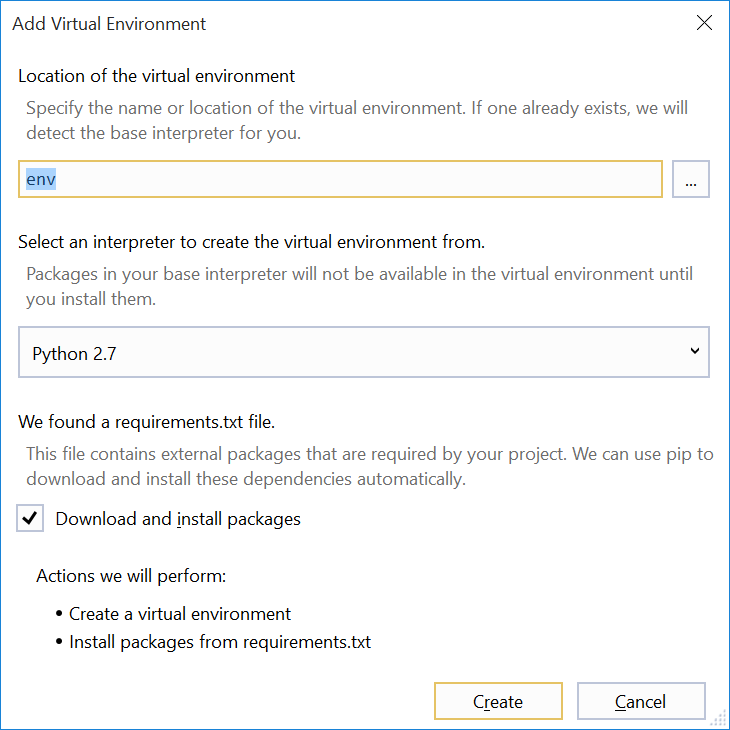

    The output window displays `Successfully installed Flask-0.10.1 Jinja2-2.8 MarkupSafe-0.23 Werkzeug-0.11.5 itsdangerous-0.24 'requirements.txt' was installed successfully.` when the environment is successfully installed.

## Step 3: Modify the Python Flask web application

### Add the Python Flask packages to your project

After your project is set up, you'll need to add the required Flask packages to your project, including pydocumentdb, the Python package for DocumentDB.

1. In Solution Explorer, open the file named **requirements.txt** and replace the contents with the following:

    	flask==0.9
    	flask-mail==0.7.6
    	sqlalchemy==0.7.9
    	flask-sqlalchemy==0.16
    	sqlalchemy-migrate==0.7.2
    	flask-whooshalchemy==0.55a
    	flask-wtf==0.8.4
    	pytz==2013b
    	flask-babel==0.8
    	flup
    	pydocumentdb>=1.0.0

2. Save the **requirements.txt** file. 
3. In Solution Explorer, right-click **env** and click **Install from requirements.txt**.

	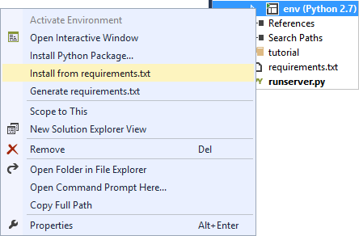

    After successful installation, the output window displays the following:

        Successfully installed Babel-2.3.2 Tempita-0.5.2 WTForms-2.1 Whoosh-2.7.4 blinker-1.4 decorator-4.0.9 flask-0.9 flask-babel-0.8 flask-mail-0.7.6 flask-sqlalchemy-0.16 flask-whooshalchemy-0.55a0 flask-wtf-0.8.4 flup-1.0.2 pydocumentdb-1.6.1 pytz-2013b0 speaklater-1.3 sqlalchemy-0.7.9 sqlalchemy-migrate-0.7.2

    > [AZURE.NOTE] In rare cases, you might see a failure in the output window. If this happens, check if the error is related to cleanup. Sometimes the cleanup fails, but the installation will still be successful (scroll up in the output window to verify this). You can check your installation by [Verifying the virtual environment](#verify-the-virtual-environment). If the installation failed but the verification is successful, it's OK to continue.

### Verify the virtual environment

Let's make sure that everything is installed correctly.

1. Build the solution by pressing **Ctrl**+**Shift**+**B**.
2. Once the build succeeds, start the website by pressing **F5**. This launches the Flask development server and starts your web browser. You should see the following page.

	

3. Stop debugging the website by pressing **Shift**+**F5** in Visual Studio.

### Create database, collection, and document definitions

Now let's create your voting application by adding new files and updating others.

1. In Solution Explorer, right-click the **tutorial** project, click **Add**, and then click **New Item**. Select **Empty Python File** and name the file **forms.py**.  
2. Add the following code to the forms.py file, and then save the file.

```python
from flask.ext.wtf import Form
from wtforms import RadioField

class VoteForm(Form):
	deploy_preference  = RadioField('Deployment Preference', choices=[
        ('Web Site', 'Web Site'),
        ('Cloud Service', 'Cloud Service'),
        ('Virtual Machine', 'Virtual Machine')], default='Web Site')
```


### Add the required imports to views.py

1. In Solution Explorer, expand the **tutorial** folder, and open the **views.py** file. 
2. Add the following import statements to the top of the **views.py** file, then save the file. These import DocumentDB's PythonSDK and the Flask packages.

	```python
	from forms import VoteForm
	import config
	import pydocumentdb.document_client as document_client
	```


### Create database, collection, and document

- Still in **views.py**, add the following code to the end of the file. This takes care of creating the database used by the form. Do not delete any of the existing code in **views.py**. Simply append this to the end.

```python
@app.route('/create')
def create():
    """Renders the contact page."""
    client = document_client.DocumentClient(config.DOCUMENTDB_HOST, {'masterKey': config.DOCUMENTDB_KEY})

    # Attempt to delete the database.  This allows this to be used to recreate as well as create
    try:
        db = next((data for data in client.ReadDatabases() if data['id'] == config.DOCUMENTDB_DATABASE))
        client.DeleteDatabase(db['_self'])
    except:
        pass

    # Create database
    db = client.CreateDatabase({ 'id': config.DOCUMENTDB_DATABASE })

    # Create collection
    collection = client.CreateCollection(db['_self'],{ 'id': config.DOCUMENTDB_COLLECTION }, { 'offerType': 'S1' })

    # Create document
    document = client.CreateDocument(collection['_self'],
        { 'id': config.DOCUMENTDB_DOCUMENT,
          'Web Site': 0,
          'Cloud Service': 0,
          'Virtual Machine': 0,
          'name': config.DOCUMENTDB_DOCUMENT 
        })

    return render_template(
       'create.html',
        title='Create Page',
        year=datetime.now().year,
        message='You just created a new database, collection, and document.  Your old votes have been deleted')
```

> [AZURE.TIP] The **CreateCollection** method takes an optional **RequestOptions** as the third parameter. This can be used to specify the Offer Type for the collection. If no offerType value is supplied, then the collection will be created using the default Offer Type. For more information on DocumentDB Offer Types, see [Performance levels in DocumentDB](documentdb-performance-levels.md).


### Read database, collection, document, and submit form

- Still in **views.py**, add the following code to the end of the file. This takes care of setting up the form, reading the database, collection, and document. Do not delete any of the existing code in **views.py**. Simply append this to the end.

```python
@app.route('/vote', methods=['GET', 'POST'])
def vote(): 
    form = VoteForm()
    replaced_document ={}
    if form.validate_on_submit(): # is user submitted vote  
        client = document_client.DocumentClient(config.DOCUMENTDB_HOST, {'masterKey': config.DOCUMENTDB_KEY})

        # Read databases and take first since id should not be duplicated.
        db = next((data for data in client.ReadDatabases() if data['id'] == config.DOCUMENTDB_DATABASE))

        # Read collections and take first since id should not be duplicated.
        coll = next((coll for coll in client.ReadCollections(db['_self']) if coll['id'] == config.DOCUMENTDB_COLLECTION))

        # Read documents and take first since id should not be duplicated.
        doc = next((doc for doc in client.ReadDocuments(coll['_self']) if doc['id'] == config.DOCUMENTDB_DOCUMENT))

        # Take the data from the deploy_preference and increment our database
        doc[form.deploy_preference.data] = doc[form.deploy_preference.data] + 1
        replaced_document = client.ReplaceDocument(doc['_self'], doc)

        # Create a model to pass to results.html
        class VoteObject:
            choices = dict()
            total_votes = 0

        vote_object = VoteObject()
        vote_object.choices = {
            "Web Site" : doc['Web Site'],
            "Cloud Service" : doc['Cloud Service'],
            "Virtual Machine" : doc['Virtual Machine']
        }
        vote_object.total_votes = sum(vote_object.choices.values())

        return render_template(
            'results.html', 
            year=datetime.now().year, 
            vote_object = vote_object)

    else :
        return render_template(
            'vote.html', 
            title = 'Vote',
            year=datetime.now().year,
            form = form)
```


### Create the HTML files

1. In Solution Explorer, in the **tutorial** folder, right click the **templates** folder, click **Add**, and then click **New Item**. 
2. Select **HTML Page**, and then in the name box type **create.html**. 
3. Repeat steps 1 and 2 to create two additional HTML files: results.html and vote.html.
4. Add the following code to **create.html** in the `<body>` element. It displays a message stating that we created a new database, collection, and document.

	```html
	
	
	<h2>{{ title }}.</h2>
	<h3>{{ message }}</h3>
	<p><a href="{{ url_for('vote') }}" class="btn btn-primary btn-large">Vote &raquo;</a></p>
	
	```

5. Add the following code to **results.html** in the `<body`> element. It displays the results of the poll.

	```html
	
	
	<h2>Results of the vote</h2>
		<br />
		
	
	<div class="row">
		<div class="col-sm-5">{{choice}}</div>
	        <div class="col-sm-5">
	        	<div class="progress">
	        		<div class="progress-bar" role="progressbar" aria-valuenow="{{vote_object.choices[choice]}}" aria-valuemin="0" aria-valuemax="{{vote_object.total_votes}}" style="width: {{(vote_object.choices[choice]/vote_object.total_votes)*100}}%;">
	                    		{{vote_object.choices[choice]}}
				</div>
			</div>
	        </div>
	</div>
	
	
	<br />
	<a class="btn btn-primary" href="{{ url_for('vote') }}">Vote again?</a>
	
	```

6. Add the following code to **vote.html** in the `<body`> element. It displays the poll and accepts the votes. On registering the votes, the control is passed over to views.py where we will recognize the vote cast and append the document accordingly.

	```html
	
	
	<h2>What is your favorite way to host an application on Azure?</h2>
	<form action="" method="post" name="vote">
		{{form.hidden_tag()}}
	        {{form.deploy_preference}}
	        <button class="btn btn-primary" type="submit">Vote</button>
	</form>
	
	```

7. In the **templates** folder, replace the contents of **index.html** with the following. This
serves as the landing page for your application.
	
	```html
	
	
	<h2>Python + DocumentDB Voting Application.</h2>
	<h3>This is a sample DocumentDB voting application using PyDocumentDB</h3>
	<p><a href="{{ url_for('create') }}" class="btn btn-primary btn-large">Create/Clear the Voting Database &raquo;</a></p>
	<p><a href="{{ url_for('vote') }}" class="btn btn-primary btn-large">Vote &raquo;</a></p>
	
	```

### Add a configuration file and change the \_\_init\_\_.py

1. In Solution Explorer, right-click the **tutorial** project, click **Add**, click **New Item**, select **Empty Python File**, and then name the file **config.py**. This config file is required by forms in Flask. You can use it to provide a secret key as well. This key is not needed for this tutorial though.

2. Add the following code to config.py, you'll need to alter the values of **DOCUMENTDB\_HOST** and **DOCUMENTDB\_KEY** in the next step.

	```python
	CSRF_ENABLED = True
	SECRET_KEY = 'you-will-never-guess'
	
	DOCUMENTDB_HOST = 'https://YOUR_DOCUMENTDB_NAME.documents.azure.com:443/'
	DOCUMENTDB_KEY = 'YOUR_SECRET_KEY_ENDING_IN_=='
	
	DOCUMENTDB_DATABASE = 'voting database'
	DOCUMENTDB_COLLECTION = 'voting collection'
	DOCUMENTDB_DOCUMENT = 'voting document'
	```

3. In the [Azure portal](https://portal.azure.com/), navigate to the **Keys** blade by clicking **Browse**, **DocumentDB Accounts**, double-click the name of the account to use, and then click the **Keys** button in the **Essentials** area. In the **Keys** blade, copy the **URI** value and paste it into the **config.py** file, as the value for the **DOCUMENTDB\_HOST** property. 
4. Back in the Azure portal, in the **Keys** blade, copy the value of the **Primary Key** or the **Secondary Key**, and paste it into the **config.py** file, as the value for the **DOCUMENTDB\_KEY** property.
5. In the **\_\_init\_\_.py** file, add the following line. 

        app.config.from_object('config')

    So that the content of the file is:

	```python
	from flask import Flask
	app = Flask(__name__)
	app.config.from_object('config')
	import tutorial.views
	```

6. After adding all the files, Solution
Explorer should look like this:

	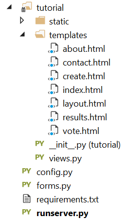


## Step 4: Run your web application locally

1. Build the solution by pressing **Ctrl**+**Shift**+**B**.
2. Once the build succeeds, start the website by pressing **F5**. You should see the following on your screen.

	

3. Click **Create/Clear the Voting Database** to generate the database.

	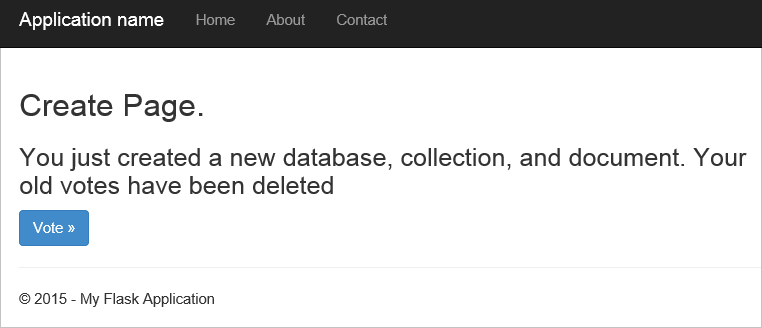

4. Then, click **Vote** and select your option.

	

5. For every vote you cast, it increments the appropriate counter.

	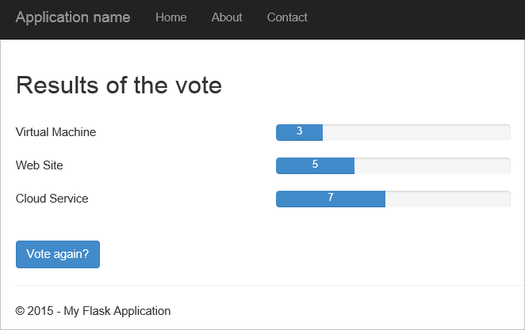

6. Stop debugging the project by pressing Shift+F5.

## Step 5: Deploy the web application to Azure Websites

Now that you have the complete application working correctly against
DocumentDB, we're going to deploy this to Azure Websites.

1. Right-click the project in Solution Explorer (make sure you're not still running it locally) and select **Publish**.  

 	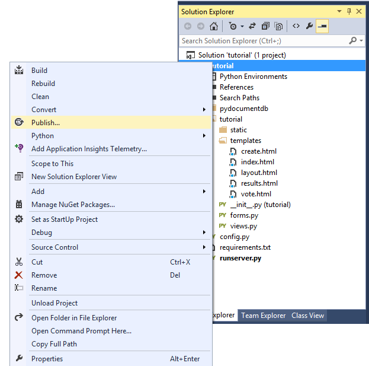

2. In the **Publish Web** window, select **Microsoft Azure Web Apps**, and then click **Next**.

	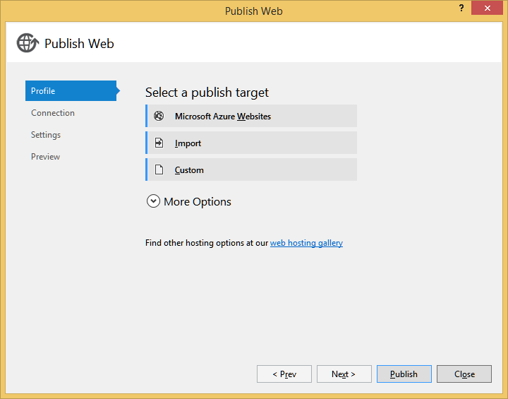

3. In the **Microsoft Azure Web Apps Window** window, click **New**.

	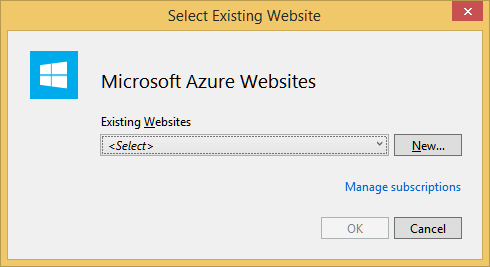

4. In the **Create site on Microsoft Azure** window, enter a **Web app name**, **App Service plan**, **Resource group**, and **Region**, then click **Create**.

	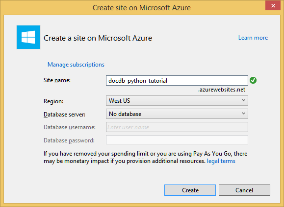

5. In the **Publish Web** window, click **Publish**.

	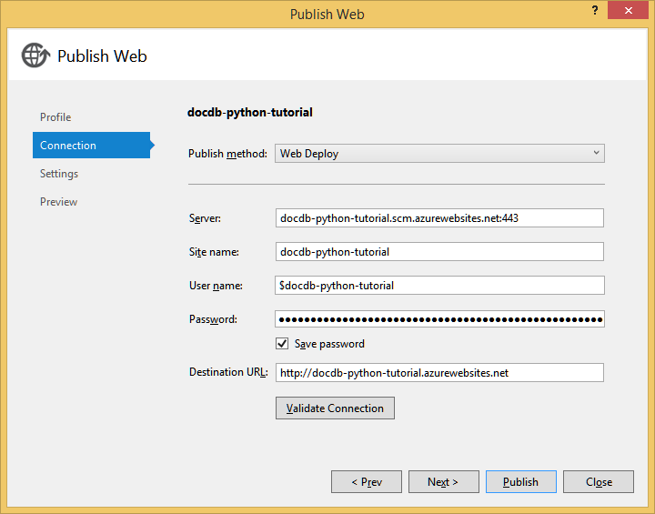

3. In a few seconds, Visual Studio will finish publishing your web
application and launch a browser where you can see your handy work
running in Azure!

## Troubleshooting

If this is the first Python app you've run on your computer, ensure that the following folders (or the equivalent installation locations) are included in your PATH variable:

    C:\Python27\site-packages;C:\Python27\;C:\Python27\Scripts;

If you receive an error on your vote page, and you named your project something other than **tutorial**, make sure that **\_\_init\_\_.py** references the correct project name in the line: `import tutorial.view`.

## Next steps

Congratulations! You have just completed your first Python web application using Azure DocumentDB and published it to Azure Websites.

We update and improve this topic frequently based on your feedback.  Once you've completed the tutorial, please using the voting buttons at the top and bottom of this page, and be sure to include your feedback on what improvements you want to see made. If you'd like us to contact you directly, feel free to include your email address in your comments.

To add additional functionality to your web application, review the APIs available in the [DocumentDB Python SDK](documentdb-sdk-python.md).

For more information about Azure, Visual Studio, and Python, see the [Python Developer Center](https://azure.microsoft.com/develop/python/). 

For additional Python Flask tutorials, see [The Flask Mega-Tutorial, Part I: Hello, World!](http://blog.miguelgrinberg.com/post/the-flask-mega-tutorial-part-i-hello-world). 

  [Visual Studio Express]: http://www.visualstudio.com/products/visual-studio-express-vs.aspx
  [2]: https://www.python.org/downloads/windows/
  [3]: https://www.microsoft.com/download/details.aspx?id=44266
  [Microsoft Web Platform Installer]: http://www.microsoft.com/web/downloads/platform.aspx
  [Azure portal]: http://portal.azure.com
