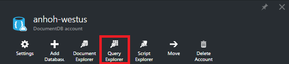
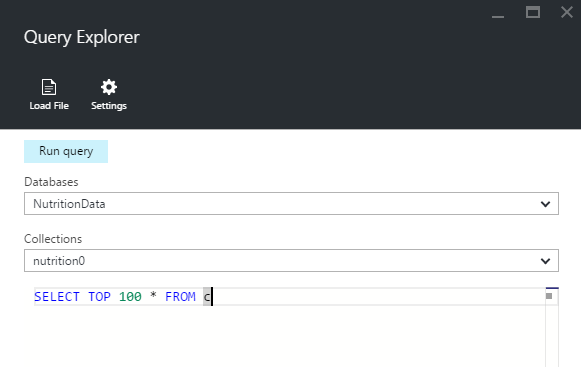
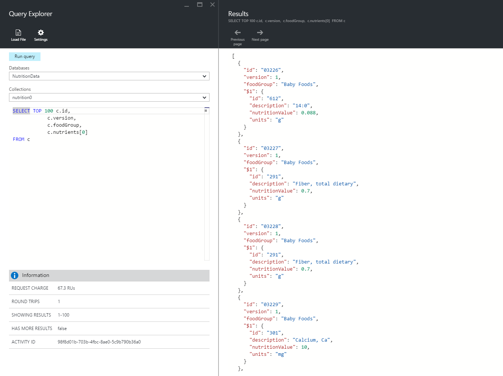
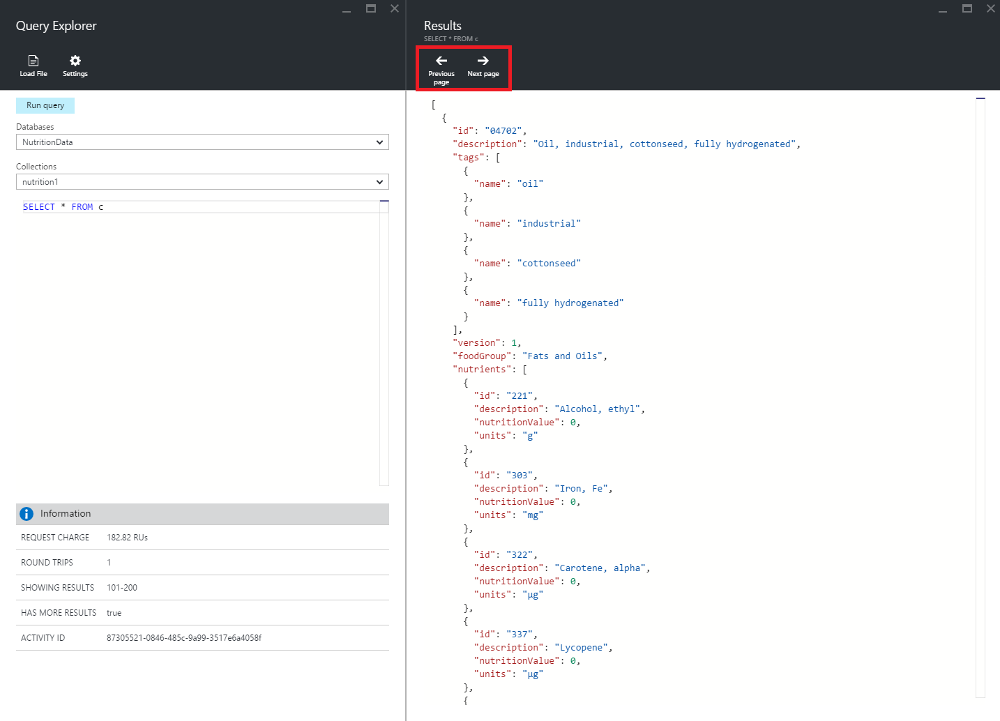
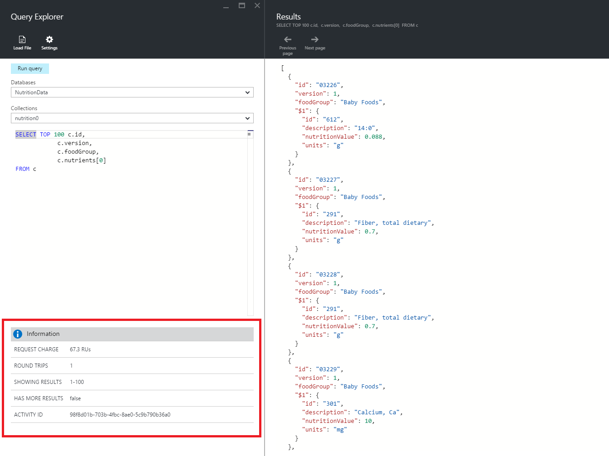
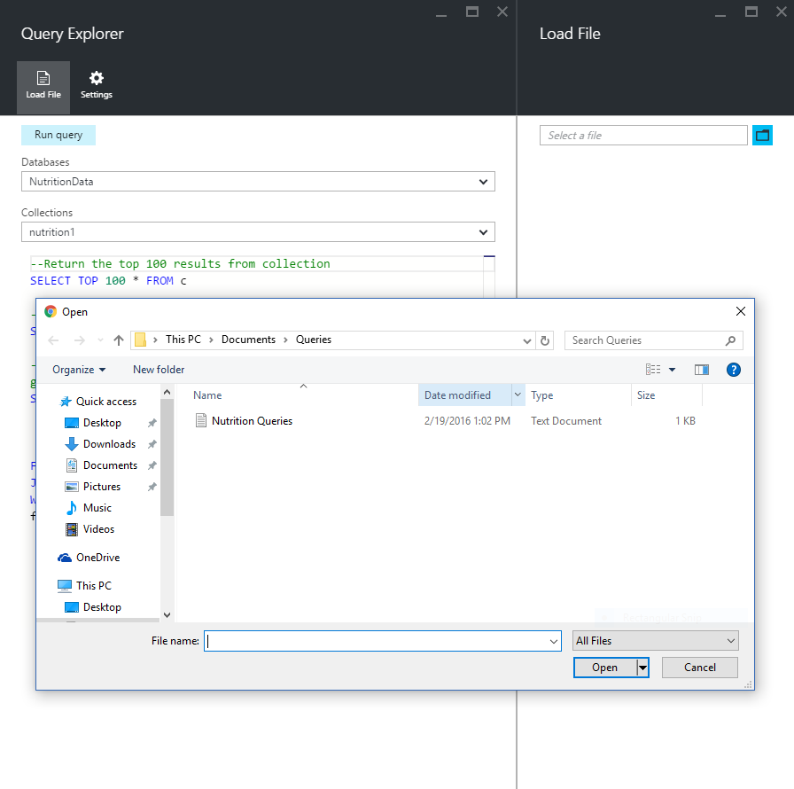
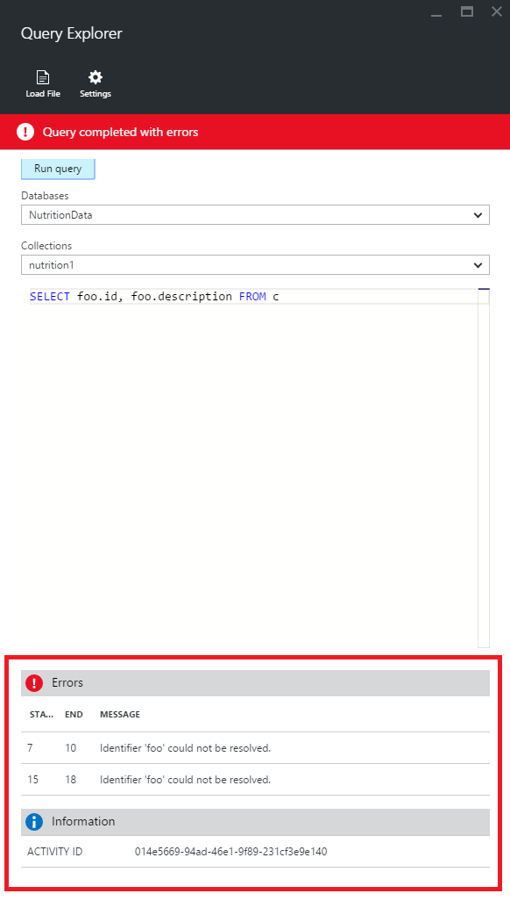

# Write, edit, and run SQL queries for Azure Cosmos DB using Query Explorer in the Azure portal
This article provides an overview of the [Microsoft Azure Cosmos DB](https://azure.microsoft.com/services/cosmos-db/) Query Explorer, an Azure portal tool that enables you to write, edit, and run SQL queries against a [DocumentDB collection](documentdb-create-collection.md).

1. In the [Azure portal](https://portal.azure.com), on the left navigation, click  **Azure Cosmos DB**. 

    If **Azure Cosmos DB** is not visible, click **More Services** at the bottom, and then click  **Azure Cosmos DB**.
2. In the resource menu, click **Query Explorer**. 
   
    
3. In the **Query Explorer** blade, select the **Databases** and **Collections** to query from the drop down lists, and type the query to run. 
   
    The **Databases** and **Collections** drop-down lists are pre-populated depending on the context in which you launch Query Explorer. 
   
    A default query of `SELECT TOP 100 * FROM c` is provided.  You can accept the default query or construct your own query using the SQL query language described in the [SQL query cheat sheet](documentdb-sql-query-cheat-sheet.md) or the [SQL query and SQL syntax](documentdb-sql-query.md) article.
   
    Click **Run query** to view the results.
   
    
4. The **Results** blade displays the output of the query. 
   
    

## Work with results
By default, Query Explorer returns results in sets of 100.  If your query produces more than 100 results, simply use the **Next page** and **Previous page** commands to navigate through the result set.

For successful queries, the **Information** pane contains metrics such as the request charge,  the number of round trips the query made, the set of results currently being shown, and whether there are more results, which can then be accessed via the **Next page** command, as mentioned previously.

## Use multiple queries
If you're using multiple queries and want to quickly switch between them, you can enter all the queries in the query text box of the **Query Explorer** blade, then highlight the one you want to run, and then click **Run query** to view the results.

## Add queries from a file into the SQL query editor
You can load the contents of an existing file using the **Load File** command.

## Troubleshoot
If a query completes with errors, Query Explorer displays a list of errors that can help with troubleshooting efforts.

## Run DocumentDB API SQL queries outside the portal
The Query Explorer in the Azure portal is just one way to run SQL queries against Cosmos DB. You can also run SQL queries using the [REST API](https://msdn.microsoft.com/library/azure/dn781481.aspx) or the [client SDKs](documentdb-sdk-dotnet.md). For more information about using these other methods, see [Executing SQL queries](documentdb-sql-query.md#ExecutingSqlQueries)

## Next steps
To learn more about the DocumentDB API SQL grammar supported in Query Explorer, see the [SQL query and SQL syntax](documentdb-sql-query.md) article or print out the [SQL query cheat sheet](documentdb-sql-query-cheat-sheet.md).
You may also enjoy experimenting with the [Query Playground](https://www.documentdb.com/sql/demo) where you can test out queries online using a sample dataset.

