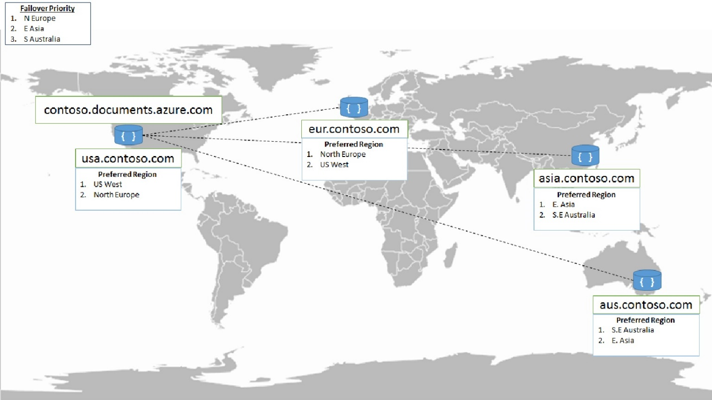
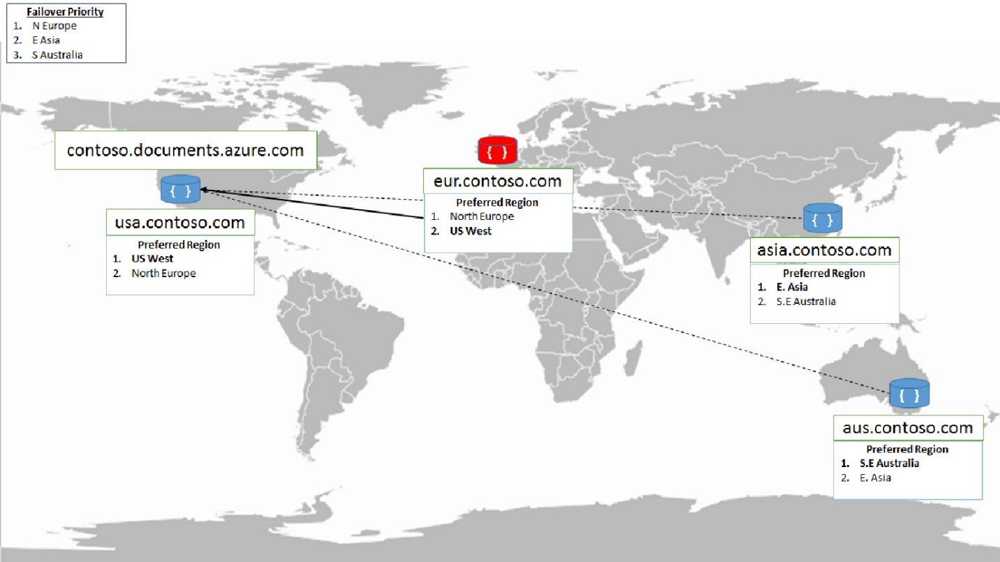
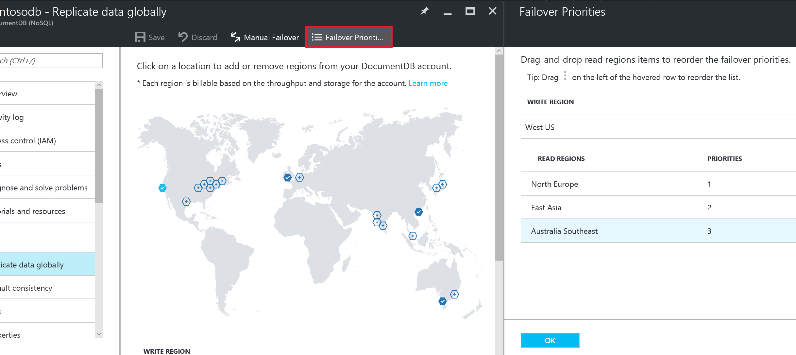
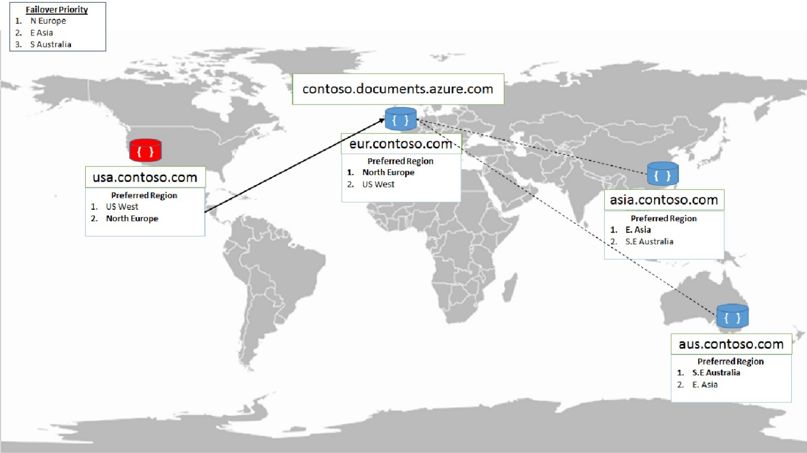
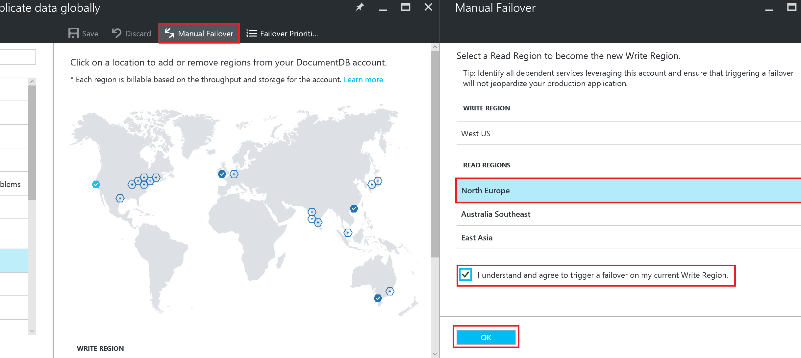

# Automatic regional failovers for business continuity in DocumentDB
Azure DocumentDB simplifies the global distribution of data by offering fully managed, [multi-region database accounts](documentdb-distribute-data-globally.md) that provide clear tradeoffs between consistency, availability, and performance, all with corresponding guarantees. DocumentDB accounts offer high availability, single digit ms latencies, [well-defined consistency levels](documentdb-consistency-levels.md), transparent regional failover with multi-homing APIs, and the ability to elastically scale throughput and storage across the globe. 

Azure DocumentDB supports both explicit and policy driven failovers that allow you to control the end-to-end system behavior in the event of failures. In this article, we look at:

* How do manual failovers work in DocumentDB?
* How do automatic failovers work in DocumentDB and what happens when a data center goes down?
* How can you use manual failovers in application architectures?

You can also learn about regional failovers in this Azure Friday video with Scott Hanselman and Principal Engineering Manager Karthik Raman.

>[!VIDEO https://channel9.msdn.com/Shows/Azure-Friday/Planet-Scale-NoSQL-with-DocumentDB/player]  

## Configuring multi-region applications
Before we dive into failover modes, we look at how you can configure an application to take advantage of multi-region availability and be resilient in the face of regional failovers.

* First, deploy your application in multiple regions
* To ensure low latency access from every region your application is deployed, configure the corresponding [preferred regions list](https://msdn.microsoft.com/library/microsoft.azure.documents.client.connectionpolicy.preferredlocations.aspx#P:Microsoft.Azure.Documents.Client.ConnectionPolicy.PreferredLocations) for each region via one of the supported SDKs.

The following snippet shows how to initialize a multi-region application. Here, the DocumentDB account `contoso.documents.azure.com` is configured with two regions - West US and North Europe. 

* The application is deployed in the West US region (using Azure App Services for example) 
* Configured with `West US` as the first preferred region for low latency reads
* Configured with `North Europe` as the second preferred region (for high availability during regional failures)

In .NET, this configuration looks like the following snippet:

    ConnectionPolicy usConnectionPolicy = new ConnectionPolicy 
    { 
        ConnectionMode = ConnectionMode.Direct,
        ConnectionProtocol = Protocol.Tcp
    };

    usConnectionPolicy.PreferredLocations.Add(LocationNames.WestUS);
    usConnectionPolicy.PreferredLocations.Add(LocationNames.NorthEurope);

    DocumentClient usClient = new DocumentClient(
        new Uri("https://contosodb.documents.azure.com"),
        "memf7qfF89n6KL9vcb7rIQl6tfgZsRt5gY5dh3BIjesarJanYIcg2Edn9uPOUIVwgkAugOb2zUdCR2h0PTtMrA==",
        usConnectionPolicy);

The application is also deployed in the North Europe region with the order of preferred regions reversed. That is, the North Europe region is specified first for low latency reads. Then, the West US region is specified as the second preferred region for high availability during regional failures.

The following architecture diagram shows a multi-region application deployment where DocumentDB and the application are configured to be available in four Azure geographic regions.  

Now, let's look at how the DocumentDB service handles regional failures via automatic failovers. 

## Automatic Failovers
In the rare event of an Azure regional outage or data center outage, DocumentDB automatically triggers failovers of all DocumentDB accounts with a presence in the affected region. 

**What happens if a read region has an outage?**

DocumentDB accounts with a read region in one of the affected regions are automatically disconnected from their write region and marked offline. The DocumentDB SDKs implement a regional discovery protocol that allows them to automatically detect when a region is available and redirect read calls to the next available region in the preferred region list. If none of the regions in the preferred region list is available, calls automatically fall back to the current write region. No changes are required in your application code to handle regional failovers. During this entire process, consistency guarantees continue to be honored by DocumentDB.

Once the affected region recovers from the outage, all the affected DocumentDB accounts in the region are automatically recovered by the service. DocumentDB accounts that had a read region in the affected region will then automatically sync with current write region and turn online. The DocumentDB SDKs discover the availability of the new region and evaluate whether the region should be selected as the current read region based on the preferred region list configured by the application. Subsequent reads are redirected to the recovered region without requiring any changes to your application code.

**What happens if a write region has an outage?**

If the affected region is the current write region for a given Azure DocumentDB account, then the region will be automatically marked as offline. Then, an alternative region is promoted as the write region each affected DocumentDB account. You can fully control the region selection order for your DocumentDB accounts via the Azure portal or [programmatically](https://docs.microsoft.com/rest/api/documentdbresourceprovider/databaseaccounts#DatabaseAccounts_FailoverPriorityChange). 

During automatic failovers, DocumentDB automatically chooses the next write region for a given Azure DocumentDB account based on the specified priority order. 

Once the affected region recovers from the outage, all the affected DocumentDB accounts in the region are automatically recovered by the service. 

* DocumentDB accounts with their previous write region in the affected region will stay in an offline mode with read availability even after the recovery of the region. 
* You can query this region to compute any unreplicated writes during the outage by comparing with the data available in the current write region. Based on the needs of your application, you can perform merge and/or conflict resolution and write the final set of changes back to the current write region. 
* Once you've completed merging changes, you can bring the affected region back online by removing and readding the region to your DocumentDB account. Once the region is added back, you can configure it back as the write region by performing a manual failover via the Azure portal or [programmatically](https://docs.microsoft.com/rest/api/documentdbresourceprovider/databaseaccounts#DatabaseAccounts_CreateOrUpdate).

## Manual Failovers

In addition to automatic failovers, the current write region of a given DocumentDB account can be manually changed dynamically to one of the existing read regions. Manual failovers can be initiated via the Azure portal or [programmatically](https://docs.microsoft.com/rest/api/documentdbresourceprovider/databaseaccounts#DatabaseAccounts_CreateOrUpdate). 

Manual failovers ensure **zero data loss** and **zero availability** loss and gracefully transfer write status from the old write region to the new one for the specified DocumentDB account. Like in automatic failovers, the Azure DocumentDB SDK automatically handles write region changes during manual failovers and ensures that calls are automatically redirected to the new write region. No code or configuration changes are required in your application to manage failovers. 

Some of the common scenarios where manual failover can be useful are:

**Follow the clock model**: If your applications have predictable traffic patterns based on the time of the day, you can periodically change the write status to the most active geographic region based on time of the day.

**Service update**: Certain globally distributed application deployment may involve rerouting traffic to different region via traffic manager during their planned service update. Such application deployment now can use manual failover to keep the write status to the region where there is going to be active traffic during the service update window.

**Business Continuity and Disaster Recovery (BCDR) and High Availability and Disaster Recovery (HADR) drills**: Most enterprise applications include business continuity tests as part of their development and release process. BCDR and HADR testing is often an important step in compliance certifications and guaranteeing service availability in the case of regional outages. You can test the BCDR readiness of your applications that use DocumentDB for storage by triggering a manual failover of your DocumentDB account and/or adding and removing a region dynamically.

In this article, we reviewed how manual and automatic failovers work in Azure DocumentDB, and how you can configure your DocumentDB accounts and applications to be globally available. By using Azure DocumentDB's global replication support, you can improve end-to-end latency and ensure that they are highly available even in the event of region failures. 

## Next Steps
* Learn about how DocumentDB supports [global distribution](documentdb-distribute-data-globally.md)
* Learn about [global consistency with DocumentDB](documentdb-consistency-levels.md)
* Develop with multiple regions using the [Azure DocumentDB SDK](documentdb-developing-with-multiple-regions.md)
* Learn how to build [Multi-region writer architectures](documentdb-multi-region-writers.md) with Azure DocumentDB

