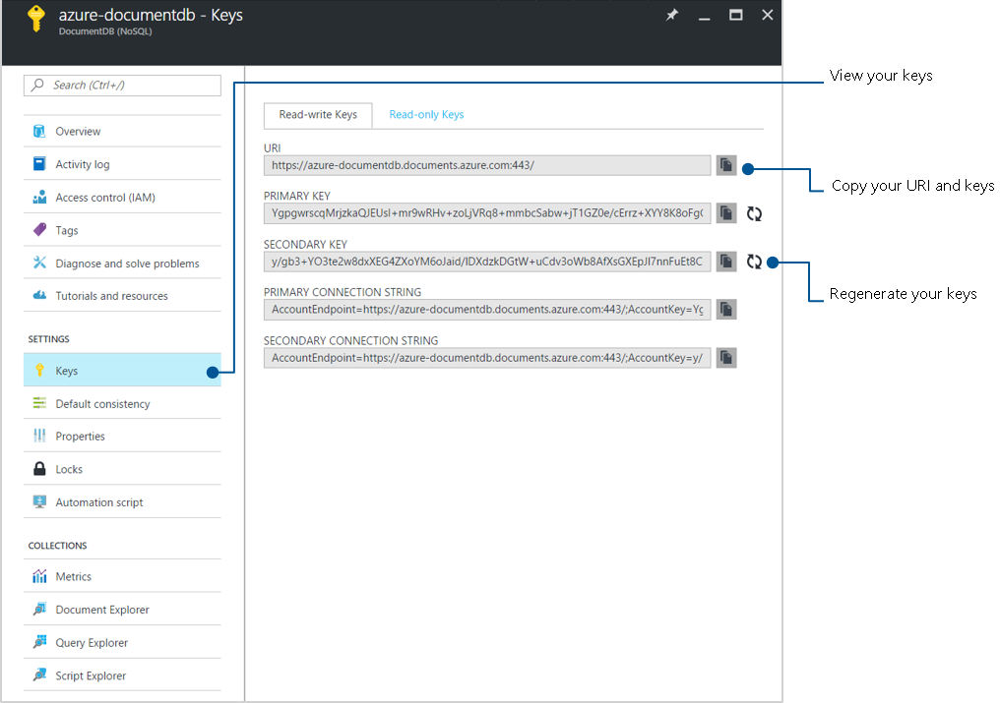

# Securing access to DocumentDB data
This article provides an overview of securing access to data stored in [Microsoft Azure DocumentDB](https://azure.microsoft.com/services/documentdb/).

DocumentDB uses two types of keys to authenticate users and provide access to its data and resources. 

|Key type|Resources|
|---|---|
|[Master keys](#master-keys) |Used for administrative resources: database accounts, databases, users, and permissions|
|[Resource tokens](#resource-tokens)|Used for application resources: collections, documents, attachments, stored procedures, triggers, and UDFs|

<a id="master-keys"></a>

## Master keys 

Master keys provide access to the all the administrative resources for the database account. Master keys:  
- Provide access to accounts, databases, users, and permissions. 
- Cannot be used to provide granular access to collections and documents.
- Are created during the creation of an account.
- Can be regenerated at any time.

Each account consists of two Master keys: a primary key and secondary key. The purpose of dual keys is so that you can regenerate, or roll keys, providing continuous access to your account and data. 

In addition to the two master keys for the DocumentDB account, there are two read-only keys. These read-only keys only allow read operations on the account. Read-only keys do not provide access to read permissions resources.

Primary, secondary, read only, and read-write master keys can be retrieved and regenerated using the Azure portal. For instructions, see [View, copy, and regenerate access keys](documentdb-manage-account.md#a-idkeysaview-copy-and-regenerate-access-keys).



The process of rotating your master key is simple. Navigate to the Azure portal to retrieve your secondary key, then replace your primary key with your secondary key in your application, then rotate the primary key in the Azure portal.


### Code sample to use a master key

The following code sample illustrates how to use a DocumentDB account endpoint and master key to instantiate a DocumentClient and create a database. 

```csharp
//Read the DocumentDB endpointUrl and authorization keys from config.
//These values are available from the Azure portal on the NOSQL (DocumentDB) account blade under "Keys".
//NB > Keep these values in a safe and secure location. Together they provide Administrative access to your DocDB account.

private static readonly string endpointUrl = ConfigurationManager.AppSettings["EndPointUrl"];
private static readonly SecureString authorizationKey = ToSecureString(ConfigurationManager.AppSettings["AuthorizationKey"]);

client = new DocumentClient(new Uri(endpointUrl), authorizationKey);

// Create Database
Database database = await client.CreateDatabaseAsync(
    new Database
    {
        Id = databaseName
    });
```

<a id="resource-tokens"></a>

## Resource tokens

Resource tokens provide access to the application resources within a database. Resource tokens:
- Provide access to specific collections, partition keys, documents, attachments, stored procedures, triggers, and UDFs.
- Are created when a [user](#users) is granted [permissions](#permissions) to a specific resource.
- Are recreated when a permission resource is acted upon on by POST, GET, or PUT call.
- Use a hash resource token specifically constructed for the user, resource, and permission.
- Are time bound with a customizable validity period. The default valid timespan is one hour. Token lifetime, however, may be explicitly specified, up to a maximum of five hours.
- Provide a safe alternative to giving out the master key. 
- Enable clients to read, write, and delete resources in the DocumentDB account according to the permissions they've been granted.

You can use a resource token (by creating DocumentDB users and permissions) when you want to provide access to resources in your DocumentDB account to a client that cannot be trusted with the master key.  

DocumentDB resource tokens provide a safe alternative that enables clients to read, write, and delete resources in your DocumentDB account according to the permissions you've granted, and without need for either a master or read only key.

Here is a typical design pattern whereby resource tokens may be requested, generated, and delivered to clients:

1. A mid-tier service is set up to serve a mobile application to share user photos. 
2. The mid-tier service possesses the master key of the DocumentDB account.
3. The photo app is installed on end-user mobile devices. 
4. On login, the photo app establishes the identity of the user with the mid-tier service. This mechanism of identity establishment is purely up to the application.
5. Once the identity is established, the mid-tier service requests permissions based on the identity.
6. The mid-tier service sends a resource token back to the phone app.
7. The phone app can continue to use the resource token to directly access DocumentDB resources with the permissions defined by the resource token and for the interval allowed by the resource token. 
8. When the resource token expires, subsequent requests receive a 401 unauthorized exception.  At this point, the phone app re-establishes the identity and requests a new resource token.

    

Resource token generation and management is handled by the native DocumentDB client libraries; however, if you use REST you must construct the request/authentication headers. For more information on creating authentication headers for REST, see [Access Control on DocumentDB Resources](https://docs.microsoft.com/en-us/rest/api/documentdb/access-control-on-documentdb-resources) or the [source code for our SDKs](https://github.com/Azure/azure-documentdb-node/blob/master/source/lib/auth.js).

For an example of a middle tier service used to generate or broker resource tokens, see the [ResourceTokenBroker app](https://github.com/Azure/azure-documentdb-dotnet/tree/master/samples/xamarin/UserItems/ResourceTokenBroker/ResourceTokenBroker/Controllers).

<a id="users"></a>

## Users
DocumentDB users are associated with a DocumentDB database.  Each database can contain zero or more DocumentDB users.  The following code sample shows how to create a DocumentDB user resource.

```csharp
//Create a user.
User docUser = new User
{
    Id = "mobileuser"
};

docUser = await client.CreateUserAsync(UriFactory.CreateDatabaseUri("db"), docUser);
```

> [!NOTE]
> Each DocumentDB user has a PermissionsLink property that can be used to retrieve the list of [permissions](#permissions) associated with the user.
> 
> 

<a id="permissions"></a>

## Permissions
A DocumentDB permission resource is associated with a DocumentDB user.  Each user may contain zero or more DocumentDB permissions.  A permission resource provides access to a security token that the user needs when trying to access a specific application resource.
There are two available access levels that may be provided by a permission resource:

* All: The user has full permission on the resource.
* Read: The user can only read the contents of the resource but cannot perform write, update, or delete operations on the resource.

> [!NOTE]
> In order to run DocumentDB stored procedures the user must have the All permission on the collection in which the stored procedure will be run.
> 
> 

### Code sample to create permission

The following code sample shows how to create a permission resource, read the resource token of the permission resource, and associate the permissions with the [user](#users) created above.

```csharp
// Create a permission.
Permission docPermission = new Permission
{
    PermissionMode = PermissionMode.Read,
    ResourceLink = documentCollection.SelfLink,
    Id = "readperm"
};
  
docPermission = await client.CreatePermissionAsync(UriFactory.CreateUserUri("db", "user"), docPermission);
Console.WriteLine(docPermission.Id + " has token of: " + docPermission.Token);
```

If you have specified a partition key for your collection, then the permission for collection, document, and attachment resources must also include the ResourcePartitionKey in addition to the ResourceLink.

### Code sample to read permissions for user

To easily obtain all permission resources associated with a particular user, DocumentDB makes available a permission feed for each user object.  The following code snippet shows how to retrieve the permission associated with the user created above, construct a permission list, and instantiate a new DocumentClient on behalf of the user.

```csharp
//Read a permission feed.
FeedResponse<Permission> permFeed = await client.ReadPermissionFeedAsync(
  UriFactory.CreateUserUri("db", "myUser"));
 List<Permission> permList = new List<Permission>();

foreach (Permission perm in permFeed)
{
    permList.Add(perm);
}

DocumentClient userClient = new DocumentClient(new Uri(endpointUrl), permList);
```

## Next steps
* To learn more about DocumentDB database security, see [DocumentDB: NoSQL database security](documentdb-nosql-database-security.md).
* To learn about managing master and read-only keys, see [How to manage a DocumentDB account](documentdb-manage-account.md#a-idkeysaview-copy-and-regenerate-access-keys).
* To learn how to construct DocumentDB authorization tokens, see [Access Control on DocumentDB Resources](https://docs.microsoft.com/en-us/rest/api/documentdb/access-control-on-documentdb-resources).
