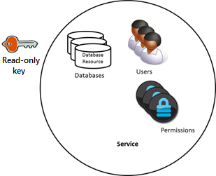
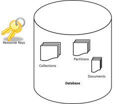

<properties 
	pageTitle="Learn how to secure access to data in DocumentDB | Microsoft Azure" 
	description="Learn about access control concepts in DocumentDB, including master keys, read-only keys, users, and permissions." 
	services="documentdb" 
	authors="kiratp" 
	manager="jhubbard" 
	editor="monicar" 
	documentationCenter=""/>

<tags 
	ms.service="documentdb" 
	ms.workload="data-services" 
	ms.tgt_pltfrm="na" 
	ms.devlang="na" 
	ms.topic="article" 
	ms.date="03/30/2016" 
	ms.author="kipandya"/>

# Securing access to DocumentDB data

This article provides an overview of securing access to data stored in [Microsoft Azure DocumentDB](https://azure.microsoft.com/services/documentdb/).

After reading this overview, you'll be able to answer the following questions:  

-	What are DocumentDB master keys?
-	What are DocumentDB read-only keys?
-	What are DocumentDB resource tokens?
-	How can I use DocumentDB users and permissions to secure access to DocumentDB data?

## DocumentDB access control concepts

DocumentDB provides first class concepts in order to control access to DocumentDB resources.  For the purposes of this topic, DocumentDB resources are grouped into two categories:

- Administrative resources
	- Account
	- Database
	- User
	- Permission
- Application resources
	- Collection
	- Document
	- Attachment
	- Stored procedure
	- Trigger
	- User-defined function

In the context of these two categories, DocumentDB supports three types of access control personas: account administrator, read-only administrator, and database user.  The rights for each access control persona are:
 
- Account administrator: Full access to all of the resources (administrative and application) within a given DocumentDB account.
- Read-only administrator: Read-only access to all of the resources (administrative and application within a given DocumentDB account. 
- Database user: The DocumentDB user resource associated with a specific set of DocumentDB database resources (e.g. collections, documents, scripts).  There can be one or more user resources associated with a given database, and each user resource may have one or more permissions associated with it.

With the aforementioned categories and resources in mind, the DocumentDB access control model defines three types of access constructs:

- Master keys: Upon creation of a DocumentDB account, two master keys (primary and secondary) are created.  These keys enable full administrative access to all resources within the DocumentDB account.

- Read-only keys: Upon creation of a DocumentDB account, two read-only keys (primary and secondary) are created.  These keys enable read-only access to all resources within the DocumentDB account.

- Resource tokens: A resource token is associated with a DocumentDB permission resource and captures the relationship between the user of a database and the permission that user has for a specific DocumentDB application resource (e.g. collection, document).

## Working with DocumentDB master and read-only keys

As mentioned earlier, DocumentDB master keys provide full administrative access to all resources within a DocumentDB account, while read-only keys enable read access to all resources within the account.  The following code snippet illustrates how to use a DocumentDB account endpoint and master key to instantiate a DocumentClient and create a new database. 

    //Read the DocumentDB endpointUrl and authorization keys from config.
    //These values are available from the Azure Classic Portal on the DocumentDB Account Blade under "Keys".
    //NB > Keep these values in a safe and secure location. Together they provide Administrative access to your DocDB account.
    
    private static readonly string endpointUrl = ConfigurationManager.AppSettings["EndPointUrl"];
    private static readonly SecureString authorizationKey = ToSecureString(ConfigurationManager.AppSettings["AuthorizationKey"]);
        
    client = new DocumentClient(new Uri(endpointUrl), authorizationKey);
    
    // Create Database
    Database database = await client.CreateDatabaseAsync(
        new Database
        {
            Id = databaseName
        });

## Overview of DocumentDB resource tokens

You can use a resource token (by creating DocumentDB users and permissions) when you want to provide access to resources in your DocumentDB account to a client that cannot be trusted with the master key. Your DocumentDB master keys include both a primary and secondary key, each of which grants administrative access to your account and all of the resources in it. Exposing either of your master keys opens your account to the possibility of malicious or negligent use. 

Likewise, DocumentDB read-only keys provide read access to all resources - except permission resources, of course - within a DocumentDB account and cannot be used to provide more granular access to specific DocumentDB resources.

DocumentDB resource token provide a safe alternative that allows clients to read, write, and delete resources in your DocumentDB account according to the permissions you've granted, and without need for either a master or read only key.

Here is a typical design pattern whereby resource tokens may be requested, generated and delivered to clients:

1. A mid-tier service is set up to serve a mobile application to share user photos.
2. The mid-tier service possesses the master key of the DocumentDB account.
3. The photo app is installed on end user mobile devices. 
4. On login, the photo app establishes the identity of the user with the mid-tier service. This mechanism of identity establishment is purely up to the application.
5. Once the identity is established, the mid-tier service requests permissions based on the identity.
6. The mid-tier service sends a resource token back to the phone app.
7. The phone app can continue to use the resource token to directly access DocumentDB resources with the permissions defined by the resource token and for the interval allowed by the resource token. 
8. When the resource token expires, subsequent requests will receive a 401 unauthorized exception.  At this point, the phone app re-establishes the identity and requests a new resource token.

## Working with DocumentDB users and permissions
A DocumentDB user resource is associated with a DocumentDB database.  Each database may contain zero or more DocumentDB users.  The following code snippet shows how to create a DocumentDB user resource.

    //Create a user.
    User docUser = new User
    {
        Id = "mobileuser"
    };

    docUser = await client.CreateUserAsync(UriFactory.CreateDatabaseUri("db"), docUser);

> [AZURE.NOTE] Each DocumentDB user has a PermissionsLink property which can be used to retrieve the list of permissions associated with the user.

A DocumentDB permission resource is associated with a DocumentDB user.  Each user may contain zero or more DocumentDB permissions.  A permission resource provides access to a security token that the user needs when trying to access a specific application resource.
There are two available access levels which may be provided by a permission resource:

- All: The user has full permission on the resource
- Read: The user can only read the contents of the resource but cannot perform write, update, or delete operations on the resource.

> [AZURE.NOTE] In order to run DocumentDB stored procedures the user must have the All permission on the collection in which the stored procedure will be run.

The following code snippet shows how to create a permission resource, read the resource token (token) of the permission resource and associate the permissions with the user created above.

    // Create a permission.
    Permission docPermission = new Permission
    {
        PermissionMode = PermissionMode.Read,
        ResourceLink = documentCollection.SelfLink,
        Id = "readperm"
    };
            
  docPermission = await client.CreatePermissionAsync(UriFactory.CreateUserUri("db", "user"), docPermission);
  Console.WriteLine(docPermission.Id + " has token of: " + docPermission.Token);
  
If you have specified a partition key for your collection, then the permission for collection, document and attachment resources must also include the ResourcePartitionKey in addition to the ResourceLink.

In order to easily obtain all permission resources associated with a particular user, DocumentDB makes available a permission feed for each user object.  The following code snippet shows how to retrieve the permission associated with the user created above, construct a permission list, and instantiate a new DocumentClient on behalf of the user.

    //Read a permission feed.
    FeedResponse<Permission> permFeed = await client.ReadPermissionFeedAsync(
      UriFactory.CreateUserUri("db", "myUser"));

    List<Permission> permList = new List<Permission>();
      
    foreach (Permission perm in permFeed)
    {
        permList.Add(perm);
    }
            
    DocumentClient userClient = new DocumentClient(new Uri(endpointUrl), permList);

> [AZURE.TIP] Resource tokens have a default valid timespan of 1 hour.  Token lifetime, however, may be explicitly specified, up to a maximum of 5 hours.

## Next steps

- To learn more about DocumentDB, click [here](http://azure.com/docdb).
- To learn about managing master and read-only keys, click [here](documentdb-manage-account.md).
- To learn how to construct DocumentDB authorization tokens, click [here](https://msdn.microsoft.com/library/azure/dn783368.aspx)
 
