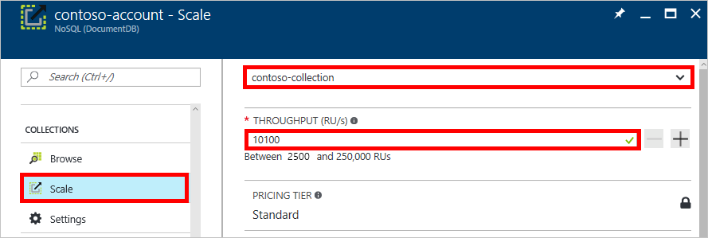

# Set throughput for Azure DocumentDB collections

You can set throughput for your DocumentDB collections in the Azure portal or by using the client SDKs. 

## To set the throughput by using the Azure portal

1. In a new window, open the [Azure portal](https://portal.azure.com).
2. On the left bar, click **NoSQL (DocumentDB)**, or click **More Services** at the bottom, then scroll to **Databases**, and then click **NoSQL (DocumentDB)**.
3. Select your DocumentDB account.
4. In the new window, under **Collections**, click **Scale** as shown in the following screenshot.
5. In the new window, select your collection from the drop-down, change the **Throughput** value, and then click **Save**.

    

<a id="set-throughput-sdk"></a>

## To set the throughput by using the .NET SDK

```C#
//Fetch the resource to be updated
Offer offer = client.CreateOfferQuery()
    .Where(r => r.ResourceLink == collection.SelfLink)    
    .AsEnumerable()
    .SingleOrDefault();

// Set the throughput to the new value, for example 12,000 request units per second
offer = new OfferV2(offer, 12000);

//Now persist these changes to the database by replacing the original resource
await client.ReplaceOfferAsync(offer);
```

## Next steps

To learn more about provisioning and going planet-scale with DocumentDB, see [Partitioning and scaling with DocumentDB](documentdb-partition-data.md).