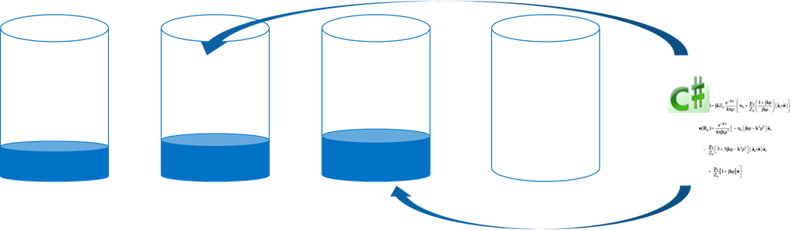
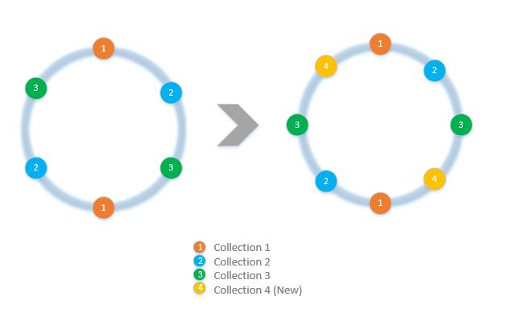
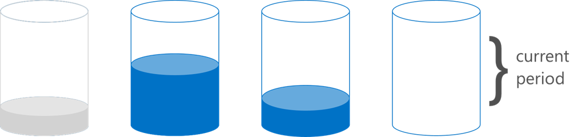

<properties 
	pageTitle="How to implement client side partitioning with the SDKs | Microsoft Azure" 
	description="Learn how to use the Azure DocumentDB SDKs to partition (shard) data and route requests across multiple collections" 
	services="documentdb" 
	authors="arramac" 
	manager="jhubbard" 
	editor="cgronlun" 
	documentationCenter=""/>

<tags 
	ms.service="documentdb" 
	ms.workload="data-services" 
	ms.tgt_pltfrm="na" 
	ms.devlang="na" 
	ms.topic="article" 
	ms.date="07/07/2016" 
	ms.author="arramac"/>

# How to partition data using client-side support in DocumentDB

Azure DocumentDB supports [automatic partitioning of collections](documentdb-partition-data.md). However, there are use cases where it is beneficial to have fine grained control over partitioning behavior. In order to reduce the boiler-plate code required for partitioning tasks, we have added functionality in the .NET, Node.js, and Java SDKs that makes it easier to build applications that are scaled out across multiple collections.

In this article, we'll take a look at the classes and interfaces in the .NET SDK and how you can use them to develop partitioned applications. Other SDKs like Java, Node.js and Python support similar methods and interfaces for client-side partitioning.

## Client-side Partitioning with the DocumentDB SDK

Before we dig deeper into partitioning, let's recap some basic DocumentDB concepts that relate to partitioning. Every Azure DocumentDB database account consists of a set of databases, each containing multiple collections, each of which can contain stored procedures, triggers, UDFs, documents, and related attachments. Collections can be single-partition or partitioned themselves and have the following properties:

- Collections offer performance isolation. Hence there is a performance benefit in collating similar documents within the same collection. For example, for time series data, you might want to place data for the last month, that is frequently queried, within a collection with higher provisioned throughput whereas older data is placed within collections with low provisioned throughput.
- ACID transactions i.e. stored procedures and triggers cannot span a collection. Transactions are scoped within a single partition key value within a collection.
- Collections do not enforce a schema, so they can be used for JSON documents of the same type or different types.

Starting with version [1.5.x of the Azure DocumentDB SDKs](documentdb-sdk-dotnet.md), you can perform document operations directly against a database. Internally the [DocumentClient](https://msdn.microsoft.com/library/azure/microsoft.azure.documents.client.documentclient.aspx) uses the PartitionResolver that you have specified for the database to route requests to the appropriate collection.

>[AZURE.NOTE] [Server-side partitioning](documentdb-partition-data.md) introduced in REST API 2015-12-16 and SDKs 1.6.0+ deprecates the client-side partition resolver approach for simple use cases. Client-side partitioning however is more flexible and lets you control performance isolation across partition keys, control degree of parallelism while reading results from multiple partitions, and use range/spatial partitioning approaches vs. hash.

For example, in .NET, each PartitionResolver class is a concrete implementation of an [IPartitionResolver](https://msdn.microsoft.com/library/azure/microsoft.azure.documents.client.ipartitionresolver.aspx) interface that has three methods - [GetPartitionKey](https://msdn.microsoft.com/library/azure/microsoft.azure.documents.client.ipartitionresolver.getpartitionkey.aspx), [ResolveForCreate](https://msdn.microsoft.com/library/azure/microsoft.azure.documents.client.ipartitionresolver.resolveforcreate.aspx) and [ResolveForRead](https://msdn.microsoft.com/library/azure/microsoft.azure.documents.client.ipartitionresolver.resolveforread.aspx). LINQ queries and ReadFeed iterators use the ResolveForRead method internally to iterate over all the collections that match the partition key for the request. Similarly, create operations use the ResolveForCreate method to route creates to the right partition. There are no changes required for Replace, Delete and Read since they use documents, which already contain the reference to the corresponding collection.

The SDKs also includes two classes that support the two canonical partitioning techniques, hashing and range lookups, via a [HashPartitionResolver](https://msdn.microsoft.com/library/azure/microsoft.azure.documents.partitioning.hashpartitionresolver.aspx) and a [RangePartitionResolver](https://msdn.microsoft.com/library/azure/mt126047.aspx). You can use these classes to easily add partitioning logic to your application.  

## Add partitioning logic and register the PartitionResolver 

Here's a snippet showing how to create a [HashPartitionResolver](https://msdn.microsoft.com/library/azure/microsoft.azure.documents.partitioning.hashpartitionresolver.aspx) and register with the DocumentClient for a database.

```cs
// Create some collections to partition data.
DocumentCollection collection1 = await client.CreateDocumentCollectionAsync(...);
DocumentCollection collection2 = await client.CreateDocumentCollectionAsync(...);

// Initialize a HashPartitionResolver using the "UserId" property and the two collection self-links.
HashPartitionResolver hashResolver = new HashPartitionResolver(
    u => ((UserProfile)u).UserId, 
    new string[] { collection1.SelfLink, collection2.SelfLink });

// Register the PartitionResolver with the database.
this.client.PartitionResolvers[database.SelfLink] = hashResolver;

```

## Create documents in a partition  

Once the PartitionResolver is registered, you can perform creates and queries directly against the database as shown below. In this example, the SDK uses the PartitionResolver to extract the UserId, hash it, and then use that value to route the create operation to the correct collection.

```cs
Document johnDocument = await this.client.CreateDocumentAsync(
    database.SelfLink, new UserProfile("J1", "@John", Region.UnitedStatesEast));
Document ryanDocument = await this.client.CreateDocumentAsync(
    database.SelfLink, new UserProfile("U4", "@Ryan", Region.AsiaPacific, UserStatus.AppearAway));
```

## Create queries against partitions  

You can query using the [CreateDocumentQuery](https://msdn.microsoft.com/library/azure/microsoft.azure.documents.linq.documentqueryable.createdocumentquery.aspx) method by passing in the database and a partition key. The query returns a single result-set over all the collections within the database that map to the partition key.  

```cs
// Query for John's document by ID - uses PartitionResolver to restrict the query to the partitions 
// containing @John. Again the query uses the database self link, and relies on the hash resolver 
// to route the appropriate collection.
var query = this.client.CreateDocumentQuery<UserProfile>(
    database.SelfLink, null, partitionResolver.GetPartitionKey(johnProfile))
    .Where(u => u.UserName == "@John");
johnProfile = query.AsEnumerable().FirstOrDefault();
```

## Create queries against all collections in the database 

You can also query all collections within the database and enumerate the results as show below, by skipping the partition key argument.

```cs
// Query for all "Available" users. Here since there is no partition key, the query is serially executed 
// across each partition/collection and returns a single result-set. 
query = this.client.CreateDocumentQuery<UserProfile>(database.SelfLink)
    .Where(u => u.Status == UserStatus.Available);
foreach (UserProfile activeUser in query)
{
    Console.WriteLine(activeUser);
}
```

## Hash Partition Resolver
With hash partitioning, partitions are assigned based on the value of a hash function, allowing you to evenly distribute requests and data across a number of partitions. This approach is commonly used to partition data produced or consumed from a large number of distinct clients, and is useful for storing user profiles, catalog items, and IoT ("Internet of Things") telemetry data. Hash partitioning is also used by DocumentDB's server-side partitioning support within a collection.

**Hash Partitioning:**


A simple hash partitioning scheme across *N* collections would be to take any document, compute *hash(d) mod N* to determine which collection it's placed in. But a problem with this simple technique is that it does not work well when you add new collections, or remove collections as this would require almost all the data to get reshuffled. [Consistent hashing] (http://citeseerx.ist.psu.edu/viewdoc/summary?doi=10.1.1.23.3738) is a well-known algorithm that addresses this by implementing a hashing scheme that minimizes the amount of data movement required during adding or removing collections.

The [HashPartitionResolver](https://msdn.microsoft.com/library/azure/microsoft.azure.documents.partitioning.hashpartitionresolver.aspx) class implements logic to build a consistent hash ring over the hash function specified in the [IHashGenerator](https://msdn.microsoft.com/library/azure/microsoft.azure.documents.partitioning.ihashgenerator.aspx) interface. By default, the HashPartitionResolver uses an MD5 hash function, but you can swap this out with your own hashing implementation. The HashPartitionResolver internally creates 16 hashes or "virtual nodes" within the hash ring for each collection in order to achieve a more uniform distribution of documents across the collections, but you can vary this number to trade off data skewness with the amount of client side computation.

**Consistent hashing with HashPartitionResolver:**


## Range Partition Resolver

In range partitioning, partitions are assigned based on whether the partition key is within a certain range. This is commonly used for partitioning with time stamp properties (e.g., eventTime between Apr 1, 2015 and Apr 14, 2015). The [RangePartitionResolver](https://msdn.microsoft.com/library/azure/mt126047.aspx) class helps you maintain a mapping between a Range\<T\> and collection self-link. 

[Range\<T\>](https://msdn.microsoft.com/library/azure/mt126048.aspx) is a simple class that manages ranges of any types that implement IComparable\<T\> and IEquatable\<T\> like strings or numbers. For reads and creates, you can pass in any arbitrary range, and the resolver identifies all the candidate collections by identifying the ranges of the partitions that intersect with the requested range. This functionality can be useful when performing range queries against time series data.

**Range Partitioning:**  

  

A special case of range partitioning is when the range is just a single discrete value, sometimes called "lookup partitioning". This is commonly used for partitioning by region (e.g. the partition for Scandinavia contains Norway, Denmark, and Sweden) or for partitioning tenants in a multi-tenant application.

## Samples 

Take a look at the  [DocumentDB Partitioning Samples Github project](https://github.com/Azure/azure-documentdb-dotnet/tree/287acafef76ad223577759b0170c8f08adb45755/samples/code-samples/Partitioning) containing code snippets on how to use these PartitionResolvers and extend them to implement your own resolvers to fit specific use cases, like the following: 

* How to specify an arbitrary lambda expression for GetPartitionKey and use it to implement compound partitioning keys or to partition different types of objects differently.
* How to create a simple [LookupPartitionResolver](https://github.com/Azure/azure-documentdb-dotnet/blob/287acafef76ad223577759b0170c8f08adb45755/samples/code-samples/Partitioning/Partitioners/LookupPartitionResolver.cs) that uses a manual lookup table to perform partitioning. This pattern is commonly used for partitioning based on discrete values like region, tenant ID or application name.
* How to create a [ManagedPartitionResolver](https://github.com/Azure/azure-documentdb-dotnet/blob/287acafef76ad223577759b0170c8f08adb45755/samples/code-samples/Partitioning/Partitioners/ManagedHashPartitionResolver.cs) that creates collections automatically based on a template that defines a naming scheme, IndexingPolicy and stored procedures that need to be registered against new collections.
* How to create a scheme-less [SpilloverPartitionResolver](https://github.com/Azure/azure-documentdb-dotnet/blob/287acafef76ad223577759b0170c8f08adb45755/samples/code-samples/Partitioning/Partitioners/SpilloverPartitionResolver.cs) that simply creates new collections as the old collections fill up.
* How to serialize and deserialize your PartitionResolver state as JSON, so that you can share between processes and across shutdowns. You can persist these in config files, or even in a DocumentDB collection.
* A [DocumentClientHashPartitioningManager](https://github.com/Azure/azure-documentdb-dotnet/blob/287acafef76ad223577759b0170c8f08adb45755/samples/code-samples/Partitioning/Util/DocumentClientHashPartitioningManager.cs) class for dynamically adding and removing partitions to a database partitioned based on consistent hashing. Internally it uses a [TransitionHashPartitionResolver](https://github.com/Azure/azure-documentdb-dotnet/blob/287acafef76ad223577759b0170c8f08adb45755/samples/code-samples/Partitioning/Partitioners/TransitionHashPartitionResolver.cs) to route reads and writes during migration using one of four modes - read from the old partitioning scheme (ReadCurrent), the new one (ReadNext), merge results from both (ReadBoth) or be unavailable during migration (None).

The samples are open source and we encourage you to submit pull requests with contributions that could benefit other DocumentDB developers. Please refer to the [Contribution guidelines](https://github.com/Azure/azure-documentdb-net/blob/master/Contributing.md) for guidance on how to contribute.  

>[AZURE.NOTE] Collection creates are rate-limited by DocumentDB, so some of the sample methods shown here might take a few minutes to complete.

##FAQ
**Does DocumentDB support server-side partitioning?**

Yes, DocumentDB supports [server-side partitioning](documentdb-partition-data.md). DocumentDB also supports client-side partitioning via client-side partition resolvers for more advanced use cases.

** When should I use server-side vs. client-side partitioning?**
For the majority of use cases, we recommend the use of server-side partitioning since it handles the administrative tasks of partitioning data and routing requests. However, if you need range partitioning or have a specialized use case for performance isolation between different values of partition keys, then client-side partitioning might be the best approach.

**How do I add or remove a collection to my partitioning scheme?**

Take a look at the implementation of DocumentClientHashPartitioningManager in the samples project for an example of how you can implement repartitioning.

**How do I persist or share my partitioning configuration with other clients?**

You can serialize the partitioner state as JSON and store in configuration files, or even within DocumentDB collections. Take a look at the RunSerializeDeserializeSample method in the samples project for an example.

**How do I chain various partitioning techniques?**

You can chain PartitionResolvers by implementing your own IPartitionResolver that internally uses one or more existing resolvers. Take a look at TransitionHashPartitionResolver in the samples project for an example.

##References
* [Server-side Partitioning in DocumentDB](documentdb-partition-data.md)
* [DocumentDB collections and performance levels](documentdb-performance-levels.md)
* [Partitioning code samples on Github](https://github.com/Azure/azure-documentdb-dotnet/tree/287acafef76ad223577759b0170c8f08adb45755/samples/code-samples/Partitioning)
* [DocumentDB .NET SDK Documentation at MSDN](https://msdn.microsoft.com/library/azure/dn948556.aspx)
* [DocumentDB .NET samples](https://github.com/Azure/azure-documentdb-net)
* [DocumentDB Limits](documentdb-limits.md)
* [DocumentDB Blog on Performance Tips](https://azure.microsoft.com/blog/2015/01/20/performance-tips-for-azure-documentdb-part-1-2/)
 
