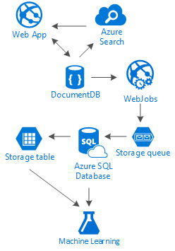

<properties 
	pageTitle="DocumentDB design pattern: Social media apps | Microsoft Azure" 
	description="Learn about a design pattern for Social Networks by leveraging the storage flexibility of DocumentDB and other Azure services." 
	keywords="social media apps"
	services="documentdb" 
	authors="ealsur" 
	manager="" 
	editor="" 
	documentationCenter=""/>

<tags 
	ms.service="documentdb" 
	ms.workload="data-services" 
	ms.tgt_pltfrm="na" 
	ms.devlang="na" 
	ms.topic="article" 
	ms.date="06/29/2016" 
	ms.author="mimig"/>

# Going social with DocumentDB

Living in a massively-interconnected society means that, at some point in life, you become part of a **social network**. We use social networks to keep in touch with friends, colleagues, family, or sometimes to share our passion with people with common interests.

As engineers or developers, we might have wondered how do these networks store and interconnect our data, or might have even been tasked to create or architect a new social network for a specific niche market yourselves. That’s when the big question arises: How is all this data stored?

Let’s suppose that we are creating a new and shiny social network, where our users can post articles with related media like, pictures, videos, or even music. Users can comment on posts and give points for ratings. There will be a feed of posts that users will see and be able to interact with on the main website landing page. This doesn’t sound really complex (at first), but for the sake of simplicity, let’s stop there (we could delve into custom user feeds affected by relationships, but it exceeds the goal of this article).

So, how do we store this and where?

Many of you might have experience on SQL databases or at least have notion of [relational modeling of data](https://en.wikipedia.org/wiki/Relational_model) and you might be tempted to start drawing something like this:

 

A perfectly normalized and pretty data structure… that doesn't scale. 

Don’t get me wrong, I’ve worked with SQL databases all my life, they are great, but like every pattern, practice and software platform, it’s not perfect for every scenario.

Why isn't SQL the best choice in this scenario? Let’s look at the structure of a single post, if I wanted to show that post in a website or application, I’d have to do a query with… 8 table joins (!) just to show one single post, now, picture a stream of posts that dynamically load and appear on the screen and you might see where I am going.

We could, of course, use a humongous SQL instance with enough power to solve thousands of queries with these many joins to serve our content, but truly, why would we when a simpler solution exists?

## The NoSQL road

There are special graph databases that can [run on Azure](http://neo4j.com/developer/guide-cloud-deployment/#_windows_azure) but they are not inexpensive and require IaaS services (Infrastructure-as-a-Service, Virtual Machines mainly) and maintenance. I’m going to aim this article at a lower cost solution that will work for most scenarios, running on Azure’s NoSQL database [DocumentDB](https://azure.microsoft.com/services/documentdb/). Using a [NoSQL](https://en.wikipedia.org/wiki/NoSQL) approach, storing data in JSON format and applying [denormalization](https://en.wikipedia.org/wiki/Denormalization), our previously complicated post can be transformed into a single [Document](https://en.wikipedia.org/wiki/Document-oriented_database):

    {
        "id":"ew12-res2-234e-544f",
        "title":"post title",
        "date":"2016-01-01",
        "body":"this is an awesome post stored on NoSQL",
        "createdBy":User,
        "images":["http://myfirstimage.png","http://mysecondimage.png"],
        "videos":[
            {"url":"http://myfirstvideo.mp4", "title":"The first video"},
            {"url":"http://mysecondvideo.mp4", "title":"The second video"}
        ],
        "audios":[
            {"url":"http://myfirstaudio.mp3", "title":"The first audio"},
            {"url":"http://mysecondaudio.mp3", "title":"The second audio"}
        ]
    }

And it can be obtained with a single query, and with no joins. This is much more simple and straightforward, and, budget-wise, it requires fewer resources to achieve a better result.

Azure DocumentDB makes sure that all the properties are indexed with its [automatic indexing](documentdb-indexing.md), which can even be [customized](documentdb-indexing-policies.md). The schema-free approach lets us store Documents with different and dynamic structures, maybe tomorrow we want posts to have a list of categories or hashtags associated with them, DocumentDB will handle the new Documents with the added attributes with no extra work required by us.

Comments on a post can be treated as just other posts with a parent property (this simplifies our object mapping). 

    {
        "id":"1234-asd3-54ts-199a",
        "title":"Awesome post!",
        "date":"2016-01-02",
        "createdBy":User2,
        "parent":"ew12-res2-234e-544f"
    }

    {
        "id":"asd2-fee4-23gc-jh67",
        "title":"Ditto!",
        "date":"2016-01-03",
        "createdBy":User3,
        "parent":"ew12-res2-234e-544f"
    }

And all social interactions can be stored on a separate object as counters:

    {
        "id":"dfe3-thf5-232s-dse4",
        "post":"ew12-res2-234e-544f",
        "comments":2,
        "likes":10,
        "points":200
    }

Creating feeds is just a matter of creating documents that can hold a list of post ids with a given relevance order:

    [
        {"relevance":9, "post":"ew12-res2-234e-544f"},
        {"relevance":8, "post":"fer7-mnb6-fgh9-2344"},
        {"relevance":7, "post":"w34r-qeg6-ref6-8565"}
    ]

We could have a “latest” stream with posts ordered by creation date, a “hottest” stream with those posts with more likes in the last 24 hours, we could even implement a custom stream for each user based on logic like followers and interests, and it would still be a list of posts. It’s a matter of how to build these lists, but the reading performance remains unhindered. Once we acquire one of these lists, we issue a single query to DocumentDB using the [IN operator](documentdb-sql-query.md#where-clause) to obtain pages of posts at a time.

The feed streams could be built using [Azure App Services’](https://azure.microsoft.com/services/app-service/) background processes: [Webjobs](../app-service-web/web-sites-create-web-jobs.md). Once a post is created, background processing can be triggered by using [Azure Storage](https://azure.microsoft.com/services/storage/) [Queues](../storage/storage-dotnet-how-to-use-queues.md) and Webjobs triggered using the [Azure Webjobs SDK](../app-service-web/websites-dotnet-webjobs-sdk.md), implementing the post propagation inside streams based on our own custom logic. 

Points and likes over a post can be processed in a deferred manner using this same technique to create an eventually consistent environment.

Followers are trickier. DocumentDB has a document size limit of 512Kb, so you may think about storing followers as a document with this structure:

    {
    	"id":"234d-sd23-rrf2-552d",
    	"followersOf": "dse4-qwe2-ert4-aad2",
    	"followers":[
    		"ewr5-232d-tyrg-iuo2",
    		"qejh-2345-sdf1-ytg5",
    		//...
    		"uie0-4tyg-3456-rwjh"
    	]
    }

This might work for a user with a few thousands followers, but if some celebrity joins our ranks, this approach will eventually hit the document size cap.

To solve this, we can use a mixed approach. As part of the User Statistics document we can store the number of followers:

    {
    	"id":"234d-sd23-rrf2-552d",
    	"user": "dse4-qwe2-ert4-aad2",
    	"followers":55230,
    	"totalPosts":452,
    	"totalPoints":11342
    }

And the actual graph of followers can be stored on Azure Storage Tables using an [Extension](https://github.com/richorama/AzureStorageExtensions#azuregraphstore) that allows for simple "A-follows-B" storage and retrieval. This way we can delegate the retrieval process of the exact followers list (when we need it) to Azure Storage Tables but for a quick numbers lookup, we keep using DocumentDB.

## The “Ladder” pattern and data duplication

As you might have noticed in the JSON document that references a post, there are multiple occurrences of a user. And you’d have guessed right, this means that the information that represents a user, given this denormalization, might be present in more than one place.

In order to allow for faster queries, we incur data duplication. The problem with this side-effect is that if by some action, a user’s data changes, we need to find all the activities he ever did and update them all. Doesn’t sound very practical, right?

Graph databases solve it in their own way, we are going to solve it by identifying the Key attributes of a user that we show in our application for each activity. If we visually show a post in our application and show just the creator’s name and picture, why store all of the user’s data in the “createdBy” attribute? If for each comment we just show the user’s picture, we don’t really need the rest of his information. That’s where something I call the “Ladder pattern” comes into play.

Let’s take user information as an example:

    {
        "id":"dse4-qwe2-ert4-aad2",
        "name":"John",
        "surname":"Doe",
        "address":"742 Evergreen Terrace",
        "birthday":"1983-05-07",
        "email":"john@doe.com",
        "twitterHandle":"@john",
        "username":"johndoe",
        "password":"some_encrypted_phrase",
        "totalPoints":100,
        "totalPosts":24
    }
    
By looking at this information, we can quickly detect which is critical information and which isn’t, thus creating a “Ladder”:

The smallest step is called a UserChunk, the minimal piece of information that identifies a user and it’s used for data duplication. By reducing the size of the duplicated data to only the information we will “show”, we reduce the possibility of massive updates.

The middle step is called the user, it’s the full data that will be used on most performance-dependent queries on DocumentDB, the most accessed and critical. It includes the information represented by a UserChunk.

The largest is the Extended User. It includes all the critical user information plus other data that doesn’t really require to be read quickly or it’s usage is eventual (like the login process). This data can be stored outside of DocumentDB, in Azure SQL Database or Azure Storage Tables.

Why would we split the user and even store this information in different places? Because storage space in DocumentDB is [not infinite](documentdb-limits.md) and from a performance point of view, the bigger the documents, the costlier the queries. Keep documents slim, with the right information to do all your performance-dependent queries for your social network, and store the other extra information for eventual scenarios like, full profile edits, logins, even data mining for usage analytics and Big Data initiatives. We really don’t care if the data gathering for data mining is slower because it’s running on Azure SQL Database, we do have concern though that our users have a fast and slim experience. A user, stored on DocumentDB, would look like this:

    {
        "id":"dse4-qwe2-ert4-aad2",
        "name":"John",
        "surname":"Doe",
        "username":"johndoe"
        "email":"john@doe.com",
        "twitterHandle":"@john"
    }

And a Post would look like:

    {
        "id":"1234-asd3-54ts-199a",
        "title":"Awesome post!",
        "date":"2016-01-02",
        "createdBy":{
        	"id":"dse4-qwe2-ert4-aad2",
    		"username":"johndoe"
        }
    }

And when an edit arises where one of the attributes of the chunk is affected, it’s easy to find the affected documents by using queries that point to the indexed attributes (SELECT * FROM posts p WHERE p.createdBy.id == “edited_user_id”) and then updating the chunks.

## The search box

Users will generate, luckily, a lot of content. And we should be able to provide the ability to search and find content that might not be directly in their content streams, maybe because we don’t follow the creators, or maybe we are just trying to find that old post we did 6 months ago.

Thankfully, and because we are using Azure DocumentDB, we can easily implement a search engine using [Azure Search](https://azure.microsoft.com/services/search/) in a couple of minutes and without typing a single line of code (other than obviously, the search process and UI).

Why is this so easy?

Azure Search implements what they call [Indexers](https://msdn.microsoft.com/library/azure/dn946891.aspx), background processes that hook in your data repositories and automagically add, update or remove your objects in the indexes. They support an [Azure SQL Database indexers](https://blogs.msdn.microsoft.com/kaevans/2015/03/06/indexing-azure-sql-database-with-azure-search/), [Azure Blobs indexers](../search/search-howto-indexing-azure-blob-storage.md) and thankfully, [Azure DocumentDB indexers](../documentdb/documentdb-search-indexer.md). The transition of information from DocumentDB to Azure Search is straightforward, as both store information in JSON format, we just need to [create our Index](../search/search-create-index-portal.md) and map which attributes from our Documents we want indexed and that’s it, in a matter of minutes (depends on the size of our data), all our content will be available to be searched upon, by the best Search-as-a-Service solution in cloud infrastructure. 

For more information about Azure Search, you can visit the [Hitchhiker’s Guide to Search](https://blogs.msdn.microsoft.com/mvpawardprogram/2016/02/02/a-hitchhikers-guide-to-search/).

## The underlying knowledge

After storing all this content that grows and grows every day, we might find ourselves thinking: What can I do with all this stream of information from my users?

The answer is straightforward: Put it to work and learn from it.

But, what can we learn? A few easy examples include [sentiment analysis](https://en.wikipedia.org/wiki/Sentiment_analysis), content recommendations based on a user’s preferences or even an automated content moderator that ensures that all the content published by our social network is safe for the family.

Now that I got you hooked, you’ll probably think you need some PhD in math science to extract these patterns and information out of simple databases and files, but you’d be wrong.

[Azure Machine Learning](https://azure.microsoft.com/services/machine-learning/), part of the [Cortana Intelligence Suite](https://www.microsoft.com/en/server-cloud/cortana-analytics-suite/overview.aspx), is the a fully managed cloud service that lets you create workflows using algorithms in a simple drag-and-drop interface, code your own algorithms in [R](https://en.wikipedia.org/wiki/R_(programming_language)) or use some of the already-built and ready to use APIs such as: [Text Analytics](https://gallery.cortanaanalytics.com/MachineLearningAPI/Text-Analytics-2),  [Content Moderator](https://www.microsoft.com/moderator) or [Recommendations](https://gallery.cortanaanalytics.com/MachineLearningAPI/Recommendations-2).

To achieve any of these Machine Learning scenarios, we can use [Azure Data Lake](https://azure.microsoft.com/services/data-lake-store/) to ingest the information from different sources, and use [U-SQL](https://azure.microsoft.com/documentation/videos/data-lake-u-sql-query-execution/) to process the information and generate an output that can be processed by Azure Machine Learning.

## Conclusion

This article tries to shed some light into the alternatives of creating social networks completely on Azure with low-cost services and providing great results by encouraging the use of a multi-layered storage solution and data distribution called “Ladder”.

The truth is that there is no silver bullet for this kind of scenarios, it’s the synergy created by the combination of great services that allow us to build great experiences: the speed and freedom of Azure DocumentDB to provide a great social application, the intelligence behind a first-class search solution like Azure Search, the flexibility of Azure App Services to host not even language-agnostic applications but powerful background processes and the expandable Azure Storage and Azure SQL Database for storing massive amounts of data and the analytic power of Azure Machine Learning to create knowledge and intelligence that can provide feedback to our processes and help us deliver the right content to the right users.

## Next steps

Learn more about data modeling by reading the [Modeling data in DocumentDB](documentdb-modeling-data.md) article. If you're interested in other use cases for DocumentDB, see [Common DocumentDB use cases](documentdb-use-cases.md).

Or learn more about DocumentDB by following the [DocumentDB Learning Path](https://azure.microsoft.com/documentation/learning-paths/documentdb/).
