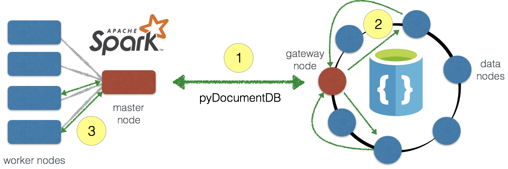
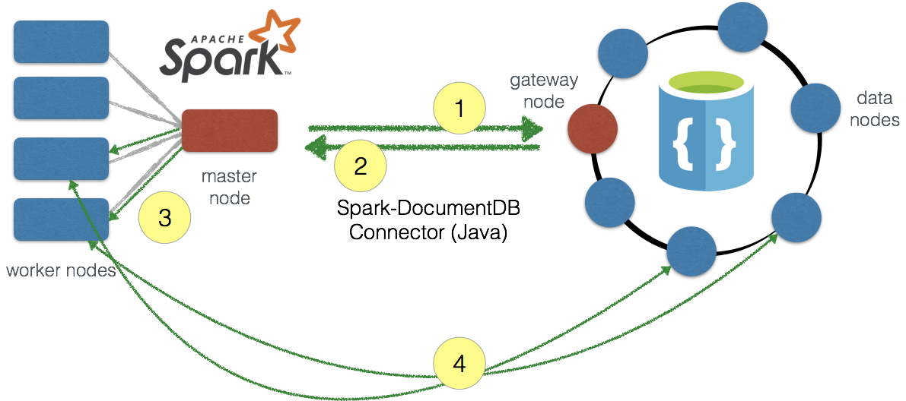
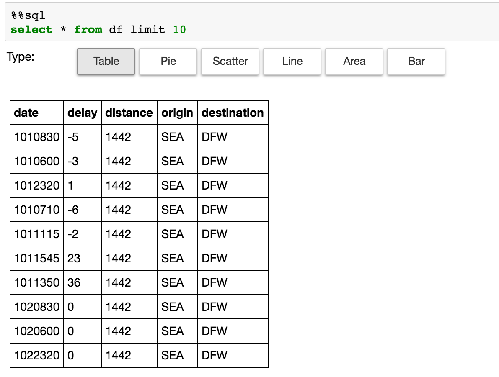
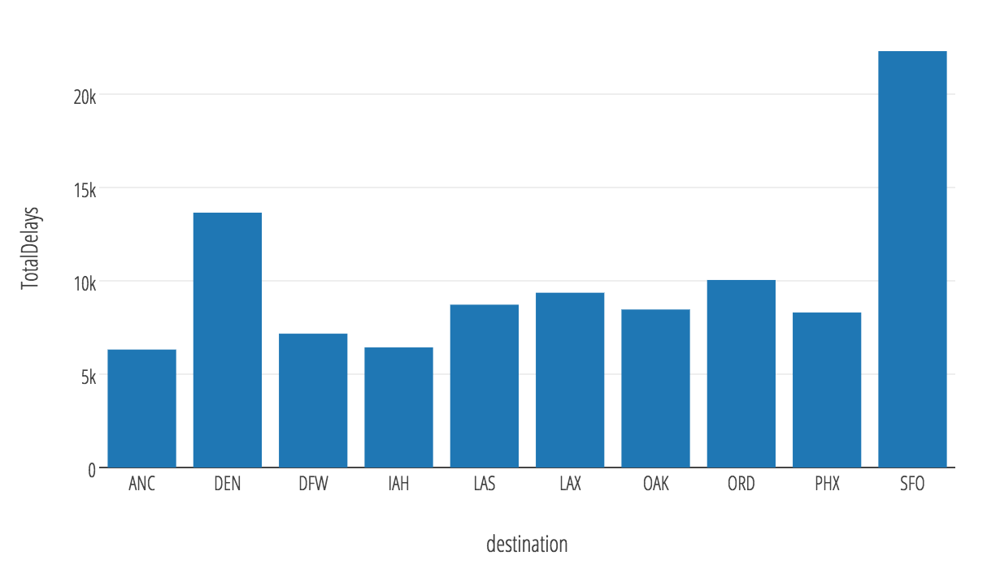
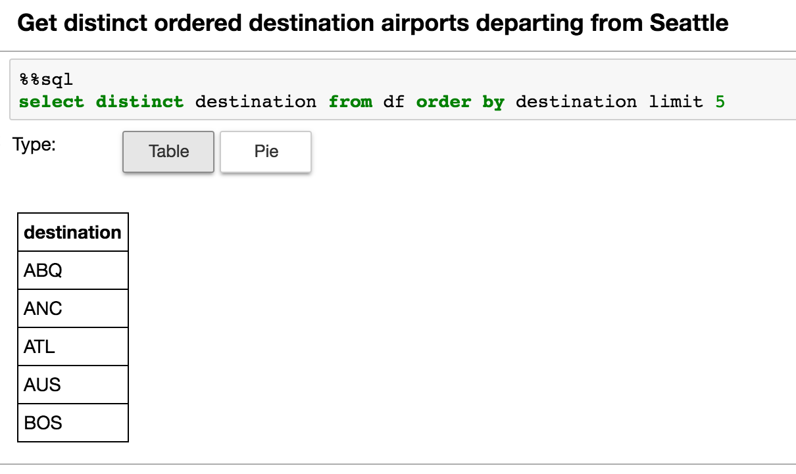
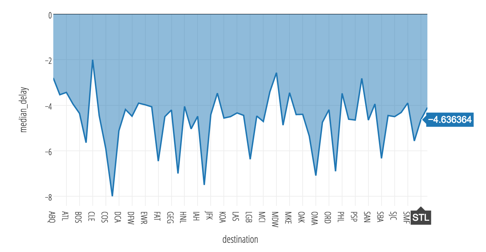

# Accelerate real-time big-data analytics with the Spark to DocumentDB connector

The Spark to DocumentDB connector enables Azure DocumentDB to act as an input source or output sink for Apache Spark jobs. Connecting [Spark](http://spark.apache.org/) to [DocumentDB](https://azure.microsoft.com/services/documentdb/) accelerates your ability to solve fast-moving data science problems, where data can be quickly persisted and queried using DocumentDB. The Spark to DocumentDB connector efficiently utilizes the native DocumentDB managed indexes and enables updateable columns when performing analytics, push-down predicate filtering against fast-changing globally distributed data, ranging from IoT, data science, and analytics scenarios. 

## Download

Get started by downloading the Spark to DocumentDB connector (preview) from the [azure-documentdb-spark](https://github.com/Azure/azure-documentdb-spark/) repo on GitHub.

## Connector components

The connector utilizes the following components:

* [DocumentDB](http://documentdb.com), Microsoft’s multi-tenant, [globally distributed database system](documentdb-distribute-data-globally.md) designed for the cloud. DocumentDB enables customers to provision and elastically scale both throughput and storage across any number of geographical regions. The service offers guaranteed low latency at the 99th percentile, a guaranteed 99.99% high availability, and [multiple well-defined consistency models](documentdb-consistency-levels.md) to developers.

* [Apache Spark](http://spark.apache.org/), which is a powerful open source processing engine built around speed, ease of use, and sophisticated analytics. 

* [Apache Spark on Azure HDInsight](../hdinsight/hdinsight-apache-spark-jupyter-spark-sql.md). You can deploy Apache Spark in the cloud for mission critical deployments using [Azure HDInsight](https://azure.microsoft.com/services/hdinsight/apache-spark/).

Officially supported versions:

| Component | Version |
|---------|-------|
|Apache Spark|2.0+|
| Scala| 2.11|
| Azure DocumentDB Java SDK | 1.9.6 |
 
This article helps you run some simple samples with Python (via pyDocumentDB) and the scala interface.

There are two approaches to connect Apache Spark and Azure DocumentDB:
- Use pyDocumentDB via the [Azure DocumentDB Python SDK](https://github.com/Azure/azure-documentdb-python).
- Create a Java-based Spark to DocumentDB connector utilizing the [Azure DocumentDB Java SDK](https://github.com/Azure/azure-documentdb-java).

## pyDocumentDB implementation 
The current [pyDocumentDB SDK](https://github.com/Azure/azure-documentdb-python) enables us to connect Spark to DocumentDB as shown in the following diagram:




### Data flow of the pyDocumentDB implementation

The data flow is as follows:

1. Connection is made from Spark master node to DocumentDB gateway node via pyDocumentDB.  Note, user only specifies Spark and DocumentDB connections, the fact that it connects to the respective master and gateway nodes is transparent to the user.
2. Query is made against DocumentDB (via the gateway node) where the query subsequently runs the query against the collection's partitions in the data nodes. The response for those queries is sent back to the gateway node and that resultset is returned to Spark master node.
3. Any subsequent queries (for example, against a Spark DataFrame) are sent to the Spark worker nodes for processing.

The important call out is that communication between Spark and DocumentDB is limited to the Spark master node and DocumentDB gateway nodes.  The queries go as fast as the transport layer is between these two nodes.

### Installing pyDocumentDB
You can install pyDocumentDB on your driver node using **pip**, for example:

```
pip install pyDocumentDB
```


### Connecting Spark to DocumentDB via pyDocumentDB 
In return for the simplicity of the communication transport, executing a query from Spark to DocumentDB using pyDocumentDB is relatively simple.

The following code snippet shows how to use pyDocumentDB within a Spark context.

```
# Import Necessary Libraries
import pydocumentdb
from pydocumentdb import document_client
from pydocumentdb import documents
import datetime

# Configuring the connection policy (allowing for endpoint discovery)
connectionPolicy = documents.ConnectionPolicy()
connectionPolicy.EnableEndpointDiscovery 
connectionPolicy.PreferredLocations = ["Central US", "East US 2", "Southeast Asia", "Western Europe","Canada Central"]


# Set keys to connect to DocumentDB 
masterKey = 'le1n99i1w5l7uvokJs3RT5ZAH8dc3ql7lx2CG0h0kK4lVWPkQnwpRLyAN0nwS1z4Cyd1lJgvGUfMWR3v8vkXKA==' 
host = 'https://doctorwho.documents.azure.com:443/'
client = document_client.DocumentClient(host, {'masterKey': masterKey}, connectionPolicy)
```

As noted in the code snippet:

* The DocumentDB Python SDK contains the all the necessary connection parameters including the preferred locations (that is, choosing which read replica in what priority order).
*  Import the necessary libraries and configure your **masterKey** and **host** to create the DocumentDB *client* (**pydocumentdb.document_client**).


### Executing Spark Queries via pyDocumentDB
The following examples use the DocumentDB instance created in the previous snippet using the specified read-only keys.  The following code snippet connects to the **airports.codes** collection (in the DoctorWho account as specified earlier) running a query to extract the airport cities in Washington state. 

```
# Configure Database and Collections
databaseId = 'airports'
collectionId = 'codes'

# Configurations the DocumentDB client will use to connect to the database and collection
dbLink = 'dbs/' + databaseId
collLink = dbLink + '/colls/' + collectionId

# Set query parameter
querystr = "SELECT c.City FROM c WHERE c.State='WA'"

# Query documents
query = client.QueryDocuments(collLink, querystr, options=None, partition_key=None)

# Query for partitioned collections
# query = client.QueryDocuments(collLink, query, options= { 'enableCrossPartitionQuery': True }, partition_key=None)

# Push into list `elements`
elements = list(query)
```

Once the query has been executed via **query**, the result is a **query_iterable.QueryIterable** that is converted into a Python list. A Python list can be easily converted into a Spark DataFrame using the following code:

```
# Create `df` Spark DataFrame from `elements` Python list
df = spark.createDataFrame(elements)
```

### Why use the pyDocumentDB to connect Spark to DocumentDB?
Connecting Spark to DocumentDB using pyDocumentDB is typically for scenarios where:

* You want to use python.
* You are returning a relatively small result set from DocumentDB to Spark.  Note that the underlying dataset within DocumentDB can be quite large. It is more that you are applying filters - that is running predicate filters - against your DocumentDB source.  

## Spark to DocumentDB connector

The Spark to DocumentDB connector utilizes the [Azure DocumentDB Java SDK](https://github.com/Azure/azure-documentdb-java) and moves data between the Spark worker nodes and DocumentDB as shown in the following diagram:



The data flow is as follows:

1. A connection is made from the Spark master node to the DocumentDB gateway node to obtain the partition map.  Note, the user only specifies the Spark and DocumentDB connections, the fact that it connects to the respective master and gateway nodes is transparent to the user.
2. This information is provided back to the Spark master node.  At this point, you should be able to parse the query to determine which partitions (and their locations) within DocumentDB you need to access.
3. This information is transmitted to the Spark worker nodes ...
4. Thus allowing the Spark worker nodes to connect directly to the DocumentDB partitions directly to extract the data that is needed and bring the data back to the Spark partitions within the Spark worker nodes.

The important call out is that communication between Spark and DocumentDB is significantly faster because the data movement is between the Spark worker nodes and the DocumentDB data nodes (partitions).

### Building the Spark to DocumentDB connector
Currently, the connector project uses maven. To build the connector without dependencies, you can run:
```
mvn clean package
```
You can also download the latest versions of the jar within the *releases* folder.

### Including the Azure DocumentDB Spark JAR
Prior to executing any code, you first need to include the Azure DocumentDB Spark JAR.  If you are using the **spark-shell**, then you can include the JAR using the **--jars** option.  

```
spark-shell --master $master --jars /$location/azure-documentdb-spark-0.0.1-jar-with-dependencies.jar
```

or if you want to execute the jar without dependencies:

```
spark-shell --master $master --jars /$location/azure-documentdb-spark-0.0.1.jar,/$location/azure-documentdb-1.9.6.jar
```

If you are using a notebook service such as Azure HDInsight Jupyter notebook service, you can use the **spark magic** commands:

```
%%configure
{ "jars": ["wasb:///example/jars/azure-documentdb-1.9.6.jar","wasb:///example/jars/azure-documentdb-spark-0.0.1.jar"],
  "conf": {
    "spark.jars.excludes": "org.scala-lang:scala-reflect"
   }
}
```

The **jars** command enables you to include the two jars needed for **azure-documentdb-spark** (itself and the Azure DocumentDB Java SDK) and excludes **scala-reflect** so it does not interfere with the Livy calls made (Jupyter notebook > Livy > Spark).

### Connecting Spark to DocumentDB using the connector
While the communication transport is a little more complicated, executing a query from Spark to DocumentDB using the connector is significantly faster.

The following code snippet shows how to use the connector within a Spark context.

```
// Import Necessary Libraries
import org.joda.time._
import org.joda.time.format._
import com.microsoft.azure.documentdb.spark.schema._
import com.microsoft.azure.documentdb.spark._
import com.microsoft.azure.documentdb.spark.config.Config

// Configure connection to your collection
val readConfig2 = Config(Map("Endpoint" -> "https://doctorwho.documents.azure.com:443/",
"Masterkey" -> "le1n99i1w5l7uvokJs3RT5ZAH8dc3ql7lx2CG0h0kK4lVWPkQnwpRLyAN0nwS1z4Cyd1lJgvGUfMWR3v8vkXKA==",
"Database" -> "DepartureDelays",
"preferredRegions" -> "Central US;East US2;",
"Collection" -> "flights_pcoll", 
"SamplingRatio" -> "1.0"))
 
// Create collection connection 
val coll = spark.sqlContext.read.DocumentDB(readConfig2)
coll.createOrReplaceTempView("c")
```

As noted in the code snippet:

- **azure-documentdb-spark** contains the all the necessary connection parameters including the preferred locations (for example, choosing which read replica in what priority order).
- Just import the necessary libraries and configure your masterKey and host to create the DocumentDB client.

### Executing Spark queries via the connector

The following example uses the DocumentDB instance created in the previous snippet using the specified read-only keys. The following code snippet connects to the DepartureDelays.flights_pcoll collection (in the DoctorWho account as specified earlier) running a query to extract the flight delay information of flights departing from Seattle.

```
// Queries
var query = "SELECT c.date, c.delay, c.distance, c.origin, c.destination FROM c WHERE c.origin = 'SEA'"
val df = spark.sql(query)

// Run DF query (count)
df.count()

// Run DF query (show)
df.show()
```

### Why use the Spark to DocumentDB connector implementation?

Connecting Spark to DocumentDB using the connector is typically for scenarios where:

* You want to use Scala (and update it to include a Python wrapper as noted in [Issue 3: Add Python wrapper and examples](https://github.com/Azure/azure-documentdb-spark/issues/3)).
* You have a large amount of data to transfer between Apache Spark and DocumentDB.

To give you an idea of the query performance difference, see the [Query Test Runs wiki](https://github.com/Azure/azure-documentdb-spark/wiki/Query-Test-Runs).

## Distributed aggregation example
This section provides some examples of how you can do distributed aggregations and analytics using Apache Spark and Azure DocumentDB together.  Note, Azure DocumentDB already has support for aggregations, as discussed in the [Planet scale aggregates with Azure DocumentDB blog](https://azure.microsoft.com/blog/planet-scale-aggregates-with-azure-documentdb/), so here is how you can take it to the next level with Apache Spark.

Note, these aggregations are in reference to the [Spark to DocumentDB Connector notebook](https://github.com/Azure/azure-documentdb-spark/blob/master/samples/notebooks/Spark-to-DocumentDB_Connector.ipynb).

### Connecting to flights sample data
For these aggregations examples, we are accessing some flight performance data stored in our **DoctorWho** DocumentDB database.  To connect to it, you need to utilize the following code snippet:

```
// Import Spark to DocumentDB connector
import com.microsoft.azure.documentdb.spark.schema._
import com.microsoft.azure.documentdb.spark._
import com.microsoft.azure.documentdb.spark.config.Config

// Connect to DocumentDB Database
val readConfig2 = Config(Map("Endpoint" -> "https://doctorwho.documents.azure.com:443/",
"Masterkey" -> "le1n99i1w5l7uvokJs3RT5ZAH8dc3ql7lx2CG0h0kK4lVWPkQnwpRLyAN0nwS1z4Cyd1lJgvGUfMWR3v8vkXKA==",
"Database" -> "DepartureDelays",
"preferredRegions" -> "Central US;East US 2;",
"Collection" -> "flights_pcoll", 
"SamplingRatio" -> "1.0"))

// Create collection connection 
val coll = spark.sqlContext.read.DocumentDB(readConfig2)
coll.createOrReplaceTempView("c")
```

With this snippet, we are also going to run a base query that transfers the filtered set of data we want from DocumentDB to Spark (where the latter can perform distributed aggregates).  In this case, we are asking for flights departing from Seattle (SEA).

```
// Run, get row count, and time query
val originSEA = spark.sql("SELECT c.date, c.delay, c.distance, c.origin, c.destination FROM c WHERE c.origin = 'SEA'")
originSEA.createOrReplaceTempView("originSEA")
```

The following results were generated by running the queries from the Jupyter notebook service.  Note that all the code snippets are generic and not specific to any service.

### Running LIMIT and COUNT queries
Just like you're used to in SQL/Spark SQL, let's start off with a **LIMIT** query:



The next query being a simple and fast **COUNT** query:


### GROUP BY query
In this next set, now we can easily run **GROUP BY** queries against our DocumentDB database:

```
select destination, sum(delay) as TotalDelays 
from originSEA 
group by destination 
order by sum(delay) desc limit 10
```



### DISTINCT, ORDER BY query
And here is a **DISTINCT, ORDER BY** query:



### Continue the flight data analysis
You can use the following example queries to continue analysis of the flight data:

#### Top 5 delayed destinations (cities) departing from Seattle
```
select destination, sum(delay) 
from originSEA
where delay < 0 
group by destination 
order by sum(delay) limit 5
```


#### Calculate median delays by destination cities departing from Seattle
```
select destination, percentile_approx(delay, 0.5) as median_delay 
from originSEA
where delay < 0 
group by destination 
order by percentile_approx(delay, 0.5)
```



## Next steps

If you haven't already, download the Spark to DocumentDB connector from the [azure-documentdb-spark](https://github.com/Azure/azure-documentdb-spark) GitHub repository and explore the additional resources in the repo:

* [Distributed Aggregations Examples](https://github.com/Azure/azure-documentdb-spark/wiki/Aggregations-Examples)
* [Sample Scripts and Notebooks](https://github.com/Azure/azure-documentdb-spark/tree/master/samples)

You may also want to review the [Apache Spark SQL, DataFrames, and Datasets Guide](http://spark.apache.org/docs/latest/sql-programming-guide.html) and the [Apache Spark on Azure HDInsight](../hdinsight/hdinsight-apache-spark-jupyter-spark-sql.md) article.


