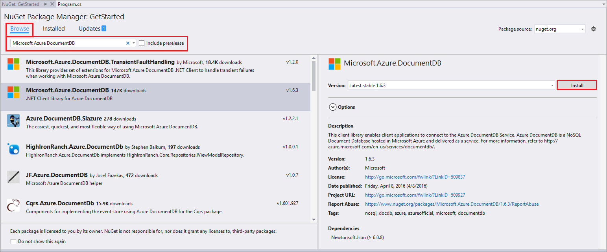

# Create a partitioned Azure Cosmos DB collection

*This is a work in progress*

In this tutorial, you'll learn how to create an Azure Cosmos DB account and perform the following basic operations using the [DocumentDB .NET SDK](documentdb-sdk-dotnet.md):

* Connect to your account
* Create a database
* Create a partitioned collection
* Create JSON documents
* Replace a document
* Delete a document
* Delete a database

## Prerequisites
Please make sure you have the following:

* An active Azure account. If you don't have one, you can sign up for a [free account](https://azure.microsoft.com/free/). 
    * Alternatively, you can use the [Azure DocumentDB Emulator](documentdb-nosql-local-emulator.md) for this tutorial.
* [Visual Studio](http://www.visualstudio.com/).

## <a id="GetSolution"></a>Get the sample app

Download or clone the sample app [documentdb-dotnet-getting-started](https://github.com/Azure-Samples/documentdb-dotnet-getting-started) app from github. To clone the app, open a git terminal window, such as git bash, and `CD` to a working directory. Then run the following commands to clone the sample repository. 

```bash
git clone https://github.com/Azure-Samples/documentdb-dotnet-getting-started
```

To restore the references to the DocumentDB .NET SDK in Visual Studio, right-click the **GetStarted** solution in Solution Explorer, and then click **Enable NuGet Package Restore**. Next, in the App.config file, update the EndpointUrl and AuthorizationKey values as described in [Connect to a DocumentDB account](#Connect).

That's it, build it and you're on your way!

## Create database account

If you already have an account you want to use, you can skip ahead to [Setup your Visual Studio Solution](#SetupVS). If you are using the DocumentDB Emulator, please follow the steps at [Azure DocumentDB Emulator](documentdb-nosql-local-emulator.md) to setup the emulator and skip ahead to [Setup your Visual Studio Solution](#SetupVS).

[!INCLUDE [documentdb-create-dbaccount](../../includes/documentdb-create-dbaccount.md)]

## <a id="SetupVS"></a>Setup your Visual Studio solution
1. Open **Visual Studio** on your computer.
2. On the **File** menu, select **New**, and then choose **Project**.
3. In the **New Project** dialog, select **Templates** / **Visual C#** / **Console Application**, name your project, and then click **OK**.
   
4. In the **Solution Explorer**, right click on your new console application, which is under your Visual Studio solution, and then click **Manage NuGet Packages...**
    
    
5. In the **Nuget** tab, click **Browse**, and type **azure documentdb** in the search box.
6. Within the results, find **Microsoft.Azure.DocumentDB** and click **Install**.
   The package ID for the DocumentDB Client Library is [Microsoft.Azure.DocumentDB](https://www.nuget.org/packages/Microsoft.Azure.DocumentDB).
   

    If you get a messages about reviewing changes to the solution, click **OK**. If you get a message about license acceptance, click **I accept**.

## <a id="Connect"></a>Add references to your project
First, add these references to the beginning of your C# application, in the Program.cs file:

    using System.Net;
    using Microsoft.Azure.Documents;
    using Microsoft.Azure.Documents.Client;
    using Newtonsoft.Json;

## Connect your app to your Azure Cosmos DB account

Add these two constants and your *client* variable underneath your public class *Program*.

    public class Program
    {
        private const string EndpointUrl = "<your endpoint URL>";
        private const string PrimaryKey = "<your primary key>";
        private DocumentClient client;

Next, head back to the [Azure Portal](https://portal.azure.com) to retrieve your endpoint URL and primary key. The endpoint URL and primary key are necessary for your application to understand where to connect to, and for DocumentDB to trust your application's connection.

In the Azure Portal, navigate to your DocumentDB account, and then click **Keys**.

Copy the URI from the portal and paste it into `<your endpoint URL>` in the program.cs file. Then copy the PRIMARY KEY from the portal and paste it into `<your primary key>`.

![Screen shot of the Azure Portal used by the NoSQL tutorial to create a C# console application. Shows a DocumentDB account, with the ACTIVE hub highlighted, the KEYS button highlighted on the DocumentDB account blade, and the URI, PRIMARY KEY and SECONDARY KEY values highlighted on the Keys blade][keys]

## Instantiate the DocumentClient

Create a new instance of the **DocumentClient**.

```csharp
this.client = new DocumentClient(new Uri(EndpointUrl), PrimaryKey);
```

## Create a database

Create an Azure Cosmos DB [database](documentdb-resources.md#databases) by using the [CreateDatabaseIfNotExistsAsync](https://msdn.microsoft.com/library/microsoft.azure.documents.client.documentclient.createdatabaseifnotexistsasync.aspx) method of the **DocumentClient** class from the [DocumentDB .NET SDK](documentdb-sdk-dotnet.md). A database is the logical container of JSON document storage partitioned across collections.

```csharp
await this.client.CreateDatabaseIfNotExistsAsync(new Database { Id = "FamilyDB" });
```

## <a id="CreateColl"></a>Create a collection
> [!WARNING]
> **CreateDocumentCollectionIfNotExistsAsync** will create a new collection with reserved throughput, which has pricing implications. For more details, please visit our [pricing page](https://azure.microsoft.com/pricing/details/documentdb/).
> 
> 

A [collection](documentdb-resources.md#collections) can be created by using the [CreateDocumentCollectionIfNotExistsAsync](https://msdn.microsoft.com/library/microsoft.azure.documents.client.documentclient.createdocumentcollectionifnotexistsasync.aspx) method of the **DocumentClient** class. A collection is a container of JSON documents and associated JavaScript application logic.

```csharp
await this.client.CreateDocumentCollectionIfNotExistsAsync(UriFactory.CreateDatabaseUri("FamilyDB"), new DocumentCollection { Id = "FamilyCollection" });
```

## <a id="CreateDoc"></a>Create JSON documents
A [document](documentdb-resources.md#documents) can be created by using the [CreateDocumentAsync](https://msdn.microsoft.com/library/microsoft.azure.documents.client.documentclient.createdocumentasync.aspx) method of the **DocumentClient** class. Documents are user defined (arbitrary) JSON content. We can now insert one or more documents. If you already have data you'd like to store in your database, you can use DocumentDB's [Data Migration tool](documentdb-import-data.md) to import the data into a database.

First, we need to create a **Family** class that will represent objects stored within DocumentDB in this sample. We will also create **Parent**, **Child**, **Pet**, **Address** subclasses that are used within **Family**. Note that documents must have an **Id** property serialized as **id** in JSON. 

```csharp
    public class Family
    {
        [JsonProperty(PropertyName = "id")]
        public string Id { get; set; }
        public string LastName { get; set; }
        public Parent[] Parents { get; set; }
        public Child[] Children { get; set; }
        public Address Address { get; set; }
        public bool IsRegistered { get; set; }
        public override string ToString()
        {
            return JsonConvert.SerializeObject(this);
        }
    }

    public class Parent
    {
        public string FamilyName { get; set; }
        public string FirstName { get; set; }
    }

    public class Child
    {
        public string FamilyName { get; set; }
        public string FirstName { get; set; }
        public string Gender { get; set; }
        public int Grade { get; set; }
        public Pet[] Pets { get; set; }
    }

    public class Pet
    {
        public string GivenName { get; set; }
    }

    public class Address
    {
        public string State { get; set; }
        public string County { get; set; }
        public string City { get; set; }
    }
```

Copy and paste the **CreateFamilyDocumentIfNotExists** method underneath your **Address** class.

```
     private async Task CreateFamilyDocumentIfNotExists(string databaseName, string collectionName, Family family)
    {
        try
        {
            await this.client.ReadDocumentAsync(UriFactory.CreateDocumentUri(databaseName, collectionName, family.Id));
            this.WriteToConsoleAndPromptToContinue("Found {0}", family.Id);
        }
        catch (DocumentClientException de)
        {
            if (de.StatusCode == HttpStatusCode.NotFound)
            {
                await this.client.CreateDocumentAsync(UriFactory.CreateDocumentCollectionUri(databaseName, collectionName), family);
                this.WriteToConsoleAndPromptToContinue("Created Family {0}", family.Id);
            }
            else
            {
                throw;
            }
        }
    }
```

## Insert JSON documents into the collection 

And insert two documents, one each for the Andersen Family and the Wakefield Family.

```csharp
    Family andersenFamily = new Family
    {
            Id = "Andersen.1",
            LastName = "Andersen",
            Parents = new Parent[]
            {
                    new Parent { FirstName = "Thomas" },
                    new Parent { FirstName = "Mary Kay" }
            },
            Children = new Child[]
            {
                    new Child
                    {
                            FirstName = "Henriette Thaulow",
                            Gender = "female",
                            Grade = 5,
                            Pets = new Pet[]
                            {
                                    new Pet { GivenName = "Fluffy" }
                            }
                    }
            },
            Address = new Address { State = "WA", County = "King", City = "Seattle" },
            IsRegistered = true
    };

    await this.CreateFamilyDocumentIfNotExists("FamilyDB", "FamilyCollection", andersenFamily);

    Family wakefieldFamily = new Family
    {
            Id = "Wakefield.7",
            LastName = "Wakefield",
            Parents = new Parent[]
            {
                    new Parent { FamilyName = "Wakefield", FirstName = "Robin" },
                    new Parent { FamilyName = "Miller", FirstName = "Ben" }
            },
            Children = new Child[]
            {
                    new Child
                    {
                            FamilyName = "Merriam",
                            FirstName = "Jesse",
                            Gender = "female",
                            Grade = 8,
                            Pets = new Pet[]
                            {
                                    new Pet { GivenName = "Goofy" },
                                    new Pet { GivenName = "Shadow" }
                            }
                    },
                    new Child
                    {
                            FamilyName = "Miller",
                            FirstName = "Lisa",
                            Gender = "female",
                            Grade = 1
                    }
            },
            Address = new Address { State = "NY", County = "Manhattan", City = "NY" },
            IsRegistered = false
    };

    await this.CreateFamilyDocumentIfNotExists("FamilyDB", "FamilyCollection", wakefieldFamily);
```


## <a id="ReplaceDocument"></a>Replace JSON document
DocumentDB supports replacing JSON documents.  
 
```csharp
    private async Task ReplaceFamilyDocument(string databaseName, string collectionName, string familyName, Family updatedFamily)
    {
         await this.client.ReplaceDocumentAsync(UriFactory.CreateDocumentUri(databaseName, collectionName, familyName), updatedFamily);
         this.WriteToConsoleAndPromptToContinue("Replaced Family {0}", familyName);
    }
```

## <a id="DeleteDocument"></a>Delete JSON documents
DocumentDB supports deleting JSON documents.  

```csharp
    private async Task DeleteFamilyDocument(string databaseName, string collectionName, string documentName)
    {
         await this.client.DeleteDocumentAsync(UriFactory.CreateDocumentUri(databaseName, collectionName, documentName));
         Console.WriteLine("Deleted Family {0}", documentName);
    }
```

## <a id="DeleteDatabase"></a>Delete the database
Deleting the created database will remove the database and all children resources (collections, documents, etc.).

```csharp
    await this.client.DeleteDatabaseAsync(UriFactory.CreateDatabaseUri("FamilyDB"));
```

## Next steps
* Want a more complex ASP.NET MVC NoSQL tutorial? See [Build a web application with ASP.NET MVC using DocumentDB](documentdb-dotnet-application.md).
* Want to perform scale and performance testing with DocumentDB? See [Performance and Scale Testing with Azure DocumentDB](documentdb-performance-testing.md)
* Learn how to [monitor a DocumentDB account](documentdb-monitor-accounts.md).
* Run queries against our sample dataset in the [Query Playground](https://www.documentdb.com/sql/demo).
* Learn more about the programming model in the Develop section of the [DocumentDB documentation page](https://azure.microsoft.com/documentation/services/documentdb/).

[documentdb-create-account]: documentdb-create-account.md
[keys]: media/documentdb-get-started/nosql-tutorial-keys.png
