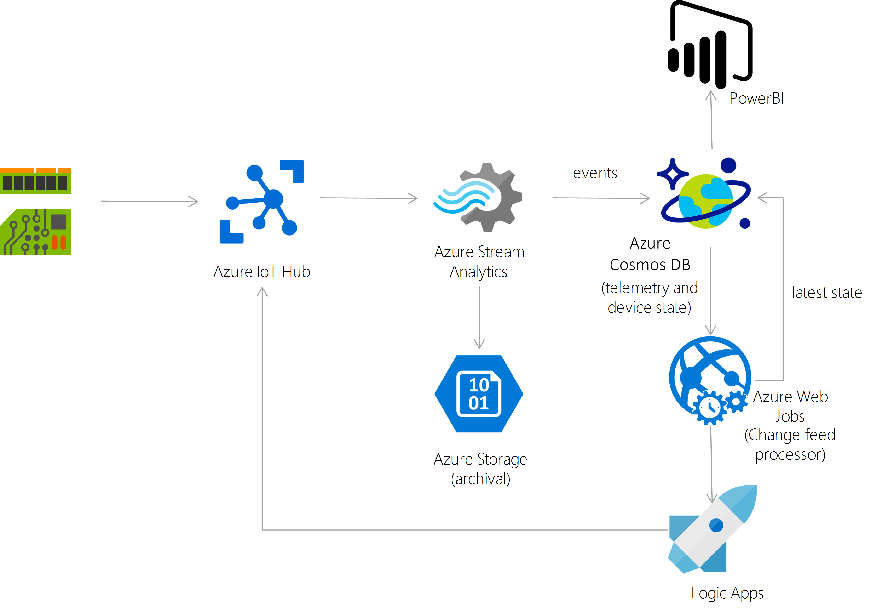
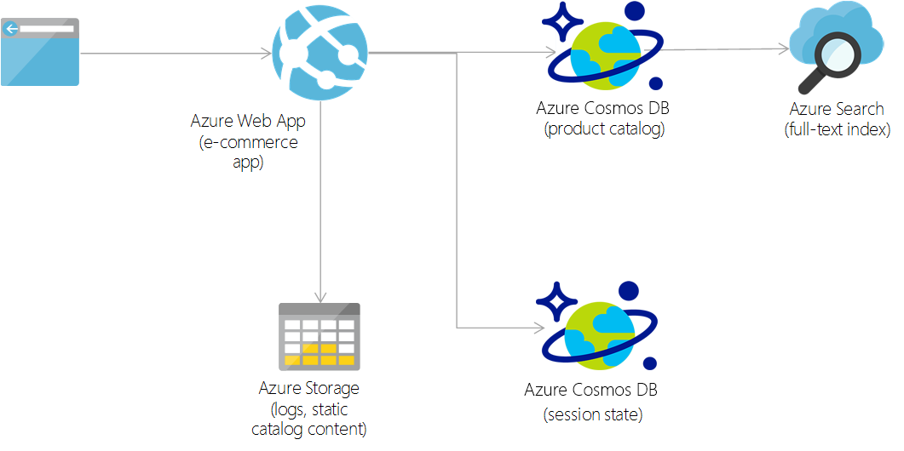
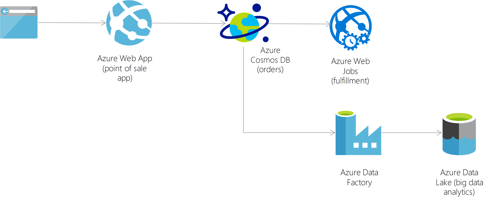
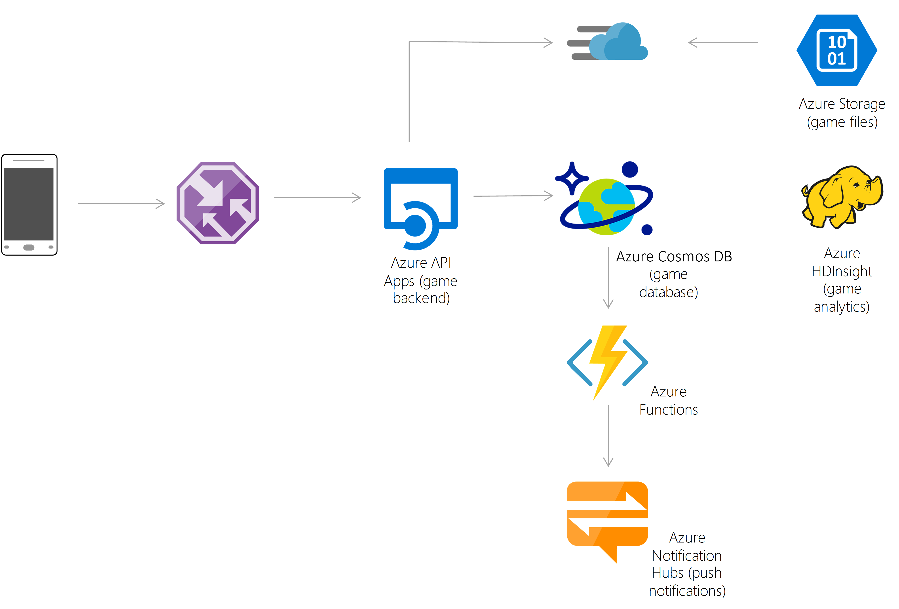
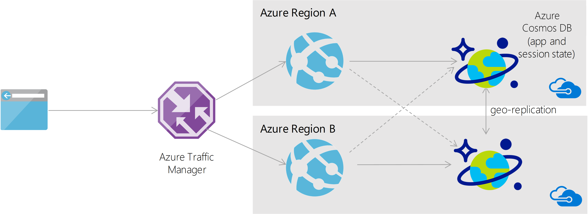

# Common DocumentDB use cases
This article provides an overview of several common use cases for DocumentDB.  The recommendations in this article serve as a starting point as you develop your application with DocumentDB.   

After reading this article, you'll be able to answer the following questions: 

* What are the common use cases for DocumentDB?
* What are the benefits of using DocumentDB for retail applications?
* What are the benefits of using DocumentDB as a data store for Internet of Things (IoT) systems?
* What are the benefits of using DocumentDB for web and mobile applications?

## Common use cases for DocumentDB
Azure DocumentDB is a general purpose NoSQL database that is used in a wide range of applications and use cases. It is a good choice for any application that needs low order-of-millisecond response times, and needs to scale rapidly. The following are some attributes of DocumentDB that make it well-suited for high-performance applications.

* DocumentDB natively partitions your data for high availability and scalability.
* DocumentDB's has SSD backed storage with low-latency order-of-millisecond response times.
* DocumentDB's support for consistency levels like eventual, session, and bounded-staleness allows for low cost-to performance-ratio. 
* DocumentDB has a flexible data-friendly pricing model that meters storage and throughput independently.
* DocumentDB's reserved throughput model allows you to think in terms of number of reads/writes instead of CPU/memory/IOPs of the underlying hardware.
* DocumentDB's design lets you scale to massive request volumes in the order of billions of requests per day.

These attributes are beneficial in web, mobile, gaming, and IoT applications that need low response times and need to handle massive amounts of reads and writes. 

## IoT and telematics
IoT use cases commonly share some patterns in how they ingest, process, and store data.  First, these systems need to ingest bursts of data from device sensors of various locales. Next, these systems process and analyze streaming data to derive real-time insights. The data is then archived to cold storage for batch analytics. Microsoft Azure offers rich services that can be applied for IoT use cases including Azure Event Hubs, Azure DocumentDB, Azure Stream Analytics, Azure Notification Hub, Azure Machine Learning, Azure HDInsight, and PowerBI. 

Bursts of data can be ingested by Azure Event Hubs as it offers high throughput data ingestion with low latency. Data ingested that needs to be processed for real-time insight can be funneled to Azure Stream Analytics for real-time analytics. Data can be loaded into DocumentDB for adhoc querying. Once the data is loaded into DocumentDB, the data is ready to be queried.  The data in DocumentDB can be used as reference data as part of real-time analytics. In addition, data can further be refined and processed by connecting DocumentDB data to HDInsight for Pig, Hive or Map/Reduce jobs.  Refined data is then loaded back to DocumentDB for reporting.   

For a sample IoT solution using DocumentDB, EventHubs and Storm, see the [hdinsight-storm-examples repository on GitHub](https://github.com/hdinsight/hdinsight-storm-examples/).

For more information on Azure offerings for IoT, see [Create the Internet of Your Things](http://www.microsoft.com/en-us/server-cloud/internet-of-things.aspx). 

## Retail and marketing
DocumentDB is commonly used in the retail industry for storing catalog data. Catalog data usage scenarios involve storing and querying a set of attributes for entities such as people, places, and products.  Some examples of catalog data are user accounts, product catalogs, device registries for IoT, and bill of materials systems.  Attributes for this data may vary and can change over time to fit application requirements.  

Consider an example of a product catalog for an automotive parts supplier. Every part may have its own attributes in addition to the common attributes that all parts share.  Furthermore, attributes for a specific part can change the following year when a new model is released.  As a JSON document store, DocumentDB supports flexible schemas and hierarchical data, and thus it is well suited for storing product catalog data.

 In addition, data stored in DocumentDB can be integrated with HDInsight for big data analytics via Pig, Hive, or Map/Reduce jobs. For details on the Hadoop Connector for DocumentDB, see [Run a Hadoop job with DocumentDB and HDInsight](documentdb-run-hadoop-with-hdinsight.md).

 
## Gaming
The database tier is a crucial component of gaming applications. Modern games perform graphical processing on mobile/console clients, but rely on the cloud to deliver customized and personalized content like in-game stats, social media integration, and high-score leaderboards. Games often require single-millisecond latencies for reads and writes to provide an engaging in-game experience. A game database needs to be fast and be able to handle massive spikes in request rates during new game launches and feature updates.

DocumentDB is used by games like [The Walking Dead: No Man's Land](https://azure.microsoft.com//blog/the-walking-dead-no-mans-land-game-soars-to-1-with-azure-documentdb/) by [Next Games](http://www.nextgames.com/), and [Halo 5: Guardians](https://azure.microsoft.com/blog/how-halo-5-guardians-implemented-social-gameplay-using-azure-documentdb/). DocumentDB provides the following benefits to game developers:

* DocumentDB allows performance to be scaled up or down elastically. This allows games to handle updating profile and stats from dozens to millions of simultaneous gamers by making a single API call.
* DocumentDB supports millisecond reads and writes to help avoid any lags during game play.
* DocumentDB's automatic indexing allows for filtering against multiple different properties in real-time, e.g. locate players by their internal player IDs, or their GameCenter, Facebook, Google IDs, or query based on player membership in a guild. This is possible without building complex indexing or sharding infrastructure.
* Social features including in-game chat messages, player guild memberships, challenges completed, high-score leaderboards, and social graphs are easier to implement with a flexible schema.
* DocumentDB as a managed platform-as-a-service (PaaS) required minimal setup and management work to allow for rapid iteration, and reduce time to market.

## Web and mobile applications
DocumentDB is commonly used within web and mobile applications, and is particularly well suited for modeling social interactions, integrating with third-party services, and for building rich personalized experiences. 

### Social Applications
A common use case for DocumentDB is to store and query user generated content (UGC) for web and mobile applications, particularly social media applications. Some examples of UGC are chat sessions, tweets, blog posts, ratings, and comments. Often, the UGC in social media applications is a blend of free form text, properties, tags, and relationships that are not bounded by rigid structure. Content such as chats, comments, and posts can be stored in DocumentDB without requiring transformations or complex object to relational mapping layers.  Data properties can be added or modified easily to match requirements as developers iterate over the application code, thus promoting rapid development.  

Applications that integrate with third-party social networks must respond to changing schemas from these networks. As data is automatically indexed by default in DocumentDB, data is ready to be queried at any time. Hence, these applications have the flexibility to retrieve projections as per their respective needs.

Many of the social applications run at global scale and can exhibit unpredictable usage patterns. Flexibility in scaling the data store is essential as the application layer scales to match usage demand.  You can scale out by adding additional data partitions under a DocumentDB account.  In addition, you can also create additional DocumentDB accounts across multiple regions. For DocumentDB service region availability, see [Azure Regions](https://azure.microsoft.com/regions/#services).

### Personalization
Nowadays, modern applications come with complex views and experiences. These are typically dynamic, catering to user preferences or moods and branding needs. Hence, applications need to be able to retrieve personalized settings effectively to render UI elements and experiences quickly. 

JSON is an effective format to represent UI layout data as it is not only lightweight, but also can be easily interpreted by JavaScript. DocumentDB offers tunable consistency levels that allow fast reads with low latency writes. Hence, storing UI layout data including personalized settings as JSON documents in DocumentDB is an effective means to get this data across the wire.

## Next steps
To get started with DocumentDB, you can create an [account](https://azure.microsoft.com/pricing/free-trial/) and then follow our [learning path](https://azure.microsoft.com/documentation/learning-paths/documentdb/) to learn about DocumentDB and find the information you need. 

Or, if you'd like to read more about customers using DocumentDB, the following customer stories are available:

* [Sulekha.com](https://customers.microsoft.com/en-US/story/sulekha-uses-azure-documentdb-to-connect-customers-and-businesses-across-india). Sulekha uses Azure DocumentDB to connect customers and businesses across India  .
* [NewOrbit](https://customers.microsoft.com/en-US/story/neworbit-takes-flight-with-azure-documentdb). NewOrbit takes flight with Azure DocumentDB.
* [Affinio](https://customers.microsoft.com/en-US/doclink/affinio-switches-from-aws-to-azure-documentdb-to-harness-social-data-at-scale). Affinio switches from AWS to Azure DocumentDB to harness social data at scale.
* [Next Games](https://azure.microsoft.com//blog/the-walking-dead-no-mans-land-game-soars-to-1-with-azure-documentdb/). The Walking Dead: No Man's Land game soars to #1 supported by Azure DocumentDB.
* [Halo](https://azure.microsoft.com/blog/how-halo-5-guardians-implemented-social-gameplay-using-azure-documentdb/). How Halo 5 implemented social gameplay using Azure DocumentDB.
* [Cortana Analytics Gallery](https://azure.microsoft.com/blog/cortana-analytics-gallery-a-scalable-community-site-built-on-azure-documentdb/). Cortana Analytics Gallery - a scalable community site built on Azure DocumentDB.
* [Breeze](https://customers.microsoft.com/Pages/CustomerStory.aspx?recid=18602). Leading Integrator Gives Multinational Firms Global Insight in Minutes with Flexible Cloud Technologies.
* [News Republic](https://customers.microsoft.com/Pages/CustomerStory.aspx?recid=18639). Adding intelligence to the news to provide information with purpose for engaged citizens. 
* [SGS International](https://customers.microsoft.com/Pages/CustomerStory.aspx?recid=18653). For consistent color across the globe, major brands turn to SGS. And SGS turns to Azure.
* [Telenor](https://customers.microsoft.com/Pages/CustomerStory.aspx?recid=18608). Global leader Telenor uses the cloud to move with the speed of a startup. 
* [XOMNI](https://customers.microsoft.com/Pages/CustomerStory.aspx?recid=18667). The store of the future runs on speedy search and the easy flow of data.
* [Nucleo](https://customers.microsoft.com/story/azure-based-software-platform-breaks-down-barriers-bet). Azure-based software platform breaks down barriers between businesses and customers
* [Weka](https://customers.microsoft.com/story/weka-smart-fridge-improves-vaccine-management-so-more-people-can-be-protected-against-diseases). Weka Smart Fridge improves vaccine management so more people can be protected against diseases
* [Orange Tribes](https://customers.microsoft.com/en-US/story/theres-more-to-that-food-app-than-meets-the-eye-or-the-mouth). There’s more to that food app than meets the eye, or the mouth.
* [Real Madrid](https://customers.microsoft.com/en-US/story/real-madrid-brings-the-stadium-closer-to-450-million-f). Real Madrid brings the stadium closer to 450 million fans around the globe, with the Microsoft Cloud.
* [Tuku](https://customers.microsoft.com/en-US/story/tuku-makes-car-buying-fun-with-help-from-azure-services). TUKU makes car buying fun with help from Azure services 
