<properties
	pageTitle="DocumentDB Document Explorer, to view JSON | Microsoft Azure"
	description="Learn about the DocumentDB Document Explorer, an Azure Portal tool to view JSON, edit, create, and upload JSON documents with DocumentDB, a NoSQL document database."
    keywords="view json"
	services="documentdb"
	authors="AndrewHoh"
	manager="jhubbard"
	editor="monicar"
	documentationCenter=""/>

<tags
	ms.service="documentdb"
	ms.workload="data-services"
	ms.tgt_pltfrm="na"
	ms.devlang="na"
	ms.topic="article"
	ms.date="06/28/2016"
	ms.author="anhoh"/>

# View, edit, create, and upload JSON documents using DocumentDB Document Explorer

This article provides an overview of the [Microsoft Azure DocumentDB](https://azure.microsoft.com/services/documentdb/) Document Explorer, an Azure portal tool that enables you to view, edit, create, upload, and filter JSON documents with DocumentDB. 

Note that Document Explorer is not enabled on DocumentDB accounts with protocol support for MongoDB. This page will be updated when this feature is enabled.

## Launch Document Explorer

1. In the Azure portal, in the Jumpbar, click **DocumentDB Accounts**. If **DocumentDB Accounts** is not visible, click **Browse** and then click **DocumentDB Accounts**.

2. At the top of the **DocumentDB account** blade, click **Document Explorer**. 
 
	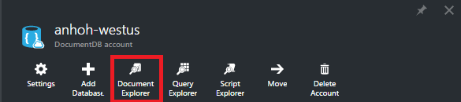

 	>[AZURE.NOTE] Query Explorer also appears on the database and collection blades.

    In the **Document Explorer** blade, the **Databases** and **Collections** drop-down lists are pre-populated depending on the context in which you launched Document Explorer. 

	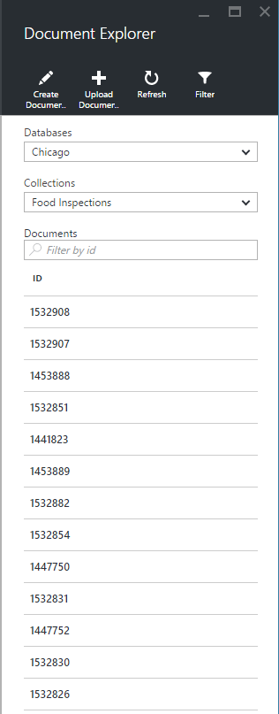

## Create a document

1. [Launch Document Explorer](#launch-document-explorer).

2. In the **Document Explorer** blade, click **Create Document**. 

    A minimal JSON snippet is provided in the **Document** blade.

	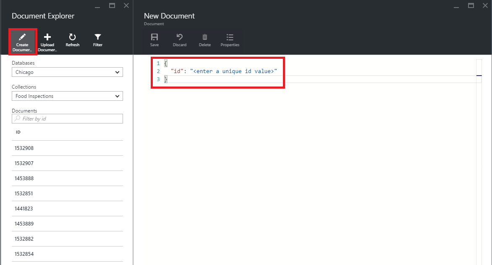

2. In the **Document** blade, type or paste in the content of the JSON document you wish to create, and then click **Save** to commit your document to the database and collection specified in the **Document Explorer** blade.

	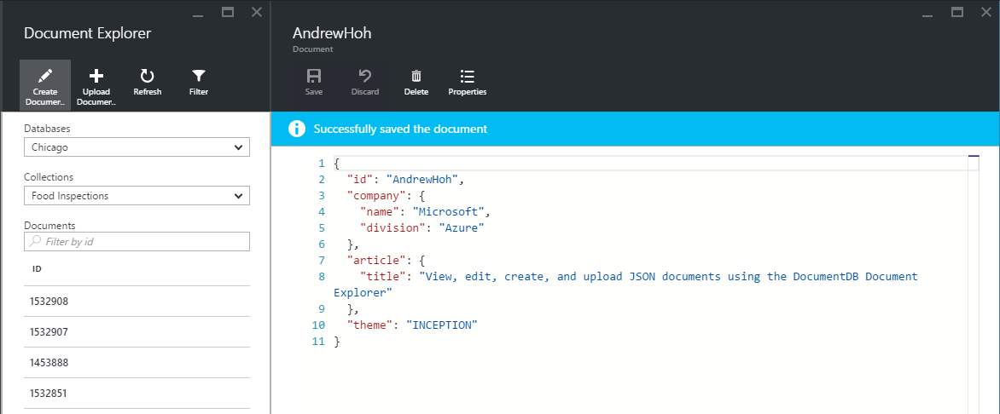

	> [AZURE.NOTE] If you do not provide an "id" property, then Document Explorer automatically adds an id property and generates a GUID as the id value.

    If you already have data from JSON files, MongoDB, SQL Server, CSV files, Azure Table storage, Amazon DynamoDB, HBase, or from other DocumentDB collections, you can use DocumentDB's [data migration tool](documentdb-import-data.md) to quickly import your data.

## Edit a document

1. [Launch Document Explorer](#launch-document-explorer).

2. To edit an existing document, select it in the **Document Explorer** blade, edit the document in the **Document** blade, and then click **Save**.

    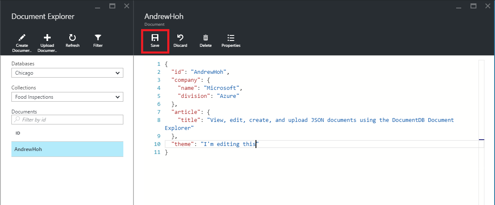

    If you're editing a document and decide that you want to discard the current set of edits, simply click **Discard** in the **Document** blade, confirm the discard action, and the previous state of the document is reloaded.

    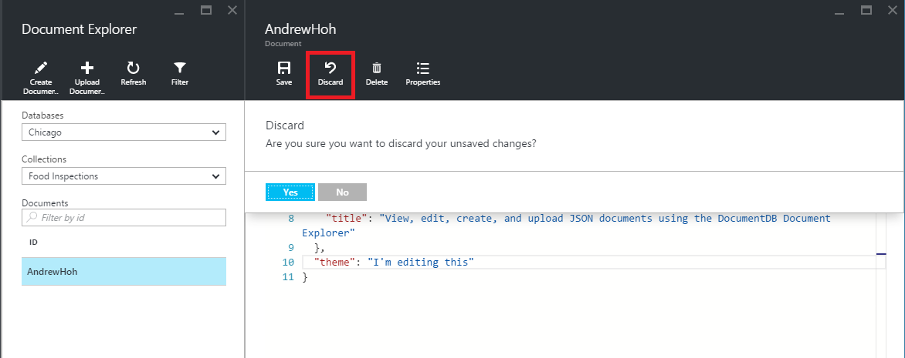

## Delete a document

1. [Launch Document Explorer](#launch-document-explorer).

2. Select the document in **Document Explorer**, click **Delete**, and then confirm the delete. After confirming, the document is immediately removed from the Document Explorer list.

	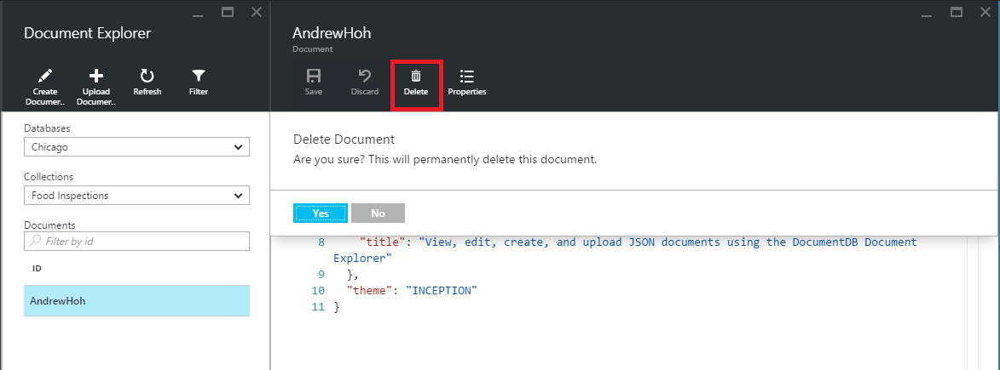

## Work with JSON documents

Document Explorer validates that any new or edited document contains valid JSON.  You can even view JSON errors by hovering over the incorrect section to get details about the validation error.

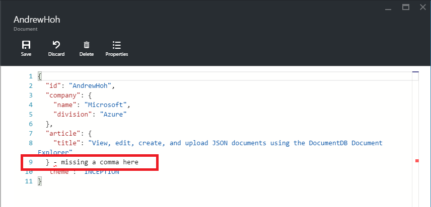

Additionally, Document Explorer prevents you from saving a document with invalid JSON content.

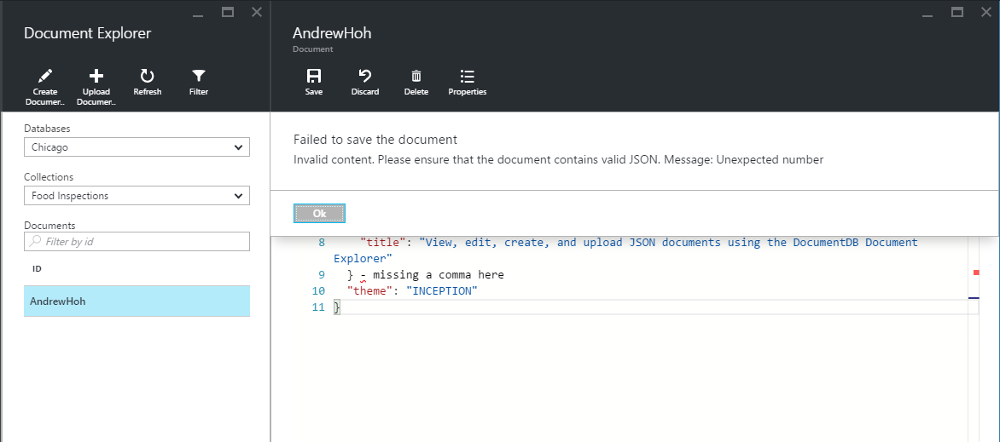

Finally, Document Explorer allows you to easily view the system properties of the currently loaded document by clicking the **Properties** command.

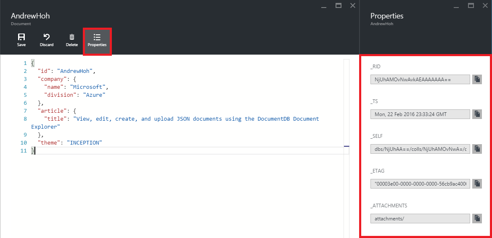

> [AZURE.NOTE] The timestamp (_ts) property is internally represented as epoch time, but Document Explorer displays the value in a human readable GMT format.

## Filter documents
Document Explorer supports a number of navigation options and advanced settings.

By default, Document Explorer loads up to the first 100 documents in the selected collection, by their created date from earliest to latest.  You can load additional documents (in batches of 100) by selecting the **Load more** option at the bottom of the Document Explorer blade. You can choose which documents to load through the **Filter** command.

1. [Launch Document Explorer](#launch-document-explorer).

2. At the top of the **Document Explorer** blade, click **Filter**.  

    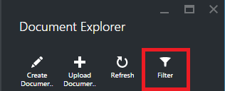
  
3.  The filter settings appear below the command bar. In the filter settings, provide a WHERE clause and/or an ORDER BY clause, and then click **Filter**.

	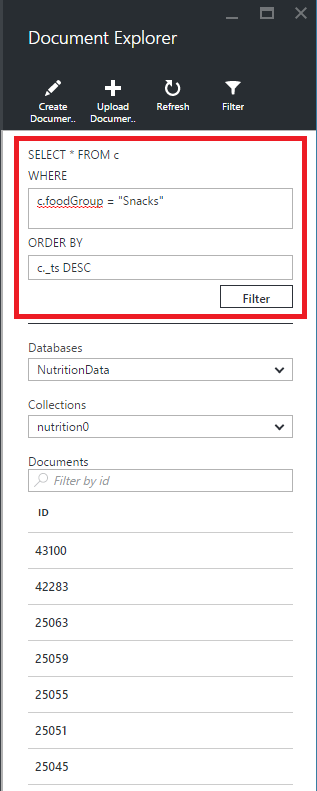

	Document Explorer automatically refreshes the results with documents matching the filter query. Read more about the DocumentDB SQL grammar in the [SQL query and SQL syntax](documentdb-sql-query.md) article or print a copy of the [SQL query cheat sheet](documentdb-sql-query-cheat-sheet.md).

    The **Database** and **Collection** drop-down list boxes can be used to easily change the collection from which documents are currently being viewed without having to close and re-launch Document Explorer.  

    Document Explorer also supports filtering the currently loaded set of documents by their id property.  Simply type in the Documents Filter by id box.

	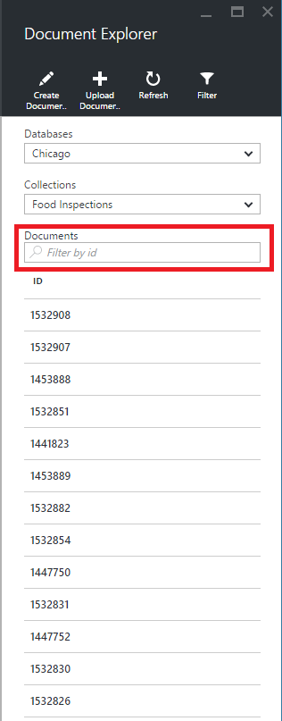

	The results in the Document Explorer list are filtered based on your supplied criteria.

	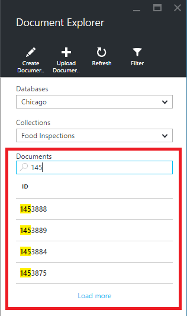

	> [AZURE.IMPORTANT] The Document Explorer filter functionality only filters from the ***currently*** loaded set of documents and does not perform a query against the currently selected collection.

4. To refresh the list of documents loaded by Document Explorer, click **Refresh** at the top of the blade.

	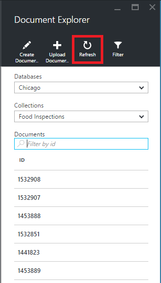

## Bulk add documents

Document Explorer supports bulk ingestion of one or more existing JSON documents, up to 100 JSON files per upload operation.  

1. [Launch Document Explorer](#launch-document-explorer).

2. To start the upload process, click **Upload Document**.

	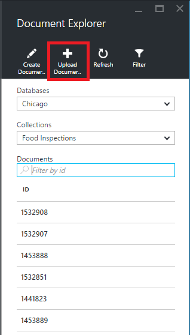

    The **Upload Document** blade opens. 

2. Click the browse button to open a file explorer window, select one or more JSON documents to upload, and then click **Open**.

	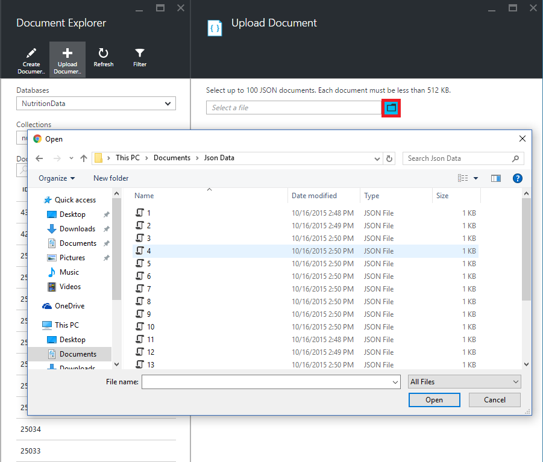

	> [AZURE.NOTE] Document Explorer currently supports up to 100 JSON documents per individual upload operation.

3. Once you're satisfied with your selection, click the **Upload** button.  The documents are automatically added to the Document Explorer grid and the upload results are displayed as the operation progresses. Import failures are reported for individual files.

	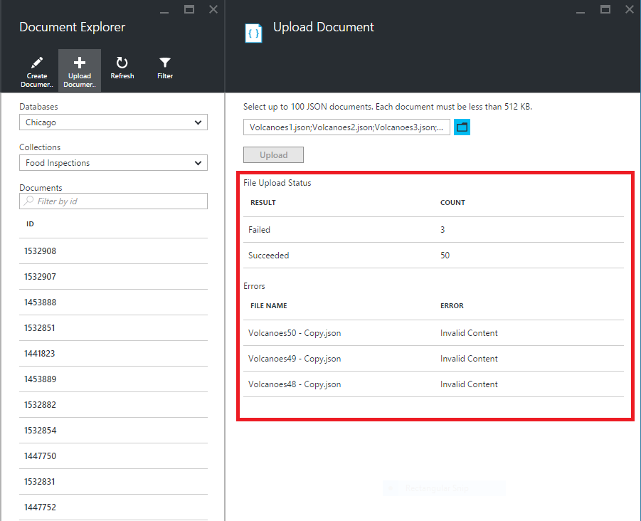

4. Once the operation is complete, you can select up to another 100 documents to upload.

## Work with JSON documents outside the portal

The Document Explorer in the Azure portal is just one way to work with documents in DocumentDB. You can also work with documents using the [REST API](https://msdn.microsoft.com/library/azure/mt489082.aspx) or the [client SDKs](documentdb-sdk-dotnet.md). For example code, see the [.NET SDK document examples](documentdb-dotnet-samples.md#document-examples) and the [Node.js SDK document examples](documentdb-nodejs-samples.md#document-examples).

If you need to import or migrate files from another source (JSON files, MongoDB, SQL Server, CSV files, Azure Table storage, Amazon DynamoDB, or HBase), you can use the DocumentDB [data migration tool](documentdb-import-data.md) to quickly import your data to DocumentDB.

## Next steps

To learn more about the DocumentDB SQL grammar supported in Document Explorer, see the [SQL query and SQL syntax](documentdb-sql-query.md) article or print out the [SQL query cheat sheet](documentdb-sql-query-cheat-sheet.md).

The [Learning path](https://azure.microsoft.com/documentation/learning-paths/documentdb/) is also a useful resource to guide you as you learn more about DocumentDB. 
