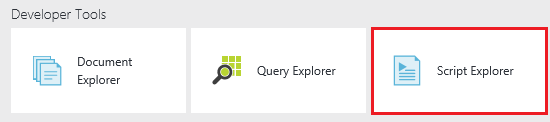
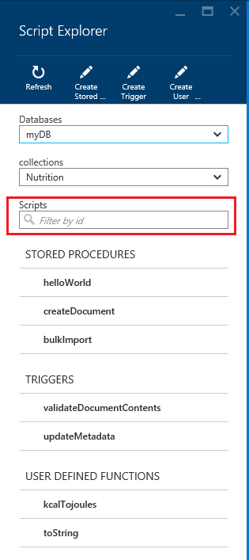

<properties
	pageTitle="View stored procedures, triggers, and user-defined functions using the DocumentDB Script Explorer | Microsoft Azure"
	description="Learn about the DocumentDB Script Explorer, an Azure Preview portal tool to view DocumentDB server-side programming artifacts including stored procedures, triggers, and user-defined functions."
	services="documentdb"
	authors="stephbaron"
	manager="johnmac"
	editor="monicar"
	documentationCenter=""/>

<tags
	ms.service="documentdb"
	ms.workload="data-services"
	ms.tgt_pltfrm="na"
	ms.devlang="na"
	ms.topic="get-started-article" 
	ms.date="06/10/2015"
	ms.author="stbaro"/>

# View stored procedures, triggers, and user-defined functions using the DocumentDB Script Explorer

This article provides an overview of the [Microsoft Azure DocumentDB](http://azure.microsoft.com/services/documentdb/) Script Explorer, an Azure Preview portal tool that enables you to view DocumentDB server-side programming artifacts including stored procedures, triggers, and user-defined functions.  Read more about DocumentDB server-side programming [here](documentdb-programming.md).

By completing this tutorial, you'll be able to answer the following questions:  

-	How can I easily view DocumentDB stored procedures via a web browser?
-	How can I easily view DocumentDB triggers via a web browser?
-	How can I easily view DocumentDB user-defined functions via a web browser?

## Launch and navigate Script Explorer

Script Explorer can be launched from any of the DocumentDB account, database, and collection blades.  

1. At the top of the DocumentDB account or database blade, simply click the **Script Explorer** command.

	
 
2. Alternatively, near the bottom of each blade is a **Developer Tools** lens that contains the **Script Explorer** part.

	

2. Simply click the command or the part to launch Script Explorer.

	
The **Database** and **Collection** drop-down list boxes are pre-populated depending on the context in which you launch Script Explorer.  For example, if you launch from a database blade, then the current database is pre-populated.  If you launch from a collection blade, then the current collection is pre-populated.

	

3. The **Database** and **Collection** drop-down list boxes can be used to easily change the collection from which scripts are currently being viewed without having to close and re-launch Script Explorer.  

4. Script Explorer also supports filtering the currently loaded set of scripts by their id property.  Simply type in the filter box.

	

	And the results in the Script Explorer list are filtered based on your supplied criteria.

	

	> [AZURE.IMPORTANT] The Script Explorer filter functionality only filters from the ***currently*** loaded set of scripts and does not automatically refresh the currently selected collection.

5. To refresh the list of scripts loaded by Script Explorer, simply click the **Refresh** command at the top of the blade.

	

## View stored Procedures, triggers, and user-defined functions with  Script Explorer

Script Explorer allows you to easily view DocumentDB server-side programming artifacts.  

- Simply click the script in which you're interested to view its contents.

	

- Script Explorer also allows you to easily view the system properties of the currently loaded script by clicking the **Properties** command.

	

	> [AZURE.NOTE] The timestamp (_ts) property is internally represented as epoch time, but Script Explorer displays the value in a human readable GMT format.

## Next steps

To learn more about DocumentDB, click [here](http://azure.com/docdb).
 