<properties
	pageTitle="DocumentDB Script Explorer, a JavaScript editor | Microsoft Azure"
	description="Learn about the DocumentDB Script Explorer, an Azure Portal tool to manage DocumentDB server-side programming artifacts including stored procedures, triggers, and user-defined functions."
	keywords="javascript editor"
	services="documentdb"
	authors="AndrewHoh"
	manager="jhubbard"
	editor="monicar"
	documentationCenter=""/>

<tags
	ms.service="documentdb"
	ms.workload="data-services"
	ms.tgt_pltfrm="na"
	ms.devlang="na"
	ms.topic="article"
	ms.date="06/28/2016"
	ms.author="anhoh"/>

# Create and run stored procedures, triggers, and user-defined functions using the DocumentDB Script Explorer

This article provides an overview of the [Microsoft Azure DocumentDB](https://azure.microsoft.com/services/documentdb/) Script Explorer, which is a JavaScript editor in the Azure portal that enables you to view and execute DocumentDB server-side programming artifacts including stored procedures, triggers, and user-defined functions. Read more about DocumentDB server-side programming in the [Stored procedures, database triggers, and UDFs](documentdb-programming.md) article.

## Launch Script Explorer

1. In the Azure portal, in the Jumpbar, click **DocumentDB Accounts**. If **DocumentDB Accounts** is not visible, click **Browse** and then click **DocumentDB Accounts**.

2. At the top of the **DocumentDB Accounts** blade, click **Script Explorer**.

	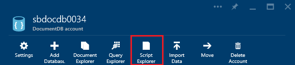
 
    >[AZURE.NOTE] Script Explorer also appears on the database and collection blades.

    The **Database** and **Collection** drop-down list boxes are pre-populated depending on the context in which you launch Script Explorer.  For example, if you launch from a database blade, then the current database is pre-populated.  If you launch from a collection blade, then the current collection is pre-populated.

	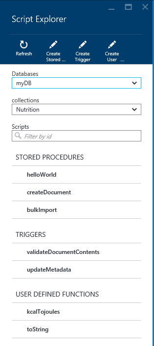

4.  Use the **Database** and **Collection** drop-down list boxes to easily change the collection from which scripts are currently being viewed without having to close and re-launch Script Explorer.  

5. Script Explorer also supports filtering the currently loaded set of scripts by their id property.  Simply type in the filter box and the results in the Script Explorer list are filtered based on your supplied criteria.

	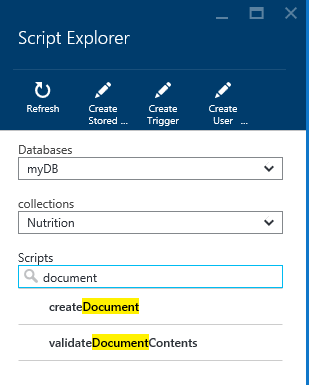

	> [AZURE.IMPORTANT] The Script Explorer filter functionality only filters from the ***currently*** loaded set of scripts and does not automatically refresh the currently selected collection.

5. To refresh the list of scripts loaded by Script Explorer, simply click the **Refresh** command at the top of the blade.

	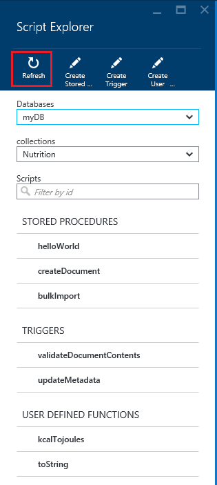

## Create, view, and edit stored procedures, triggers, and user-defined functions

Script Explorer allows you to easily perform CRUD operations on DocumentDB server-side programming artifacts.  

- To create a script, simply click on the applicable create command within script explorer, provide an id, enter the contents of the script, and click **Save**.

	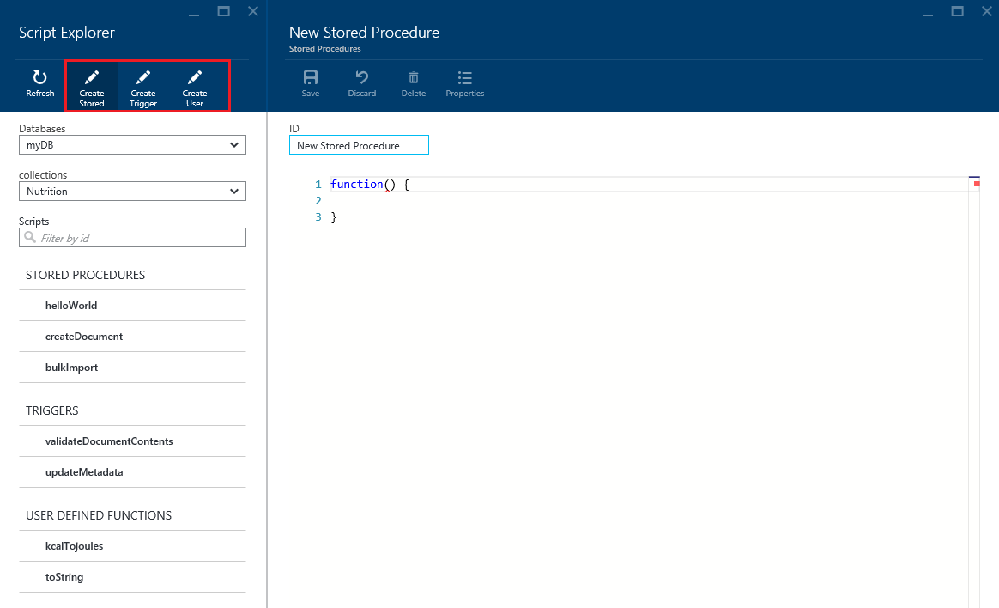

- When creating a trigger, you must also specify the trigger type and trigger operation

	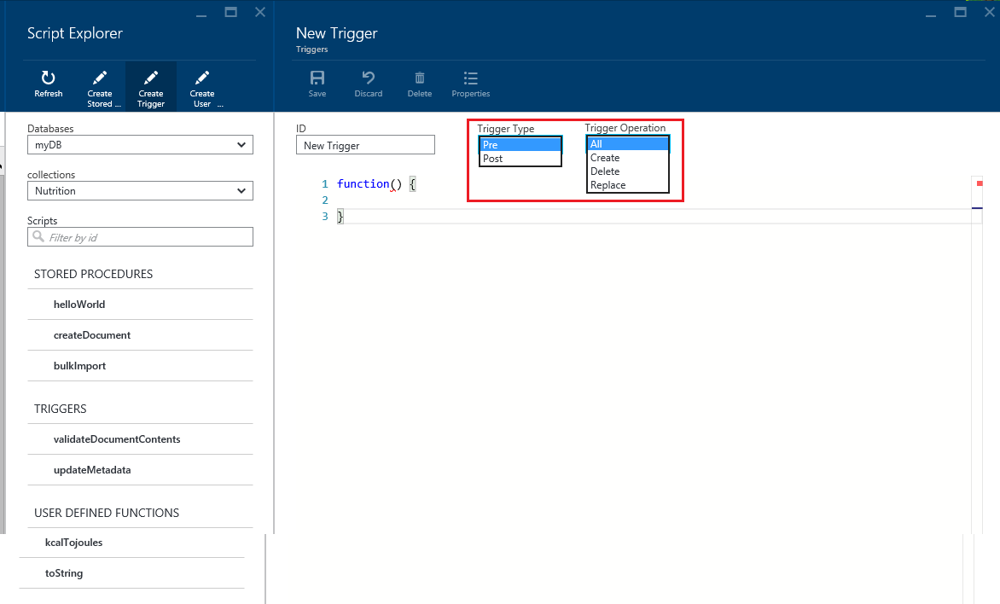

- To view a script, simply click the script in which you're interested.

	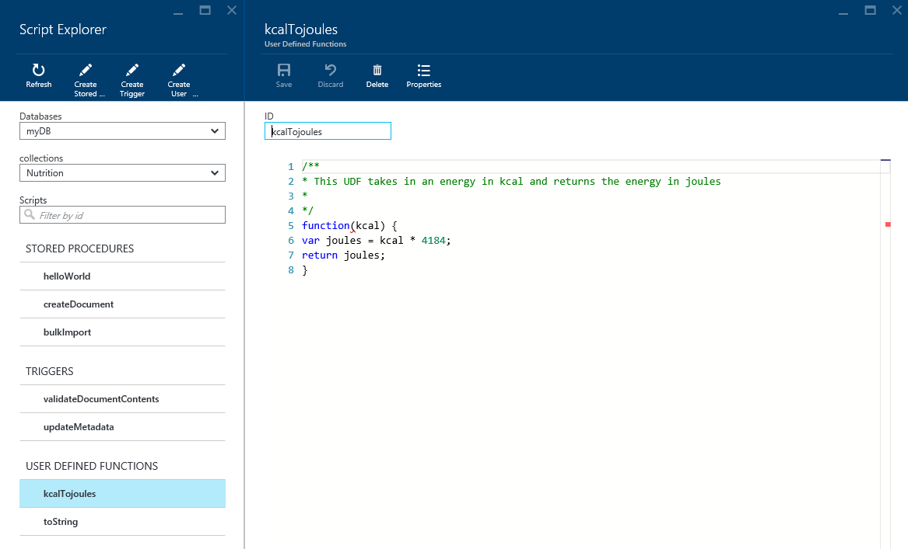

- To edit a script, simply make the desired changes in the JavaScript editor and click **Save**.

	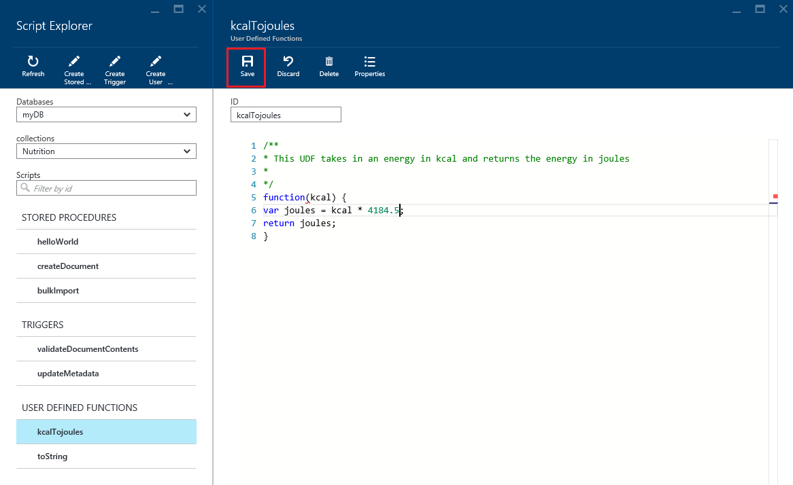

- To discard any pending changes to a script, simply click the **Discard** command.

	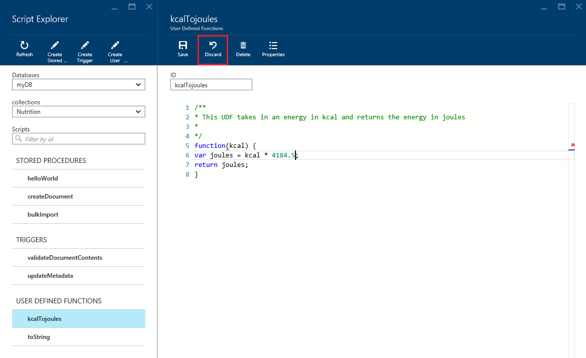

- Script Explorer also allows you to easily view the system properties of the currently loaded script by clicking the **Properties** command.

	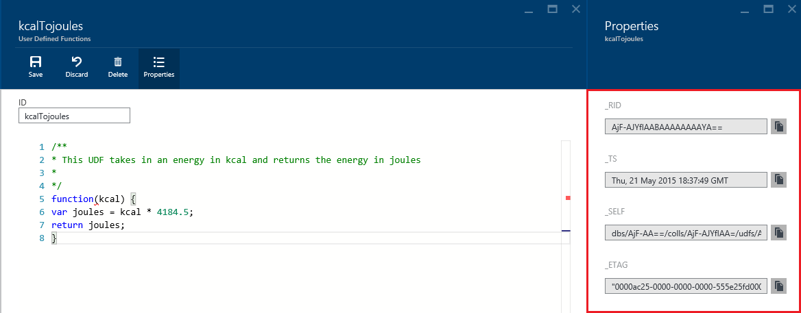

	> [AZURE.NOTE] The timestamp (_ts) property is internally represented as epoch time, but Script Explorer displays the value in a human readable GMT format.

- To delete a script, select it in Script Explorer and click the **Delete** command.

	

- Confirm the delete action by clicking **Yes** or cancel the delete action by clicking **No**.

	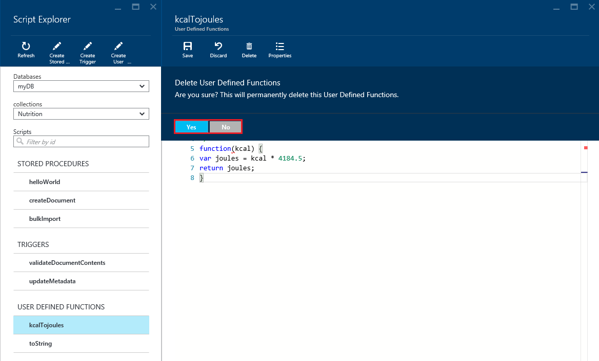

## Execute a stored procedure

> [AZURE.WARNING] Executing stored procedures in Script Explorer is not yet supported for server side partitioned collections. For more information, visit [Partitioning and Scaling in DocumentDB](documentdb-partition-data.md).

Script Explorer allows you to execute server-side stored procedures from the Azure portal.

- When opening a new create stored procedure blade, a default script (*prefix*) will already be provided. In order to run the *prefix* script or your own script, add an *id* and *inputs*. For stored procedures that accept multiple parameters, all inputs must be within an array (e.g. *["foo", "bar"]*).

	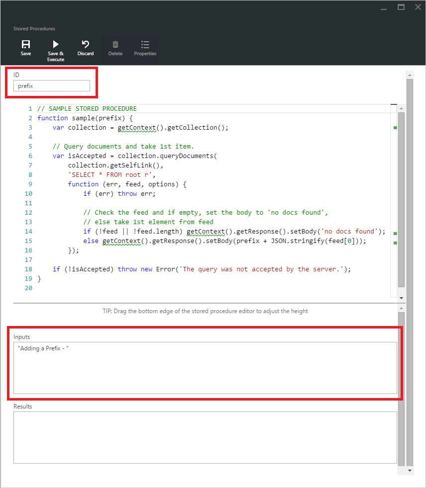

- To execute a stored procedure, simply click on the **Save & Execute** command within script editor pane.

	> [AZURE.NOTE] The **Save & Execute** command will save your stored procedure before executing, which means it will overwrite the previously saved version of the stored procedure.

- Successful stored procedure executions will have a *Successfully saved and executed the stored procedure* status and the returned results will be populated in the *Results* pane.

	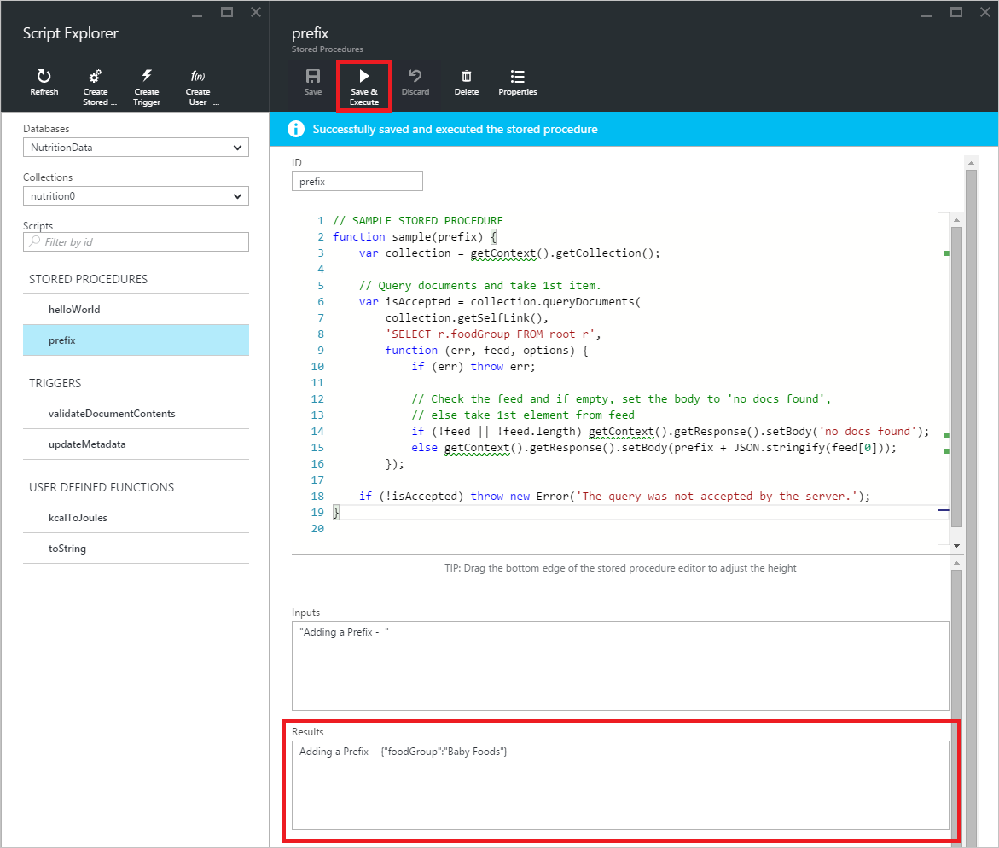

- If the execution encounters an error, the error will be populated in the *Results* pane.

	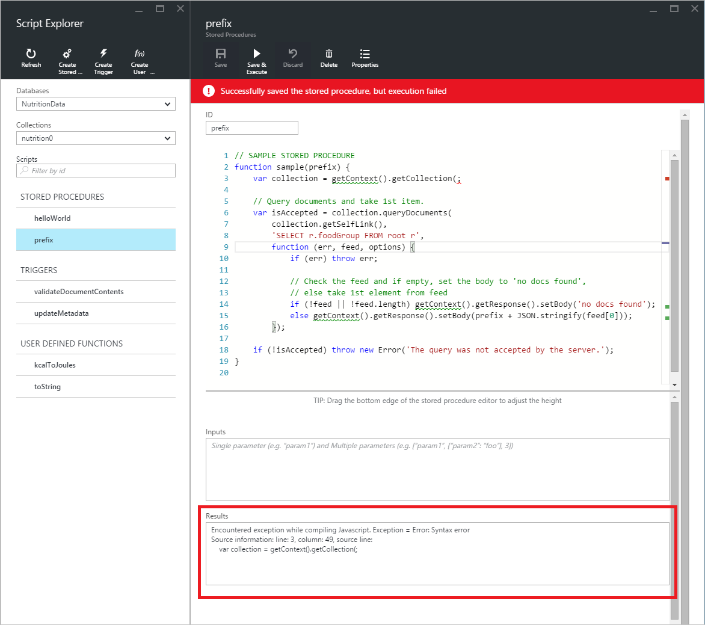

## Work with scripts outside the portal

The Script Explorer in the Azure portal is just one way to work with stored procedures, triggers, and user-defined functions in DocumentDB. You can also work with scripts using the the REST API and the [client SDKs](documentdb-sdk-dotnet.md). The REST API documentation includes samples for working with [stored procedures using REST](https://msdn.microsoft.com/library/azure/mt489092.aspx), [user defined functions using REST](https://msdn.microsoft.com/library/azure/dn781481.aspx), and [triggers using REST](https://msdn.microsoft.com/library/azure/mt489116.aspx). Samples are also available showing how to [work with scripts using C#](documentdb-dotnet-samples.md#server-side-programming-examples) and [work with scripts using Node.js](documentdb-nodejs-samples.md#server-side-programming-examples).

## Next steps

Learn more about DocumentDB server-side programming in the [Stored procedures, database triggers, and UDFs](documentdb-programming.md) article.

The [Learning path](https://azure.microsoft.com/documentation/learning-paths/documentdb/) is also a useful resource to guide you as you learn more about DocumentDB.  
