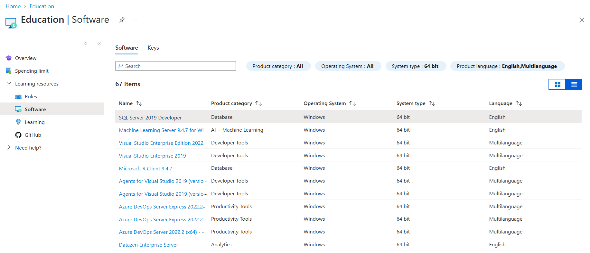

# Download software developer tools

Students who have an active Azure for Students subscription and/or are part of the Azure Dev Tools for Teaching program can download certain software developer tools for free on the Education Hub. Have your students follow the procedure in this article to download the tools from the Azure Education Hub.

## Download instructions for students

1. Open a browser and go to the [Education Hub](https://portal.azure.com/#blade/Microsoft_Azure_Education/EducationMenuBlade/software).
1. Sign in with you account that is associated with Azure for Students or Azure Dev Tools for Teaching
2. Navigate to the **Software** blade in the Education Hub
3. Select any of the software developer tools in the software blade to open the download pane.
4. Read the software information to make sure that the software is compatible with your computer system.
5. Select **Download**.
6. Follow the on-screen instructions to download and install the software.

## Related content

- [Resolve sign-in problems](troubleshoot-login.md)
- [Get an overview of the Azure for Students program](azure-students-program.md)
- [Get an overview of the Azure for Students Starter program](azure-students-starter-program.md)
- [Access Microsoft Learn training materials](/training/)
- [Get answers to frequently asked questions](./program-faq.yml)
