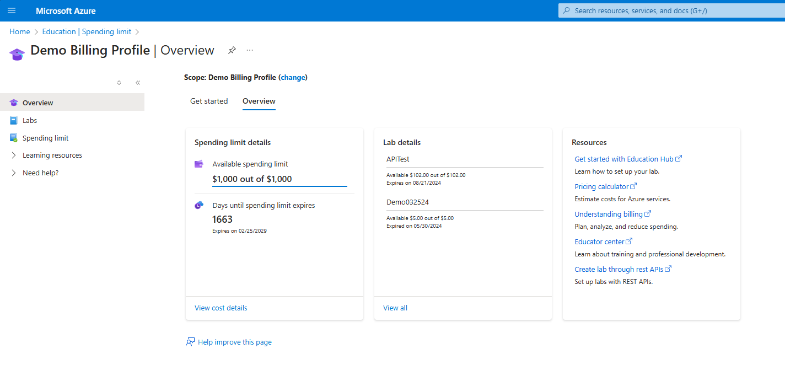

# Manage your academic sponsorship in the Azure Education Hub

> [!WARNING]
> This offer requires assistance from your Microsoft sales representative. Self-service signup is not available.

Your main landing page in the Azure Education Hub is the **Overview** page. This page contains all the relevant information about your academic sponsorship, such as the number of labs that you established and your total running credit allocated and used from those labs. It also displays other resources available to help you get started with allocating credits and tracking your spend.

## Overview page

Spending limit shows how much monetary cap you can allocate to students in the labs you create.
Lab details shows the labs that you have created with details such as how much students have spent and the expiration date.

## Next step

> [!div class="nextstepaction"]
> [Set up a course, allocate credit, and invite students](create-assignment-allocate-credit.md)
