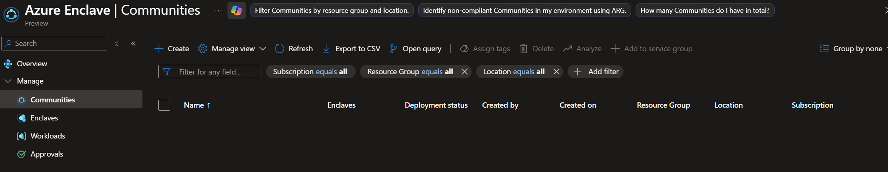
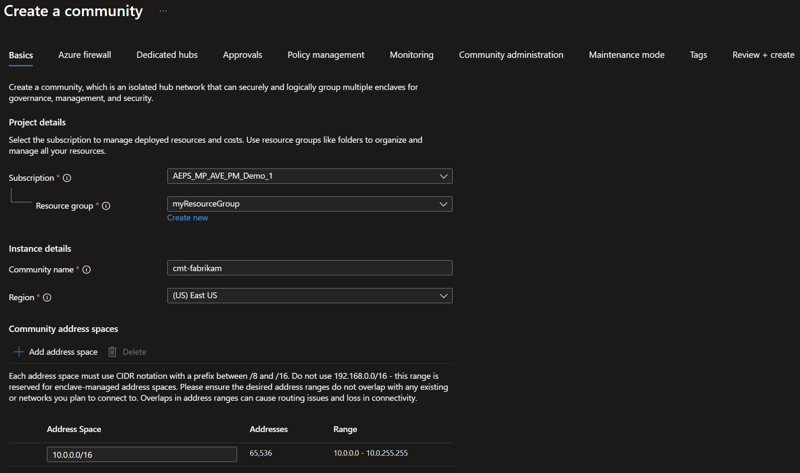
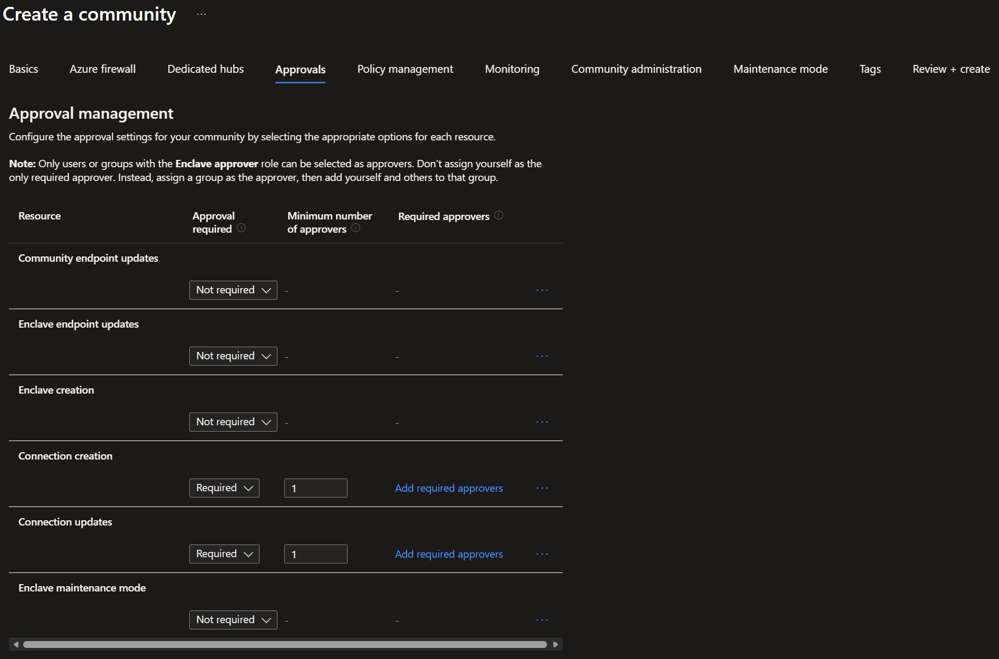
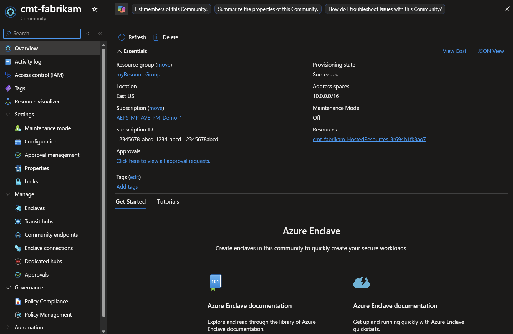
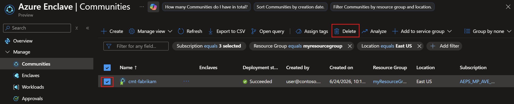

# Tutorial 1-1: Deploy an Azure Enclave community

## Overview

Azure Enclave is an Azure service that accelerates and streamlines the deployment and management of secure, isolated, and compliant cloud environments for the most sensitive mission workloads.

Communities provide the isolated hub network foundation that securely and logically group enclaves together for governance, management, connectivity, and monitoring. A community owner can enable connectivity to other communities or on-premises networks through community endpoints and transit hubs.

In this tutorial, part one of eight, you create an Azure Enclave community in the Azure portal. Later tutorials in this series create [enclaves](./what-enclave.md), [enclave endpoints](./what-enclave-endpoint.md), and [enclave connections](./what-enclave-connection.md).

In this tutorial, you:

- Plan your community architecture and address space.
- Deploy a community for your enclaves.
- Understand hub-and-spoke topology benefits.
- Validate community deployment, connectivity resources, monitoring, and access.
- Clean up the community when you no longer need it.

## Prerequisites

- An Azure subscription with quota for the required networking, firewall policy, and monitoring resources.
- Permissions to create and manage resources in the target subscription or resource group:
  - Contributor
  - User Access Administrator, if you need to create or update role assignments
- Basic familiarity with Azure networking, Azure resource groups, and private IP address planning.
- Azure CLI or Azure PowerShell installed, if you want to run optional validation commands.

## Before you begin

### Planning your community

Before creating your community, consider these important planning aspects:

#### Address space planning

Calculate the total IP space needed for all planned enclaves:

- **Estimate enclave count**: Plan for current needs plus 20-30% growth
- **Calculate required space**: Each enclave typically needs /16 to /24 CIDR
- **Avoid overlaps**: Ensure no overlap with on-premises networks or other Azure environments
- **Plan carefully**: Determine your required IP address space for your community and enclaves

**Example calculation:**
- Planning five enclaves, each with /16 CIDR (65,536 IPs each and 327,680 IPs total)
- Minimum community CIDR: /12 (1,048,576 IPs total)
- Recommended: /11 or /10 for growth buffer

**Address space size recommendations:**

| Deployment Size | Enclave Count | Recommended CIDR | Available IPs |
|-----------------|---------------|------------------|---------------|
| **Small** | 1-3 enclaves | /14 | 262,144 |
| **Medium** | 4-10 enclaves | /12 | 1,048,576 |
| **Large** | 11-25 enclaves | /11 | 2,097,152 |
| **Enterprise** | 26+ enclaves | /10 | 4,194,304 |

> [!TIP]
> Use the [Azure IP Address Calculator](https://www.subnet-calculator.com/cidr.php) to plan your address space.

#### Naming convention

Establish naming standards before deployment:

**Recommended naming pattern:**
- Format: `<organization>-<environment>-<purpose>`
- Examples:
  - `contoso-prod-main` - Production community
  - `fabrikam-dev-sandbox` - Development community
  - `northwind-test-validation` - Test community

**Additional naming considerations:**
- Keep names concise (3-24 characters)
- Use lowercase letters and hyphens
- Avoid special characters
- Document naming convention for team reference

#### Region selection

Choose the Azure region based on:

**Data residency requirements:**
- Regulatory compliance
- Data sovereignty requirements
- Industry-specific regulations

**Service availability:**
- Verify Azure Enclave availability in region
- Check required Azure services are available
- Consider preview vs. GA features

**Performance and cost:**
- Proximity to users for lower latency
- Network egress costs
- Azure pricing variations by region

**Disaster recovery:**
- Plan for secondary region if needed
- Consider paired regions for Azure DR

## Architecture considerations

### Hub-and-spoke topology

Communities create the hub and enclaves create the spokes for your hub-and-spoke network topology that provides several architectural benefits:

**Hub (Community) components:**
- **Managed resource group**: Azure-managed resources that support the community
- **Connectivity resources**: Virtual WAN and related connectivity resources for the community hub
- **Firewall policy**: Centralized rule policy and rule collections for traffic governance
- **Centralized logging**: Configurable logging and monitoring resources
- **Policy enforcement**: Centralized governance and compliance controls

**Spoke (Enclave) components:**
- **Isolated virtual networks**: Separate network boundaries per enclave
- **Workload resources**: Application-specific Azure resources
- **Network Security Groups**: Subnet-level security controls
- **Private endpoints**: Secure connectivity to Azure PaaS services

**Benefits of hub-and-spoke topology:**

| Benefit | Description |
|---------|-------------|
| **Network isolation** | Each enclave is isolated with independent address space |
| **Centralized security** | Single point for traffic inspection and policy enforcement |
| **Cost optimization** | Shared infrastructure (firewall, VPN gateway) reduces costs |
| **Simplified management** | Centralized monitoring and governance |
| **Scalability** | Easily add new enclaves without affecting existing ones |
| **Controlled connectivity** | Explicit enclave connections required for inter-enclave traffic |

### Security by default

Communities provide multiple security layers:

**Network security:**
- Isolated network boundaries with Azure Firewall
- Deny network traffic by default
- Explicit allow rules through community and enclave endpoints
- Network traffic logging for audit and compliance

**Governance and compliance:**
- Centralized Azure Policy enforcement
- Built-in compliance frameworks
- Policy exemption workflows with approval
- Audit logging of all administrative actions

**Access controls:**
- Just-in-time (JIT) access for administrative operations
- Maintenance mode for temporary elevated access
- Role-based access control (RBAC) integration
- Managed identity support

**Monitoring and observability:**
- Log Analytics workspace integration
- Azure Monitor for metrics and alerts
- Azure Firewall threat intelligence
- Network flow logs and diagnostics

### Architecture diagram

The following diagram shows an example Azure Enclave environment that starts with a community and adds enclaves and workloads in later tutorials:

[  ](./media/mermaid-workloads-example.svg#lightbox)

<!--
The mermaid definition for the above graph is in the what-workload.md file
-->

## Create a community in Azure Enclave

### Prepare resource group

Before creating a community, you need a resource group. An Azure resource group is a logical container into which you deploy and manage Azure resources.

> [!IMPORTANT]
> This tutorial uses `myResourceGroup` as a placeholder for the resource group name. You can optionally replace `myResourceGroup` with your own resource group name following your naming convention.

**Best practices for resource group:**
- Use descriptive names that indicate purpose and environment
- Apply tags for organization and cost tracking
- Ensure appropriate RBAC permissions are assigned
- Consider resource group location (should match community region)

### Deploy the community

Community deployments take approximately **30-45 minutes** to complete. Azure Enclave creates the community resource and supporting managed resources for connectivity, firewall policy, and monitoring.

#### Step 1: Navigate to Azure Enclave

In the `Azure Enclave` page, select `Communities` in the left menu.

[  ](./media/azure-enclave-homepage.png#lightbox)

#### Step 2: Start community creation

On the `Communities` page, select `Create`.

[  ](./media/tutorial-step-one-azure-enclave-page-communities-list.png#lightbox)

#### Step 3: Configure community settings

Enter the basic details for your community:

**Basic configuration:**
- `Subscription`: Select your Azure subscription
- `Resource Group`: `myResourceGroup` (or create new)
- `Community name`: `cmt-fabrikam` (or use your naming convention)
- `Region`: `East US` (choose based on your requirements)
- `Community address space`: `10.0.0.0/16`

**Understanding the configuration parameters:**

| Parameter | Description | Guidance |
|-----------|-------------|----------|
| **Subscription** | Azure subscription to bill resources | Use subscription with adequate quotas |
| **Resource Group** | Logical container for community resources | Create new or use existing |
| **Community name** | Unique identifier for the community | Follow naming convention, 3-24 characters |
| **Region** | Azure region for deployment | Can't be changed after creation |
| **Address space** | Private IP range for community | Must be RFC 1918, plan for growth |

**Address space guidance:**

Private IP address ranges (RFC 1918):
- `10.0.0.0/8` - Class A (16,777,216 addresses)
- `172.16.0.0/12` - Class B (1,048,576 addresses)
- `192.168.0.0/16` - Class C (65,536 addresses)

**For this tutorial:**
- Using `10.0.0.0/16` provides 65,536 IP addresses
- Sufficient for 3-5 enclaves with moderate-sized subnets
- Consider larger CIDR (for example, /14 or /12) for production to allow growth



You can look through the other tabs but for this tutorial you keep the defaults:

- keep the default firewall selected
- don't create any dedicated hubs for your enclaves
- keep the default policy management
- keep the default monitoring and logging settings
- don't add others to the community administration
- keep maintenance mode `Off`

Select the `Approvals` tab next.

#### Step 4: Approvals
For this tutorial, you only need approvals for enclave connection creation and update. Enter the basic details for your community:

**Approvals configuration:**

- `Connection creation`: Select `Required` and enter `1` for `Minimum number of approvers`
- `Connection updates`: Select `Required` and enter `1` for `Minimum number of approvers`



> [!NOTE]
> 
> These approvals selections are just to demonstrate how approvals work on the last resource you create. This configuration doesn't represent a production configuration.

#### Step 5: Review and create

Select `Review + create` and validate the details for your community are correct.

**Validation checks:**
- Verify subscription and resource group are correct
- Confirm community name follows naming convention
- Validate region matches requirements
- Check address space is appropriate size and doesn't overlap
- Review any validation warnings or errors

#### Step 6: Create

Select `Create` to begin deployment.

**What happens during deployment:**

The deployment process creates:
- **Virtual Network**: Hub virtual network with community address space
- **Azure Firewall**: Premium or Standard tier for traffic filtering
- **Firewall Policy**: Default rules and policies
- **Log Analytics Workspace**: For monitoring and diagnostics
- **Managed Resource Group**: Contains Azure-managed infrastructure
- **Diagnostic Settings**: Logs and metrics configuration
- **Network Security Groups**: Default security rules

**Monitoring deployment progress:**
- Track deployment status in Azure portal notifications
- Review deployment logs if issues occur
- Estimated time: 30-45 minutes
- Status shows "Running" then "Succeeded"

## Validate deployment

After the community deployment completes, perform these validation steps to ensure everything is configured correctly.

### Step 1: Check community status

1. Navigate to the community in Azure portal
1. Verify `Status` shows `Succeeded`
1. Review the `Overview` page for basic information

   [  ](./media/tutorial-step-one-community-overview-page.png#lightbox)

**Key information to verify:**
- **Provisioning State**: Should be "Succeeded"
- **Resource Group**: Correct resource group listed
- **Location**: Matches selected region
- **Address Space**: Correct CIDR displayed
- **Managed Resource Group**: Created automatically

### Step 2: Verify network configuration

1. In the community overview, select `Managed Resource Group`
1. Review the resources created:

**Expected resources in managed resource group:**
- Managed identity
- Log Analytics workspace
- Virtual WAN and related connectivity resources
- Firewall policy and rule collection resources
- Diagnostic settings, where applicable

**Verify managed connectivity resources:**
- Navigate to the managed resource group.
- Confirm the expected connectivity and firewall policy resources were created.
- Check that the configured address space matches your community planning.

### Step 3: Review RBAC and access

1. Navigate to `Access control (IAM)` in the community
1. Review role assignments

**Expected roles:**
- Your user account should have appropriate permissions
- Review inherited permissions from subscription/resource group
- Review assignments you made for community administration permissions

### Validation checklist

After deployment, confirm:

  - Community status shows **Succeeded**
  - Community managed resource group created with expected resources
  - Managed connectivity resources configured with the correct address space
  - Firewall policy and rule collections created
  - Log Analytics workspace connected
  - Diagnostic settings enabled
  - RBAC permissions are configured
  - No deployment errors in activity log

## Clean up resources

If you need to delete your community after completing this tutorial:

> [!WARNING]
> Deleting a community is **permanent** and **cannot be undone**. Associated enclaves, workloads, and managed resources can be deleted as part of the community deletion process. Review dependent resources before you delete the community.

**Before deleting:**
- Export any important configurations or data
- Document network settings for reference
- Notify team members of planned deletion
- Remove any dependencies (virtual network peering, connections)

**To delete a community:**

1. Navigate to Azure Enclave in the Azure portal
1. Select `Communities` from the left menu
1. Select the community to delete (for example, `fabrikam`)
1. Select `Delete` from the top menu
1. Type the community name to confirm deletion
1. Select `Delete`

   [  ](./media/tutorial-step-one-azure-enclave-page-communities-list-deployed.png#lightbox)

**Alternative deletion via Azure CLI:**
```azurecli
# Delete community (replace with your values)
az resource delete \
  --resource-group myResourceGroup \
  --resource-type Microsoft.Mission/communities \
  --name fabrikam \
  --api-version 2025-05-01-preview
```

**What gets deleted:**
- Community resource
- Associated enclaves within the community
- Associated workloads and empty workload resource groups
- Managed resource group and service-managed resources
- Firewall policy and associated rule collection resources
- Log Analytics workspace, if it isn't shared

**What is retained:**
- Resource group (if containing other resources)
- Any resources not managed by Azure Enclave
- Log Analytics data (based on retention settings)

## Troubleshooting

### Issue: Deployment fails with address space overlap error

**Symptom:**
Deployment fails with error message about address space conflicts

**Possible causes:**
- Address space overlaps with existing virtual network in subscription
- Address space conflicts with on-premises network
- Address space overlaps with virtual network peering connections

**Resolution steps:**
1. Review existing VNets in your subscription:
   ```azurecli
   az network vnet list --output table
   ```
1. Choose a different, nonoverlapping CIDR block
1. Verify with network team if using hybrid connectivity
1. Restart deployment with new address space

**Prevention:**
Maintain an IP address management (IPAM) spreadsheet documenting all allocated ranges

### Issue: Deployment takes longer than expected

**Symptom:**
Deployment running for more than 60 minutes

**Possible causes:**
- Azure region experiencing high load
- Complex firewall policy configurations
- Resource provider registration delays

**Resolution steps:**
1. Check Azure status page for service health issues
1. Review deployment logs in Activity Log
1. Contact Azure support if deployment exceeds 90 minutes
1. Don't cancel deployment unless explicitly advised

**Prevention:**
Deploy during off-peak hours when possible

### Issue: Can't access community after deployment

**Symptom:**
Community deployed but inaccessible in portal

**Possible causes:**
- Insufficient RBAC permissions
- Conditional Access policies blocking access
- Managed resource group permissions issue

**Resolution steps:**
1. Verify you have Reader or Contributor role on community
1. Check Conditional Access policies in Microsoft Entra ID
1. Request access from subscription administrator
1. Clear browser cache and retry

**Prevention:**
Ensure proper RBAC assignments before starting deployment

### Getting help

If you continue experiencing issues:

1. **Check the Azure Enclave troubleshooting guide**: [Troubleshooting guide](./troubleshoot.md)
1. **Review logs**: Check Activity Log for error messages
1. **Azure documentation**: Review the [Azure Enclave documentation](./index.yml) and [Azure Enclave FAQs](./azure-enclave-faq.md)
1. **Contact support**: Create a support ticket with:
   - Subscription ID
   - Community resource ID
   - Timeline of deployment events
   - Error messages and screenshots
   - Deployment correlation ID

## Understanding community costs

Create an Azure Calculator estimate for your [community](https://aka.ms/ae/calc).

**Cost optimization tips:**
- Use Standard tier firewall for dev/test
- Configure log retention policies appropriately
- Monitor and right-size resources
- Use Microsoft Cost Management for tracking

## Next steps

Congratulations! You successfully deployed an Azure Enclave community.

In the next tutorial, you'll learn how to create isolated enclaves within your community to host workloads.

> [Tutorial 1-2: Create enclaves inside a community](./1-2-create-enclaves-inside-community.md)

## Related content

- [What is a community?](./what-community.md)
- [What is an enclave?](./what-enclave.md)
- [Best practices for Azure Enclave](./best-practices.md)
- [Azure Enclave FAQs](./azure-enclave-faq.md)
- [Naming rules and restrictions](./name-rules-restrictions-azure-enclave-resources.md)
- [Quotas and region availability](./quotas-region-availability.md)
