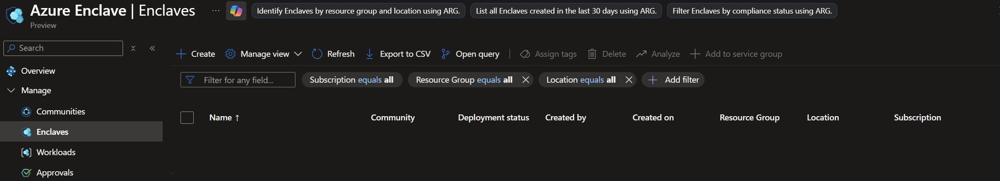
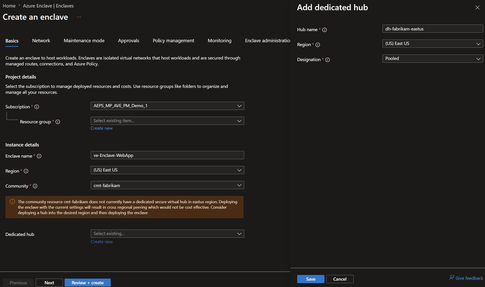
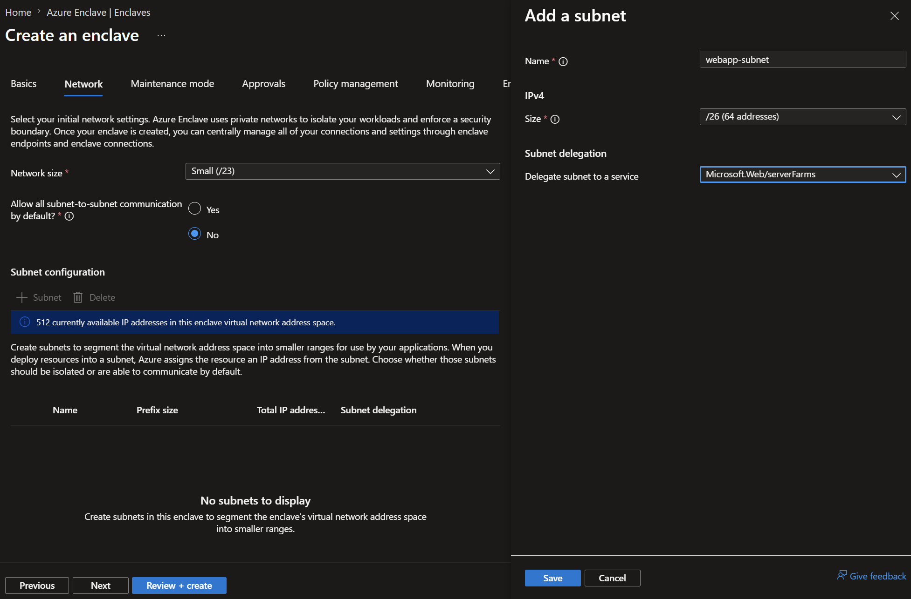
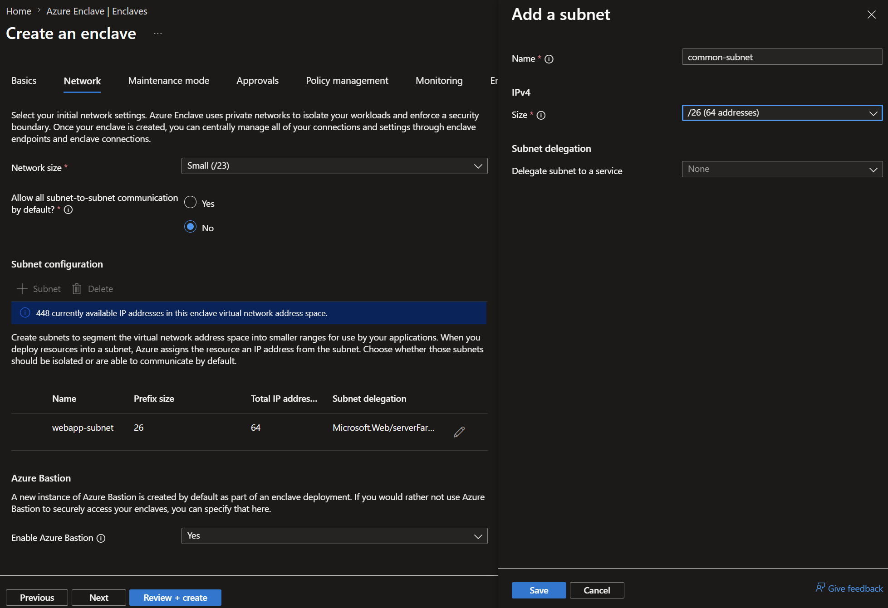
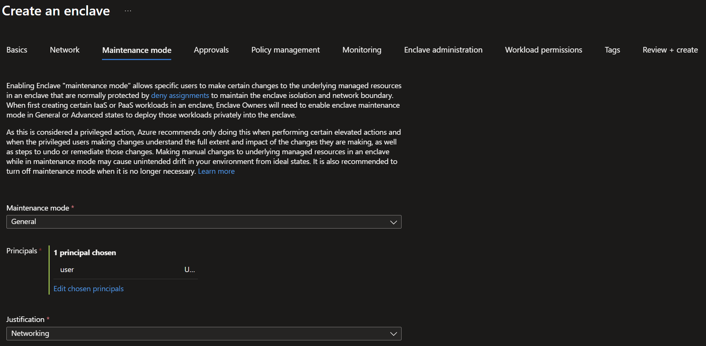
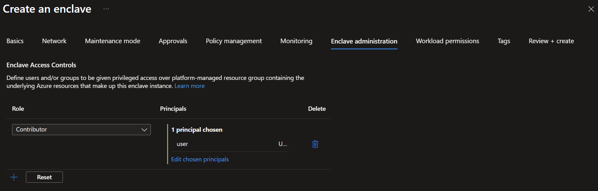
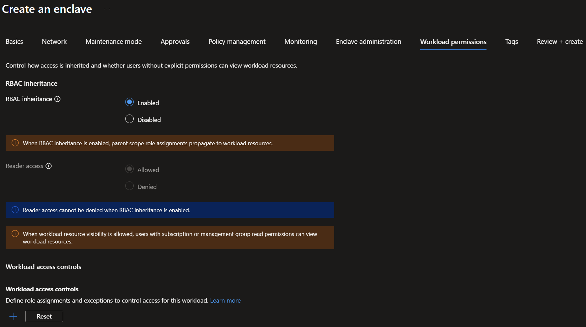
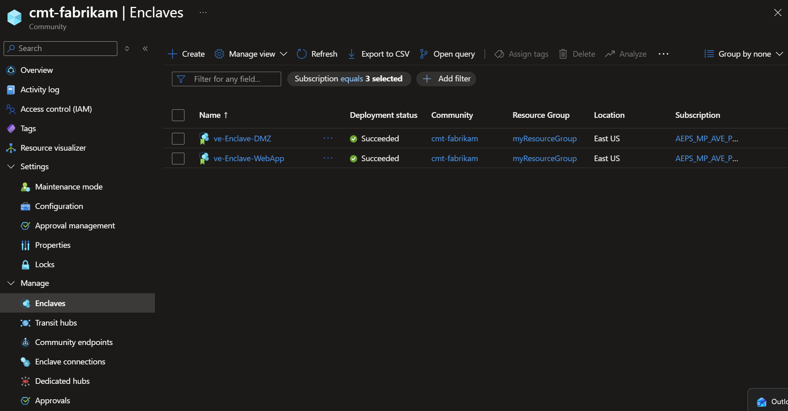
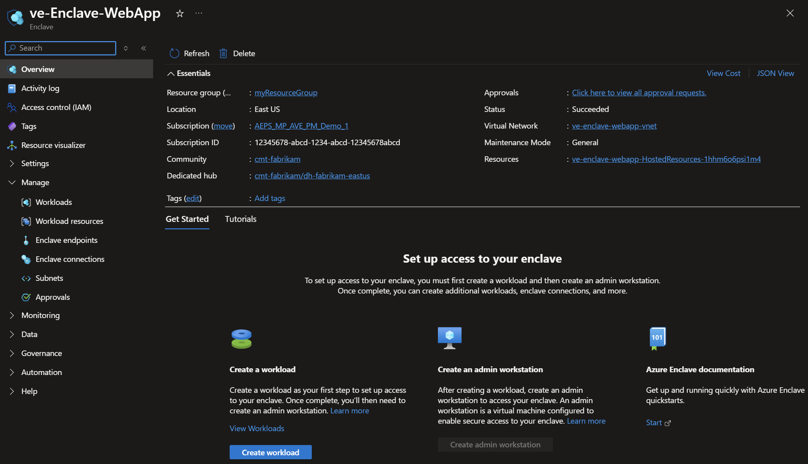

# Tutorial 1-2: Create enclaves in an Azure Enclave community

An enclave is an isolated Azure Virtual Network that's part of a community and hosts one or more workloads.

In this tutorial, part two of eight, you create two enclaves in the community that you deployed in the previous tutorial. The enclaves become spokes in the community hub-and-spoke network topology.

In this tutorial, you:

- Create the `Enclave-WebApp` enclave.
- Create the `Enclave-DMZ` enclave.
- Validate that both enclaves are deployed successfully.
- View and manage enclaves in the Azure portal.

## Before you begin

Complete [Tutorial 1-1: Deploy a community](./1-1-create-community.md) before you start this tutorial. You need:

- An existing Azure Enclave community named `fabrikam`.
- A resource group named `myResourceGroup` for the enclave resource.
- Permissions to create Azure Enclave resources in the target subscription and resource group.
- Access to the Azure portal.

For more information about enclave settings, see [Create an enclave in the Azure portal](./create-enclave-portal.md) and [What is an enclave?](./what-enclave.md).

## Create enclaves using Azure Enclave

Before creating an enclave instance, you need a resource group. An Azure resource group is a logical container into which you deploy and manage Azure resources. Azure Enclave also creates managed resources for each enclave in a managed resource group.

> [!Important]
>
> This tutorial uses `myResourceGroup` as a placeholder for the resource group name. If you want to use a different name, replace `myResourceGroup` with your own resource group name.

Enclave deployments can take around 30-45 minutes to complete. After deployment completes, open your enclave and verify that `Status` is `Succeeded`.

1. In the `Azure Enclave` page, select `Enclaves` in the left menu.

1. On the `Enclaves` page, select `Create`.

1. Enter the basic details for your first enclave:
   - `Subscription`: Select an existing subscription
   - `Resource Group`: `myResourceGroup`
   - `Enclave name`: `ve-Enclave-WebApp`
   - `Region`: `East US`
   - `Community`: Select the `fabrikam` community that you created in [Tutorial 1-1: Deploy a community](./1-1-create-community.md).
   - `Dedicated hub`: Select `Create new`
       - `Hub name`: Enter `dh-fabrikam-eastus` and then select `Save`

    

1. Create the enclave subnets:
    1. Select `Next` and select `+ Subnet`.

    1. Create a subnet delegated to App Service:
        - `Name`: `common-subnet`
        - `Size`: `/26`
        - `Delegate subnet to a service`: Select `Microsoft.Web/serverFarms`
        
        

    1. Select `Save`.

    1. Create a second subnet for other resources:
        - `Name`: `common-subnet`
        - `Size`: `/26`

    1. Select `Save`.

        

1. Select `Next`.

    Enter the maintenance mode details for your first enclave:
    - `Maintenance mode`: Select `General`
    - `Principals`: Select your name
    - `Justification`: Select `Networking`

    

    In this tutorial, you don't change the approvals settings at the enclave review. For more options, see [configure approvals article](./configure-approvals.md).

    The policy management tab also shows the options as unavailable because at the community you didn't allow the enclave owners to override policy.

1. Select the `Enclave administration` tab.

    1. Select `+`.
    1. For `Role`, select `Contributor`.
    1. For `Principals`, select `Choose Microsoft Entra principal` and select your name.

    

    If you select the `Workload permissions` tab, you see that workload permissions are inherited so you're `contributor` on the enclave and that permission is inherited on the workloads too.

    

1. Select `Review + create`, verify the settings, and then select `Create`.

1. To deploy the second enclave, repeat steps 1 and 2. On the `Create enclave` page, enter these basic details:
   - `Subscription`: Select an existing subscription
   - `Resource Group`: `myResourceGroup`
   - `Enclave name`: `ve-Enclave-DMZ`.
   - `Region`: `East US`
   - `Community`: Select the `cmt-fabrikam` community that you created in [Tutorial 1-1: Deploy a community](./1-1-create-community.md).
   - `Dedicated hub`: Select the hub you already created named `dh-fabrikam-eastus` and then select `Save`.
   
    > [!NOTE]
    > If the dedicated hub doesn't appear in the list, make sure the first enclave was created since that step creates the dedicated hub.
   
    Keep the other settings as their defaults for this tutorial.

1. Select `Review + create`, verify the settings, and then select `Create`.

## Validate the deployment

After the enclave resources are created, you can view them in the Azure portal from the `fabrikam` community.

Confirm that:

- `Enclave-WebApp` and `Enclave-DMZ` appear on the `Enclaves` page.
- Each enclave shows `Status` as `Succeeded`.
- Each enclave is associated with the `fabrikam` community.

Select an enclave name to view and manage the enclave.

## Clean up resources

If you're continuing to the next tutorial, keep both enclaves. The next tutorial uses these enclave resources.

If you don't need the resources from this tutorial, delete `Enclave-WebApp` and `Enclave-DMZ` from the Azure portal.

## Next steps

In this tutorial, you created two sample enclaves by using the Azure portal. In the [next tutorial](./1-3-create-workloads-inside-enclave.md), you learn how to create workloads within your enclave.
