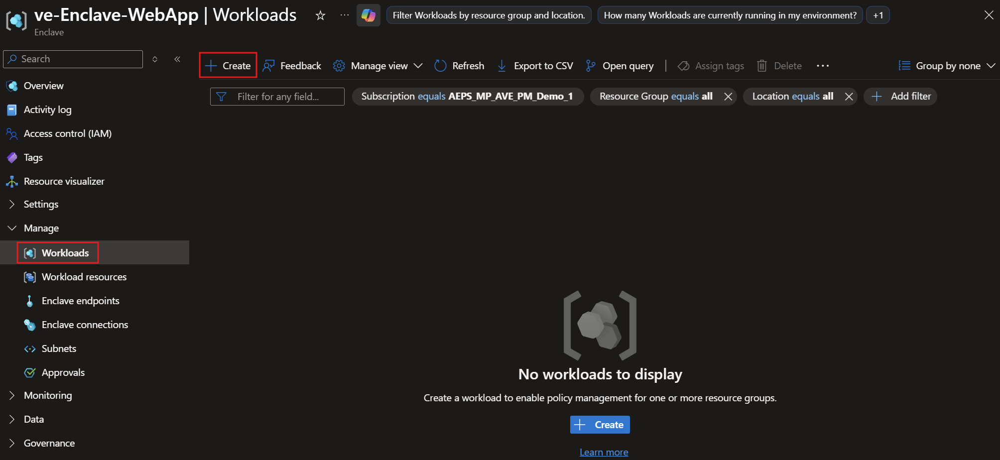
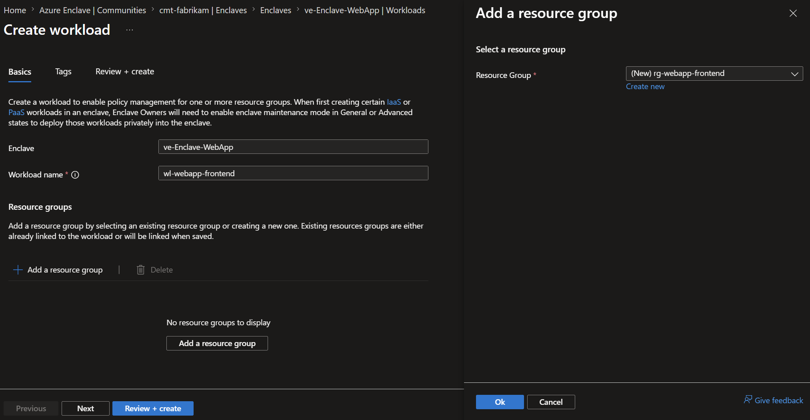
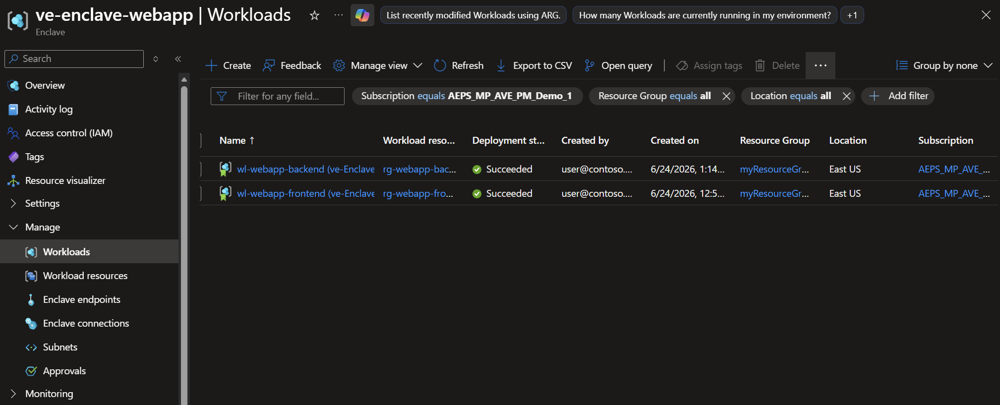

# Tutorial 1-3: Create workloads in an enclave on Azure Enclave

Workloads are logical groupings that help you organize Azure resources inside an Azure Enclave enclave. Each workload is associated with one or more workload resource groups where you deploy resources in later tutorials.

In this tutorial, part three of eight, you create workloads inside an enclave. You learn how to:

- Create frontend and backend workloads in an enclave.
- Associate each workload with a workload resource group.
- View workloads in the Azure portal.

## Before you begin

Complete [Tutorial 1-2: Create enclaves in a community](./1-2-create-enclaves-inside-community.md). This tutorial assumes that you have:

- An Azure account with an active subscription.
- An Azure Enclave community named `fabrikam`.
- An enclave named `Enclave-WebApp`.
- Permissions to create Azure Enclave workload resources and resource groups in the subscription.

## Create workloads using Azure Enclave

Before creating Azure resources in an enclave, create the Azure Enclave workload resources and associate them with workload resource groups. Azure Enclave applies enclave policy, guardrail, deny-assignment, and RBAC configuration to workload resource groups during creation.

> [!Important]
> This tutorial uses sample names such as `wl-webapp-frontend`, `wl-webapp-backend`, `rg-webapp-frontend`, and `rg-webapp-backend`. If you use different names, update the later tutorials to match your environment.

1. In the Azure portal, go to `Azure Enclave`.

1. In the left menu, select `Enclaves`.

1. On the `Enclaves` page for the `cmt-fabrikam` community, select the `ve-Enclave-WebApp` enclave that you created in [Tutorial 1-2: Create enclaves in a community](./1-2-create-enclaves-inside-community.md).

    

1. Under `Manage`, select `Workloads`.

1. On the `Workloads` page, select `Create`.

    

1. On the `Basics` tab, enter the following values for the frontend workload:

   - `Enclave`: Confirm that `ve-Enclave-WebApp` is selected.
   - `Workload name`: Enter `wl-webapp-frontend`.
   - `Resource groups`: Select `Add`.
   - `Create new`: Enter `rg-webapp-frontend`, and then select `OK`.

    > [!NOTE]
    > Choose workload and resource group names that match your organization's naming convention. For guidance, see [Define your naming convention](/azure/cloud-adoption-framework/ready/azure-best-practices/resource-naming).
    
    

1. Select `Review + create`, confirm the workload details, and then select `Create`.

1. To create the backend workload, repeat the previous steps with these values:

   - `Enclave`: Confirm that `ve-Enclave-WebApp` is selected.
   - `Workload name`: Enter `wl-webapp-backend`.
   - `Resource groups`: Select `Add`.
   - `Create new`: Enter `rg-webapp-backend`, and then select `OK`.

1. Select `Review + create`, confirm the workload details, and then select `Create`.

## Validate the workloads

After both deployments complete, return to the `Workloads` page for `Enclave-WebApp`.

Confirm that:

- `wl-webapp-frontend` appears in the workload list.
- `wl-webapp-backend` appears in the workload list.
- Each workload is associated with the expected workload resource group.

## Clean up resources

If you plan to continue the tutorial series, keep these workloads. Tutorial 1-4 uses them to deploy Azure resources from the service catalog.

If you need to remove the workloads created in this tutorial, first delete any resources in the associated workload resource groups. Workload deletion can fail when associated resource groups aren't empty.

After the workload resource groups are empty, delete the `wl-webapp-frontend` and `wl-webapp-backend` workload resources from the Azure portal.

## Next steps

In this tutorial, you created sample workloads in an enclave by using the Azure portal. In the [next tutorial](./1-4-use-service-catalog-create-azure-resources-workloads.md), you deploy Azure resources into those workloads by using the service catalog.
