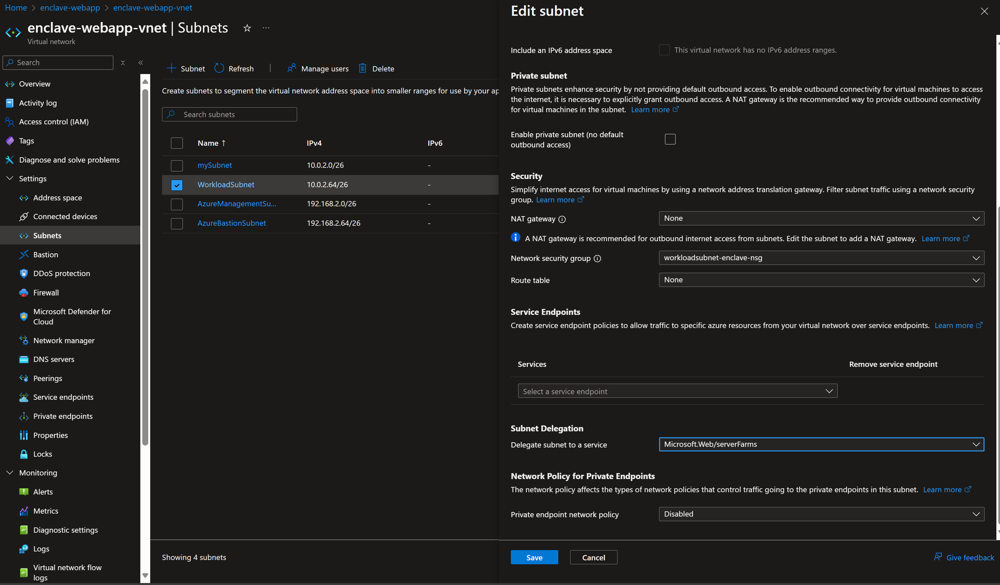
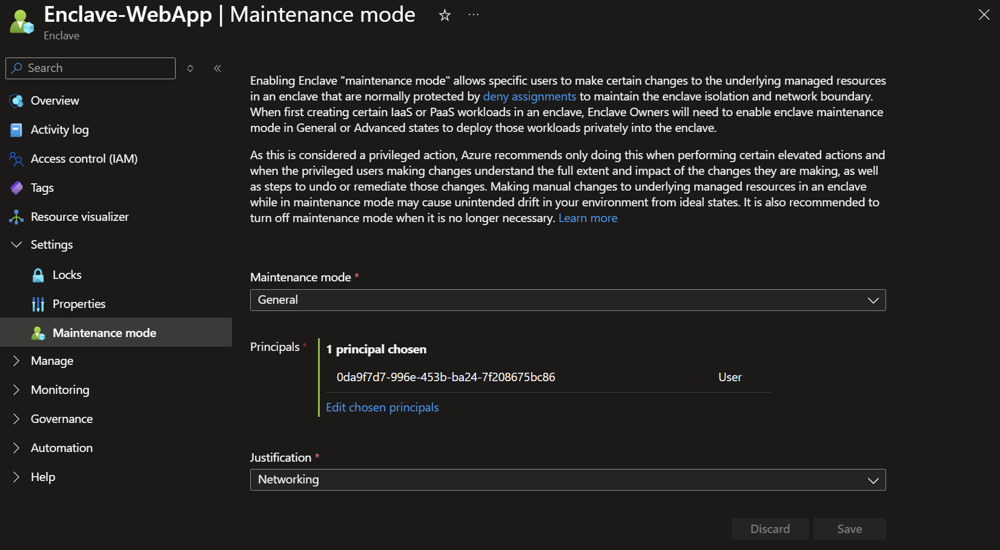
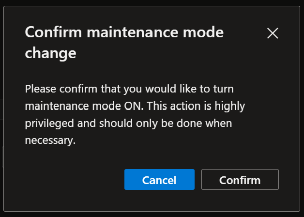
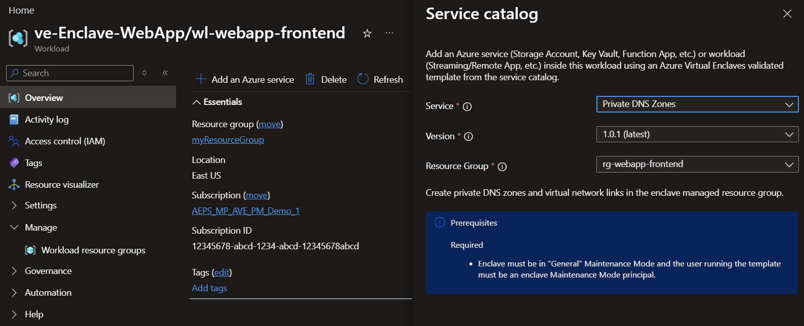
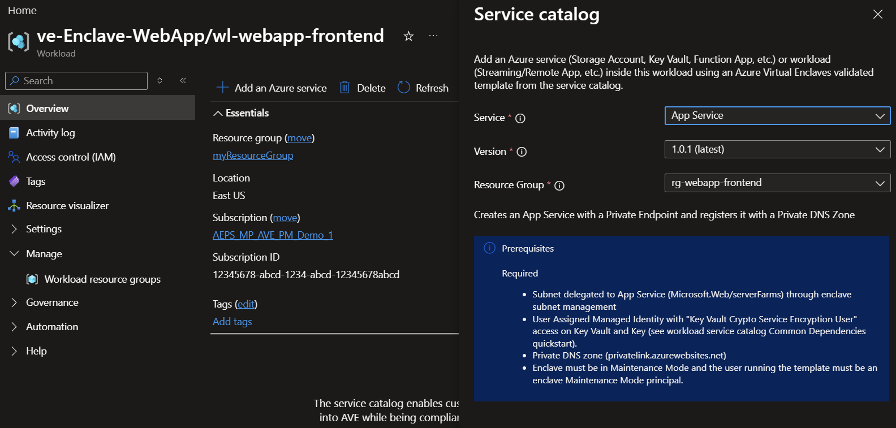
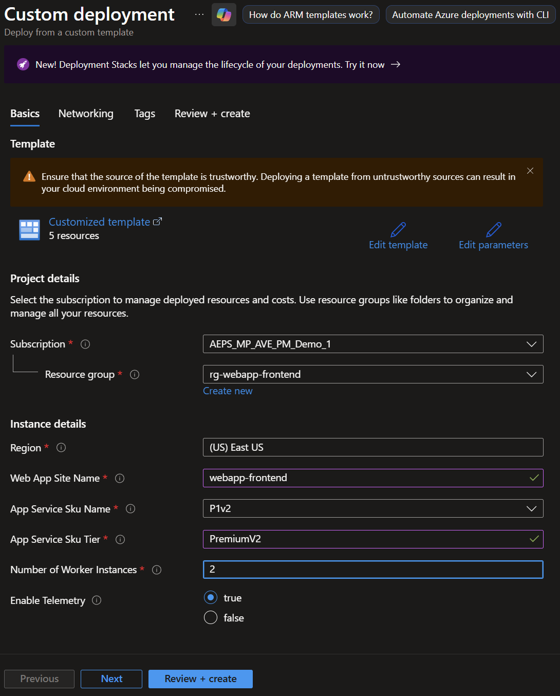
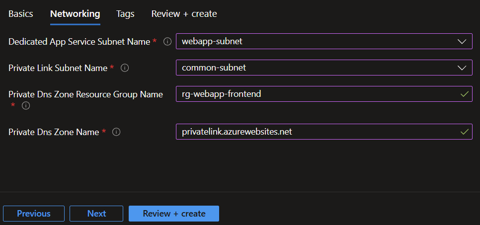
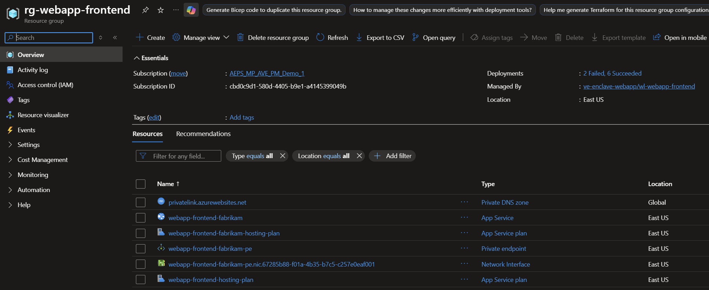

# Tutorial 1-4: Create Azure resources from the service catalog in an Azure Enclave workload

The service catalog enables you to deploy Azure services and streaming applications into Azure Enclave quickly while being compliant with Policy Guardrails and enclave isolation requirements.

In this tutorial, part four of eight, you create Azure resources using service catalog in workloads. You learn how to:

  - Deploy a service catalog template for an Azure resource into an existing workload from the Portal

> [!NOTE] 
> 
> The sample deployment is just for demonstration purposes and doesn't represent all the best practices for network, systems, or applications administration.

## Before you begin

- This tutorial assumes a basic understanding of networking and Azure Enclave concepts. For more information, see [Best practices for Azure Enclave](./best-practices.md).
- You need an Azure account with an active subscription. If you don't have one, [create an account for free](https://azure.microsoft.com/free/).
- You need a [community](./what-community.md), [enclave](./what-enclave.md), [workload](./what-workload.md), and at least one [workload resource group](./what-workload.md#workload-resource-group) and permissions to create resources inside the workload resource group.
- Complete the [prerequisites](./deploy-app-service-web-app-service-catalog.md#prerequisites) for an App Service Web App. Including subnet delegation for the

## Enable enclave maintenance mode

> [!TIP]
> 
> Skip this step if enclave maintenance mode is still turned on since you completed [Tutorial 1-2](./1-2-create-enclaves-inside-community.md).

1. Navigate to the `ve-Enclave-WebApp` enclave and select `Maintenance Mode`.

1. Enter the information needed to enable maintenance mode:
   - **Maintenance Mode:** Select `General`
   - **Principals:** Select `Choose Microsoft Entra principal` and enter your username
   - **Justification:** Select `Networking`
   - Select `Save`

   

1. Select `Confirm` and allow a few minutes for the enclave to return to `Succeeded` state.

   

## Create App Service required resources

1. Navigate to the `wl-webapp-frontend` workload to create an Azure App Service for your webapp.
1. Select `Add an Azure service` button on the overview page.
1. Select `Private DNS Zones` from the service catalog dropdown list and select `Next`.

   

1. Create the private DNS zone:
    
    1. For `Resource groups`, select `wl-webapp-frontend`.
    1. For `Additional Private DNS Zone Names`, enter the private DNS zone name for App Service `["privatelink.azurewebsites.net"]`. You might need to use a different value depending on the Azure cloud you're using.
    1. Select `Review + Create` then `Create`.
 
## Create Azure web app resources from the service catalog

1. Navigate to the `wl-webapp-frontend` workload to create an Azure App Service for your webapp.
1. Select `Add an Azure service` button on the overview page.
1. Select `App Service` from the service catalog dropdown list and select `Next`.
    
1. Enter all the required parameters on each tab.
   - **Web App Site Name:** Enter `webapp-frontend-fabrikam`
   - **App Service Sku Name:** Select an option from the dropdown, `P1v2`, or the lowest option for this tutorial. See this table for a full list of options: https://azure.microsoft.com/pricing/details/app-service/linux/#pricing
   - **App Service Sku Tier:** Enter `PremiumV2`.
   - **Number of Worker Instances:** Enter `2`.

   

1. Select `Next` then enter the networking information. Ensure the App Service subnet has a delegation to 'Microsoft.Web/serverfarms' and the private link subnet doesn't.
   - `Dedicated App Service Subnet Name`: Enter `webapp-Subnet` for the subnet delegated in the previous step.
   - `Private Link Subnet Name`: Enter `common-subnet` for the subnet containing the private endpoints.
   - `Private Dns Zone Resource Group Name`: Enter `rg-webapp-frontend`.
   - `Private Dns Zone Name`: Enter `privatelink.azurewebsites.net` for App Service.

   

1. Select `Review + Create` and then `Create`.

   Wait for the deployment to complete successfully before you take any actions within your deployed resources.

   

## Validate the deployment

Go to the specified resource group to confirm the intended resources were created.

## Deploy Web App Quickstart (Optional)
Azure App Service has quickstarts for many languages such as the [python quickstart](/azure/app-service/quickstart-python?tabs=flask%2Cwindows%2Cazure-cli%2Cazure-cli-deploy%2Cdeploy-instructions-azportal%2Cterminal-bash%2Cdeploy-instructions-zip-azcli) or [deploy from a zip file](/azure/app-service/deploy-zip)

## Clean up resources

If you don't plan on keeping these resources, clean up unnecessary resources to avoid Azure charges. If no other deployments exist in the resource group, the whole resource group can be deleted or all App Service resources can be selected and deleted.

## Recommendations

- Review an architecture example for a [basic web application](/azure/architecture/web-apps/app-service/architectures/basic-web-app)
- [Add tags](/azure/azure-resource-manager/management/tag-resources) to service catalog deployments to track important information for that resource such as:
  - Owner: `main POC`
  - Deployer: `yourName`
  - Purpose: `publish abc app to users`
  - Service Catalog Name: `Virtual Machine`
  - Service Catalog Version: `version you deployed`
- Consider adding an [Azure Policy to enforce and inherit tags](/azure/azure-resource-manager/management/tag-policies)

## Next steps

In this tutorial, you created Azure resources with service catalog using Azure portal.

In the [next tutorial](./1-5-create-enclave-endpoint-connections.md), you'll learn how to create Azure resources in your enclave.
