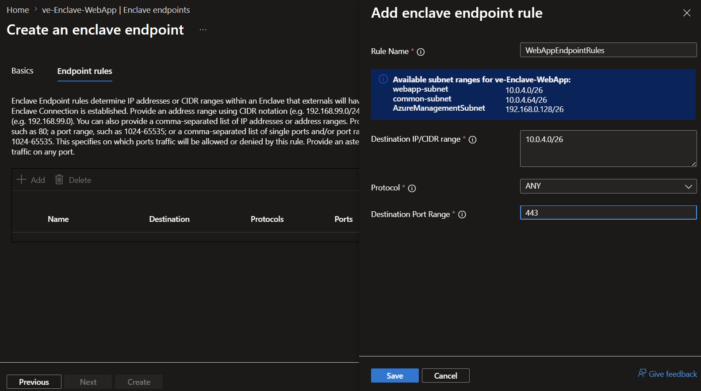
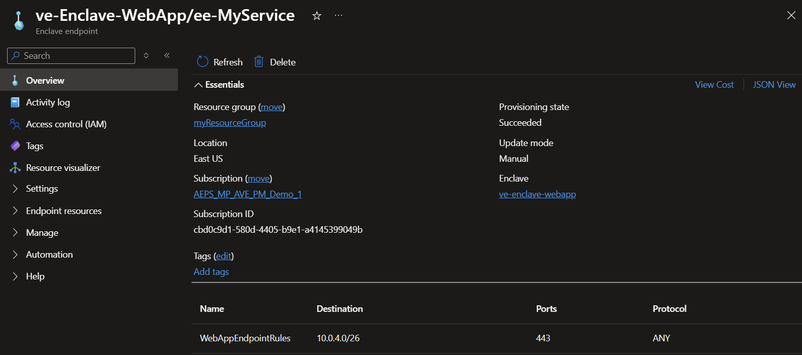
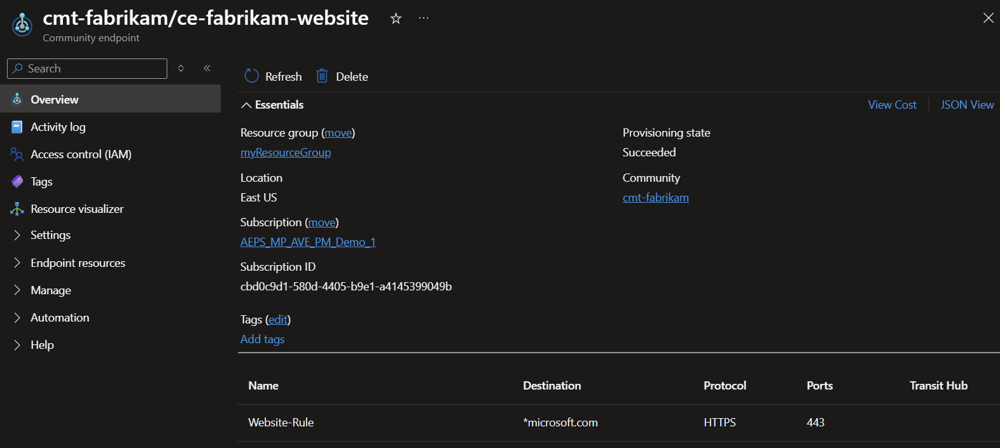
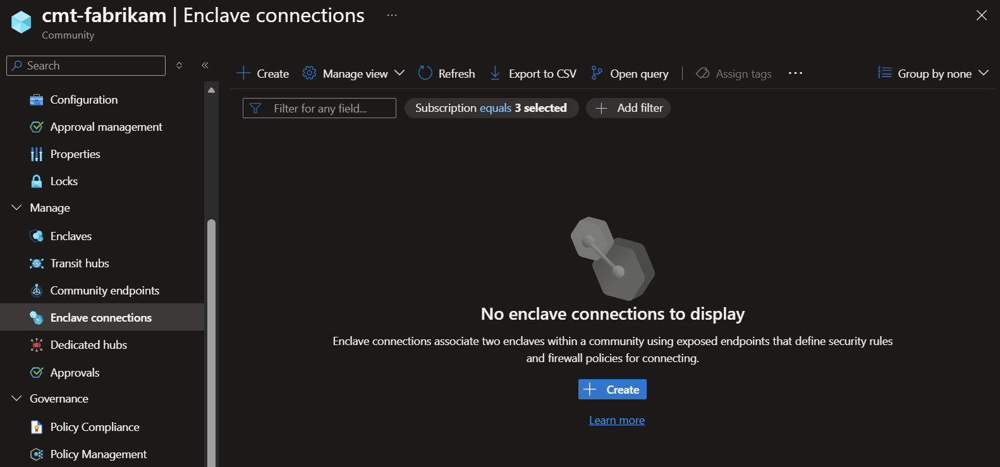
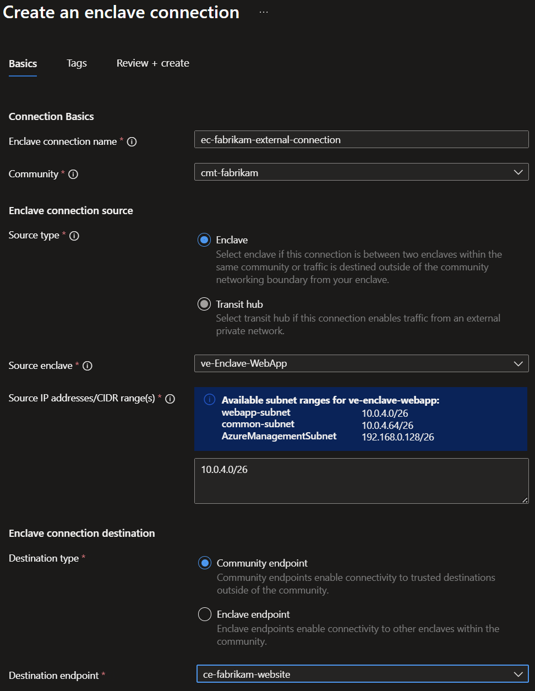
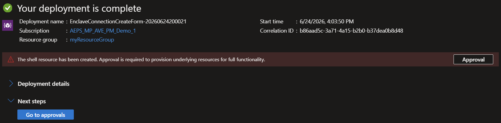
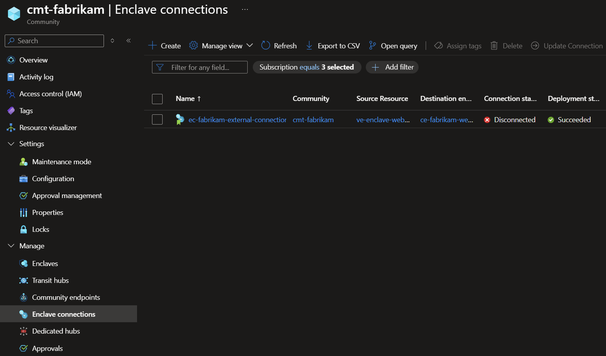
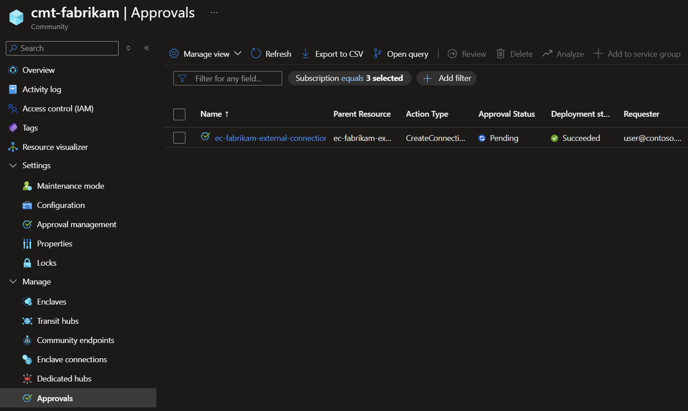

# Tutorial 1-5: Create enclave or community endpoint resources in Azure Enclave

Community endpoints enable enclaves in a community to establish connections to resources outside of the community boundary to include public websites, public IP addresses, and external private networks through Site-to-Site (S2S) VPN or ExpressRoute connections. Enclave endpoints enable others to connect to your service by defining the means by which inbound traffic is allowed to flow into a given enclave once a connection is made.

In this tutorial, part six of eight, you create community and enclave endpoint resources. You learn how to:

  - Create community endpoint resources in communities
  - Create enclave endpoint resources in enclaves
  - View your endpoints in Azure portal

## Before you begin
In the previous tutorials, you created a [community](./1-1-create-community.md) and an [enclave](./1-2-create-enclaves-inside-community.md) using the Azure portal.

## Create an enclave endpoint

1. Navigate to an enclave hosting a service you want to make available to other enclaves in the community

1. While in your enclave's page, select `Enclave Endpoints` on the left side, and select `Create`.

    

1. Enter your enclave endpoint name and then select `Next`:
   - Enclave endpoint name: Name of the enclave endpoint `ee-MyService`

1. Enter the endpoint rules for your app:
   - Select `+ Add` to add Endpoint Rules that represent how to access your app
      - Rule Name: `WebAppEndpointRules`
      - Destination IP/CIDR range: `<See the information box that gives your enclave webapp-subnet range (for example 10.0.2.0/26) and make sure there are no commas at the end>`
      - Protocol: `ANY`
      - Port: `443`

    

1. Select `Save`, select `Review + Create`, and select `Create`

1. Once the endpoint resource is created, you can view them in Azure portal from the Enclave-WebApp `Enclave Endpoints`.

    

## Create a community endpoint

1. Go to the `fabrikam` community and select `Community Endpoints`, and then select `Create`.

    

1. Enter the community endpoint name and then select `Next`:
   - Community endpoint name: `ce-fabrikam-website`

1. Enter the endpoint rules for your app:
   - Select `+ Add` to add Endpoint Rules that represent how to access your app
      - Rule Name: `Website-Rule`
      - Destination Type: `FQDN`
      - Destination: `*microsoft.com`
      - Protocol: `HTTPS`
      - Port: `443`

    

1. Select `Save`, select `Review + Create`, and select `Create`.

1. Once the endpoint resource is created, you can view them in Azure portal from the Enclave-WebApp enclave endpoint page.

    

## Create an enclave connection
Create an enclave connection from the web app enclave to the community endpoint so the app can reach required site outside the community.

1. From the `cmt-fabrikam` community, select  `Enclave Connections`, then select `Create`.

   

1. Enter the details for your app/service
   - Resource Group: `myResourceGroup`
   - Enclave connection name: Name of the connection `ec-fabrikam-external-connection`
   - Community: Select `cmt-fabrikam` from the dropdown
   - Source Type: Select `Enclave`
   - Source enclave: Select `ve-Enclave-WebApp` from the dropdown
   - Source IP addresses/CIDR range(s): `<See the information box that gives your enclave subnet range (for example 10.0.2.0/26) and make sure there are no commas at the end>`
   - Destination Endpoint Type: Select `Community Endpoint`
   - Destination endpoint: Select `ce-fabrikam-website` from the dropdown

   

1. Select `Review + Create` and then `Create`

   

1. Once the endpoint resource is created, you can view them in Azure portal from the `cmt-fabrikam` `Enclave Connections`. However, it's in a disconnected state because the community requires approvals on all new enclave connections and updates to those connections. 

   

1. Review the pending approvals in `Approvals` on the left for the enclave.

   

1. Approve the pending approvals and the connection state is automatically updated to the `connected` state. For more information about reviewing approval requests, see [Manage approval requests](./manage-approvals.md). For resource-type approval settings, see [Configure approval settings](./configure-approvals.md).

## Next steps
In this tutorial, you deployed community and enclave endpoints using Azure portal. You also learned how to:

- [Create connections](./what-enclave-connection.md)

In the [next tutorial](./1-6-monitor-your-enclaves.md), you'll learn how to create connections using these endpoints.
