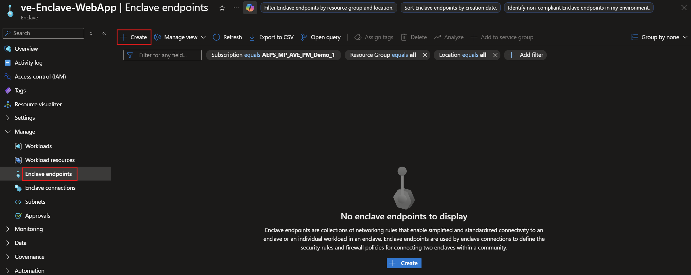
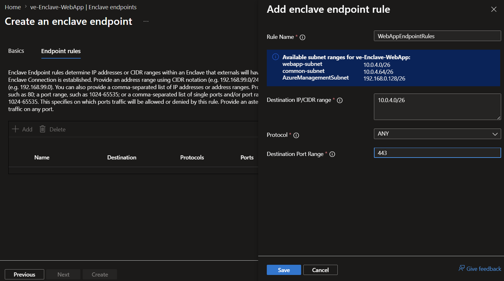
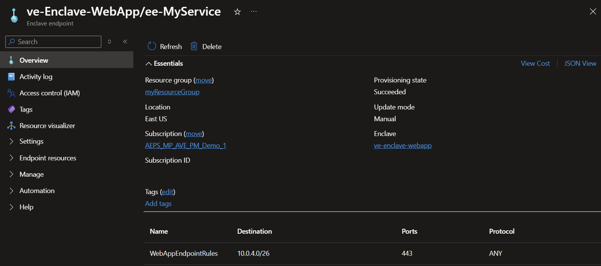
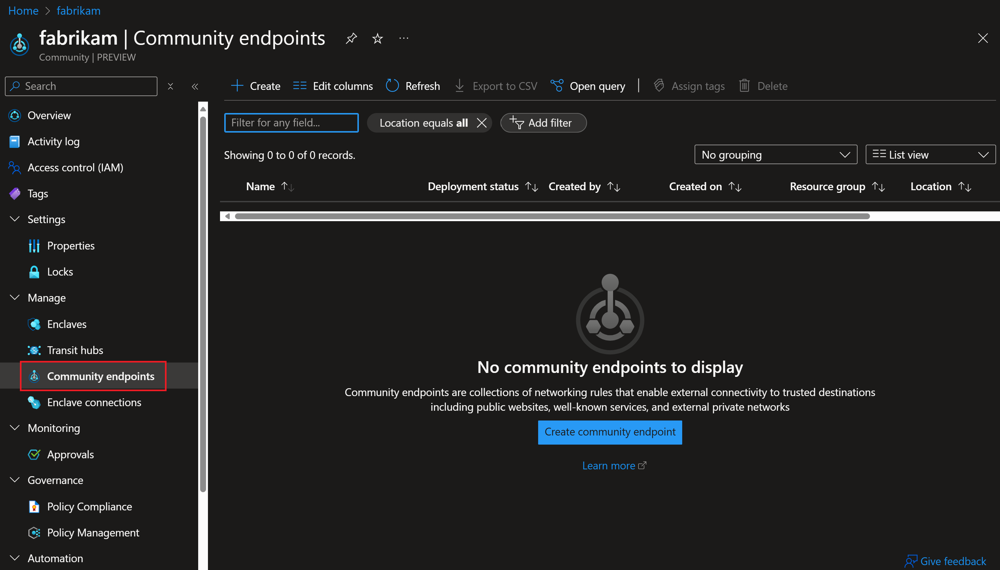
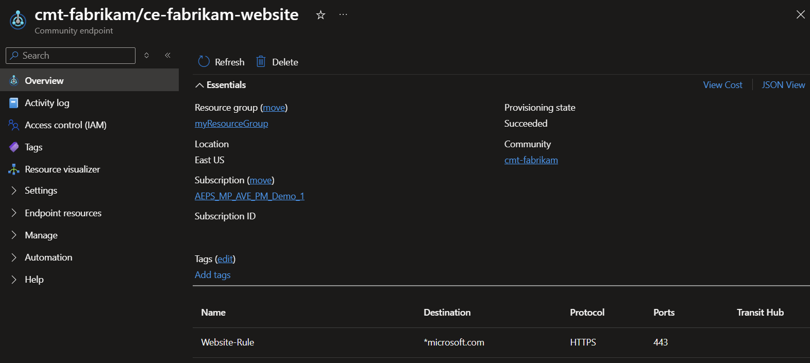
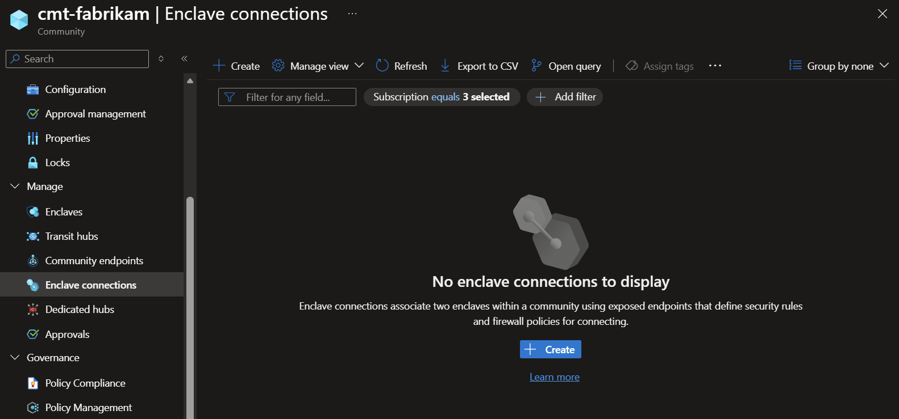
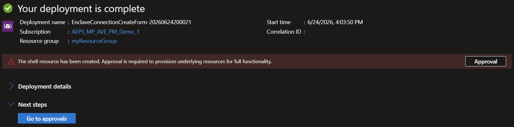
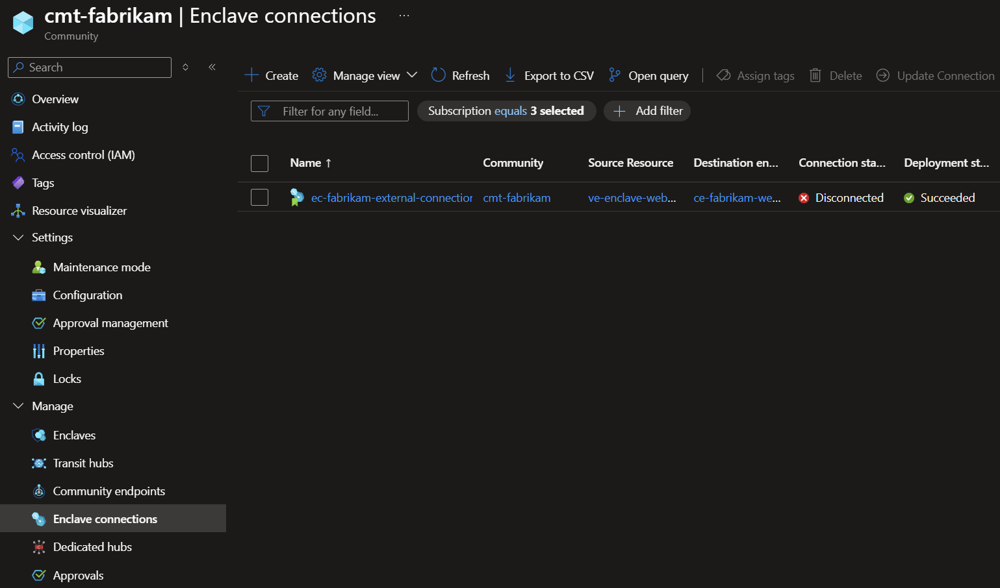
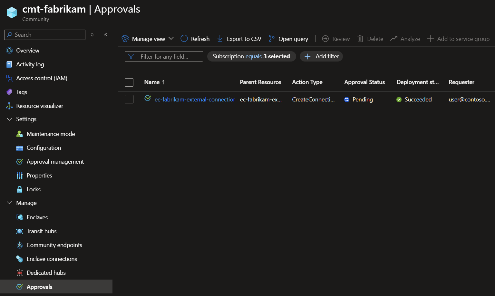

# Tutorial 1-5: Create enclave or community endpoint resources in Azure Enclave

Community endpoints enable enclaves in a community to establish connections to resources outside of the community boundary to include public websites, public IP addresses, and external private networks through Site-to-Site (S2S) VPN or ExpressRoute connections. Enclave endpoints enable others to connect to your service by defining the means by which inbound traffic is allowed to flow into a given enclave once a connection is made.

In this tutorial, part five of eight, you create community and enclave endpoint resources and connect them. You learn how to:

  - Create community endpoint resources in communities.
  - Create enclave endpoint resources in enclaves.
  - Create an enclave connection.
  - View your endpoints and connection in the Azure portal.

## Before you begin
In the previous tutorials, you created a [community](./1-1-create-community.md) and an [enclave](./1-2-create-enclaves-inside-community.md) using the Azure portal.

## Create an enclave endpoint

1. Navigate to an enclave hosting a service you want to make available to other enclaves in the community

1. While in your enclave's page, select `Enclave Endpoints` on the left side, and select `Create`.

    

1. Enter `ee-MyService` as the enclave endpoint name, and then select **Next**.

1. Enter the endpoint rules for your app:
   - Select **+ Add** to add an endpoint rule that represents how to access your app.
      - `Rule Name`: Enter `WebAppEndpointRules`.
      - `Destination IP/CIDR range`: Enter the CIDR range for the subnet that hosts your application, such as `10.0.2.0/26`. Find the subnet range in the information box for your enclave workload.
      - `Protocol`: Select `ANY`.
      - `Port`: Enter `443`.

    

1. Select `Save`, select `Review + Create`, and select `Create`

1. After the portal creates the endpoint resource, you can view it in the Azure portal from the `ve-Enclave-WebApp` enclave's **Enclave Endpoints**.

    

## Create a community endpoint

1. Go to the `cmt-fabrikam` community, select `Community Endpoints`, and then select `Create`.

    

1. Enter the community endpoint name and then select `Next`:
   - Community endpoint name: `ce-fabrikam-website`

1. Enter the endpoint rules for your app:
   - Select **+ Add** to add an endpoint rule that represents how to access your app.
      - `Rule Name`: Enter `Website-Rule`.
      - `Destination Type`: Select `FQDN`.
      - `Destination`: Enter `*.microsoft.com`.
      - `Protocol`: Select `HTTPS`.
      - `Port`: Enter `443`.

   > [!NOTE]
   > FQDN endpoint rules aren't supported for Basic communities. Use a community with a supported SKU for this example.

    

1. Select `Save`, select `Review + Create`, and select `Create`.

1. After the portal creates the endpoint resource, you can view it in the Azure portal from the `cmt-fabrikam` community's `Community Endpoints`.

    

## Create an enclave connection
Create an enclave connection from the web app enclave to the community endpoint so the app can reach required site outside the community.

1. From the `cmt-fabrikam` community, select  `Enclave Connections`, then select `Create`.

   

1. Enter the details for your app or service:
   - `Resource Group`: Select `myResourceGroup`.
   - `Enclave connection name`: Enter `ec-fabrikam-external-connection`.
   - `Community`: Select `cmt-fabrikam` from the dropdown.
   - `Source Type`: Select `Enclave`.
   - `Source enclave`: Select `ve-Enclave-WebApp` from the dropdown.
   - `Source IP addresses/CIDR range(s)`: Enter the CIDR range for the source enclave subnet, such as `10.0.2.0/26`.
   - `Destination Endpoint Type`: Select `Community Endpoint`.
   - `Destination endpoint`: Select `ce-fabrikam-website` from the dropdown.

   

1. Select `Review + Create` and then `Create`

   

1. After the portal creates the connection resource, you can view it in `cmt-fabrikam` under `Enclave Connections`. The connection can remain in a disconnected state when approval is required by the community or destination endpoint.

   

1. Review the pending approvals in `Approvals` on the left for the enclave.

   

1. Approve any pending requests. After approval, the connection is reconciled and can change to the `Connected` state when the required network configuration is complete. For more information about reviewing approval requests, see [Manage approval requests](./manage-approvals.md). For resource-type approval settings, see [Configure approval settings](./configure-approvals.md).

## Clean up resources

If you no longer need the endpoint and connection resources that you created in this tutorial, delete them to avoid incurring unnecessary charges.

> [!WARNING]
> Deleting endpoint and connection resources is **permanent** and **can't be undone**. Review dependent workloads and active traffic paths before deletion.

**Before deleting:**
- Verify that no workloads depend on these endpoints or connections.

**Recommended deletion order:**
1. Delete enclave connections.
1. Delete enclave endpoints.
1. Delete community endpoints.

**To delete enclave connections:**

1. In the Azure portal, go to your community (for example, `cmt-fabrikam`).
1. Select `Enclave Connections`.
1. Select the enclave connection to delete (for example, `ec-fabrikam-external-connection`).
1. Select `Delete`.
1. Confirm deletion.

**To delete enclave endpoints:**

1. In the Azure portal, go to the source enclave (for example, `ve-Enclave-WebApp`).
1. Select `Enclave Endpoints`.
1. Select the enclave endpoint to delete (for example, `ee-MyService`).
1. Select `Delete`.
1. Confirm deletion.

**To delete community endpoints:**

1. In the Azure portal, go to your community (for example, `cmt-fabrikam`).
1. Select `Community Endpoints`.
1. Select the community endpoint to delete (for example, `ce-fabrikam-website`).
1. Select `Delete`.
1. Confirm deletion.

**What gets deleted:**
- Enclave connection resources that you created in this tutorial.
- Enclave endpoint resources that you created in this tutorial.
- Community endpoint resources that you created in this tutorial.

**What is retained:**
- Community and enclave resources.
- Workloads and subnet resources.
- Approval settings and other unrelated Azure Enclave resources.

## Next steps
In this tutorial, you deployed community and enclave endpoints using Azure portal. You also learned how to:

- [Create connections](./what-enclave-connection.md)

In the [next tutorial](./1-6-monitor-your-enclaves.md), you'll learn how to create connections using these endpoints.
