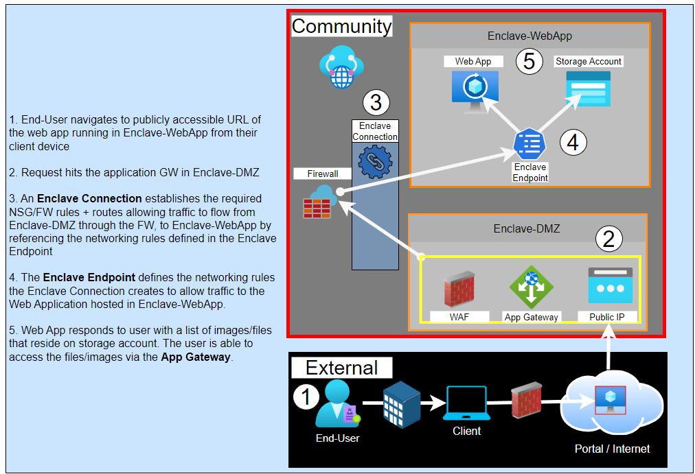

# Tutorial 1-7: Host a publicly accessible application in an enclave

Web applications can be hosted inside of an enclave and made publicly accessible by routing traffic through a separate Demilitarized Zone (DMZ) enclave with a Web Application Gateway, Web Application Firewall, and a Public IP address, creating an **Enclave Endpoint** for the Web App, and establishing an **enclave connection** between the Web App and DMZ enclaves.

## Public Web Applications in Azure Enclave

### Steps to make your web app accessible from the internet in Azure Enclave

1. Deploy an enclave to host the public Web Application (`Enclave-WebApp`).

1. Deploy an enclave to host an Application Gateway (`Enclave-DMZ`).

1. Deploy a workload and the resources required to host the web application into `Enclave-WebApp`.

1. Deploy an Endpoint that allows traffic to the web application's IP Address over port `443` and/or `80` into `Enclave-WebApp` (`endpoint-MyService`).

1. Deploy a workload and Application Gateway into `Enclave-DMZ`.

1. Configure the Web Application Storage Account to Proxy through the Application Gateway.

1. Create an enclave connection from `Enclave-DMZ` to `Enclave-WebApp`.
    - **Source Enclave**: `Enclave-DMZ`
    - **Source IP/CIDR**: `Application Gateway PIP`
    - **Destination Enclave**: `Enclave-WebApp`
    - **Destination Endpoint**: `endpoint-MyService`
