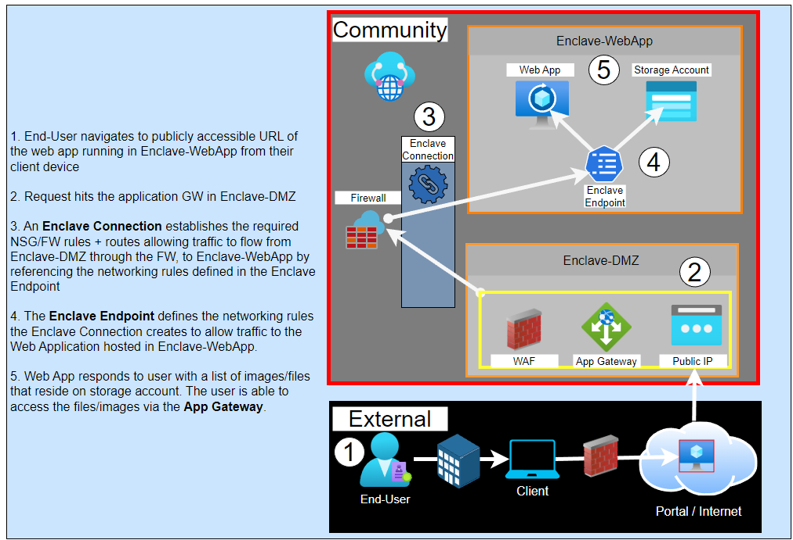

# Tutorial 1-7: Host a publicly accessible application in an enclave

You can host a web application inside an enclave and make it publicly accessible by routing traffic through a separate Demilitarized Zone (DMZ) enclave. This design uses an Application Gateway, Web Application Firewall (WAF), and public IP address, creates an enclave endpoint for the web app, and establishes an enclave connection between the web app and DMZ enclaves.

## Host a public web application in Azure Enclave

### Make your web app accessible from the internet

1. Deploy an enclave to host the public web application (`Enclave-WebApp`).
1. Deploy an enclave to host an Application Gateway (`Enclave-DMZ`).
1. Deploy the workload and required resources for the web application into `Enclave-WebApp`.
1. Deploy an endpoint in `Enclave-WebApp` (`endpoint-MyService`) that allows traffic to the web application's IP address over port `443` and/or `80`.
1. Deploy a workload and Application Gateway into `Enclave-DMZ`.
1. Configure the web application storage account to proxy through the Application Gateway.
1. Create an enclave connection from `Enclave-DMZ` to `Enclave-WebApp` with:
   - `Source enclave`: `Enclave-DMZ`
   - `Source IP/CIDR`: `Application Gateway PIP`
   - `Destination enclave`: `Enclave-WebApp`
   - `Destination endpoint`: `endpoint-MyService`
