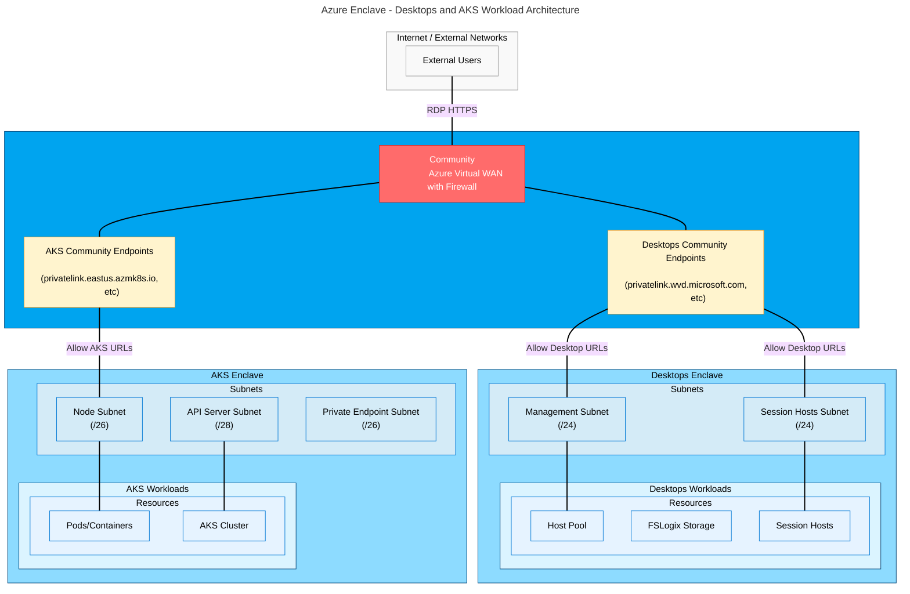

# Tutorial 2-1: Plan your architecture for Azure Virtual Desktop and AKS workloads in Azure Enclave

This tutorial helps you plan your Azure Enclave architecture for deploying Azure Virtual Desktop and Azure Kubernetes Service (AKS) workloads. Proper planning ensures optimal security, network isolation, and resource organization.

In this tutorial, you learn how to:
  - Plan your enclave topology for workload isolation
  - Calculate subnet sizing requirements for Azure Virtual Desktop and AKS
  - Identify required network endpoints and connectivity
  - Design enclave connections for inter-enclave communication
  - Organize workload resource groups effectively

## Prerequisites

This tutorial assumes understanding of concepts from these tutorials:
- [Tutorial 1-1: Deploy a community](./1-1-create-community.md)
- [Tutorial 1-2: Create enclaves inside a community](./1-2-create-enclaves-inside-community.md)
- [Tutorial 1-3: Create workloads inside an enclave](./1-3-create-workloads-inside-enclave.md)
- [Tutorial 1-4: Use the service catalog](./1-4-use-service-catalog-create-azure-resources-workloads.md)
- [Tutorial 1-5: Create enclave endpoints and connections](./1-5-create-enclave-endpoint-connections.md)
- Understanding of [Azure Virtual Desktop](/azure/virtual-desktop/overview)
- Understanding of [Azure Kubernetes Service](/azure/aks/intro-kubernetes)

## Architecture overview

The following diagram shows the architecture tutorials 2-1 through 2-4. The architecture includes a community hub with firewall, separate enclaves for Azure Virtual Desktop and AKS workloads, and the necessary endpoints and connections.

<!--
This is the mermaid definition for the above diagram. Use this to edit and regenerate the image.

-->

## Key planning decisions

### Enclave topology

You need to decide whether to deploy Azure Virtual Desktop and AKS in separate enclaves or a shared enclave.

| Option | Benefits | Considerations |
|--------|----------|----------------|
| **Separate Enclaves** | • Maximum isolation between workload types • Independent network policies • Easier to manage different compliance requirements • Clear security boundaries | • More complex enclave connections • More enclave resources • Potential for duplicate shared services |
| **One Enclave** | • Simplified networking • Shared common services • Fewer enclave connections needed • Lower management overhead | • Less isolation between workloads • Shared network policies |
| **Hybrid with Shared Services Enclave** | • Isolate workloads while sharing common resources • Centralized services like Key Vault, Domain Name System (DNS) • Best of both approaches | • Most complex to set up initially • Requires careful planning of enclave connections |

**Recommendation**: For production environments with strict security requirements, use separate enclaves for Azure Virtual Desktop and AKS and a third enclave for shared services and common resources. This tutorial series walks through the separate enclaves approach.

### Subnet sizing for Azure Virtual Desktop

Azure Virtual Desktop requires at least two subnets in the enclave:

| Subnet | Purpose | Recommended Size | Calculation |
|--------|---------|------------------|-------------|
| **Management Subnet** | Host pool, workspace, application groups, private endpoints | /26 (64 IPs) | Five reserved Azure IPs + management resources + growth |
| **Session Hosts Subnet** | Azure Virtual Desktop session host virtual machines (VMs) | Depends on VM count | `(Number of VMs + 5 reserved) + 20% growth` |

**Example calculation for Session Hosts Subnet**:
- 50 session hosts planned
- Formula: `(50 + 5) × 1.2 = 66 IPs needed`
- Recommended: `/26` (64 IPs) or `/25` (128 IPs) for growth

> [!IMPORTANT]
> You can't resize a subnet after resources are deployed. Plan for growth.

### Subnet sizing for AKS

AKS requires at least three subnets in the enclave:

| Subnet | Purpose | Recommended Size | Calculation |
|--------|---------|------------------|-------------|
| **Node Subnet** | AKS worker nodes | Depends on pod count | `(max nodes + 1) + ((max nodes + 1) × max pods per node)` |
| **API Server Subnet** | Private API server endpoint | /28 (16 IPs) | Small subnet for API server |
| **Private Endpoint Subnet** | Private endpoints for AKS services | /26 (64 IPs) | Private endpoints for various AKS services |

**Example calculation for Node Subnet** (30 pods per node, 3 max nodes):
- Formula: `(3 + 1) + ((3 + 1) × 30) = 4 + 120 = 124 IPs needed`
- Recommended: `/25` (128 IPs) minimum

> [!IMPORTANT]
> Plan for upgrade operations that require an extra node.

## Network requirements

### Azure Virtual Desktop required endpoints

Azure Virtual Desktop requires connectivity to the following endpoints via community endpoints:

| Purpose | Endpoint Name | Ports | Protocol |
|---------|-------|-------|----------|
| **Azure Virtual Desktop Control Plane** | `*.wvd.microsoft.com` `*.prod.warm.ingest.monitor.core.windows.net` | 443 | HTTPS |
| **Authentication** | `login.microsoftonline.com` `login.windows.net` | 443 | HTTPS |
| **Azure Resource Manager** | `management.azure.com` | 443 | HTTPS |
| **Agent Updates** | `mrsglobalstb2prod.blob.core.windows.net` `gcs.prod.monitoring.core.windows.net` | 443 | HTTPS |
| **Guest Configuration** | `*.guestconfiguration.azure.com` | 443 | HTTPS |
| **Windows Update** | `*.prod.do.dsp.mp.microsoft.com` `www.msftconnecttest.com` | 443/80 | HTTPS/HTTP |

Reference: [Azure Virtual Desktop required URLs](/azure/virtual-desktop/required-fqdn-endpoint)

### AKS required endpoints

AKS requires connectivity to the following endpoints via community endpoints:

| Purpose | Endpoint Name | Ports | Protocol |
|---------|-------|-------|----------|
| **Container Registry** | `mcr.microsoft.com` `*.data.mcr.microsoft.com` | 443 | HTTPS |
| **Cluster Management** | `*.hcp.<region>.azmk8s.io` | 443 | HTTPS |
| **Azure Resource Manager** | `management.azure.com` | 443 | HTTPS |
| **Authentication** | `login.microsoftonline.com` | 443 | HTTPS |
| **Package Repository** | `packages.microsoft.com` `acs-mirror.azureedge.net` | 443 | HTTPS |

Reference: [AKS required outbound network rules](/azure/aks/outbound-rules-control-egress)

### Inter-enclave communication

If using separate enclaves, you need enclave endpoints and connections for:

| Source | Destination | Purpose | Ports |
|--------|-------------|---------|-------|
| Azure Virtual Desktop Enclave | Shared Services Enclave | Key Vault, DNS, monitoring | 443, 53 |
| AKS Enclave | Shared Services Enclave | Key Vault, DNS, monitoring | 443, 53 |
| Azure Virtual Desktop Enclave | AKS Enclave | Optional: Direct communication | Depends on requirements |

## Resource organization

### Workload resource groups

Each workload should have one or more resource groups. Consider this organization:

**Azure Virtual Desktop workload Resource Groups**:
- `rg-avd-controlplane` - Host pools, workspaces, application groups
- `rg-avd-sessionhosts` - Session host VMs and related resources
- `rg-avd-storage` - FSLogix storage accounts
- `rg-avd-shared` - Shared resources like Key Vault, managed identities

**AKS workload Resource Groups**:
- `rg-aks-cluster` - AKS cluster user resource group
- `rg-aks-nodes` - AKS managed resource group (created automatically)
- `rg-aks-shared` - Shared resources like Key Vault, managed identities

**Shared Services workload Resource Groups** (if using shared services enclave):
- `rg-shared-security` - Key Vaults, managed identities, disk encryption sets
- `rg-shared-network` - Private DNS zones
- `rg-shared-monitoring` - Log Analytics workspaces

## Common dependencies planning

Both Azure Virtual Desktop and AKS require these common dependencies:

| Resource | Purpose | Shared or Per-Workload |
|----------|---------|----------------------|
| **User Assigned Managed Identity** | Access Key Vault for encryption keys | Can be shared or per-workload |
| **Key Vault** | Store encryption keys, secrets, certificates | Recommended: shared |
| **Customer Managed Key (CMK)** | Encrypt disks and data | Can be shared or per-workload |
| **Disk Encryption Set** | Apply CMK to managed disks | Per-workload |
| **Private DNS Zones** | Private endpoint DNS resolution | Shared across enclaves |
| **Log Analytics Workspace** | Centralized logging and monitoring | Shared across enclaves |

**Recommendation**: Reduce duplicate resources by deploying common dependencies in a shared services enclave or workload.

## Security considerations

### Network isolation

- Use separate subnets for different resource types
- Apply network security group (NSG) rules to subnets
- Use private endpoints for Azure PaaS services
- Minimize community endpoints to endpoints required for your needs

### Encryption

- Enable customer-managed keys (CMK) for all data at rest
- Use disk encryption sets for VM disks
- Enable encryption at host for AKS nodes
- Store all keys in Azure Key Vault and assign the least privilege access permissions

### Access control

- Use Azure role assignments for resource access
- Implement just-in-time (JIT) access for administrative operations
- Use managed identities instead of service principals where possible
- Apply principle of least privilege to all role assignments

### Monitoring

- Enable diagnostic settings on all resources
- Configure Azure Virtual Desktop Insights for session host monitoring
- Configure Container Insights for AKS monitoring
- Send all logs to a centralized Log Analytics workspace

## Next steps

Now that you planned your architecture, the next tutorial guides you through creating the Azure Enclave environment for your workloads.

> [!div class="nextstepaction"]
> [Tutorial 2-2: Create Azure Enclave environment for workloads](./2-2-create-azure-enclave-environment.md)

## Related content

- [Azure Virtual Desktop architecture](/azure/architecture/example-scenario/wvd/windows-virtual-desktop)
- [AKS baseline architecture](/azure/architecture/reference-architectures/containers/aks/baseline-aks)
- [Best practices for Azure Enclave](./best-practices.md)
- [What is an enclave?](./what-enclave.md)
- [What is a workload?](./what-workload.md)
