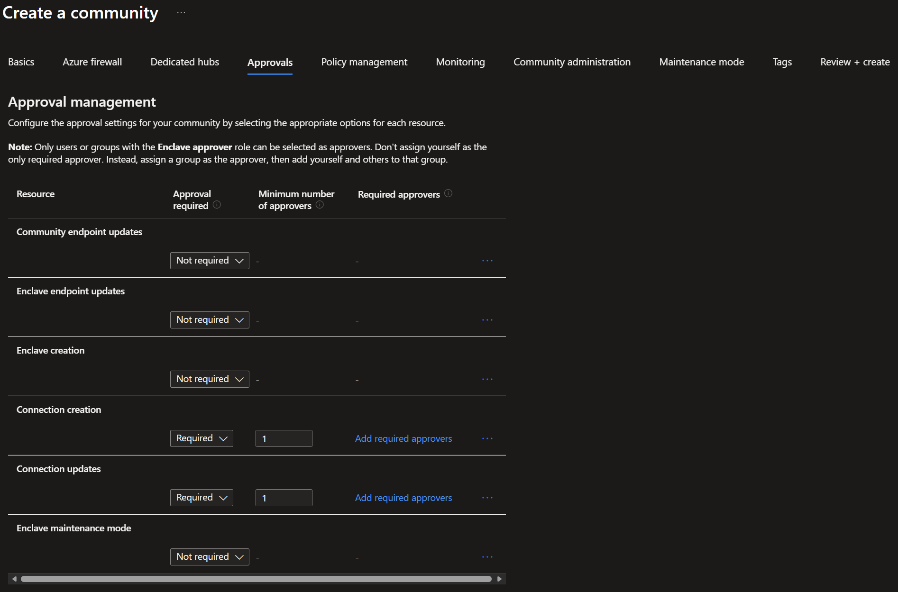
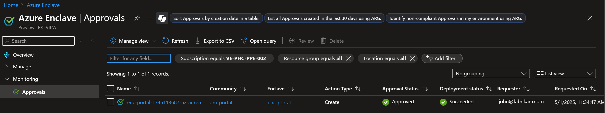
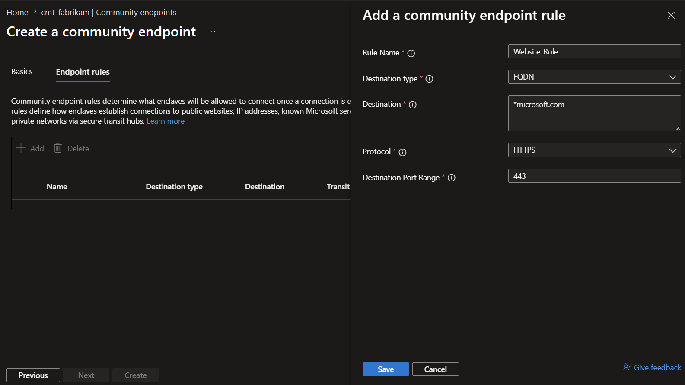
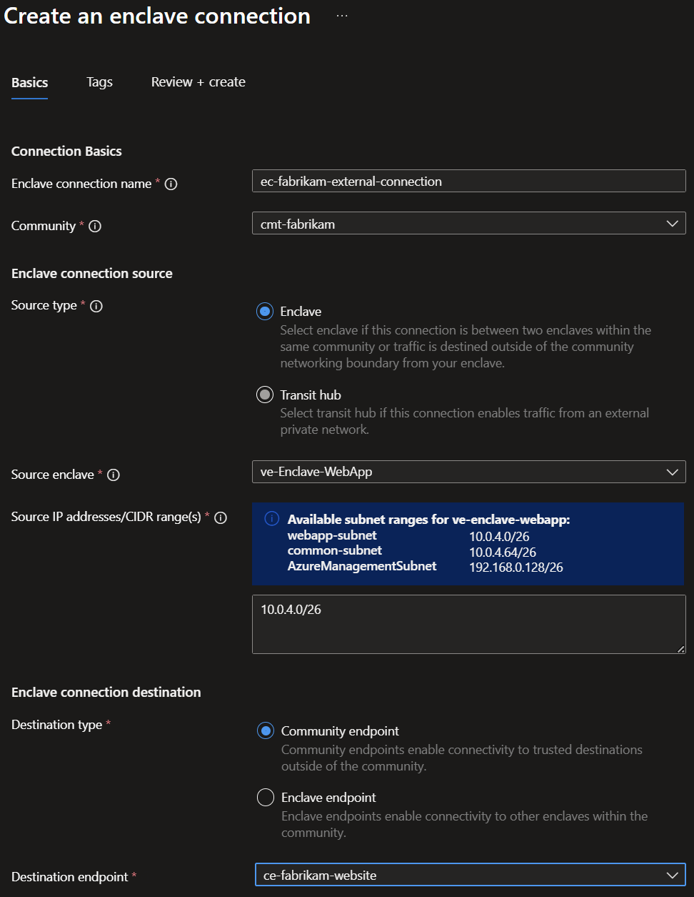

# Tutorial 3-1: Require approvals with Azure Enclave resources

In this tutorial, you use approvals to control a realistic workflow: onboarding a new enclave for an application team, then enabling and refining external connectivity through a community endpoint and enclave connection.

This tutorial mirrors the core resources from the [Tutorial 1-1](./1-1-create-community.md) path (community, enclave, endpoint, and connection) but focuses on the approvals experience to improve governance and oversight of critical changes.

## Scenario

A fictional customer, **Fabrikam**, runs a shared Azure Enclave community for regulated workloads. A platform engineer needs to:

- Create a new enclave for a data workload.
- Allow the workload to reach a partner API over HTTPS.
- Update connectivity settings after security review.

Fabrikam requires approvals for:

- `Enclave creation`
- `Community endpoint updates`
- `Enclave connection updates`

## Prerequisites

Before you start, make sure you have:

- An Azure subscription with access to Azure Enclave.
- A user account that can create community and enclave resources.
- At least one approver assigned the **Enclave Approver Role** at the correct scope.
- Familiarity with the base deployment flow from these tutorials:
  - [Tutorial 1-1: Deploy an Azure Enclave community](./1-1-create-community.md)
  - [Tutorial 1-2: Create enclaves in an Azure Enclave community](./1-2-create-enclaves-inside-community.md)
  - [Tutorial 1-5: Create enclave or community endpoint resources in Azure Enclave](./1-5-create-enclave-endpoint-connections.md)

For approval concepts and roles, see [Understand approvals](./understand-approvals.md) and [Configure approvals](./configure-approvals.md).

## Step 1: Create the community with approvals enabled

1. In the Azure portal, open `Azure Enclave` and select `Communities`.
1. Select `Create` and enter your basic settings, such as `cmt-fabrikam`, `East US`, and your address space.
1. Go to the `Approvals` tab.
1. Configure only these approval requirements:
   - `Enclave creation`: `Required`, `Minimum number of approvers = 1`
   - `Community endpoint updates`: `Required`, `Minimum number of approvers = 1`
   - `Enclave connection updates`: `Required`, `Minimum number of approvers = 1`
1. Complete `Review + create`, and then select `Create`.

> [!NOTE]
> In production, define approvers as security groups and use a minimum approver count that matches your governance policy. You can also add the security group as a required approver if that meets your requirements.

## Step 2: Submit and approve enclave creation
These steps require a person that requests the resource creation or change and another person to approve the request. The approver must have the **Enclave Approver Role** at the correct scope. This tutorial requires one `minimum number of approvers` but you would need multiple people to approve a request if your configuration requires that.

1. As the requestor, go to `Enclaves` and select `Create`.
1. Enter enclave details for the new workload enclave (for example, `ve-Enclave-Data`) and submit the request.
1. Ask your approver to open `Approvals` from the Azure Enclave service, community, or enclave view.
1. Ask your approver to find the pending `Enclave` creation request and review the requested details.
1. Ask your approver to select `Approve` to allow deployment to continue.
1. Return to `Enclaves` and confirm the enclave provisioning state is `Succeeded`.

## Step 3: Create a community endpoint for partner egress

1. Open your community and select `Community Endpoints` > `Create`.
1. Enter endpoint basics (for example, `ce-fabrikam-partner-api`).
1. Add a rule for partner API egress:
   - `Destination Type`: `FQDN`
   - `Destination`: Enter the destination in the format `*.microsoft.com,*.azure.com`.
   - `Protocol`: `HTTPS`
   - `Port`: `443`
1. Select `Review + create`, and then select `Create`.

## Step 4: Update the community endpoint and complete approval

After the security review, Fabrikam narrows the destination from a broad test value to a production-specific value. This update requires approval.

1. Open **Community Endpoints**, select `ce-fabrikam-partner-api`, and select **Edit**.
1. Update one rule value (for example, a stricter FQDN) and save. For this tutorial, you can add or remove your FQDNs.
1. Ask your approver to open **Approvals** and review the pending **Community endpoint update** request.
1. Ask your approver to approve the request.
1. Confirm the endpoint reflects the approved update.

For the approval review process, see [Manage approval requests](./manage-approvals.md).

## Step 5: Create an enclave connection and then update it with approval

1. In the community, select **Enclave Connections** > **Create**.
1. Create a connection from your source enclave (for example, `ve-Enclave-Data`) to the community endpoint (`ce-fabrikam-partner-api`).
1. After creation succeeds, open the connection and change one setting that triggers an update request (for example, source CIDR range).
1. Ask your approver to open **Approvals**, review the pending **Enclave connection update** request, and approve it.
1. Confirm the connection state is healthy after the approved update.

## Validate results

At the end of this tutorial, verify:

- The enclave creation request required approval and completed successfully.
- Community endpoint update required approval before the change took effect.
- Enclave connection update required approval before the change took effect.
- Approval history shows who approved each request and when.

## Clean up resources

If you no longer need this environment, delete the tutorial resources:

1. Delete the enclave connection.
1. Delete the community endpoint.
1. Delete the enclave.
1. Delete the community.

> [!NOTE]
> 
> If all of these resources are in the same resource group and you no longer need the contents of the resource group, you can delete the whole resource group to clean up the tutorial resources.

For full cleanup guidance, see:

- [Tutorial 1-1: Deploy an Azure Enclave community](./1-1-create-community.md#clean-up-resources)
- [Tutorial 1-2: Create enclaves in an Azure Enclave community](./1-2-create-enclaves-inside-community.md#clean-up-resources)
- [Tutorial 1-5: Create enclave or community endpoint resources in Azure Enclave](./1-5-create-enclave-endpoint-connections.md#clean-up-resources)

## Next steps

- [Manage approval requests](./manage-approvals.md)
- [Configure approvals](./configure-approvals.md)
- [Understand approvals](./understand-approvals.md)

