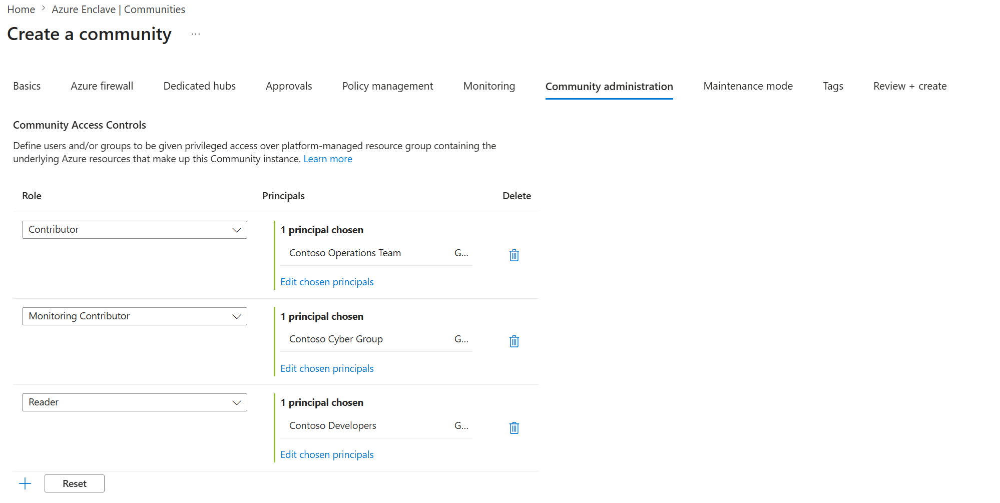
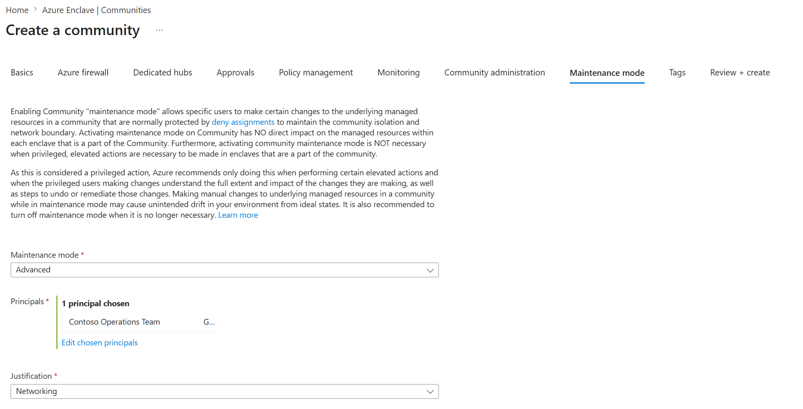
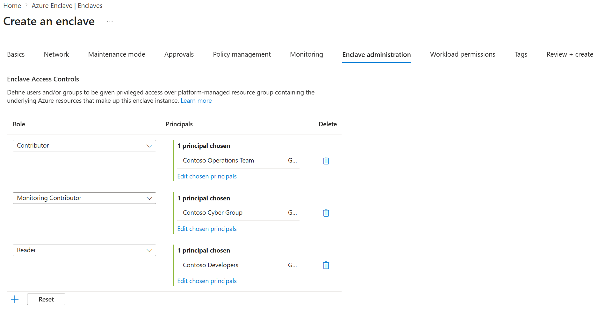
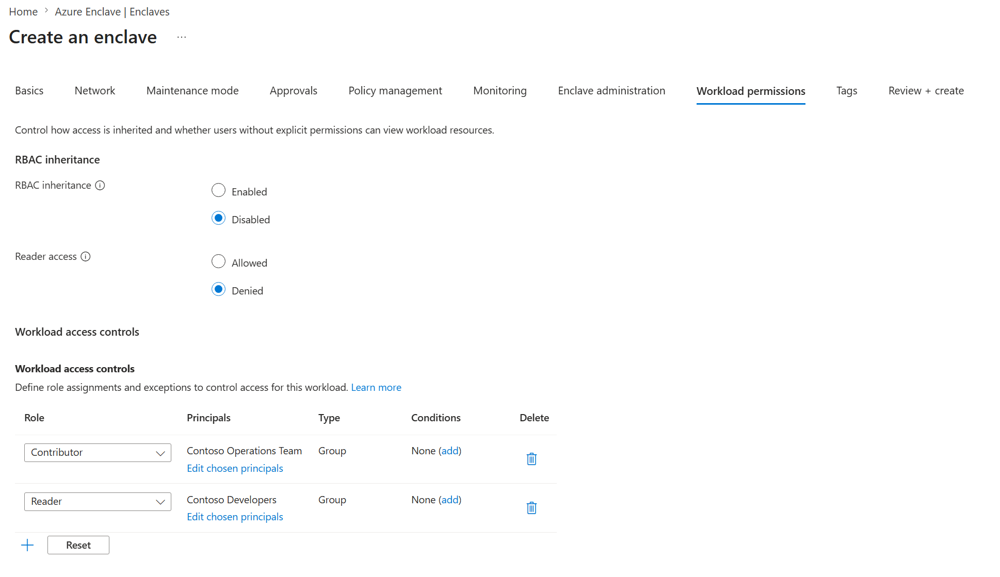
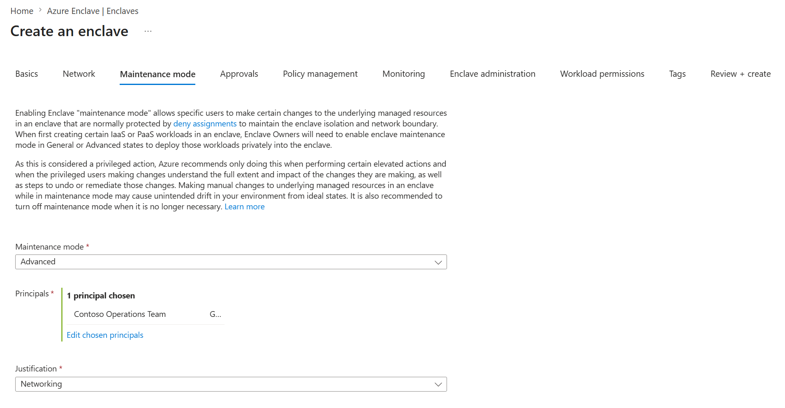

# Azure Enclave Access Controls

Azure Enclave provides robust identity and access management (IAM) controls to safeguard your environments while ensuring operational flexibility. Azure Enclave supports native Azure RBAC controls and/or isolated access controls at the Community, Enclave, and workload levels through a combination of RBAC role assignments, deny assignments, and deny assignment exclusions that block standard RBAC inheritance and allow for more granular access controls.  

## Community access controls 

- `Community Administration settings` - Define **who has permissions over Community managed resources**. Specify these settings during Community creation or modification. They result in RBAC role assignments and deny assignment exclusions over Community managed resources, such as Virtual WAN, Firewall, and Firewall policy.  

   

- `Community Maintenance Mode` - Grants specific users, groups, and service principals deny assignment exclusions over Community managed resources to perform the following RBAC actions:

   | Mode | Permissions |
   |------|-------------|
   | General | `Microsoft.Insights/alertRules/*`   `Microsoft.Support/*`   `Microsoft.Resources/tags/*` |
   | Advanced | `Microsoft.Network/azureFirewalls/networkRuleCollections/write`   `Microsoft.Network/azureFirewalls/applicationRuleCollections/write`   `Microsoft.Network/azureFirewalls/natRuleCollections/write`   `Microsoft.Network/firewallPolicies/ruleGroups/write`   `Microsoft.Insights/dataCollectionRules/*`   `Microsoft.Insights/dataCollectionEndpoints/*`   `Microsoft.OperationalInsights/workspaces/sharedKeys/action`   `Microsoft.Network/virtualHubs/write`   `Microsoft.Network/virtualWans/virtualHubs/read`   `Microsoft.Network/virtualWans/join/action`   `Microsoft.Authorization/policyExemptions/*` |

   

## Enclave and workload access controls

Enclave-level access controls determine who can access Enclave managed resources and workload resources. Specify these settings during Enclave creation or modification and for Workload resource groups.

- `Enclave Administration settings` - Define **who has permissions over Enclave managed resources** and result in RBAC role assignments and deny assignment exclusions over Enclave managed resources (virtual network, network security groups, and other resources).

   

- `Workload Administration settings` - Define **RBAC inheritance and explicit permissions over Workload resources** and result in RBAC role assignments and deny assignment exclusions over workload resource groups.
  - `RBAC Inheritance`
    - Enabled: Standard Azure RBAC inheritance is enabled for Workload resources.
    - Disabled: Only permissions defined under workload admin settings apply to workload resources.
  - `Reader Access`
    - Allowed: Standard RBAC inheritance is enabled for read permissions only over workload resources.
    - Denied: Read access is denied unless explicitly defined under workload admin settings. 

- `Enclave Maintenance Mode` - Grants specific users, groups, and service principals deny assignment exclusions over Enclave managed resources to perform the following RBAC actions:

   | Mode | Permissions |
   |------|-------------|
   | General | `Microsoft.Support/*`   `Microsoft.Insights/alertRules/*`   `Microsoft.Resources/tags/*` |
   | Advanced | `Microsoft.Network/virtualNetworks/write`   `Microsoft.Network/routeTables/routes/write`   `Microsoft.Resources/deployments/*`   `Microsoft.Network/privateDnsZones/*`   `Microsoft.Network/privateDnsOperationResults/*`   `Microsoft.Network/privateDnsOperationStatuses/*`   `Microsoft.Network/virtualNetworks/join/action`   `Microsoft.Network/virtualNetworks/subnets/join/action`   `Microsoft.Authorization/policyExemptions/*`   `Microsoft.Insights/dataCollectionRules/*`   `Microsoft.Insights/dataCollectionEndpoints/*`   `Microsoft.OperationalInsights/workspaces/sharedKeys/action` |

   

## Built in RBAC roles for Azure Enclave

Azure Enclave includes a set of built-in **Role-Based Access Control (RBAC)** roles designed to manage Azure Enclave-specific resource types. These roles provide granular permissions to manage Azure Enclave objects like communities and enclaves, without granting permissions to underlying Azure networking resources such as Virtual WAN or Azure Firewall. 

- **Community Owner** - Grants full control over the Azure Enclave community resource. This role allows the user to configure community-level settings and manage associated enclaves but doesn't permit direct modification of the underlying Azure networking resources (for example, Virtual WAN or firewall).  
- **Community Contributor** - Provides permissions to manage community configurations but doesn't include the ability to delete the resource.   
- **Community Reader** Grants read-only access to view the Azure Enclave community and its settings, such as networking endpoints and diagnostics configurations.  
- **Enclave Owner** - Grants full control over the Azure Enclave enclave resource. Users can manage the enclave’s configuration, including endpoints and workload associations, but can't modify the underlying infrastructure (for example, virtual network or NSGs).  
- **Enclave Contributor** - Provides permissions to manage enclave configurations without the ability to delete the resource.  
- **Enclave Reader** - Grants read-only access to view enclave settings and associated workloads.  
- **Enclave Approver** - Required role for authorizing actions that have been configured to require approvals. 