# Application installation using RemoteApp Virtual Machine

Install an application via Virtual Machine service catalog template.

The application installation scripting supports the following scenarios:

  - The most common use case for the RemoteApp app installation is to deploy remote applications that can be accessed from an Azure Virtual Destop.
  - Install your prerequisites such as cyber security and monitoring agents.
  - Script configuration changes for compliance or application setup.

  > [!NOTE] 
  > 
  > This sample deployment is just for demo purposes and doesn't represent all the best practices for network, systems, or applications administration.


## Prerequisites
The RemoteApp template supports scripting to automate the process of installing applications and configuring the Virtual Machine. Before you can start using the RemoteApp app installation, you need to make sure you have:
- A [community](./what-community.md), [enclave](./what-enclave.md), [workload](./what-workload.md), and at least one [workload resource group](./what-workload.md#workload-resource-group) and permissions to create resources inside the workload resource group.
- Enable `Advanced` [maintenance mode](./maintenance-mode.md) for your enclave so you can add the Private Link resources to your enclave managed resource group.
- A [container](/azure/storage/blobs/blob-containers-portal) (artifacts) within the [storage account](./deploy-storage-account-service-catalog.md).
- A [community endpoint](./create-community-endpoint-portal.md) to the storage account and optionally to an existing copy of AzCopy.exe.
- A copy of AzCopy.exe
  - [Download AzCopy](/azure/storage/common/storage-use-azcopy-v10#download-a-portable-binary).
  - Upload the AzCopy installer to the storage account at the same level as your app folder.
  - File Structure: 
    ```md
        - storage account
            - artifacts container
                - app folder
                - azcopy.exe 
    ```
    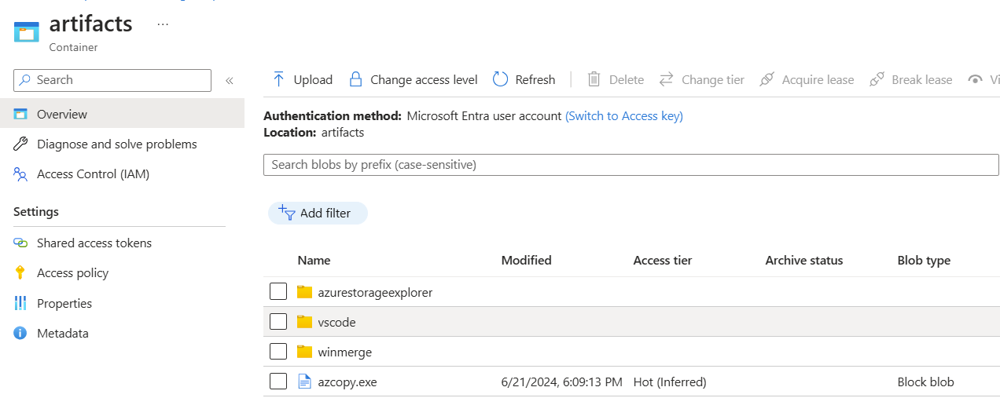
- [Enclave connections](./create-enclave-connection-portal.md) between the previously made community endpoints and the enclave subnet.

> [!NOTE]
> 
> If the storage account is in a different enclave, create an [enclave endpoint](./create-enclave-endpoint-portal.md) in the enclave with the storage account. Then create an [enclave connection](./create-enclave-connection-portal.md) between that storage account enclave and the enclave where you're installing the application.


### Azure Resources Deployed

- RemoteApp example Virtual Machine
  - Disk
  - Windows Virtual Machine 
  - Windows Virtual Machine Extension


### Software Deployed

- Windows
- Application of your choice

## Installation 

### Set up Storage Account to install Visual Studio Code
1. Add app folder to container within storage account.
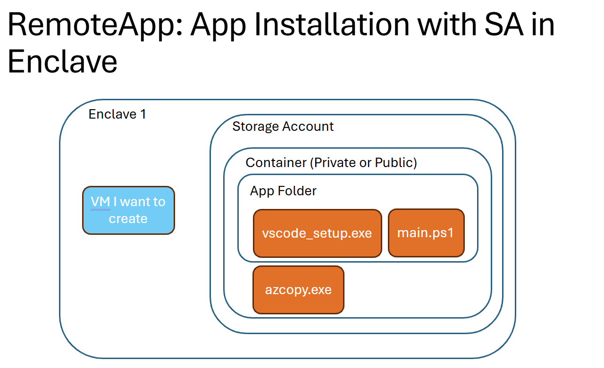
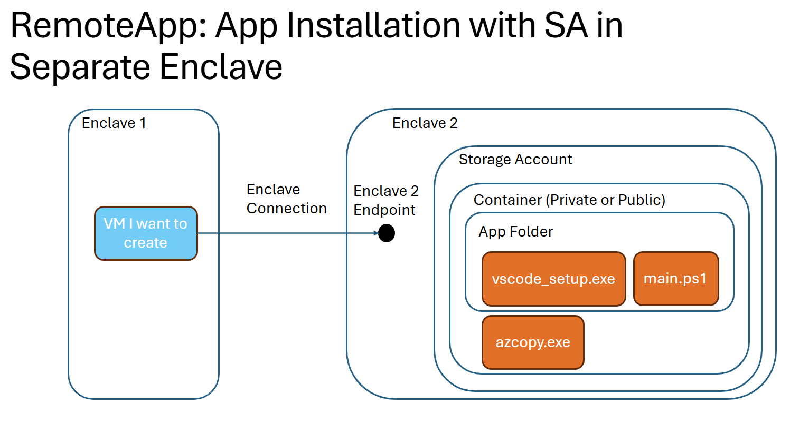
    - File Structure:
        ```md
            - artifacts container
                - app folder
                    - app installer
                    - main script to install app
                    - (optional) additional scripts
                    - (optional) azcopy.exe
        ```
1. Download the application installer you need. In this example download [Vscode.exe](https://code.visualstudio.com/sha/download?build=stable&os=win32-x64) and upload the installer into the storage account app folder.
1. Upload the `main.ps1` application installer script compatible with the version of Visual Studio Code you added to the storage account app folder:
    ```powershell
        # Main powershell script that installs the application

        Start-Process 'C:/vscode/VSCodeSetup-x64-{version}.exe' -Argument "/VERYSILENT /MERGETASKS=!runcode"
    ```

### Setup Template
1. On the workload overview page, select `+Add an Azure Service`.

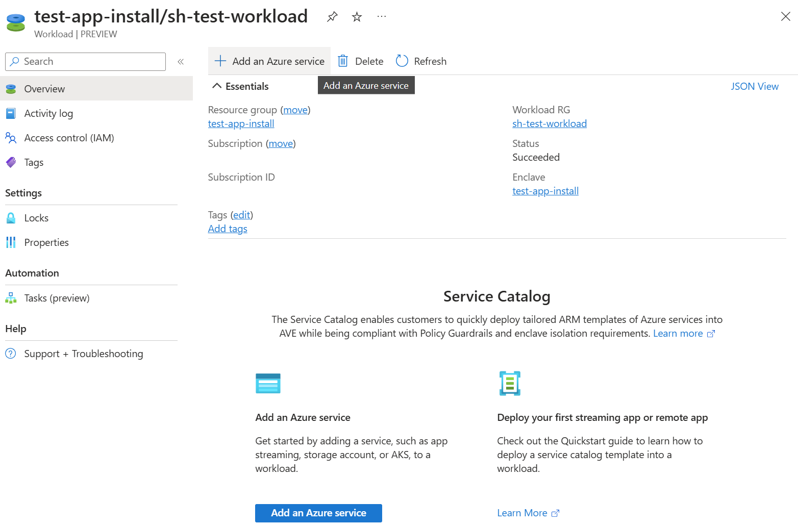

1. For `Service`, select `Virtual Machine`.

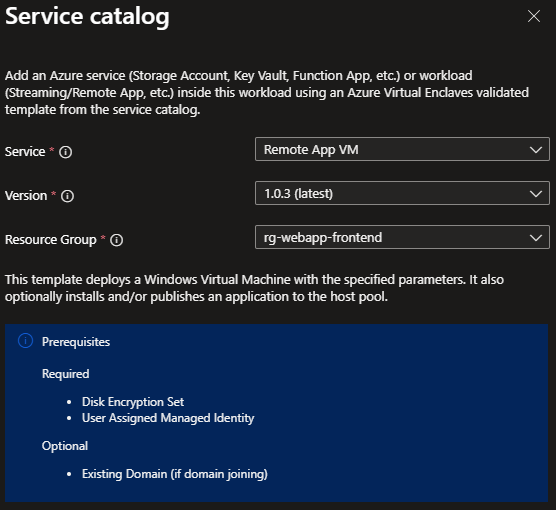

1. Confirm the resource group selection and select `Next`
1. Basics Tab:
    - For `Virtual Machine name`, input the name of the Virtual Machine.
    - For  `Admin username` and `Admin password`, input the username and password you use to log into your Virtual Machine.
1. App Tab:
    - For `App folder URI`, input the URI to the container. Select an artifact within the container, copy its URI, **remove everything** after the folder name in the URI.
        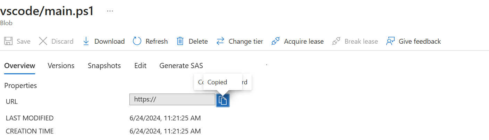

        | Original URI | Fixed URI |
        |--|--|
        | https://`<storage-account>`.blob.core.windows.net/`<container-name>`/`<folder-name>`/`<script>`.ps1 | https://`<storage-account>`.blob.core.windows.net/`<container-name>`/`<folder-name>` |

    - Example:
        - storageaccountexample.blob.core.windows.net/artifacts/vscode
    - For `Main Script` input the name (ex: `main.ps1`) of the script that installs the application.

    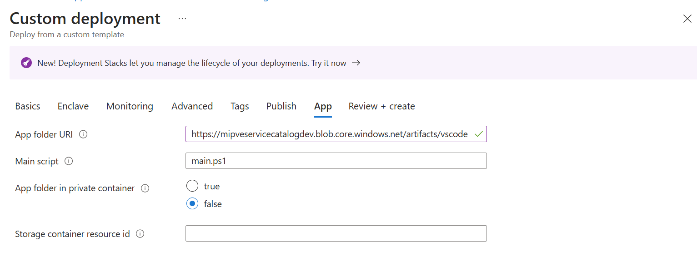

### Private Container:

1. For `App folder in private container` select `true` to allow `reader` role access to the storage account via the Virtual Machine. 
1. For `Storage container resource id` get the following three parts: `<storage-account-resource-id>` + '/blobServices/default/containers/' + `<container-name>`.
    - To get `Storage container resource id`, from the storage account, select "Overview," select "JSON View" in the far right corner, copy the storage account resource ID.

    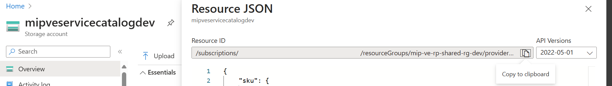

    - For the container name, copy the name of the private container that holds the artifacts.
    - Example storage container resource ID: `subscriptions/000000a0-a0a0-000a-00a0-0000aaa0a000/resourceGroups/providers/Microsoft.Storage/storageAccounts/storage-account-example/blobServices/default/containers/container-name`
1. If the parameter `AzCopy File URI` is displayed, add the URI to the azcopy.exe from the container
    - Select the file, and copy its URL:

    
    
    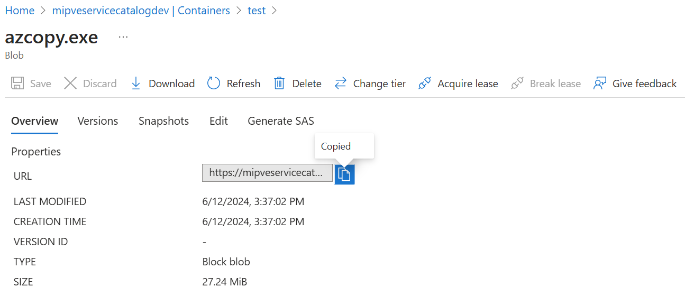

Example Private Container Parameters:

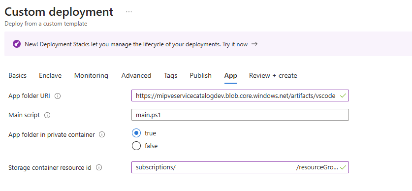

1. Select `Review and Create`, if validations pass, select `Create`.
1. Once resources are deployed, check to see if app is installed on application Virtual Machine by connecting to the Application Virtual Machine. [Connect to the Application Virtual Machine](./deploy-virtual-machine-service-catalog.md#connect-to-the-application-virtual-machine)

## WinGet Installation

Folder Structure:
```md
- artifacts container
    - WinGet app folder ('winget')
        - WinGet installer ('Microsoft.DesktopAppInstaller_8wekyb3d8bbwe.msixbundle')
        - Windows UI Library ('Microsoft.UI.Xaml.2.8.x64.appx')
        - main script to schedule install ('main.ps1')
        - script to install and schedule reboot('install_winget.ps1')
        - ('restart.ps1')
```
[ 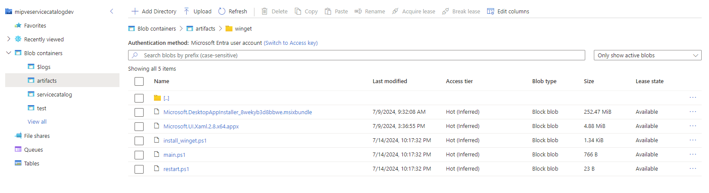 ](./media/remoteapp-winget-folder.png#lightbox)

1. Download installers and upload them to the winget folder in storage container
    - WinGet `MSIX` bundle ([Microsoft.DesktopAppInstaller_8wekyb3d8bbwe.msixbundle](https://github.com/microsoft/winget-cli/releases/tag/v1.8.1911))
    - Windows UI Library ([Microsoft.UI.Xaml.2.8.x64.appx](https://github.com/microsoft/microsoft-ui-xaml/releases/tag/v2.8.6))
1. Create and upload scripts
    1. main.ps1
        ```powershell
        # This script creates and runs a scheduled task to install the appx package and msix bundle with elevated privileges

        $installScriptPath = "C:\winget\install_winget.ps1"

        # Create a scheduled task action to run the installation script with elevated permissions
        $taskAction = New-ScheduledTaskAction -Execute 'powershell.exe' -Argument "-ExecutionPolicy Bypass -File $installScriptPath"

        # Set the task to start 30 seconds from now
        $taskTrigger = New-ScheduledTaskTrigger -Once -At (Get-Date).AddSeconds(30)
        $taskPrincipal = New-ScheduledTaskPrincipal -UserId "SYSTEM" -LogonType ServiceAccount -RunLevel Highest

        # Register the scheduled task
        Register-ScheduledTask -TaskName "InstallWinget" -Action $taskAction -Trigger $taskTrigger -Principal $taskPrincipal
        ```
    1. install_winget.ps1
        ```powershell
        Set-ExecutionPolicy -Scope Process -ExecutionPolicy Bypass -Force

        Start-Process -FilePath "DISM.exe" -ArgumentList "/Online /Add-ProvisionedAppxPackage /PackagePath:C:\winget\Microsoft.UI.Xaml.2.8.x64.appx /SkipLicense" -NoNewWindow -Wait
        Start-Process -FilePath "DISM.exe" -ArgumentList "/Online /Add-ProvisionedAppxPackage /PackagePath:C:\winget\Microsoft.DesktopAppInstaller_8wekyb3d8bbwe.msixbundle /SkipLicense" -NoNewWindow -Wait

        $wingetDir = 'C:\Program Files\WindowsApps\Microsoft.DesktopAppInstaller_1.23.1791.0_x64__8wekyb3d8bbwe'
        $currentPath = [System.Environment]::GetEnvironmentVariable("Path", [System.EnvironmentVariableTarget]::Machine)
        [System.Environment]::SetEnvironmentVariable("Path", "$currentPath;$wingetDir", [System.EnvironmentVariableTarget]::Machine)

        # Schedule the reboot script
        $rebootScriptPath = "C:\winget\reboot.ps1"
        $taskAction = New-ScheduledTaskAction -Execute 'powershell.exe' -Argument "-ExecutionPolicy Bypass -File $rebootScriptPath"

        # Set the task to start 30 seconds from now
        $taskTrigger = New-ScheduledTaskTrigger -Once -At ((Get-Date).AddSeconds(30))
        $taskPrincipal = New-ScheduledTaskPrincipal -UserId "SYSTEM" -LogonType ServiceAccount -RunLevel Highest

        # Register the scheduled task
        Register-ScheduledTask -TaskName "Reboot" -Action $taskAction -Trigger $taskTrigger -Principal $taskPrincipal
        ```
    1.  restart.ps1
        ```powershell
        Restart-Computer -Force
        ```
1. Proceed to [Deploy Template](#setup-template)
