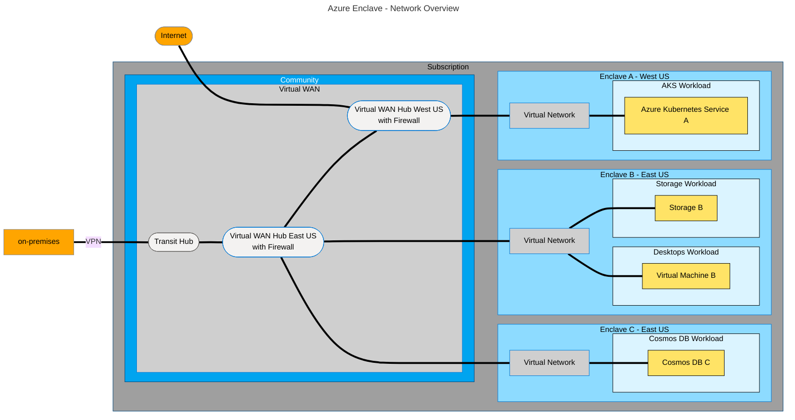

# Learn about Azure Enclave

If you're new to Azure Enclave, this article helps introduce core concepts to understand, communicate, and plan Azure Enclave environments.

## Visualize Azure Enclave

You can think of an Azure Enclave environment as a connection of network resources or as an organization of resource groups. Both are correct and can be helpful when visualizing an Azure Enclave environment depending on your role and goals.

### Network diagram

This diagram shows networking connections within Azure Enclave. The diagram should look similar to a typical hub and spoke network. The community Virtual WAN is the hub and each enclave is a spoke off of that hub. 

<!--
This is the mermaid definition for the above diagram. Use this to edit and regenerate the image.

-->

## How can I get more familiar with Azure Enclave?

Start with [What is Azure Enclave?](./what-azure-enclave.md), review the [Learn Azure Enclave article](./azure-enclave-learn.md), then create resources in a [tutorial](./1-1-create-community.md) or [sample templates](./azure-enclave-templates.md) to deploy reference architectures. Review the [best practices](./best-practices.md) article when you're ready to start planning a production design. For service limits, see [Quotas and region availability](./quotas-region-availability.md).

## Next steps
To learn more about the new Azure Enclave resources, see the following articles:

- [Why use Azure Enclave?](./why-azure-enclave.md)
- [Get started with Azure Enclave](./onboard.md)
- [What is a community?](./what-community.md)
- [What is an enclave?](./what-enclave.md)
- [What is a workload?](./what-workload.md)
- [Azure Enclave tutorials](./1-1-create-community.md)