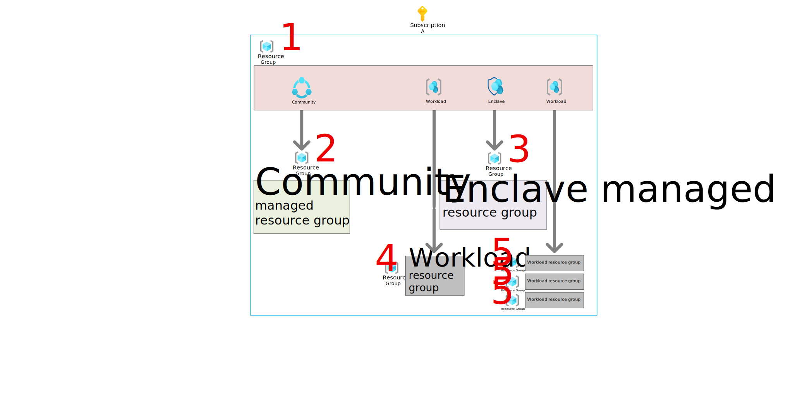
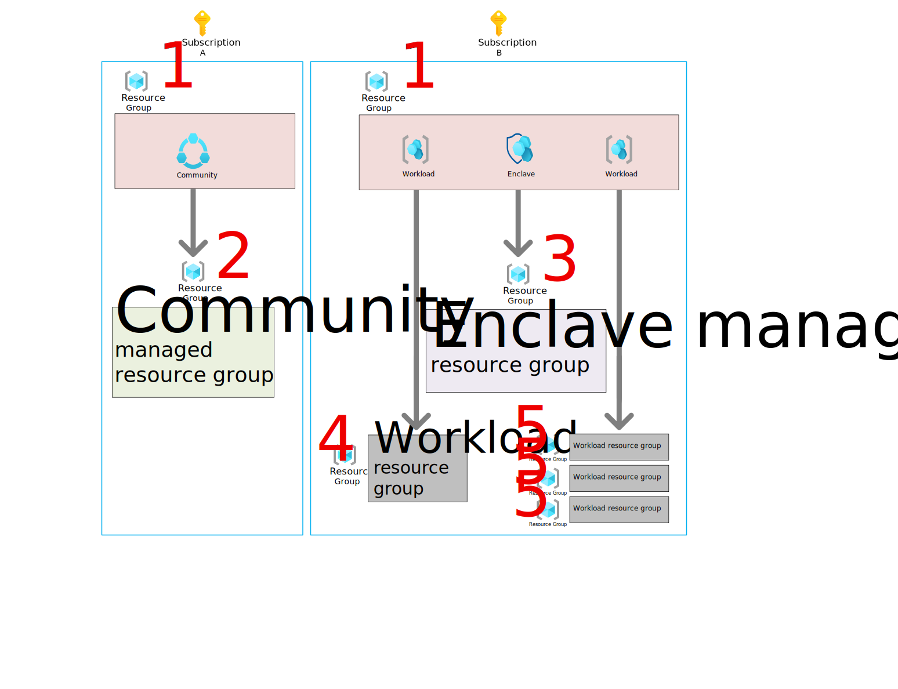

# Azure Enclave resource groups
Azure Enclave simplifies the creation of complex secure environments and includes a few resource groups to help manage and organize those resources. Resource groups are created during the creation of the Azure Enclave resources and this guide will explain the purposes of those resource groups.

## Single subscription deployment architecture
For a deployment into a single subscription, the Azure Enclave resources can be organized in one resource group. This example shows a community, an enclave, a workload with one workload resource group, and a workload with three workload resource groups.

 
1.	The resource group where the Azure Enclave resources are deployed. The Azure Enclave resources can be organized into resource groups according to your needs. 
1.	Community managed resource group - The managed resource group deployed with the community for the community resources like the firewall and Log Analytics workspace. Our documentation refers to this resource group as the `community managed resource group` and one is created for each community. You shouldn't normally deploy new Azure resources to this resource group manually. Azure Enclave manages the resources in this resource group. This resource group is deleted when the community is deleted. [What gets deployed](./what-azure-enclave.md#what-gets-deployed)
3.	Enclave managed resource group - The managed resource group deployed with the enclave for the enclave resources like the virtual network, subnet network security groups, and Log Analytics workspace. Our documentation refers to this resource group as the `enclave managed resource group` and one is created for each enclave. You shouldn't normally deploy new Azure resources to this resource group manually. Azure Enclave manages the resources in this resource group. This resource group is deleted when the enclave is deleted. [What gets deployed](./what-azure-enclave.md#what-gets-deployed)
4.	Workload resource group - The managed resource group for your resources. Our documentation refers to this resource group as the `workload resource group` and you can create many per workload. You manage the resources inside this resource group and Azure Enclave manages the policy and deletion of the resource group itself because it's linked to the workload. These resource groups are deleted when the workload is deleted or when the resource group is detached from the workload. These workload resource groups must be empty before deletion can complete successfully.
5.	Workload resource groups - Another example of workload resource groups showing one workload with three resource groups linked. You may choose to add more resources groups to a workload to logically organize your resources.

## Community and enclave managed resource group naming
During the creation of a community or enclave, a new resource group is also created for the resources required for the community or enclave to function that Azure Enclave manages. These managed resource groups are easy to identify because they have the name of the community or enclave at the beginning and then “HostedResources” followed by characters to make the name unique.

## Multi-subscription deployment architecture
For a deployment into two subscriptions, the Azure Enclave resources can be organized into two resource groups. This example shows a community in one subscription and an enclave, a workload with one workload resource group, and a workload with three workload resource groups in another subscription.

 
In this architecture with two subscriptions the Azure Enclave resources are organized into two resource groups, one in each subscription (labeled each with a `#1`). The other resource groups are aligned with the subscription as shown. If you wanted to deploy more enclaves, you could deploy all of the enclaves in this second subscription, each enclave could have its own subscription, or a combination to fit yours needs.

## Frequently asked questions
Frequently asked questions about Azure Enclave resource groups.

### How do I access the enclave portal page for management?
If you wanted to manage the enclave, you would navigate to the enclave resource located in the #1 resource group with the enclave icon. You could then perform management tasks on the enclave like enabling maintenance mode or adding an enclave endpoint. You can also navigate to this resource by searching for the enclave name in the list of all enclave resources in the portal.

### How do I manage the enclave resources (for example, virtual network)?
Some tasks like adding a subnet can be performed at the enclave portal page for management. If you need to perform a manual action on the enclave resources, understanding that these changes can break enclave functionality, you would navigate to the #3 enclave managed resource group. Changes to this managed resource group require maintenance mode and you must be added as one of the maintenance mode principals.

### How do I access the community portal page for management?
If you wanted to manage the community, you would navigate to the community resource located in the #1 resource group. You could then perform management tasks on the community like enabling maintenance mode or adding a community endpoint. You can also navigate to this resource by searching for the community name in the list of all community resources in the portal.

### How do I manage the community resources (for example, virtual WAN)?
Some tasks like adding a virtual WAN hub are handled by Azure Enclave for enclave regions. Other tasks like changing the default routing preference require a manual change. If you need to perform a manual change on the community resources, you would navigate to the #2 community managed resource group. Changes to this managed resource group require maintenance mode and you must be added as one of the maintenance mode principals.

> [!WARNING]
> 
> Changes to the community or enclave managed resource group can break community or enclave functionality so care should be taken when making manual changes to these resources.
