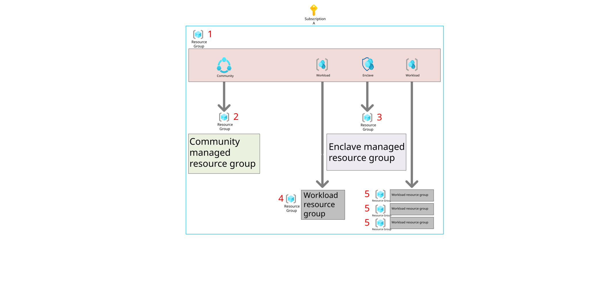
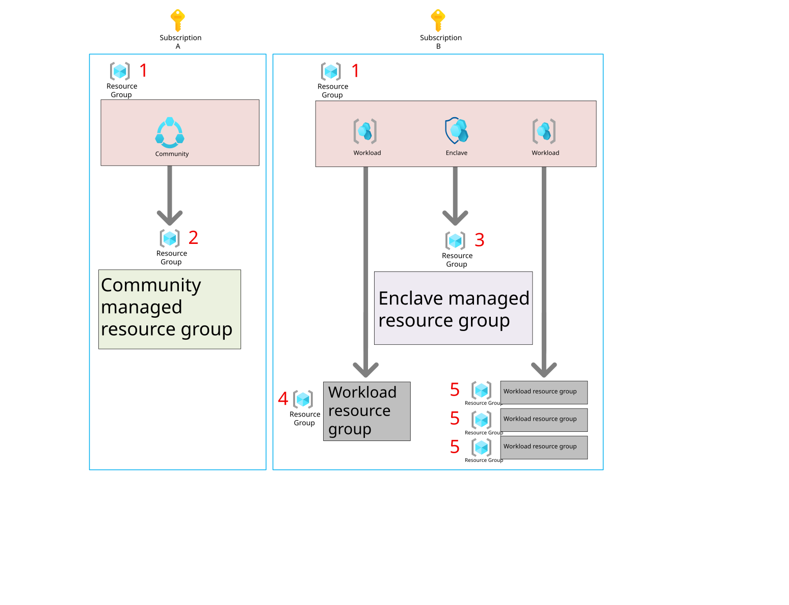

# Azure Enclave resource groups

Azure Enclave uses a small set of resource groups to organize community, enclave, and workload resources. This article explains what each resource group is for and how Azure Enclave manages it.

## Single subscription deployment architecture

For a single-subscription deployment, Azure Enclave uses managed resource groups for the community and enclave, plus workload resource groups for customer resources. This example shows a community, an enclave, and workloads with one and three workload resource groups.

- An Azure resource group contains the Azure Enclave resources for the deployment (for example, the community or enclave resource itself).
- The `community managed resource group` contains community resources such as the firewall and Log Analytics workspace. Azure Enclave creates one for each community, manages the resources in it, and deletes it when the community is deleted. See [What gets deployed](./what-azure-enclave.md#what-gets-deployed).
- The `enclave managed resource group` contains enclave resources such as the virtual network, subnet network security groups, and Log Analytics workspace. Azure Enclave creates one for each enclave, manages the resources in it, and deletes it when the enclave is deleted. See [What gets deployed](./what-azure-enclave.md#what-gets-deployed).
- The `workload resource group` contains your resources. You manage the resources in this group, and Azure Enclave manages the policy and lifecycle of the resource group itself because it is linked to the workload. Azure Enclave deletes the group when the workload is deleted or when the group is detached from the workload. The workload resource group must be empty before deletion can complete successfully.
- The three workload resource groups example shows how you can add more than one workload resource group to a workload to organize resources.

## Community and enclave managed resource group naming

During community or enclave creation, Azure Enclave creates a managed resource group for the resources required for that community or enclave to function. These managed resource groups are easy to identify because they begin with the community or enclave name, followed by `HostedResources`, and then characters that make the name unique.

## Multi-subscription deployment architecture

For a deployment across two subscriptions, Azure Enclave uses managed resource groups and workload resource groups in each subscription. This example shows a community in one subscription and an enclave with workloads in another subscription.

In this architecture, the `#1` label marks the primary deployment resource group in each subscription. The `#2` label marks the community managed resource group, and the `#3` label marks the enclave managed resource group. The remaining resource groups align with the subscription that owns them. If you want to deploy more enclaves, you can place all of the enclaves in the second subscription, give each enclave its own subscription, or use a combination that fits your needs.

## Frequently asked questions

Frequently asked questions about Azure Enclave resource groups.

### How do I access the enclave management area?

Manage the enclave through the enclave resource in the primary deployment resource group. From there, you can perform tasks such as enabling maintenance mode or adding an enclave endpoint.

### How do I manage the enclave resources, such as the virtual network?

Some tasks, such as adding a subnet, can be performed at the enclave resource. If you need to make a manual change to the enclave managed resource group, be aware that these changes can break enclave functionality. Changes to this managed resource group require maintenance mode, and you must be added as one of the maintenance mode principals.

### How do I access the community management area?

Manage the community through the community resource in the primary deployment resource group. From there, you can perform tasks such as enabling maintenance mode or adding a community endpoint.

### How do I manage the community resources, such as virtual WAN?

Some tasks, such as adding a virtual WAN hub, are handled by Azure Enclave for enclave regions. Other tasks, such as changing the default routing preference, require a manual change. If you need to change the community managed resource group, be aware that manual changes can affect community functionality. Changes to this managed resource group require maintenance mode, and you must be added as one of the maintenance mode principals.

> [!WARNING]
>
> Changes to the community or enclave managed resource groups can break community or enclave functionality. Make manual changes only when necessary and only in maintenance mode.
