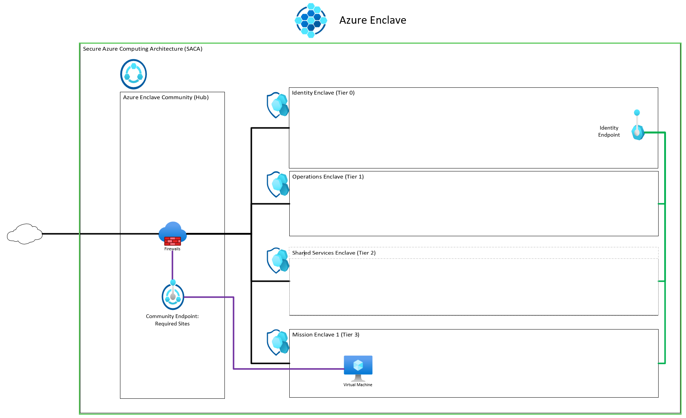
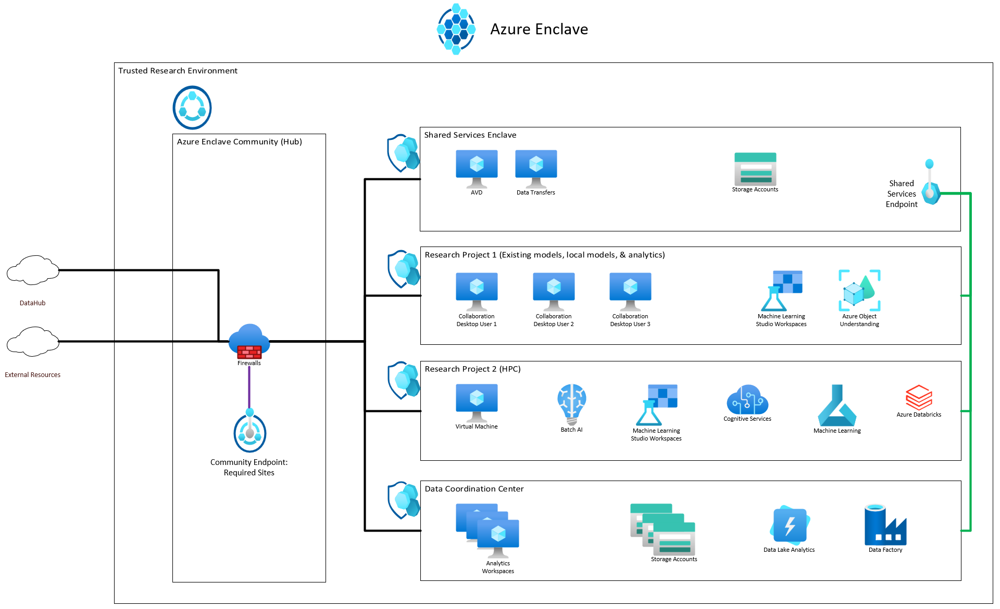
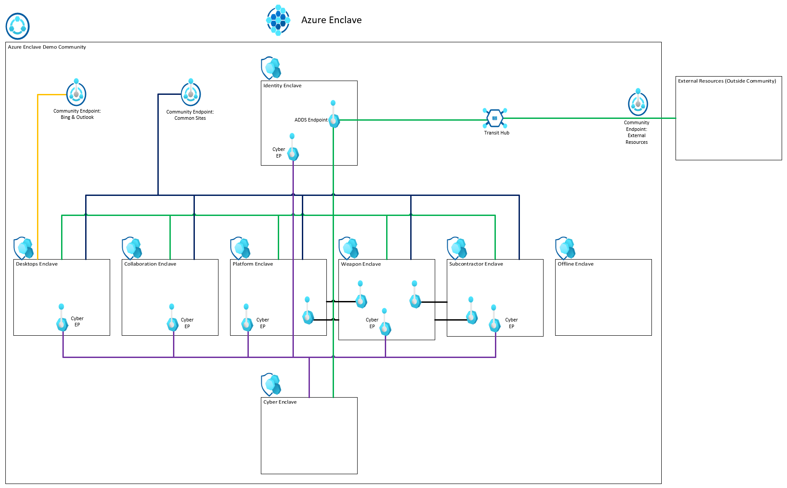
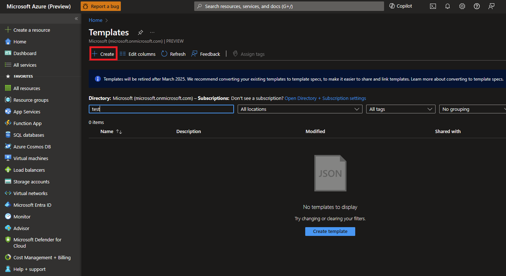

# Azure Enclave deployment templates
Example templates to deploy multiple Azure Enclave resources for a sample scenario. The current templates are maintained using a [Bicep](/azure/azure-resource-manager/bicep/overview) file but are converted to [Azure Resource Manager (ARM)](/azure/azure-resource-manager/templates/overview) templates for deployment from the portal. Both bicep and ARM formats can be published as a [template spec](#create-template-spec-and-deploy) for your workload admins too.

## Secure Azure Computing Architecture (SACA) template
An example of how to deploy the SACA within Azure Enclave.

What gets deployed:
- One  [community](./what-community.md)
- Four  [enclaves](./what-enclave.md)
- Four  [workloads](./what-workload.md)
- Five  [community endpoints](./what-community-endpoint.md)
- One  [enclave endpoint](./what-enclave-endpoint.md)
- 18  [enclave connections](./what-enclave-connection.md)
- One  [transit hub](./what-transit-hub.md)

[ARM Template](https://github.com/Azure/virtual-enclaves/ave-templates/ave-saca.json) (easiest to deploy via Portal, PowerShell, or command line)

[Bicep Template](https://github.com/Azure/virtual-enclaves/ave-templates/ave-saca.bicep) (easiest to edit and maintain, then convert to ARM template before deployment)

Deploy the template:
1. Open the Azure portal and type `deploy` into the top search bar and select `Deploy a Custom Template`.
1. Select `Build your own template in the editor`.
1. Replace the default template with the ARM template contents (for example copy the text inside the json file). See [this article](/azure/azure-resource-manager/templates/quickstart-create-templates-use-the-portal#edit-and-deploy-the-template) if you have any issues.
1. Select `Save`.
1. Select `Create New` under `Resource Group` and enter the resource group name you would like to use (for example community-template-rg) for the Azure Enclave resources.
1. Increment `Unique Number` if previous deployments are located in the same resources group.
1. Review the remaining parameters but keep the default unless you would like to test a modification.
1. Select `Review + Create` and then `Create`.

## Trusted Research Environment (TRE) within Azure Enclave

What gets deployed:
- One  [community](./what-community.md)
- Four  [enclaves](./what-enclave.md)
- Four  [workloads](./what-workload.md)
- Five  [community endpoints](./what-community-endpoint.md)
- Two  [enclave endpoint](./what-enclave-endpoint.md)
- 15  [enclave connections](./what-enclave-connection.md)
- One  [transit hub](./what-transit-hub.md)

[ARM Template](https://github.com/Azure/virtual-enclaves/ave-templates/ave-tre.json) (easiest to deploy via Portal, PowerShell, or command line)

[Bicep Template](https://github.com/Azure/virtual-enclaves/ave-templates/ave-tre.bicep) (easiest to edit and maintain, then convert to ARM template before deployment)

Deploy the template:
1. In the Azure portal, type `deploy` into the top search bar and select `Deploy a Custom Template`.
1. Select `Build your own template in the editor`.
1. Replace the default template with the provided template (for example, copy the text inside the json file). See [this quickstart](/azure/azure-resource-manager/templates/quickstart-create-templates-use-the-portal#edit-and-deploy-the-template) if you have any issues with the above steps.
1. Select `Save`.
1. Under `Resource Group`, select `Create New` and enter the resource group name you would like to use (for example, community-template-rg) for the Azure Enclave resources.
1. Optionally, Under `Unique Number`, increment the number if previous deployments occurred in the same resources group.
1. The remaining parameters that aren't required can be left as the default unless you would like to test a modification. Keep the defaults for the first test deployment to reduce errors from template changes.
1. Select `Review + Create` and then `Create`.

## Azure Enclave demo environment template

What gets deployed:
- One  [community](./what-community.md)
- Eight  [enclaves](./what-enclave.md)
- Eight  [workloads](./what-workload.md)
- Five  [community endpoints](./what-community-endpoint.md)
- 11 [enclave endpoint](./what-enclave-endpoint.md)
- 39 [enclave connections](./what-enclave-connection.md)
- One  [transit hub](./what-transit-hub.md)

[ARM Template](https://github.com/Azure/virtual-enclaves/ave-templates/ave-demo-env.json) (easiest to deploy via Portal, PowerShell, or command line)

[Bicep Template](https://github.com/Azure/virtual-enclaves/ave-templates/ave-demo-env.bicep) (easiest to edit and maintain, then convert to ARM template before deployment)

Deploy the template:
1. Open the Azure portal and type `deploy` into the top search bar and select `Deploy a Custom Template`.
1. Select `Build your own template in the editor`.
1. Replace the default template with the ARM template contents (for example copy the text inside the json file). See [this article](/azure/azure-resource-manager/templates/quickstart-create-templates-use-the-portal#edit-and-deploy-the-template) if you have any issues with the above steps.
1. Select `Save`.
1. Select `Create New` under `Resource Group` and enter the resource group name you would like to use (for example community-template-rg) for the Azure Enclave resources.
1. Increment `Unique Number` if previous deployments are located in the same resources group.
1. Review the remaining parameters but keep the default unless you would like to test a modification.
1. Select `Review + Create` and then `Create`.

## Resource modules
You can also create the Azure Enclave resources using the resource modules in this [repository](https://github.com/Azure/virtual-enclaves/ave-templates/ave-templates/modules/).

## Create template spec and deploy
1. Sign in to the Azure portal, search and select the **Template Specs** service. Select **Create template spec**. In the ARM Template section upload or copy and paste the above ARM template.

1. On the **Basics** page, leave the default values, and configure the following template parameters:
   - **Subscription**: Select an Azure subscription.
   - **Resource group**: Select Create new. Enter a unique name for the resource group, such as `myResourceGroup`, then select OK.
   - **Location**: Select a location, such as East US.
   - **Community Name**: Name of the Community (ex: `My-Community`)
   - **Enclave Name**: Name of the enclave (ex: `My-Enclave`)
   - **Endpoint name**: Name of the enclave endpoint (ex: `endpoint-bingdotcom`)

1. Select `Review + Create` and then `Create`.

1. Once the template is created and available on the **Template Specs** page, select newly created ARM template and then select **Deploy**.  

1. On the **Deploy** page for the template spec, note the default values and configure the following parameters:
   - **Community Name**: Name of the Community (ex: `My-Community`)
   - **Enclave Name**: Name of the enclave (ex: `My-Enclave`)
   - **Endpoint name**: Name of the enclave endpoint (ex: `endpoint-bingdotcom`)
   
1.  Select `Review + Create` and then `Create`.

It can take up to 50 minutes to finish all resource creation. Wait for the deployment to be successfully completed before you take any actions within your deployed resources.

## Validate the deployment

Learn more about what gets deployed in a [community](./what-community.md) and what gets deployed in an [enclave](./what-enclave.md).

### Connect to the Admin VMs
Learn more about how to access resources within your enclave from the enclave Admin VM [here](./understand-admin-vm.md).

## Terraform
Terraform support will start after Azure Enclave starts preview.
