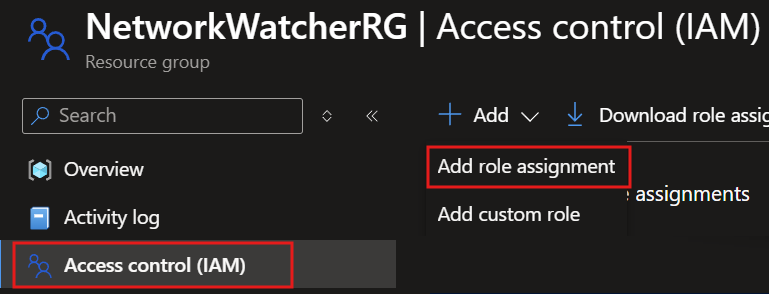
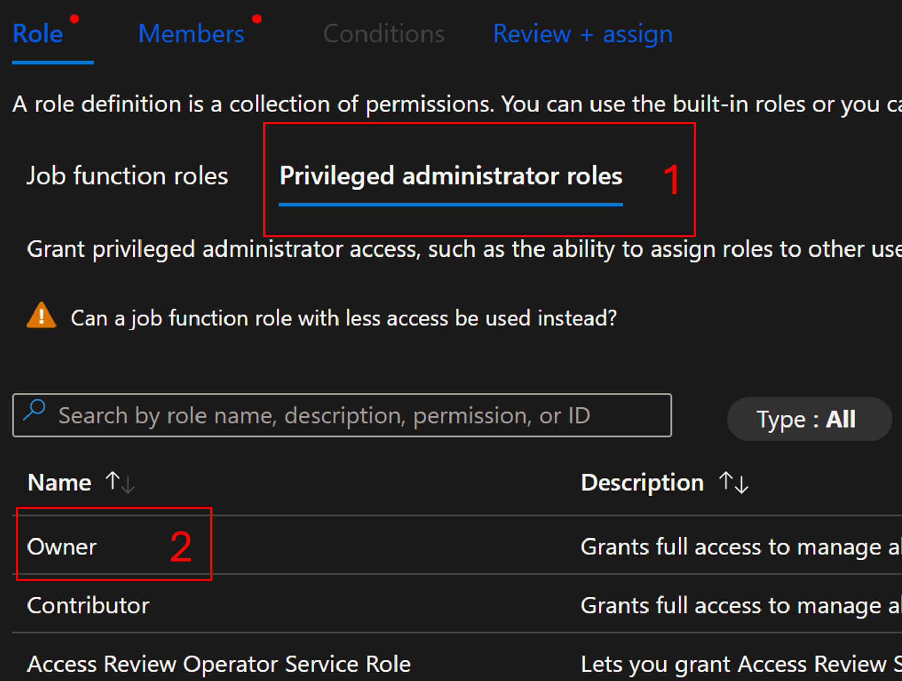
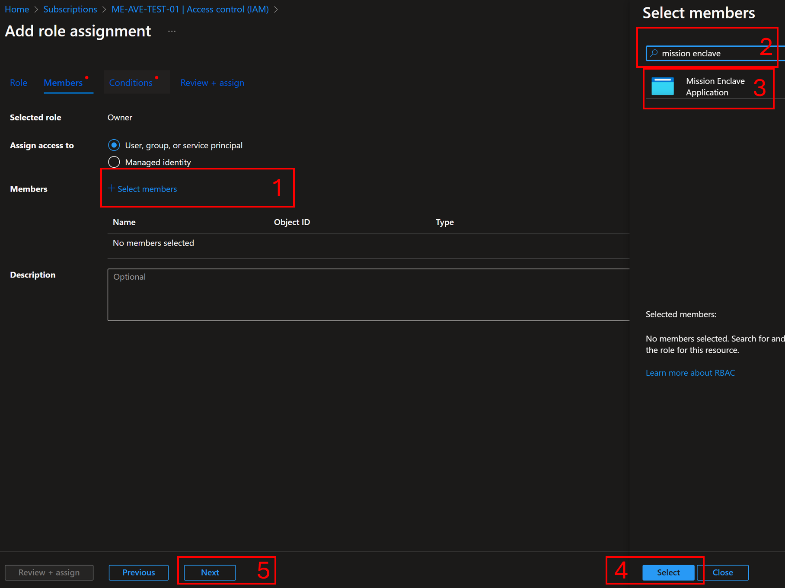
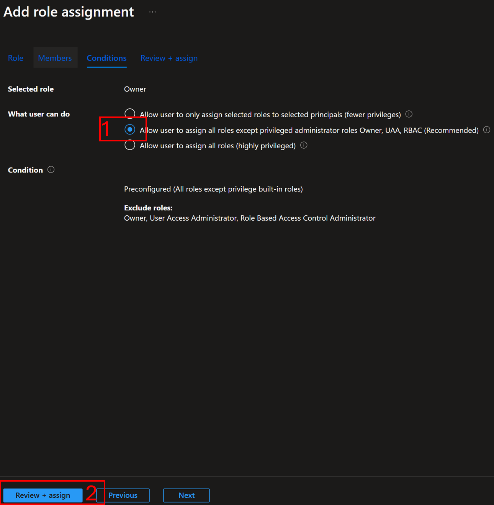
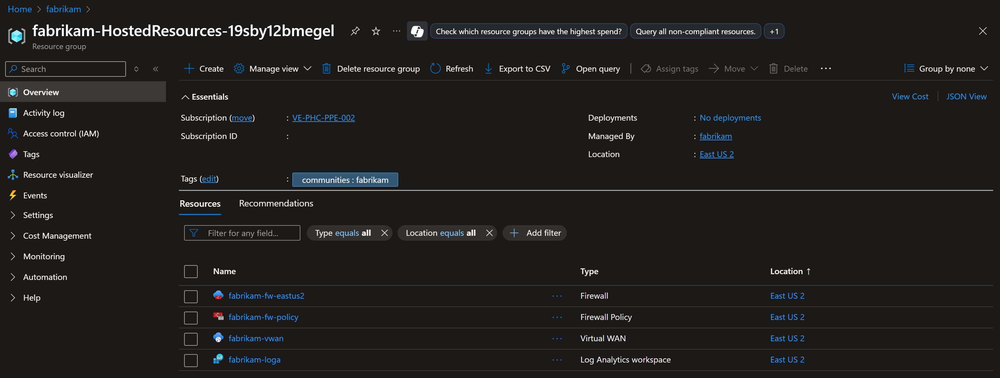
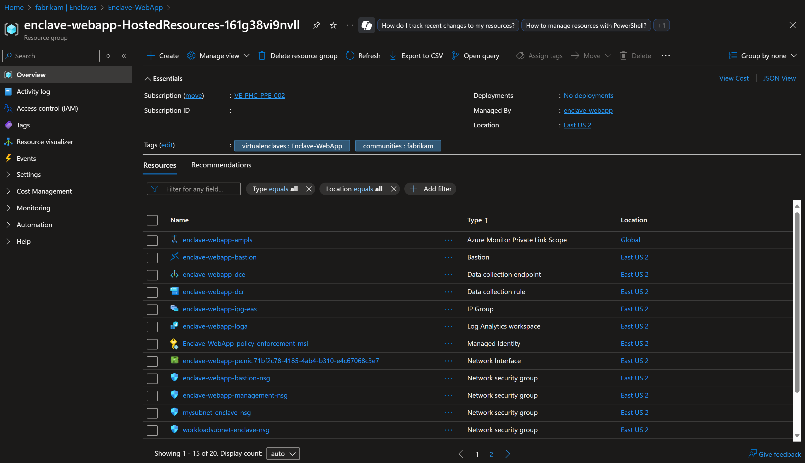

# Azure Enclave best practices

This article describes key concepts and best practices for Azure Enclave.

Azure Enclave accelerates and streamlines the deployment and management of secure, isolated, and compliant cloud environments. These environments are designed to handle the most sensitive missions and workloads across Commercial and air-gapped environments.

Building and running workloads successfully in Azure Enclave requires understanding and implementation of some key concepts, including:

- [Networking and organizational design patterns](#networking-and-organizational-design-patterns-for-azure-enclave)
- [Security design patterns](#security-design-patterns-for-azure-enclave)
- [Managed resource groups](#managed-resource-groups-in-azure-enclave)

The Azure Enclave product group, engineering teams, and field teams developed the following best practices and conceptual articles. The articles were created to help community and enclave owners and developers better understand important concepts and implement the appropriate features.

## Azure setup

Read through these setup steps to determine whether these configuration steps fit your Azure Enclave use cases.

### Configure Network Watcher resource groups

To avoid potential issues with [virtual network flow log](/azure/network-watcher/vnet-flow-logs-overview) creation, set up the `NetworkWatcherRG` resource group manually in advance and assign the `Mission Enclave` app the `Owner` role on that resource group, or verify that setup and role assignment happened automatically before creating your first enclave in the subscription.

To mitigate this potential issue, for each subscription, manually create the NetworkWatcher resource group called `NetworkWatcherRG` in new subscriptions, and then grant the `Mission Enclave` Azure Enclave App `Owner` on the NetworkWatcherRG:
1. Select the `NetworkWatcherRG` resource group, select `Access control (IAM)`, then select `Add` and `Add role assignment`.



1. Select `Privileged administrator roles`, select `owner`, then select `Next`.



1. Select `Select members`, type `Mission Enclave` in the search and select the `Mission Enclave` app, select `Select`, then `Next`.



1. If your subscription requires a condition, select `Allow user to assign all roles except privileged administrator roles Owner, UAA, RBAC (Recommended)`, then select `Review + assign`.



1. Once the update is complete, you can start deploying Azure Enclave resources.

When a community or enclave is created, Azure Enclave attempts the following steps:
1. Check if the `NetworkWatcherRG` exists. If not, attempt to create that resource group.
1. Check if the `Mission Enclave` App has a permanent `Owner` assignment on `NetworkWatcherRG`. If not, attempt to assign the `Mission Enclave` App as a permanent `Owner` assignment on `NetworkWatcherRG`. Even if an inherited `Owner` permission exists, a permanent `Owner` assignment creation is attempted.
1. If any step fails, enclave deployments might fail when attempting to create virtual network flow logs.

## Networking and Organizational Design Patterns for Azure Enclave

### Multi-tenancy

- [How to organize resources](/azure/cloud-adoption-framework/ready/azure-setup-guide/organize-resources)

### Networking design

Azure Enclave brings together the capabilities and flexibility of several Azure networking products in a simplified user interface including:
- Azure Virtual WAN
- Azure Firewall
- Azure Virtual Network
- Network Security Groups

Azure Enclave makes the following overall recommendations:

- [Communities](./what-community.md) should be deployed when you have networking requirements to provide an [Azure Firewall](https://aka.ms/azurefirewall), which is Azure's intelligent firewall security Platform-as-a-Service.
- Communities should be deployed when you have organizational or data sensitivity requirements to separate a hub-and-spoke Virtual WAN from another hub-and-spoke Virtual WAN.
- Communities should be deployed when you have networking requirements to support systems spanning [multiple Azure regions](/azure/cloud-adoption-framework/ready/azure-setup-guide/regions), in which each region requires its own Azure Firewall. [Learn more about multi-hub Azure Firewall use-cases](/azure/firewall/firewall-multi-hub-spoke).
- Communities should be deployed when you have networking requirements to support a large number of systems on a distributed, hub-and-spoke wide area network. Learn more about [Azure Virtual WAN](/azure/virtual-wan/virtual-wan-faq).
- [Enclaves](./what-enclave.md) should be deployed when you have networking requirements to deploy similar workloads as part of the same private network.
- Enclaves should be deployed when you have workload requirements that need a virtual network and is within the same Virtual WAN as an existing community.

#### Community network design considerations

You should follow, wherever possible, underlying Azure service best practices documentation when planning your community networks. Including these best practices:

- [Azure Firewall best practices](/azure/firewall/firewall-best-practices)
- [Azure Firewall multi-hub-and-spoke](/azure/firewall/firewall-multi-hub-spoke)
- [Hub-and-spoke Azure Virtual WAN Architecture](/azure/architecture/networking/hub-spoke-vwan-architecture)
- [Azure Virtual WAN Network topology](/azure/cloud-adoption-framework/ready/azure-best-practices/virtual-wan-network-topology)
- [Azure Virtual WAN FAQ](/azure/virtual-wan/virtual-wan-faq)

#### Enclave network design considerations

You should follow, wherever possible, underlying Azure service best practices documentation when planning your enclave networks. Including these best practices:

- [Azure Virtual Network concepts and best practices](/azure/virtual-network/concepts-and-best-practices)
- [Network security groups overview](/azure/virtual-network/network-security-groups-overview)

Learn more about overall [Azure networking best practices](/azure/security/fundamentals/network-best-practices).

### Workload deployment

- Workloads are linked to a managed resource group where enclave contributors can deploy Azure resources.
- By default, all Azure Enclave workloads are [governed](./what-azure-enclave.md#multi-layered-governance-security-and-monitoring) through built-in Azure Policy initiatives
- Workloads associated with a [community](./what-community.md) that has a custom governance setup, use this unique configuration instead of the default Azure Enclave governance configuration.
- [Considerations for naming Azure resources](/azure/azure-government/documentation-government-concept-naming-resources)

## Security design patterns for Azure Enclave
Consider these security design patterns when designing your Azure Enclave environments.

### Security boundaries

Azure Enclave employs a defense-in-depth approach when it comes to cybersecurity. When you deploy a community and enclaves, Azure Enclave establishes several layers of network isolation, security, access controls, and logging and monitoring.

### Shared security responsibilities

As a service on Azure, Azure Enclave also is committed to upholding the [shared responsibility model](/azure/security/fundamentals/shared-responsibility) in the cloud. For Azure Enclave specifically, [workloads](./what-workload.md) are your responsibility. Azure shared responsibility is inherited in workloads if you deployed PaaS services into your workloads.

Your [communities](./what-community.md) and [enclaves](./what-enclave.md) represent a shared responsibility. Communities and enclaves use a shared responsibility model where the Azure Enclave Resource Provider creates your secured, preconfigured hub-and-spoke network environment. You manage this network environment by creating [enclave endpoints](./create-enclave-endpoint-portal.md), [community endpoints](./create-community-endpoint-portal.md), [transit hubs](./create-transit-hub-portal.md), or [enclave connections](./create-enclave-connection-portal.md). Certain preview versions of Azure Enclave also allow you to manually make changes to the network through underlying controls provided by [Azure Virtual WAN](/azure/virtual-wan/virtual-wan-about), [Azure Virtual Network](/azure/virtual-network/virtual-networks-overview), and other underlying Azure networking services.

Azure Enclave [governance](./what-azure-enclave.md#multi-layered-governance-security-and-monitoring) is also a shared responsibility. The Azure Enclave Resource Provider creates a secured, preconfigured list of [Azure Policy initiatives](./aks-initiative.md) per [workload](./what-workload.md) deployment. However, [communities](./what-community.md) now have the capability to customize the community Azure Policy Initiatives, which overrides the preconfigured list for the workload. Despite the policy requirements, you retain the ability to make manual [exemptions](./policy-compliance-exemptions.md) to these Azure Policy Initiative assignments depending on their compliance or governance requirements.

### Azure Security best practices

Azure Enclave recommends following [Microsoft Azure Security best practices and patterns](/azure/security/fundamentals/best-practices-and-patterns) for deploying Azure resources and implementing workloads.

You should follow the [Azure security best practices - Cloud Adoption Framework](/azure/cloud-adoption-framework/secure/security-top-10) for organizing your systems, cloud infrastructure, IT personnel and teaming structures, and corporate cybersecurity awareness trainings.

### Data exfiltration via Domain Name System

Data exfiltration through Domain Name System (DNS) represents a significant security concern for organizations, as it uses a protocol that is typically allowed through firewalls and rarely monitored for malicious activity. Attackers can exploit DNS queries to covertly extract sensitive data from compromised systems by encoding information within domain names or using DNS tunneling techniques. This method is insidious because DNS traffic appears legitimate and often bypasses traditional security monitoring tools.

In DNS-based data exfiltration attacks, malicious actors encode stolen data into DNS queries, often using techniques such as subdomain labeling or TXT record queries. For example, an attacker might break sensitive data into chunks and embed each chunk as a subdomain in DNS queries to attacker-controlled domains. The data can be extracted from DNS logs on the attacker's DNS server. This approach allows for the gradual exfiltration of large datasets while maintaining a low profile, as the DNS queries appear as normal name resolution requests.

#### Addressing data exfiltration with Azure DNS Security Policy

Azure DNS Security Policy provides comprehensive protection against DNS-based data exfiltration attacks by offering granular control over DNS traffic within Azure Virtual Networks. This service enables organizations to implement proactive security measures that can detect, alert on, and block suspicious DNS activity before data can be successfully exfiltrated.

Azure DNS Security Policy addresses DNS data exfiltration through several key mechanisms. First, it provides the ability to create DNS traffic rules that can block queries to known malicious domains or suspicious domain patterns commonly used in exfiltration attempts. Organizations can maintain block lists of domains associated with command and control infrastructure or data exfiltration services. Second, the service offers comprehensive DNS logging capabilities that capture all DNS queries and responses within protected virtual networks. This logging enables security teams to analyze DNS traffic patterns and identify potential exfiltration attempts. Third, the policy engine supports wildcard domain filtering, allowing organizations to block entire categories of suspicious domains or implement allow lists for approved DNS destinations.

The implementation of Azure DNS Security Policy creates multiple layers of defense against DNS data exfiltration. Traffic rules can be configured with different priority levels, allowing for complex security policies that balance security with operational requirements. The service supports real-time blocking of malicious queries while providing detailed logs for forensic analysis and threat hunting. Additionally, virtual network links ensure that DNS security policies are consistently applied across all resources within protected network segments, creating a comprehensive security perimeter that's difficult for attackers to bypass.

For Azure Enclave deployments, Azure DNS Security Policy should be integrated as part of the overall security architecture. Organizations should configure DNS security policies to monitor and control DNS traffic from enclave workloads, ensuring that sensitive data remains protected even if individual workloads become compromised. Regular review and updating of DNS domain lists, combined with continuous monitoring of DNS logs, provides ongoing protection against evolving DNS-based threats and helps maintain the security integrity of the Azure Enclave environment.

More information is available at the [DNS Security Policy documentation](/azure/dns/dns-security-policy).

#### Implementing deny-by-default DNS security policies

For maximum security in Azure Enclave environments, organizations should implement a "deny by default, allow by exception" approach to DNS filtering. This security model ensures that all DNS queries are blocked unless explicitly permitted, providing the strongest protection against DNS-based data exfiltration and command-and-control communications.

The deny-by-default approach is implemented using a two-tier DNS rule structure within Azure DNS Security Policy:

**Step 1: Create the default deny rule**
Create a DNS Domain List containing only the root domain `.` (dot). This wildcard domain matches all possible DNS queries. Associate this domain list to a DNS traffic rule configured with:

- **Priority**: 65000 (lowest priority)
- **Action**: Block
- **Domain List**: Root domain (`.`)

This rule serves as the catch-all that blocks any DNS query not explicitly allowed by higher-priority rules.

**Step 2: Create allow-list rules**
Create separate DNS Domain Lists containing specific domains that are required for legitimate business operations. These might include:

- Essential Azure services (for example, `*.azure.com`, `*.microsoft.com`)
- Corporate domains and trusted non-Microsoft services
- Operating system update services
- Certificate authority domains

Associate the allow lists to DNS traffic rules configured with:

- **Priority**: 500-1000 (higher priority than the default deny)
- **Action**: Allow
- **Domain Lists**: Specific approved domains

**Priority-based rule processing**
Azure DNS Security Policy processes rules in priority order (lower numbers = higher priority). When a DNS query is made:

1. The system first evaluates high-priority allow rules (priority 500-1000)
1. If the domain matches an allow list, the query is permitted
1. If no `allow` rules match, the query falls through to the default deny rule (priority 65000) and the traffic is blocked

This approach provides several security advantages:

- **Zero trust model**: No DNS queries are permitted unless explicitly authorized
- **Granular control**: Organizations can precisely control which domains are accessible
- **Audit trail**: All blocked queries are logged, providing visibility into potential threats
- **Incremental updates**: New approved domains can be added to allow lists without modifying the default deny rule

**Example implementation:**

```
Priority 500: Allow rule for Azure services
- Domain List: azure-services (contains azure.com., microsoft.com.)
- Action: Allow

Priority 600: Allow rule for business applications
- Domain List: business-domains (contains company.com., partner1.com., partner2.com.)
- Action: Allow

Priority 65000: Default deny rule
- Domain List: deny-all (contains .)
- Action: Block
```

Organizations implementing this approach should start with a comprehensive inventory of required domains and gradually refine the list of allowed domains based on operational needs and security logs. Regular review of blocked queries helps identify legitimate domains that might need to be added to the allow lists while maintaining strong security posture.

#### Implementing deny-by-default DNS policies with Windows DNS Server

For environments that can't utilize Azure DNS Security Policy or require on-premises DNS control, similar deny-by-default security can be implemented using Windows DNS Server with DNS Policy features. This approach provides comparable protection against DNS-based data exfiltration while maintaining compatibility with existing Windows infrastructure.

Windows DNS Server (Windows Server 2016 and later) supports DNS Policy functionality that enables organizations to implement sophisticated DNS filtering rules. The deny-by-default model can be achieved through a combination of [DNS Policy rules](/powershell/module/dnsserver/add-dnsserverqueryresolutionpolicy) and zone configurations.

## Managed resource groups in Azure Enclave

The resource groups that contain resources managed by Azure Enclave.

### Community managed resource group

The _Community managed resource group_ contains the infrastructure resources described in [What is a community?](./what-community.md).

The community managed resource group name follows this naming convention: `myCommunityName-HostedResources-<GUID>`. Every community deployment creates this resource group and places community infrastructure inside it. When you delete your community, the Azure Enclave resource provider automatically deletes the community managed resource group.



The community managed resource group has the following limitations:

- You can't specify an existing resource group for the community managed resource group.
- You can't specify a different subscription for the community managed resource group.
- You can't change the community managed resource group name after the community is created.
- You can't specify names for the managed resources within the community managed resource group.
- You can't modify or delete Azure-created tags of managed resources within the community managed resource group.

If you modify or delete Azure-created tags, resources, and other resource properties in the community managed resource group, you could see unexpected results. As Azure Enclave manages the lifecycle of infrastructure in the community managed resource group, any changes could potentially move your enclave into an unsupported state.

A common scenario where you want to modify resources is through tags. Azure Enclave allows you to create and modify tags that are propagated to resources in the community managed resource group. You might want to create or modify custom tags, for example, to assign a business unit or cost center. This can also be achieved by creating Azure Policies with a scope on the community managed resource group.

> [!NOTE]
>
> If you don't have community managed resource group lockdown enabled, you can directly modify any resource in the community managed resource group. Directly modifying resources in the community managed resource group can cause your enclave to become unstable or unresponsive.

### Enclave managed resource group

The _Enclave managed resource group_ contains the infrastructure resources described in [What is an enclave?](./what-enclave.md).

The enclave managed resource group name follows this naming convention: `myEnclaveName-HostedResources-<GUID>`. Every enclave deployment creates this resource group and places enclave infrastructure inside it. When you delete your enclave, the Azure Enclave resource provider automatically deletes the enclave managed resource group.



The enclave managed resource group has the following limitations:

- You can't specify an existing resource group for the enclave managed resource group.
- You can't specify a different subscription for the enclave managed resource group.
- You can't change the enclave managed resource group name after the enclave is created.
- You can't specify names for the managed resources within the enclave managed resource group.
- You can't modify or delete Azure-created tags of managed resources within the enclave managed resource group.

If you modify or delete Azure-created tags, resources, and other resource properties in the enclave managed resource group, you could get unexpected results, such as network, access, and monitoring errors. As Azure Enclave manages the lifecycle of infrastructure in the enclave managed resource group, any changes could potentially move your enclave into an unsupported state.

A common scenario where you want to modify resources is through tags. Azure Enclave allows you to create and modify tags that are propagated to resources in the enclave managed resource group. You might want to create or modify custom tags, for example, to assign a business unit or cost center. Resource tagging can also be achieved by creating Azure Policies with a scope on the enclave managed resource group.

> [!WARNING]
>
> Modifying resources in the enclave managed resource group can cause your enclave to become unstable or unresponsive.

### Workload resource group

The workload is linked to one or more resource groups where you can create and organize your Azure resources.

#### Add a resource group to a workload

Adding a new resource group normally requires the user to have permissions to create a new resource group. Subscription `Owner` or `Contributor` roles have this permission but the person creating the workload resource group might not have or need this privileged permission. Azure Enclave attempts three ways to create the new resource group ranging from the highest to lowest user permission requirements, offering flexibility for the user:

- Option 1: Requires the most privileged permissions for the individual creating or updating the workload, providing full control but necessitating elevated access.
- Option 2: Involves manual setup by the user to [grant our `Mission Enclave` application ownership at the subscription level](./onboard.md), which might not align with your preferences.
- Option 3: Requires no permissions for either the user or the `Mission Enclave` application, making it the easiest method but imposing a strict 1:1 relationship between the resource group and workload.

Each option has benefits and limitations, balancing control, convenience, and flexibility to fit varying needs. These options are each evaluated starting with option 1 and the first option to succeed is used to create the new resource group.

After you create one workload resource group by using option 3, you see a warning that option 3 can't be used for the next workload resource groups on that workload. You can also create a new workload and then create a new workload resource group by using option 3 again.

Add a resource group to your enclave:

1. Open the Azure portal page for the workload.
1. Select `Manage` and then `Resource Groups`.
1. Select `Add a resource group`.
1. In the side window that opens, select `Create new` to provide the name of the new empty resource group, or select the `Resource Group` drop-down to choose an existing resource group.
1. Select `OK` and then `Save`.

#### How is a workload resource group different from other Azure resource groups?

A workload resource group is a critical component of the Azure Enclave security and compliance because that's where your important resources are created. Since these workload resource groups are linked to a workload, and the workload is linked to an enclave, Azure Enclave manages the [deletion of workload managed resource groups](#workload-deletion).

Additionally, policy is applied to the workload resource groups. Similar to how the community policies flow down to the enclave, the enclave policies flow down to the [workload](./what-workload.md) resources and [workload resource groups](./what-workload.md#workload-resource-group). When you create a new workload resource group, the roles are set at the enclave level and inherited from the subscription. Some of these policies are inherited from the community and you can also create policies on the enclave that flow down to workloads and workload resource groups.

#### Organizing resources in workload resource groups

If you wanted to split your resources into two resource groups, you can choose either of these options:

- split those resources between two resource groups linked to one workload
- split those resources between two workloads each having one or more resource groups

#### Workload deletion

When a workload deletion is requested, the workload resource groups are checked to make sure they're empty. If workload resource groups contain resources, the requested workload deletion fails and shows an error. To delete the workload and workload resource groups, first empty the workload resource groups. Empty workload resource groups help avoid accidental deletion of important resources.

Deletion of a resource linked to the workload follows the same behavior. For example, if a community deletion is requested but all workload resource groups aren't empty, the operation shows an error. Empty the workload resource groups and try again.

The workload managed resource group has the following limitations:

- You can't specify an existing resource group for the workload managed resource group.
- You can't specify a different subscription for the workload managed resource group.
- You can't change the workload managed resource group name after the workload is created.
- You can't modify or delete Azure-created tags of managed resources within the workload managed resource group.

A common scenario where you want to modify resources is through tags. Azure Enclave allows you to create and modify tags that are propagated to resources in the workload managed resource group. You might want to create or modify custom tags, for example, to assign a business unit or cost center. Tagging can also be achieved by creating Azure Policies with a scope on the workload managed resource group.

## Other Azure best practices

As you build your communities, enclaves, and workloads in Azure, it's important to keep in mind the following universal design principles:

- [Networking architecture design in Azure](/azure/architecture/guide/networking/networking-start-here)
- [Hub-spoke network topology in Azure](/azure/architecture/reference-architectures/hybrid-networking/hub-spoke?tabs=cli)
- [Azure Private Link in a hub-and-spoke network](/azure/architecture/guide/networking/private-link-hub-spoke-network)
- [Azure Firewall - Well-Architected Framework](/azure/well-architected/services/networking/azure-firewall)
- [Considerations for naming Azure resources](/azure/azure-government/documentation-government-concept-naming-resources)
- [Microsoft Azure Security best practices and patterns](/azure/security/fundamentals/best-practices-and-patterns)
