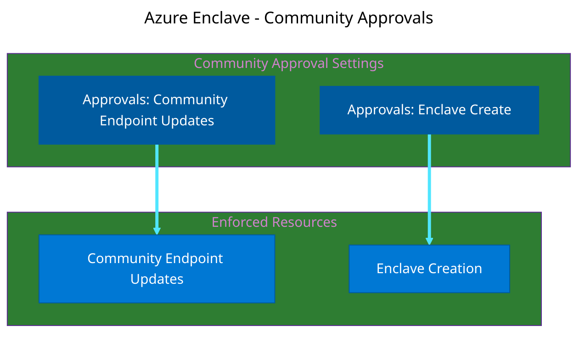
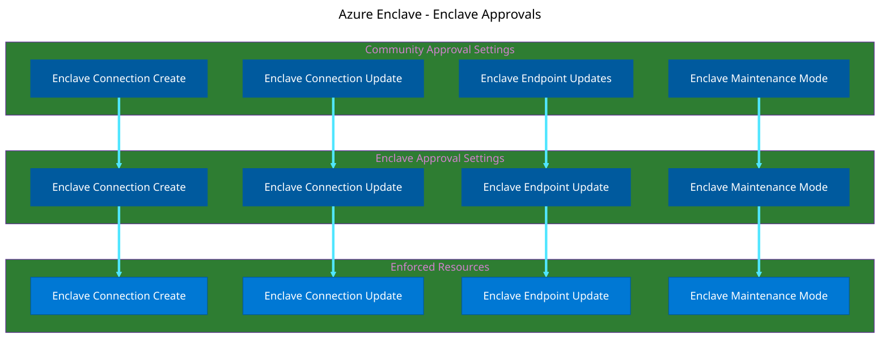

# Configure Approvals in Azure Enclave

This article explains how to configure the Approvals feature in Azure Enclave to enforce governance and oversight for critical infrastructure operations.

> [!IMPORTANT]
> 
> The Approvals feature is currently in **Preview**. This feature is encouraged for testing but shouldn't be used for production workloads while in preview.

## Prerequisites

Before configuring Approvals, make sure you have:

- An active Azure subscription
- Access to the Approvals preview
- One of the following roles:
  - Community Owner
  - Community Contributor
  - Subscription Owner/Contributor
- At least one community created in your environment
- Users or groups designated as approvers

## Approval scopes

Approval settings can be configured at different scopes:

| Scope | Applies to |
|-------|------------|
| Community | Community-level resources, such as community endpoints and transit hubs. |
| Enclave | Enclave-level resources, such as enclave endpoints and enclave connections. |

Approval settings for community resources are configured when you create or update a community. Approval settings for enclave resources can be configured at community creation and enclave creation. When both scopes define requirements for the same enclave resource type, Azure Enclave applies the higher-level enforced requirement. You can configure different approval requirements based on the type of resource or operation.

Community owners can also choose not to define a community-level approval setting for a resource type. When the community-level configuration is left blank, enclave-level approval settings can be used without inheriting a community-level requirement for that resource type.

## Minimum approvers and required approvers

Approval configuration includes two related concepts:

- `Minimum approvers`: The number of approvers that must approve a request before Azure Enclave can apply the change.
- `Required approvers`: The users or groups that are allowed or required to review requests for a resource type.

For example, a resource type might require at least two approvals and require one approval from a specific security operations group. In that case, configure `Minimum approvers` for the count and configure `Required approvers` for the approver identities or group.

> [!TIP]
> 
> If you add required approvers, you should select a security group so an individual leaving your organization doesn't block resource deployments.

## Community approvals settings flow down

:::image type="content" source="./media/mermaid-community-approvals.png" alt-text="Diagram showing how the community approvals settings affect the creation of enclaves, updates to community endpoints, and changing community maintenance mode." border="True" lightbox="./media/mermaid-community-approvals.png":::

<!--
This is the mermaid definition for the above diagram. Use this to edit and regenerate the image.


-->

The approvals settings at the community level are the only approvals settings that affect enclave creation, community endpoint updates, or changes to maintenance mode. When each approval type is enabled, the number of minimum approvers and list of required approvers must be satisfied before those resource changes can occur.

## Enclave approvals settings flow down

:::image type="content" source="./media/mermaid-enclave-approvals.png" alt-text="Diagram showing how the community and enclave approvals settings effect enclave connection creation or updates, enclave connection update, or changes to maintenance mode." border="True" lightbox="./media/mermaid-enclave-approvals.png":::

<!--
This is the mermaid definition for the above diagram. Use this to edit and regenerate the image.


-->

The approvals settings at the community and enclave levels effect enclave connection creation or updates, enclave connection update, or changes to maintenance mode. When each approval type is enabled, the number of minimum approvers and list of required approvers must be satisfied before those resource changes can occur.

## Configure approvals for a community

Approvals are configured at the community level. You decide what resource actions require approvals and then those settings apply to all resources of that type within the community.

To configure approval settings when you create a community:

1. In the Azure portal, start the community creation workflow.
1. Go to the `Approvals` configuration tab.
1. For each supported community or enclave resource type, configure whether approvals are required.
  - `Community endpoint updates`: Require approval when modifying community endpoints.
  - `Enclave endpoint updates`: Require approval when modifying enclave endpoints.
  - `Enclave creation`: Require approval before a new enclave is created.
  - `Enclave connection creation`: Require approval when creating enclave connections.
  - `Enclave connection updates`: Require approval when modifying enclave connections.
  - `Maintenance mode changes`: Require approval before maintenance mode is changed on an enclave, including toggling it on or off.
  
1. Set the `Minimum approvers` value.
1. Select the users or groups for `Required approvers`.
1. Review the configuration and create the community.

Community-level approval settings are used for community resources. They can also provide inherited requirements for enclave resource types, unless the community-level configuration leaves that resource type blank.

## Configure approvals for an enclave

To configure approval settings when you create an enclave:

1. In the Azure portal, start the enclave creation workflow.
1. Go to the `Approvals` configuration tab.
1. Review any approval requirements inherited from the community.
1. For each supported enclave resource type, configure whether approvals are required.
  - `Enclave endpoint updates`: Require approval when modifying enclave endpoints.
  - `Enclave connection creation`: Require approval when creating enclave connections.
  - `Enclave connection updates`: Require approval when modifying enclave connections.
  - `Maintenance mode changes`: Require approval before maintenance mode is changed on an enclave, including toggling it on or off.
1. Set the `Minimum approvers` value.
1. Select the users or groups for `Required approvers`.
1. Review the configuration and create the enclave.

If both the community and enclave define requirements for an enclave resource type, the maximum of `Minimum approvers` is used and the `Required approvers` from both community and enclave are combined into a set of `Required approvers`.

## Update approval settings

Community owners can update approval settings after resources are created. Use the Azure portal or CLI support available in your environment to update approval settings for community or enclave resource types.

Before changing approval settings, review:

- Which resource types are affected and look for any pending approvals of that resource type.
- Whether the setting is defined at the community scope, enclave scope, or both.
- Whether the change adds or removes inherited requirements.
- Which users or groups are listed as required approvers.

## Assign Enclave Approver Role

After enabling Approvals, assign the Enclave Approver Role to users or groups who will review and approve requests.

### [Portal](#tab/portal)

1. Navigate to the subscription or resource group where you want to assign approvers.

1. In the left navigation menu, select `Access control (IAM)`.

1. Select `+ Add` > `Add role assignment`.

1. On the `Role` tab, search for and select `Enclave Approver Role`.

1. Select `Next`.

1. On the `Members` tab, select `+ Select members`.

1. Search for and select the users, groups, or service principals you want to designate as approvers.

1. Select `Next`, then `Review + assign`.

### [Azure CLI](#tab/cli)

Assign the Enclave Approver Role at the enclave scope:

```azurecli
az role assignment create \
  --assignee <user-or-group-id> \
  --role "Enclave Approver Role" \
  --scope "/subscriptions/<subscription-id>/resourceGroups/<resource-group>/providers/Microsoft.Mission/enclaves/<enclave-name>"
```

Assign the Enclave Approver Role at the community scope:

```azurecli
az role assignment create \
  --assignee <user-or-group-id> \
  --role "Enclave Approver Role" \
  --scope "/subscriptions/<subscription-id>/resourceGroups/<resource-group>/providers/Microsoft.Mission/communities/<community-name>"
```

### [PowerShell](#tab/powershell)

Assign the Enclave Approver Role at enclave scope:

```azurepowershell
New-AzRoleAssignment `
  -ObjectId <user-or-group-id> `
  -RoleDefinitionName "Enclave Approver Role" `
  -Scope "/subscriptions/<subscription-id>/resourceGroups/<resource-group>/providers/Microsoft.Mission/enclaves/<enclave-name>"
```

Assign the Enclave Approver Role at community scope:

```azurepowershell
New-AzRoleAssignment `
  -ObjectId <user-or-group-id> `
  -RoleDefinitionName "Enclave Approver Role" `
  -Scope "/subscriptions/<subscription-id>/resourceGroups/<resource-group>/providers/Microsoft.Mission/communities/<community-name>"
```
---

## Notification behavior

If you need notifications of approval requests, create your own monitoring workflow by using Azure Activity Logs and your organization's alerting tools.

## Integration with Microsoft Entra Privileged Identity Management (PIM)

For enhanced security, combine Approvals with PIM to grant approver permissions on a time-limited basis.

### Configure PIM for Enclave Approver Role

1. Navigate to `Microsoft Entra Privileged Identity Management` in the Azure portal.

1. Select `Azure resources` > `Discover resources`.

1. Select your subscription or resource group containing the community.

1. Navigate to **Roles** and search for **Enclave Approver Role**.

1. Select `Enclave Approver Role` > `Role settings` > `Edit`.

1. Configure the role settings:
   - `Require approval to activate`: Enable this setting.
   - `Select approvers`: Choose who can approve requests for approver access.
   - `Maximum activation duration`: Set to 8 hours or less.
   - `Require multifactor authentication`: Enable for security.

1. Select `Update` to save the settings.

1. Assign users as **eligible** for the Enclave Approver Role rather than assigning it permanently.

[Learn more about Microsoft Entra PIM integration](./just-in-time-access.md)

## Best practices for approval configuration

When configuring Approvals in your environment:

1. **Start with high-risk operations**: Begin by requiring approval for the most critical operations, such as community endpoints and transit hub modifications

1. **Define clear approval policies**: Document which operations require approval and the criteria for approval decisions

1. **Assign multiple approvers**: Ensure at least two users have the Enclave Approver Role to prevent delays when an approver is unavailable

1. **Use Azure PIM for approver access**: Grant approver permissions on a just-in-time basis for sensitive environments

1. **Plan approver workflow**: Define an operational process so approvers review pending requests promptly

1. **Regular reviews**: Periodically review which operations require approval and adjust settings based on operational experience

1. **Test the workflow**: Before rolling out to production, test the approval workflow in a development environment

## Verify approval configuration

After configuring Approvals, verify the setup is working correctly:

1. As a user with Enclave Contributor permissions, attempt to create an enclave connection that requires approval

1. Verify that the connection enters a `Pending` state.

1. As a user with Enclave Approver permissions, select `Approvals` in the enclave on the left side.

1. Verify that the pending request appears in the approval queue

1. Approve the request and verify that the connection becomes active

## Disable Approvals

If you need to disable the Approvals feature:

> [!WARNING]
> Disabling Approvals allows new operations to proceed without creating new approval requests. Existing pending approval requests remain in the queue. To avoid transition issues, review and resolve or cancel pending requests as part of your change process.

1. Navigate to your community resource in the Azure portal.

1. Select `Configuration` or `Governance` in the left navigation menu.

1. Toggle the `Enable Approvals` setting to `Off`.

1. Select `Save` to apply the changes.

## Troubleshooting

### Approvers can't see pending requests

**Cause**: The user doesn't have the Enclave Approver Role or the role is assigned at the wrong scope.

**Solution**: Verify that the user has the Enclave Approver Role assigned at the enclave or community level.

### Approved requests aren't being implemented

**Cause**: There might be a resource conflict or insufficient permissions to implement the change.

**Solution**: Check the Azure Activity Log for error messages and ensure the system has the necessary permissions to implement the approved change.

## Next steps

- [Manage approval requests](./manage-approvals.md)
- [Learn about the Approvals feature](./what-approvals.md)
- [Configure Just-in-Time Access with PIM](./just-in-time-access.md)
- [Understand Azure Enclave access control](./built-in-rbac-roles.md)
- [Create an enclave connection](./create-enclave-connection-portal.md)
