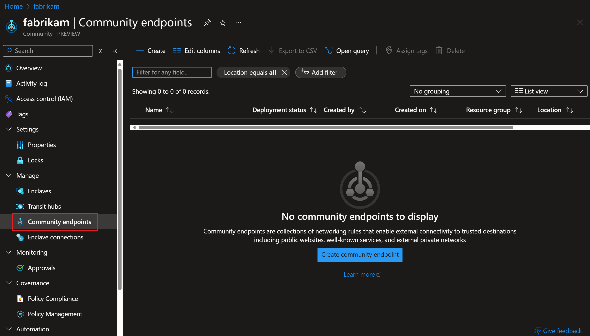
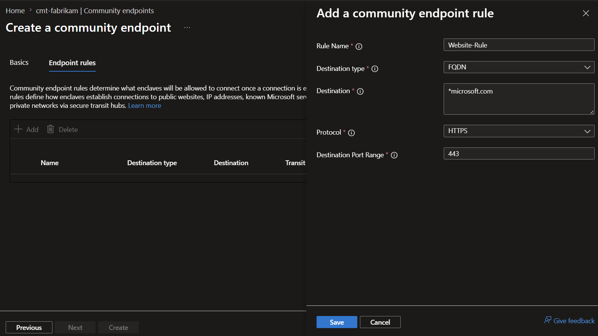

# Create a community endpoint in the Azure portal

In this how-to article, you create a [community endpoint](./what-community-endpoint.md) and add a rule that defines an allowed destination for enclave connections.

## Prerequisites

- An Azure subscription. If you don't have one, create a [free account](https://azure.microsoft.com/free/) before you begin.

- An existing [community](./create-community-portal.md).

## Sign in to Azure

Sign in to the [Azure portal](https://portal.azure.com).

## Create a community endpoint

1. Go to an existing community in your Azure subscription.
1. In the left menu, select `Community Endpoints`, and then select `Create`.

    

1. Enter a name for the community endpoint, and then select `Add` to create a community endpoint rule.

### Community endpoint rule types

Before you add the rule, choose the destination type that matches the endpoint you need to allow.

- `IPAddress`: Enable traffic from an enclave to an IP address outside of the community Virtual WAN.
- `FQDN`: Enable traffic from an enclave to a trusted fully qualified domain name (FQDN), such as `*.portal.azure.com`. FQDN rules support `HTTP`, `HTTPS`, `TCP`, or `UDP`; use only one protocol and one port per rule.
- `FQDNTag`: Enable traffic from enclaves to known Microsoft Azure services through FQDN tags, such as `AzurePortal`.
- `ServiceTag`: Enable traffic from enclaves to Azure services by using Azure service tags. Service tags represent groups of IP address prefixes for specific Azure services, such as `Storage`, `AzureKeyVault`, and `Sql`. For a complete list of available service tags, see [Virtual Network service tags](/azure/virtual-network/service-tags-overview).
- `PrivateNetwork`: Enable traffic from enclaves to an external private network through a [transit hub](./create-transit-hub-portal.md) connection.

Enter the rule name, destination type, destination, port, and protocol, and then select `Add`.

### Configure service tag rules

When you create a `ServiceTag` rule:

1. Select `ServiceTag` as the destination type.
1. Choose the `Destination` service tag from the list, such as `Storage`, `AzureKeyVault`, or `AzureActiveDirectory`.
1. Select the protocol: `TCP`, `UDP`, `ICMP`, or `ANY`.
1. Enter the destination ports required for your service.

    > [!TIP]
    > Use service tags when you need to connect to Azure services that have dynamic IP address ranges. Service tags reduce the need to track and update IP addresses manually.

1. Select `Review + create`, and then select `Create`.

## Related content

- [What is a community endpoint?](./what-community-endpoint.md)
- [What is a community?](./what-community.md)
- [Create a community](./create-community-portal.md)
- [Best practices](./best-practices.md)
