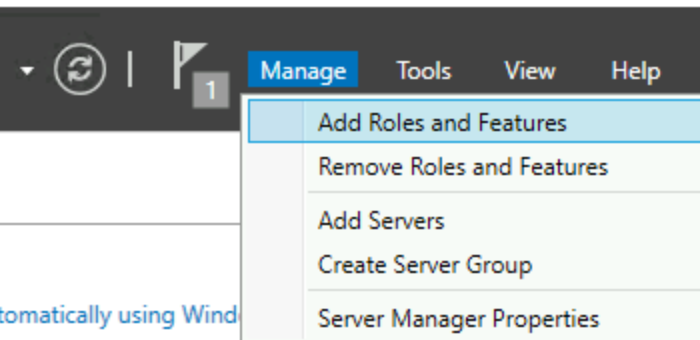
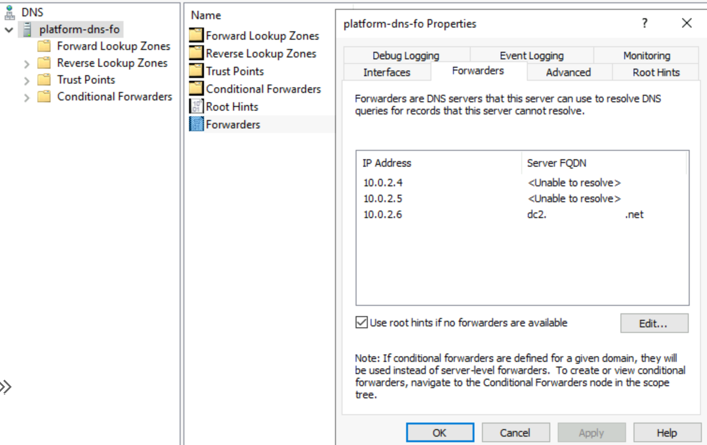
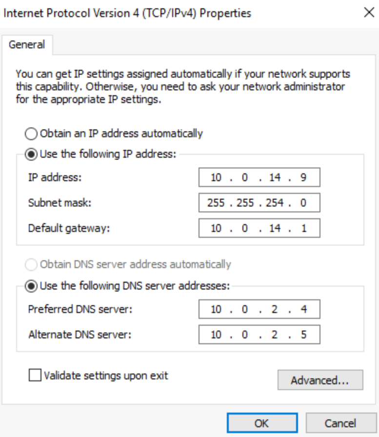

# Create a Domain Name Service (DNS) forwarder
This example of setting up a DNS Forwarder Virtual Machine (VM) is for the `contoso5.com` domain with three domain controllers on IPs `10.0.2.4`, `10.0.2.5`, and `10.0.2.6`.

## Steps in this guide

1. Deploy DNS Forwarder VM.
1. Update virtual network DNS.

## Deploy and configure DNS forwarder VM

### Create VM
Create Windows Server VM in the enclave workload of your choice, within the enclave virtual network, `AzureVirtualEnclaveSubnet` subnet, and with no public IP address.

### Install DNS feature on Windows Server VM
In the `Server Manager` window, select `Manage` to install a new feature

1. Select `Next` until `Server Roles` where you check the box next to `DNS Server`.
1. Accept the recommended tools and select `Next` until the install button appears.
1. Wait for the installation to finish.

### Add domain controller IPs as the DNS Forwarders
In the `Server Manager` window, select `Tools` and `DNS`. Make sure the DNS forwarder VM name is selected and double select `Forwarders` and add the domain controller IPs.

### Set Static IP for DNS Forwarder
Use the commands `ipconfig /all` and `nslookup contoso5.com` to get the VM IP address, gateway, and DNS Servers (one or more of the DC IPs).

## Update enclave virtual network DNS
1. Open the enclave virtual network resource.
1. Select `DNS` on the left side.
1. Remove the default Azure IP address and add the domain controller IPs. Reboot any VMs in the virtual network for these new setting to take effect automatically.
