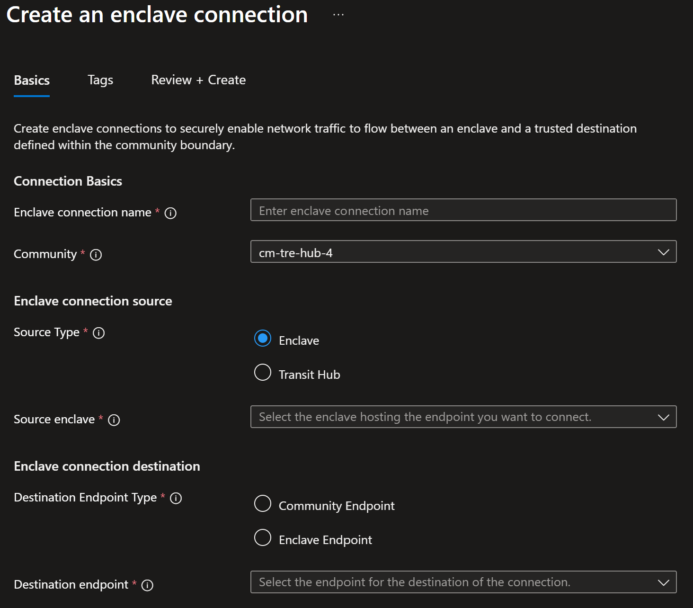
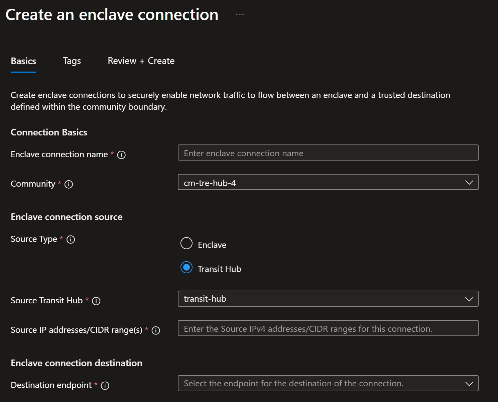

# Create an enclave connection from the Azure portal

[Enclave connections](./what-enclave-connection.md) enable network traffic to flow into, out of, and between Azure Enclave communities and enclaves. In this how-to guide, you create an enclave connection in the Azure portal.

## Prerequisites

- An Azure subscription. If needed, create a [free Azure account](https://azure.microsoft.com/free/).
- A [community](./create-community-portal.md) and an [enclave](./create-enclave-portal.md).
- An existing [enclave endpoint](./what-enclave-endpoint.md) or [community endpoint](./what-community-endpoint.md) in the same community.

## Sign in to Azure

Sign in to the [Azure portal](https://portal.azure.com).

## Create an enclave connection

1. Enter `Azure Enclave` in the search.

1. Under `Services`, select `Azure Enclave`.

1. In the `Azure Enclave` page, select `Enclaves` in the left menu.

1. On the `Enclaves` page, select your Enclave's name to open the enclave resource.

1. Select `Enclave Connections` on the left navigation and then select `Create`.

1. Enter the following information:
   - `Enclave connection name`: Enter a name for the enclave connection.
   - `Community`: Select the existing community from the list.

## Configure an enclave source connection

If the connection source is `Transit Hub`, skip this section.

For connections where the source is `Enclave`, enter the required information:

1. Under `Source Type`, select `Enclave`.

1. Select the existing `Source Enclave` from the list.

1. Enter the `Source IP addresses/CIDR range(s)` for the enclave subnets that initiate traffic.

1. Under `Destination Endpoint Type`, select `Enclave Endpoint` or `Community Endpoint`.

1. Select the `Destination Endpoint` from the list.

    

## Configure a transit hub source connection

If the connection source is `Enclave`, skip this section.

For connections where the source is `Transit Hub`, enter the required information:

1. Under `Source Type`, select `Transit Hub`.

1. Select the `Source transit hub` from the list.

1. Enter the `Source IP addresses/CIDR range(s)` for this connection.

1. Select the `Destination endpoint` from the list.

    

1. Select `Review + create`, and then select `Create`.
